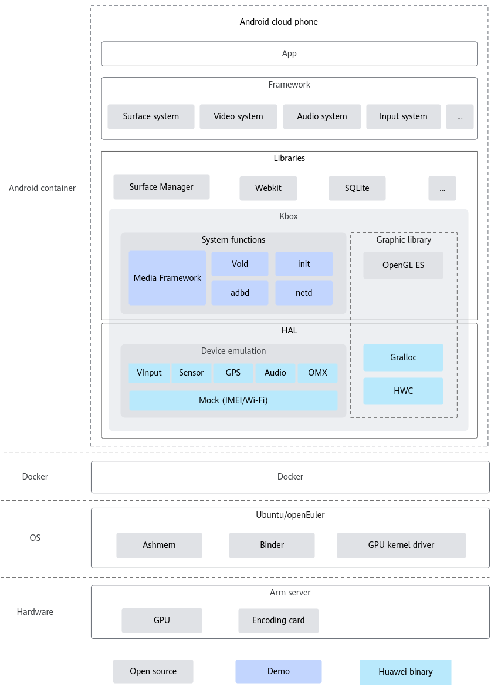

# Kbox Cloud Phone Overview<a name="ZH-CN_TOPIC_0000002550238281"></a>

## Project Overview<a name="ZH-CN_TOPIC_0000002518598550"></a>

### Introduction<a name="ZH-CN_TOPIC_0000002518758442"></a>

The Kbox cloud phone container is the core component of the cloud phone Turbo toolkit in Kunpeng BoostKit. This document describes the basic concepts of the Kbox cloud phone container and how to compile, deploy, and configure the Kbox cloud phone container.

The cloud phone solution is a virtual phone service virtualized based on the Arm server and runs the Android Open Source Project (AOSP). In short, cloud phones are Arm servers that run the Android OS and function as virtual phones. You can remotely control the cloud phone in real time to run Android applications on the cloud. Based on the basic computing power of cloud phones, you can also efficiently build applications for scenarios like cloud gaming, mobile office, and live streaming interaction.

As the foundational software for running Android applications, the Kbox cloud phone container is an important part of the cloud phone Turbo toolkit in Kunpeng BoostKit. It directly runs the AOSP system in a container, mocks peripheral hardware such as the GPS sensor, acceleration sensor, gyroscope, international mobile equipment identity (IMEI), and Wi-Fi, and implements the Gralloc and HWComposer (HWC) modules, ensuring normal startup and running of the AOSP system.

The Kbox cloud phone container is the core component of the cloud phone Turbo toolkit in Kunpeng BoostKit. This document describes the basic concepts of the Kbox cloud phone container and how to compile, deploy, and configure the Kbox cloud phone container.

### Software Architecture<a name="ZH-CN_TOPIC_0000002550238279"></a>

This section describes the context logical structure and modules (including module functions) of the Kbox cloud phone container.

[**Figure 1** Kbox cloud phone container architecture](#kbox-cloud-phone-container-architecture) shows the overall architecture of the Kbox cloud phone container.

**Figure 1** Kbox cloud phone container architecture<a id="kbox-cloud-phone-container-architecture"></a>



Android container: The closed-source component Kbox and the AOSP are used to enable basic cloud phones running Android in containers.

Kbox implements hardware emulation (including VInput, sensors, GPS, and IMEI/Wi-Fi mock) and GPU device passthrough, enabling the Android cloud phone container solution. Kbox consists of binary deliverables and demos.

- Binary deliverables include VInput (touchscreen input module), Sensor (sensor emulation), GPS (GPS emulation), IMEI/Wi-Fi mock, Gralloc (off-screen rendering), HWC (image composition), Audio (audio module), and OMX (decoding module).
- Demos (including Media Framework, vold, adbd, init, and netd) provide patches (for reference) based on open-source code of the Android system.

Docker: The open-source Docker software is used to provide a software operating environment for the Android system.

OS: Open-source openEuler is used as the Docker host OS. The integrated GPU kernel driver is shared by upper-layer container instances and drives GPUs to complete rendering. Ashmem and binder provide basic memory management functions for Android containers.

Hardware: The Arm server including GPUs, memory, and drives, is used as the hardware platform.

This section describes the context logical structure and modules (including module functions) of the Kbox cloud phone container.

### Cloud Phone Specifications<a name="ZH-CN_TOPIC_0000002518758446"></a>

**Table 1** Kbox basic cloud phone specifications<a id="kbox-basic-cloud-phone-specifications"></a>

|**Item**|**Configuration**|
|--|--|
|CPU core binding policy|2 containers/2 cores|
|Number of cores|2|
|Memory|6 GB|
|Storage|16 GB|
|Resolution|720 x 1280|

## Directory Structure<a name="ZH-CN_TOPIC_0000002550238277"></a>

```shell
├── docs                                           # Project document directory
│   └── en                                         # English document directory
│       ├── figures                                # Directory of figures in documents
│       ├── best_practices.md                         # Kbox Cloud Phone Best Practices
│       ├── compile_guide.md                          # Kbox Cloud Phone Compilation Guide
│       ├── feature_guide.md                          # Kbox Cloud Phone Feature Guide
│       ├── install_guide.md                           # Kbox Cloud Phone Installation Guide
│       ├── release_notes.md                           # Kbox Cloud Phone Release Notes
│       ├── routine_maintenance.md                     # Kbox Cloud Phone Routine Maintenance
│       ├── security_statement.md                     # Kbox Cloud Phone Security Statement
│       ├── test_guide.md                             # Kbox Cloud Phone Acceptance Test Guide
│       ├── troubleshooting.md                         # Kbox Cloud Phone Troubleshooting
│       ├── user_guide.md                             # Kbox Cloud Phone User Guide
├── deploy_scripts                                 # Container deployment scripts
├── make_img_sample                                # Reference script
├── patchForAndroid                                # Android patch
├── patchForExagear                                # Transcoding patch
├── patchForKernel                                 # Kernel patch
```

## Version Description<a name="ZH-CN_TOPIC_0000002550278289"></a>

The Kbox cloud phone has two branch versions: Android 11 and Android 15. This section describes the differences and feature changes between the two versions.

**Version Introduction<a name="section10131916143616"></a>**

The Kbox cloud phone is developed based on AOSP and currently supports AOSP 11 and AOSP 15. Due to differences in Android versions, the Kbox cloud phone has code branches `AOSP 11` and `AOSP 15` to support different Android code.

**Table 1** Code branch differences<a id="code-branch-differences"></a>

|Code Branch|AOSP11|AOSP15|
|--|--|--|
|Supported kernel version|5.10|6.6|
|Supported Docker Version|18.0|24.0|
|Corresponding AOSP version|11|15|

**Change Description<a name="section4408930144513"></a>**

For details about feature changes in each release, see the _Release Notes_.

## Environment Setup<a name="ZH-CN_TOPIC_0000002550278295"></a>

For details about the hardware environment and OSs supported by the Kbox cloud phone and the software packages required for environment setup, see "Environment Requirements" in the *Deployment Guide*.

The Kbox cloud phone supports bare metal servers and VMs. For details, see the *Deployment Guide*.

## Related Documents<a name="ZH-CN_TOPIC_0000002518598548"></a>

|Resource Type|Resource Name|Description|
|--|--|--|
|Document|Quick Start|Provides a quick start guide for launching and operating a Kbox cloud phone.|
|Document|Release Notes|Provides basic information and feature updates of each Kbox cloud phone version.|
|Document|Deployment Guide|Provides detailed guidance for deploying the Kbox cloud phone in two environments: bare metal and VM.|
|Document|Best Practices|Provides practical cases of using a Kbox cloud phone in Docker and Kubernetes environments.|
|Document|FAQ|Provides answers to frequently asked questions (FAQs) about installing and using Kbox.|

## Version Maintenance Policy<a name="ZH-CN_TOPIC_0000002518758444"></a>

The Kbox version maintenance policy is as follows.

|**Kbox Version**|**Maintenance Policy**|**Status**|**Release Date**|**Subsequent Status**|**EOL Date**|
|--|--|--|--|--|--|
|Kbox11|Long-term branch|In development|2025/10/15|Maintenance status effective from March 15, 2026|-|
|Kbox15|Long-term branch|In development|2025/10/15|Maintenance status effective from March 15, 2026|-|

## Disclaimer<a name="ZH-CN_TOPIC_0000002518598546"></a>

**To Users of This Project**

- This project is intended solely for debugging and development. You are responsible for any risks and should carefully review the following information:
  - Data processing and deletion: Users are responsible for managing and deleting any data generated while using this tool. You are advised to promptly delete any related data after use to prevent information leaks.
  - Data confidentiality and transmission: Users understand and agree not to share or transmit any data generated by this tool. Neither the tool nor its developers are responsible for any information leaks, data breaches, or other negative consequences.
  - User input security: Users are responsible for the security of any commands they enter and for any risks or losses resulting from improper input. The tool and its developers are not liable for issues caused by incorrect command usage.

- Disclaimer scope: This disclaimer applies to all individuals and entities using this tool. By using the tool, you acknowledge and accept this statement and assume all risks and responsibilities arising from its use. If you do not agree, please stop using the tool immediately.
- Before using this tool, **please read and understand the preceding disclaimer**. If you have any questions, contact the developer.

**To Data Owners**

If you do not want your model or dataset to be mentioned in this project, or if you wish to update its description, please submit an issue on GitCode. We will delete or update your description according to your request. Thank you for your understanding and contribution to this project.

## License<a name="ZH-CN_TOPIC_0000002518758448"></a>

This project is licensed under Apache License 2.0. For details, see [LICENSE](LICENSE).
The documents of this project are licensed under CC-BY 4.0. For details, see [LICENSE](docs/LICENSE).

## Contributor Statement<a name="ZH-CN_TOPIC_0000002550238283"></a>

We welcome your contributions to the community. If you have any questions/suggestions or want to provide feedback on feature requirements and bug reports, you can submit [issues](https://gitcode.com/boostkit/community/blob/master/docs/contributor/issue-submit.md). For details, see [Contribution Guideline](https://gitcode.com/boostkit/community/blob/master/docs/contributor/contributing.md). You are also welcome to share insights in [Discussions](https://gitcode.com/boostkit/community/discussions). Thank you for your support.

## Suggestions and Communication<a name="ZH-CN_TOPIC_0000002518598544"></a>

You are welcome to contribute to the community. If you have any questions or suggestions, submit [issues](https://gitcode.com/boostkit/community/blob/master/docs/contributor/issue-submit.md). We will reply to you as soon as possible. Thank you for your support.

## Acknowledgement<a name="ZH-CN_TOPIC_0000002550278293"></a>

Kbox is jointly developed by the following Huawei department:

- Kunpeng Computing BoostKit Development Dept

Thank you to everyone in the community for your PRs. We warmly welcome contributions to Kbox!
