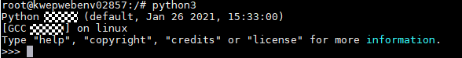

# Compilation Guide<a name="ZH-CN_TOPIC_0000002521735842"></a>

## 1 Environment Setup<a name="ZH-CN_TOPIC_0000002518346174"></a>

### 1.1 Hardware Environment<a name="ZH-CN_TOPIC_0000002549825993"></a>

The Kbox Android image can be compiled only on an x86_64 server running Ubuntu 22.04 LTS. Before the compilation, ensure that the hardware requirements are met.

For details, see [**Table 1** Hardware requirements](#hardware-requirements).

**Table 1** Hardware requirements<a id="hardware-requirements"></a>

|Device Model|Function|Server OS Version|
|--|--|--|
|x86_64 server|Used to compile a Kbox Android image|Recommended Ubuntu 22.04 LTS image: ubuntu-22.04-live-server-amd64.iso|

> **NOTE:**
>
>- In this document, the server model is 2288H V5.
>- Ensure that the server can connect to the Internet so that the OS image can be downloaded.

### 1.2 Software Environment<a name="ZH-CN_TOPIC_0000002549705993"></a>

Before compiling the Kbox Android image, obtain the following packages from links provided in this section: AOSP source package, Kbox binary package (provided by Huawei), and ExaGear transcoding package (provided by Huawei). You need to verify the integrity of the Huawei-provided packages to ensure that they are not tampered with.

**Obtaining Software Packages<a name="section038565445713"></a>**

For details, see [**Table 1** Software requirements](#software-requirements).

**Table 1** Software requirements<a id="software-requirements"></a>

|No.|Software|Description|How to Obtain|
|--|--|--|--|
|1|AOSP source code|Version: android-15.0.0_r17|[Link](https://android.googlesource.com/platform/manifest)|
|2|BoostKit-boostcph-kbox_*_15.zip|Android Kbox binary package|Contact Huawei technical support.|
|3|Kbox-patches-AOSP15.zip|Android code patch demo package and compilation script demo package|[Link](https://raw.gitcode.com/boostkit/Kbox-patches/archive/refs/heads/AOSP15.zip)|
|4|Meson|1.1.0|[Link](https://github.com/mesonbuild/meson/releases/download/1.1.0/meson-1.1.0.tar.gz)|
|5|Mesa|Refer to Demo 24.3.4.|[Link](https://gitcode.com/boostkit/mesa/tree/24.3.4)|

> **NOTE:**<br>
>
>1. The preceding software package names are for reference only, and the actual package names are subject to the download methods. You are advised to rename the packages based on the preceding table to facilitate subsequent operations.<br>
>2. The default branch of the Mesa source repository is 22.1.7. Switch to the required branch when you run **git clone** to obtain the source code.<br>

**Verifying Software Package Integrity<a name="section12800195641510"></a>**

To prevent software packages from being maliciously tampered with during transfer or storage, download also the corresponding digital signature files for integrity verification while obtaining the software packages from the Kunpeng community.

1. Obtain the software packages and corresponding digital certificates.

    For details, see [**Table 1** Software requirements](#software-requirements).

2. <a name="li1273482318125"></a>Obtain the verification tool and method from the [Huawei enterprise website](https://support.huawei.com/enterprise/en/tool/pgp-verify-TL1000000054) or [carrier website](http://support.huawei.com/carrier/digitalSignatureAction).
3. Based on the *OpenPGP Signature Verification Guide* obtained in [2](#li1273482318125), verify the PGP digital signature of the software package.

> **NOTE:**
>
>If the verification fails, do not use the software package. Contact Huawei technical support.
>Before a software package is used for installation or upgrade, its digital signature also needs to be verified to ensure that the software package is not tampered with.
>Before using the software package, read and agree to [Kunpeng BoostKit User License Agreement 2.0](https://www.hikunpeng.com/en/legal/developer/boostkit/software/protocol).

## 2 Compilation and Build Process<a name="ZH-CN_TOPIC_0000002549826003"></a>

It is a nice try to understand the overall Kbox Android image compilation process before you start.

For details, see [**Figure 1** Kbox Android image compilation process](#kbox-android-image-compilation-process).

**Figure 1** Kbox Android image compilation process<a name="fig19747839194513"></a><a id="kbox-android-image-compilation-process"></a>


## 3 Installing Dependency Packages<a name="ZH-CN_TOPIC_0000002549826019"></a>

Before compilation, you need to configure a repository for the environment and install the Mako module of Python 3 and dependency packages such as Meson.

1. Configure a repository based on the network environment to install the dependency packages required for compiling the source code.
2. After the configuration is complete, update the index.

    ```shell
    sudo apt update
    ```

3. Install the dependency packages required for the compilation.

    ```shell
    sudo apt-get install glslang-tools
    sudo apt-get install libgl1-mesa-dev g++-multilib git flex bison gperf build-essential
    sudo apt-get install tofrodos python3-markdown xsltproc dpkg-dev libsdl1.2-dev
    sudo apt-get install git-core gnupg zip curl zlib1g-dev gcc-multilib
    sudo apt-get install libc6-dev-i386 libx11-dev libncurses5-dev lib32ncurses5-dev x11proto-core-dev
    sudo apt-get install libxml2-utils unzip m4 lib32z-dev ccache libssl-dev gettext python3-mako libncurses5
    sudo apt-get install python3-chardet python3-markupsafe python3-packaging python3-pkg-resources python3-pygments
    sudo apt-get install python3-pyparsing python3-six python3-yaml python2 python2.7 
    sudo apt-get install python3 python3-apport python3-apt python3-attr python3-automat 
    sudo apt-get install python3-blinker python3-certifi python3-cffi-backend 
    sudo apt-get install python3-click python3-colorama python3-commandnotfound 
    sudo apt-get install python3-configobj python3-constantly 
    sudo apt-get install python3-cryptography python3-dbus python3-debconf 
    sudo apt-get install python3-debian python3-dev python3-distro python3-distro-info 
    sudo apt-get install python3-distupgrade python3-distutils python3-entrypoints
    sudo apt-get install python3-gdbm python3-gi python3-hamcrest python3-httplib2 
    sudo apt-get install python3-hyperlink python3-idna python3-importlib-metadata 
    sudo apt-get install python3-incremental python3-jinja2 python3-json-pointer 
    sudo apt-get install python3-jsonpatch python3-jsonschema python3-jwt 
    sudo apt-get install python3-keyring python3-launchpadlib python3-lazr.restfulclient 
    sudo apt-get install python3-lazr.uri python3-lib2to3
    sudo apt-get install python3-more-itertools python3-nacl python3-netifaces python3-newt 
    sudo apt-get install python3-oauthlib python3-openssl python3-pip 
    sudo apt-get install python3-problem-report python3-pyasn1
    sudo apt-get install python3-pyasn1-modules python3-pymacaroons python3-pyrsistent 
    sudo apt-get install python3-requests python3-requests-unixsocket python3-secretstorage 
    sudo apt-get install python3-serial python3-service-identity
    sudo apt-get install python3-setuptools python3-simplejson
    sudo apt-get install python3-software-properties python3-systemd python3-twisted 
    sudo apt-get install python3-update-manager python3-urllib3 python3-wadllib
    sudo apt-get install python3-wheel python3-zipp python3-zope.interface
    sudo apt-get install python-is-python3 ninja-build autoconf
    ```

    If the following information is displayed, click **Cancel**.

    

4. Check whether the Python 3 environment of the server contains the Mako module. If it does not have the Mako module, install the module.
    1. Run the following command to go to the Python 3 environment:

        ```shell
        python3
        ```

        

    2. In the Python 3 environment, run the following command to view the module information:

        ```shell
        help("modules")
        ```

        

        As shown in the following figure, if the command output contains the Mako module, you can proceed with subsequent operations. If no, run the **pip3 install mako** command to install the Mako module. Ensure that the Python 3 environment contains the Mako module and then go to the next step.

        

    3. Exit the Python CLI.

        ```shell
        exit()
        ```

5. Create a **buildtools** directory in the user directory and grant the read, write, and execute permissions to the directory owner.

    ```shell
    mkdir /home/buildtools
    chmod -R 700 /home/buildtools
    ```

6. Install Meson.

    Download the source package from the link provided in [1.2-Software Environment](#software-requirements), upload the **meson-1.1.0.tar.gz** file in the source package to the **/home/buildtools** directory, and decompress it.

    ```shell
    cd /home/buildtools
    tar -xvpf meson-1.1.0.tar.gz
    ln -s /home/buildtools/meson-1.1.0/meson.py /usr/local/bin/meson15.py
    ```

7. Set the environment variables.
    1. Add the following content to the end of the **~/.bashrc** file:

        ```shell
        cat >> ~/.bashrc <<EOF
        export PATH=/home/buildtools/meson-1.1.0:$PATH
        EOF
        ```

    2. Make environment variables take effect.

        ```shell
        source ~/.bashrc
        ```

## 4 Compiling the AOSP Source Code and Creating an Image<a name="ZH-CN_TOPIC_0000002549705989"></a>

### 4.1 Downloading AOSP Source Code<a name="ZH-CN_TOPIC_0000002518186238"></a>

The Kbox Android image is compiled using AOSP 15. Perform the following steps to download the AOSP source code.

1. Create an **aosp** directory in the user directory and grant the read, write, and execute permissions to the directory owner.

    ```shell
    mkdir /home/aosp
    chmod -R 700 /home/aosp
    ```

    > **NOTE:**
    >
    >The remaining space of the user directory must be greater than 300 GB. The AOSP source code is approximately 130 GB and is close to 300 GB after compilation.

2. Download and install the Repo tool following the official Google guide. Download AOSP source code (version: android-15.0.0_r17) and compile it.

    ```shell
    cd /home/aosp
    repo init -u https://android.googlesource.com/platform/manifest -b android-15.0.0_r17
    repo sync
    ```

### 4.2 Downloading Mesa Demo Source Code<a name="ZH-CN_TOPIC_0000002549825989"></a>

The Mesa third-party library is used during the compilation of the Kbox Android image. Download its source code as described in this section.

1. Create a **sourcecode** directory in the user directory and grant the read, write, and execute permissions to the directory owner.

    ```shell
    mkdir /home/sourcecode
    chmod -R 700 /home/sourcecode
    ```

2. Download the Mesa source package from the link provided in [1.2-Software Environment](#software-requirements), upload the package to the **/home/sourcecode** directory, and decompress it. Then rename the extracted file and copy it to the **aosp/external** directory.

    ```shell
    cd /home/sourcecode
    unzip mesa-24.3.4.zip
    mv mesa-24.3.4 mesa3d
    rm -rf /home/aosp/external/mesa3d
    cp -rf ./mesa3d /home/aosp/external/
    ```

### 4.3 Applying the Kbox Android Patch<a name="ZH-CN_TOPIC_0000002518346170" id="applying-the-kbox-android-patch"></a>

Apply the Kbox Android patch into the AOSP source package.

1. Obtain source code of the Kbox Android patch.

    Download the source package from the link provided in [1.2-Software Environment](#software-requirements), upload the package to the **/home/sourcecode** directory, and decompress it.

    ```shell
    cd /home/sourcecode
    unzip Kbox-patches-AOSP15.zip
    ```

2. Apply the Kbox Android patch.

    ```shell
    cd /home/sourcecode/Kbox-patches-AOSP15/patchForAndroid15
    ./apply-patch.sh /home/aosp
    ```

> **NOTE:**
>
>Kbox Android patches are provided to facilitate the deployment of the Kbox cloud phone suite. The patches are for functional reference only, not for commercial delivery. No commercial commitment is made. It is recommended that customers or ISVs perform necessary security assessment before commercial use. Using Kunpeng BoostKit for Cloud Phone demos implies the user's acceptance of all associated security risks.

### 4.4 Applying the Binaries<a name="ZH-CN_TOPIC_0000002549705997"></a>

Apply the Kbox binary file package into the AOSP source package.

1. Download the source package from the link provided in [1.2-Software Environment](#software-requirements), decompress the binary file package (**BoostKit-boostcph-kbox_\*_15.zip**) to obtain the **Kbox-\*-aosp15.0-binary.zip** package, and upload the **product_prebuilt** and **products** directories in the package to the **/home/dependency** directory.

    Assign appropriate permissions on the uploaded files and directories. You are not advised to assign the write permission for other user groups.

2. Copy the binary content to the root directory of the AOSP source code.

    ```shell
    cd /home/dependency
    cp -rf product_prebuilt /home/aosp/
    ```

3. Create a **vendor/kbox** directory in the AOSP source code directory. Then copy the **products** directory to **vendor/kbox**.

    ```shell
    mkdir -p /home/aosp/vendor/kbox
    chmod -R 700 /home/aosp/vendor/kbox
    cd /home/dependency
    cp -rf products /home/aosp/vendor/kbox
    ```

4. In the **/home/aosp/vendor/kbox/products** directory, run the following command to change the DNS address in the **kbox.mk** file.

    Replace *xxx.xxx.xxx.xxx* in the command with the DNS address of the container. Ensure that the configured address is available. Otherwise, the compiled image may be unavailable.

    ```shell
    sed -i "s|net.dns1=.*|net.dns1=xxx.xxx.xxx.xxx \\\\|" /home/aosp/vendor/kbox/products/kbox.mk
    ```

    > **NOTE:**
    >
    >- The example is for reference only. Configure an available public DNS address to ensure that the container is connected to the network.
    >- You can also configure the DNS address in the **/system/vendor/build.prop** file of the Kbox container. The configuration takes effect after the container is restarted.
    >- If you have any questions about the configuration, contact Huawei O&M engineers.

### 4.5 Compiling the AOSP and Creating an Image<a name="ZH-CN_TOPIC_0000002549826011"></a>

Compile the AOSP source code to generate a Kbox Android image.

1. Compile the AOSP source code.
    1. Generate your own unique set of release keys to sign the deployed Android image.

        ```shell
        cd /home/aosp/
        rm -rf ./build/target/product/security/release*
        chmod +x ./development/tools/make_key
        ./development/tools/make_key build/target/product/security/releasekey '/C=xx/ST=xxx/L=xxx/O=xxx/OU=xx/CN=xxx/emailAddress=xxxxx@xxx.com'
        ```

        > **NOTE:**
        >
        >When you run the **make_key** command, the system prompts you to enter the password. You can press **Enter** to skip this step.
        >The parameters in the **make_key** command are described as follows:
        >- **build/target/product/security/releasekey** indicates the name of the key to be generated.
        >- The following parameters indicate company information. Set the parameters as required. For details, see [**Table 1** **make_key** parameters](#make-key-parameters).

        **Table 1** **make_key** parameters<a id="make-key-parameters"></a>

        |Parameter|Description|
        |--|--|
        |C|Country Name (2 letter code)|
        |ST|State or Province Name (full name)|
        |L|Locality Name (eg, city)|
        |O|Organization Name (eg, company)|
        |OU|Organizational Unit Name (eg, section)|
        |CN|Common name (for example, user name or the host name of the server)|
        |emailAddress|Contact email address|

    2. Load all the commands in **envsetup.sh** to environment variables.

        ```shell
        source build/envsetup.sh
        ```

    3. Select a compilation mode.

        ```shell
        lunch kbox_arm64-trunk_staging-user
        ```

        > **NOTE:**
        >
        >- To compile the image in userdebug mode, change **user** to **userdebug** in the **lunch** command. The following uses **kbox_arm64** as an example.
        >
        > ```shell
        > lunch kbox_arm64-trunk_staging-userdebug
        >    ```
        >
        >- Kbox also provides a streamlined image in which some pre-installed applications are removed to achieve better memory utilization and performance.
        > Use the following option to compile a streamlined image:
        >
        > ```shell
        > lunch kbox_arm64_optimized-trunk_staging-user
        >    ```

    4. Perform the compilation.

        ```shell
        make clean
        make -j
        ```

        > **NOTE:**
        >
        >In the preceding command, set the number following **-j** to the number of CPU cores of the server. To query the number of CPU cores, run the following command:
        >
        >```shell
        >cat /proc/cpuinfo |grep "processor" | wc -l
        >```
        >
        >If you run the **make** command without specifying the number of cores, one core is used for compilation by default. You can also use the **-j** parameter to specify the number of cores for compilation. The maximum allowed number of cores is the total number of CPU cores of the server. This document uses 64 cores as an example.
        >In normal cases, the compilation can be completed. Sometimes a compilation error may occur due to the concurrent compilation sequence. In this case, run the **make** command again.

2. Download the source package from the link provided in [1.2-Software Environment](#software-requirements), decompress **Kbox-patches-AOSP15.zip** (see [4.3-Applying the Kbox Android Patch](#applying-the-kbox-android-patch)), and upload the **make_img_sample** directory in the **Kbox-patches-AOSP15** folder to the **/home/dependency** directory.

    Assign appropriate permissions on the uploaded files and directories. You are not advised to assign the write permission for other user groups.

3. Copy the generated image script to the **/home/aosp** directory and grant the execute permission on the script.

    ```shell
    cd /home/dependency/make_img_sample/kbox15_android_build
    cp create-package.sh /home/aosp/
    cd /home/aosp
    chmod +x create-package.sh
    ```

4. Run the script to create a Kbox Android image.

    > **NOTE:**
    >
    >The root permission is required for creating an image. Execute the script as the **root** user. The directory must be an absolute path.

    ```shell
    ./create-package.sh /home/aosp/out/target/product/kbox_arm64/system.img
    ```

    The Kbox Android image is created. A Kbox image named **android.tar** is generated in the current directory.
