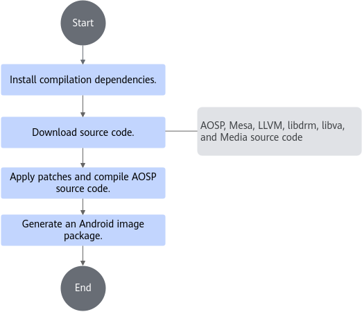
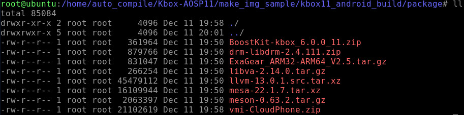
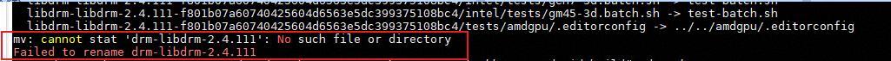
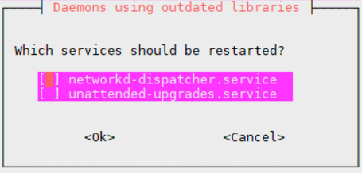
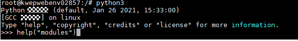

# Compilation Guide <a name="ZH-CN_TOPIC_0000002552663613"></a>

## 1 Environment Setup<a name="ZH-CN_TOPIC_0000002549825291"></a>

### 1.1 Hardware Environment <a name="ZH-CN_TOPIC_0000002549705339"></a>

The Kbox Android image can be compiled only on an x86 server running Ubuntu 22.04 LTS. Before the compilation, ensure that your hardware environment meets the requirements.

[**Table 1**](#hardware-requirements) lists the hardware requirements for compiling and building the Kbox Android image.

**Table 1** Hardware requirements<a id="hardware-requirements"></a>

|Device Model|Function|Server OS|
|--|--|--|
|x86_64 server|Used to compile a Kbox Android image|Ubuntu 22.04 LTS<br>Recommended: ubuntu-22.04-live-server-amd64.iso|

> **NOTE:**
>
>- In this document, the server model is 2288H V5.
>- Ensure that the server can access the Internet to download the OS image.

### 1.2 Software Environment <a name="ZH-CN_TOPIC_0000002518345466"></a>

Before compiling the Kbox Android image, obtain the following packages from addresses provided in this section: source packages of AOSP, Mesa, and LLVM, and the Kbox binary file package and ExaGear transcoding package provided by Huawei. You need to verify the integrity of the source packages provided by Huawei to ensure that they are not tampered with.

**Obtaining Software Packages<a name="section038565445713"></a>**

[**Table 1**](#software-requirements) lists the software requirements for compiling and building a Kbox Android image.

**Table 1** Software requirements<a id="software-requirements"></a>

|No.|Software|Description|How to Obtain|
|--|--|--|--|
|1|AOSP source code|Version: Android-11.0.0_r48|[Link](https://android.googlesource.com/platform/manifest)|
|2|Mesa source code|Mesa reference demo version: 22.1.7|[Link](https://gitcode.com/boostkit/mesa)<br>Click the download icon on the 22.1.7 branch page.|
|3|LLVM source code|Version: 13.0.1|[Link](https://github.com/llvm/llvm-project/releases/download/llvmorg-13.0.1/llvm-13.0.1.src.tar.xz)|
|4|libdrm source code|Version: 2.4.111|[Link](https://gitlab.freedesktop.org/mesa/drm/-/archive/libdrm-2.4.111/drm-libdrm-2.4.111.zip)|
|5|libva source code|Version: 2.14.0|[Link](https://github.com/intel/libva/archive/refs/tags/2.14.0.tar.gz)|
|6|BoostKit-boostcph-kbox_*.zip|Android Kbox binary package|Contact Huawei technical support.|
|7|Kbox-patches-AOSP11.zip|Android code patch demo package and compilation script demo package|[Link](https://raw.gitcode.com/boostkit/Kbox-patches/archive/refs/heads/AOSP11.zip)|
|8|ExaGear_ARM32-ARM64_V2.5.tar.gz|Binary package for ExaGear transcoding|[Link](https://kunpeng-repo.obs.cn-north-4.myhuaweicloud.com/Exagear%20ARM32-ARM64/Exagear%20ARM32-ARM64%20202.0.0/ExaGear_ARM32-ARM64_V2.5.tar.gz)|
|9|Meson|0.63.2|[Link](https://github.com/mesonbuild/meson/releases/download/0.63.2/meson-0.63.2.tar.gz)|
|10|vmi-CloudPhone.zip|Open-source cloud phone demo of the Huawei VMI engine<br>Branch: CloudPhone|[Link](https://raw.gitcode.com/boostkit/vmi/archive/refs/heads/CloudPhone.zip)|

> **NOTE:**<br>
>
>1. The preceding software package names are for reference only, and the actual package names are subject to the download methods. You are advised to rename the packages based on the preceding table to facilitate subsequent operations.<br>

**Verifying Software Package Integrity<a name="section12800195641510"></a>**

To prevent software packages from being maliciously tampered with during transfer or storage, download also the corresponding digital signature files for integrity verification while obtaining the software packages from the Kunpeng community.

1. Obtain the software packages and corresponding digital certificates.

    For details, see [**Table 1**](#software-requirements).

2. <a name="li1273482318125"></a> Obtain the verification tool and guide from the [Huawei enterprise website](https://support.huawei.com/enterprise/en/tool/pgp-verify-TL1000000054) or [Huawei carrier website](http://support.huawei.com/carrier/digitalSignatureAction).
3. Based on the *OpenPGP Signature Verification Guide* obtained in [2](#li1273482318125), verify the PGP digital signatures of the software packages.

> **NOTE:**
>
>If the verification fails, do not use the software package, and contact Huawei technical support.
>Before a software package is used for installation or upgrade, its digital signature also needs to be verified to ensure that the software package is not tampered with.
>Before using the software package, read and agree to [Kunpeng BoostKit User License Agreement 2.0](https://www.hikunpeng.com/en/legal/developer/boostkit/software/protocol).

## 2 Compilation Process <a name="ZH-CN_TOPIC_0000002549825249"></a>

Understanding the overall Kbox Android image compilation process is a great starting point to help you better grasp each stage of the build.

[**Figure 1**](#fig19747839194513) shows the process of compiling and building a Kbox Android image.

**Figure 1** Kbox Android image compilation process <a name="fig19747839194513"></a><a id="kbox-android-image-compilation-process"></a>


## 3 One-Click Image Compilation Script <a name="ZH-CN_TOPIC_0000002549825281"></a>

Huawei provides an automation script for compiling the Kbox Android image. This script contains the entire compilation process. If you use the automation script to compile an image based on this section, you can skip the following sections in the "Software Compilation" chapter and start software deployment.

The automation script implements the operations described in [4 Installing Dependencies](#4-installing-dependencies) and [5 Compiling AOSP Source Code and Creating an Image](#5-compiling-aosp-source-code-and-creating-an-image). To use the automation script, you need to prepare the AOSP source code, Kbox binary package provided by Huawei, ExaGear transcoding package, Android code patch package, and compilation script package. Obtain them based on [**Table 1**](#software-requirements). To use the automation script, perform the following steps:

1. Create an `auto_compile` directory under the `/home` directory to store the AOSP source code and the automation script.

    > **NOTE:**
    >
    >Ensure that the free space of the `/home` directory is greater than 250 GB. You can run the `df -h` command to check the remaining space.

    ```shell
    mkdir -p /home/auto_compile
    cd /home/auto_compile
    ```

2. Download the AOSP source code (version: android-11.0.0_r48) to the `/home/auto_compile` directory. Rename the AOSP source code directory `aosp`.
3. Download `Kbox-patches-AOSP11.zip` to the local host based on the [Software Environment](#software-requirements), upload it to the `/home/auto_compile` directory on the server, and decompress it.

    ```shell
    cd /home/auto_compile
    unzip Kbox-patches-AOSP11.zip
    ```

4. Download the Android Kbox binary package, ExaGear transcoding package, source packages of Meson/Mesa/LLVM/libdrm/libva, and cloud phone application installation package to the local host based on the [Software Environment](#software-requirements). Create a `package` folder in the following specified directory:

    ```shell
    cd /home/auto_compile/Kbox-patches-AOSP11/make_img_sample/kbox11_android_build
    mkdir -p package
    ```

    Upload the packages to the `/home/auto_compile/Kbox-patches-AOSP11/make_img_sample/kbox11_android_build/package` directory on the server.

    

    Ensure that the folder names of the extracted third-party source libraries (Mesa, LLVM, libdrm, and libva) match the values configured for `<package>_version` or `<package>_src` variables in the `/home/auto_compile/Kbox-patches-AOSP11/make_img_sample/00_kbox_prepare.sh` file. If not, rename the source code folders and package them again.

5. Modify the compilation configuration.
    1. Edit the `build.conf` script.

        ```shell
        cd /home/auto_compile/Kbox-patches-AOSP11/make_img_sample/kbox11_android_build
        vim build.conf
        ```

    2. Press `i` to enter insert mode and modify the values of the configuration items based on the actual environment. (For details about the configuration items, see the comments in the configuration file.) The following uses DNS as an example.

        ```shell
        DNS=xx.xx.xx.xx
        ```

    3. Press `Esc`, type `:wq!`, and press `Enter` to save the file and exit.

6. Run the `kbox11_android_build.sh` automation script to complete Kbox compilation.

    ```shell
    cd /home/auto_compile/Kbox-patches-AOSP11/make_img_sample/kbox11_android_build && chmod +x kbox11_android_build.sh
    ./kbox11_android_build.sh
    ```

    The script execution takes more than one hour. If the script is executed successfully, the following information is displayed. If an error is reported during the execution, check the script and contact Huawei technical support.

    ```shell
    ---------------Success--------------
    /home/auto_compile/aosp/android.tar
    ---------------End--------------
    ```

    The Kbox Android image is created. A Kbox image named `android.tar` is generated in the AOSP source code directory.

**Troubleshooting<a name="section173361345459"></a>**

**Symptom 1**

When the `kbox11_android_build.sh` script is executed, the message "'format_info.h' file not found" may be displayed. The cause is that Mesa's multi-threaded compilation occasionally delays the generation of this header file, resulting in a compilation failure.

```shell
../src/mesa/main/formats.c:81:10: fatal error: 'format_info.h' file not found
#include "format_info.h"
1 error generated.
```

**Procedure**

1. Make environment variables take effect.

    ```shell
    source ~/.bashrc
    ```

2. Compile QEMU again.

    ```shell
    cd /home/auto_compile/aosp
    source build/envsetup.sh
    lunch kbox_arm64-user
    make -j
    ```

    If the same error occurs, run `make -j` to perform the compilation again until the error does not occur. If the execution is successful, the following information is displayed:

    ```shell
    #### build completed successfully (xx:xx (mm:ss)) ####
    ```

3. Run the following commands to generate a Kbox image `android.tar`:

    ```shell
    cp -r /home/auto_compile/Kbox-patches-AOSP11/make_img_sample/kbox11_android_build/create-package.sh /home/auto_compile/aosp
    chmod +x create-package.sh
    ./create-package.sh /home/auto_compile/aosp/out/target/product/arm64/system.img
    ```

**Symptom 2**

When the `kbox11_android_build.sh` script is executed, an error message "No such file or directory" may be reported. The reason for the issue is a variation in the folder name created upon unzipping the dependency package, such as the appending of a new suffix. The script cannot identify the folder name, resulting in a compilation failure.



**Solution**

The following steps are for reference only.

1. Find the software package related to the error and unzip the package.

    ```shell
    unzip drm-libdrm-2.4.111.zip
    ```

2. Change the name of the extracted folder to the name displayed in the error message (predefined name in the script).

    ```shell
    mv libdrm-libdrm-2.4.111-f801b07a60740425604d6563e5dc399375108bc4 drm-libdrm-2.4.111
    ```

3. Compress the folder into a new software package and use the new software package for script-based automatic compilation.

    ```shell
    mv drm-libdrm-2.4.111.zip drm-libdrm-2.4.111.zip.bak
    zip -r drm-libdrm-2.4.111.zip  drm-libdrm-2.4.111
    ```

> **NOTE:**
>
>When the `kbox11_android_build.sh` script is executed, a dependency missing error may also occur. This error may be caused by new dependencies generated due to software package content update. If this error occurs, install the missing package in the environment.

## 4 Installing Dependencies<a name="installing-dependencies"></a>

Before compilation, you need to configure a repository for the environment and install the Mako module of Python 3 and dependencies such as Meson.

1. Configure a repository based on the network environment to install the dependency packages required for compiling the source code.
2. After the configuration is complete, update the index.

    ```shell
    sudo apt update
    ```

3. Install the dependency packages required for the compilation.

    ```shell
    sudo apt-get install libgl1-mesa-dev g++-multilib git flex bison gperf build-essential
    sudo apt-get install tofrodos python3-markdown xsltproc dpkg-dev libsdl1.2-dev
    sudo apt-get install git-core gnupg zip curl zlib1g-dev gcc-multilib glslang-tools
    sudo apt-get install libc6-dev-i386 libx11-dev libncurses5-dev lib32ncurses5-dev x11proto-core-dev
    sudo apt-get install libxml2-utils unzip m4 lib32z-dev ccache libssl-dev gettext python3-mako libncurses5
    sudo apt-get install python3-chardet python3-markupsafe python3-packaging python3-pkg-resources python3-pygments
    sudo apt-get install python3-pyparsing python3-six python3-yaml python2 python2.7 
    sudo apt-get install python3 python3-apport python3-apt python3-attr python3-automat 
    sudo apt-get install python3-blinker python3-certifi python3-cffi-backend 
    sudo apt-get install python3-click python3-colorama python3-commandnotfound 
    sudo apt-get install python3-configobj python3-constantly 
    sudo apt-get install python3-cryptography python3-dbus python3-debconf 
    sudo apt-get install python3-debian python3-dev python3-distro python3-distro-info 
    sudo apt-get install python3-distupgrade python3-distutils python3-entrypoints
    sudo apt-get install python3-gdbm python3-gi python3-hamcrest python3-httplib2 
    sudo apt-get install python3-hyperlink python3-idna python3-importlib-metadata 
    sudo apt-get install python3-incremental python3-jinja2 python3-json-pointer 
    sudo apt-get install python3-jsonpatch python3-jsonschema python3-jwt 
    sudo apt-get install python3-keyring python3-launchpadlib python3-lazr.restfulclient 
    sudo apt-get install python3-lazr.uri python3-lib2to3
    sudo apt-get install python3-more-itertools python3-nacl python3-netifaces python3-newt 
    sudo apt-get install python3-oauthlib python3-openssl python3-pip 
    sudo apt-get install python3-problem-report python3-pyasn1
    sudo apt-get install python3-pyasn1-modules python3-pymacaroons python3-pyrsistent 
    sudo apt-get install python3-requests python3-requests-unixsocket python3-secretstorage 
    sudo apt-get install python3-serial python3-service-identity
    sudo apt-get install python3-setuptools python3-simplejson
    sudo apt-get install python3-software-properties python3-systemd python3-twisted 
    sudo apt-get install python3-update-manager python3-urllib3 python3-wadllib
    sudo apt-get install python3-wheel python3-zipp python3-zope.interface
    sudo apt-get install python-is-python3 ninja-build autoconf
    ```

    If the following information is displayed, click `Cancel`.

    

4. Check whether the Python 3 environment of the server contains the mako module. If it does not have the mako module, install the module.
    1. Run the following command to go to the Python 3 environment:

        ```shell
        python3
        ```

        

    2. In the Python 3 environment, run the following command to view the module information:

        ```shell
        help("modules")
        ```

        

        As shown in the following figure, if the command output contains the mako module, you can proceed with subsequent operations. If no, run the `pip3 install mako` command to install the mako module. Ensure that the Mako module is installed in your Python 3 environment before proceeding with the subsequent steps.

        

    3. Exit the Python CLI.

        ```shell
        exit()
        ```

5. Create a `buildtools` directory in the user directory and grant the read, write, and execute permissions to the directory owner.

    ```shell
    mkdir ~/buildtools
    chmod -R 700 ~/buildtools
    ```

6. Install Meson.

    Download the source package based on the [Software Environment](#software-requirements), upload `meson-0.63.2.tar.gz` in the source package to the `~/buildtools directory`, and decompress `meson-0.63.2.tar.gz`.

    ```shell
    cd ~/buildtools
    tar -xvpf meson-0.63.2.tar.gz
    ```

7. Set the environment variables.
    1. Add the following content to the end of the `~/.bashrc` file:

        ```shell
        cat >> ~/.bashrc <<EOF
        export PATH=~/buildtools/meson-0.63.2:$PATH
        EOF
        ```

    2. Make environment variables take effect.

        ```shell
        source ~/.bashrc
        ```

## 5 Compiling AOSP Source Code and Creating an Image<a name="ZH-CN_TOPIC_0000002518185476" id="compiling-aosp-source-code-and-creating-an-image"></a>

### 5.1 Downloading AOSP Source Code <a name="ZH-CN_TOPIC_0000002549705281"></a>

The Kbox Android image is compiled using AOSP 11. Perform the following steps to download the AOSP source code.

1. Create an `aosp` directory in the user directory and grant the read, write, and execute permissions to the directory owner.

    ```shell
    mkdir ~/aosp
    chmod -R 700 ~/aosp
    ```

    > **NOTE:**
    >
    >The remaining space of the user directory must be greater than 300 GB. The AOSP source code is approximately 130 GB and is close to 300 GB after compilation.

2. Download and install the Repo tool following the [official Google guide](https://android.googlesource.com/tools/repo). Download AOSP source code (version: android-11.0.0_r48) and compile it.

    ```shell
    cd ~/aosp
    repo init -u https://android.googlesource.com/platform/manifest -b android-11.0.0_r48
    repo sync
    ```

3. In the `aosp` directory, delete the `external/mesa3d`, `external/libdrm`, and `device/generic/arm64` folders from the source code.

    ```shell
    cd ~/aosp
    rm -rf external/mesa3d external/libdrm device/generic/arm64
    ```

### 5.2 Downloading Source Code of Mesa, LLVM, libdrm, libva, and Media<a name="ZH-CN_TOPIC_0000002518185496"></a>

Mesa, LLVM, and libdrm are used during the compilation of the Kbox Android image. Download their source code by referring to this section.

1. Create a `sourcecode` directory in the user directory and grant the read, write, and execute permissions to the directory owner.

    ```shell
    mkdir ~/sourcecode
    chmod -R 700 ~/sourcecode
    ```

2. Download the Mesa demo source code and copy it to the `aosp/external` directory.

    Download the source package based on the [Software Environment](#software-requirements), upload the package to the `/root/sourcecode` directory, and decompress the package. Then rename the extracted file and copy it to the `aosp/external` directory.

    ```shell
    cd ~/sourcecode
    unzip mesa-22.1.7.zip
    mv mesa-22.1.7 mesa
    cp -r ./mesa ~/aosp/external/
    ```

3. Download the LLVM source package, copy it to the `aosp/external` directory, and rename the package `llvm70`.

    Download the source package based on the [Software Environment](#software-requirements), upload the package to the `/root/sourcecode` directory, and decompress the package. Then rename the extracted file and copy it to the `aosp/external` directory.

    ```shell
    cd ~/sourcecode
    tar xvf llvm-13.0.1.src.tar.xz
    mv llvm-13.0.1.src llvm70
    cp -r ./llvm70 ~/aosp/external/
    ```

4. Download the libdrm source package, copy it to the `aosp/external` directory, and rename the package `libdrm`.

    Download the source package based on the [Software Environment](#software-requirements), upload the package to the `/root/sourcecode` directory, and decompress the package. Then rename the extracted file and copy it to the `aosp/external` directory.

    ```shell
    cd ~/sourcecode
    unzip drm-libdrm-2.4.111.zip
    mv drm-libdrm-2.4.111 libdrm
    cp -r ./libdrm ~/aosp/external/
    ```

5. Download the libva source package, copy it to the `aosp/external` directory, and rename the package `libva`.

    Download the source package based on the [Software Environment](#software-requirements), upload the package to the `/root/sourcecode` directory, and decompress the package. Then rename the extracted file and copy it to the `aosp/external` directory.

    ```shell
    cd ~/sourcecode
    tar xvf libva-2.14.0.tar.gz
    mv libva-2.14.0 libva
    cp -r ./libva ~/aosp/external/
    ```

6. Download `vmi-CloudPhone.zip` based on the [Software Environment](#software-requirements), decompress the package, and copy the specified folders to the `aosp/external` directory.

    Upload the extracted Media ZIP source package to the `/root/sourcecode` directory, decompress the package, and copy the specified folders to the `aosp/external` directory.

    ```shell
    cd ~/sourcecode
    unzip vmi-CloudPhone.zip
    cp -r ./vmi-CloudPhone/CloudPhoneService/VideoEngine/Media/video_decoder ~/aosp/external/
    cp -r ./vmi-CloudPhone/CloudPhoneService/VideoEngine/Media/vendor ~/aosp/external/
    ```

### 5.3 Applying the ExaGear Transcoding Patch<a name="ZH-CN_TOPIC_0000002549705327"></a>

Apply the ExaGear transcoding patch package into the AOSP source package.

1. Create a `dependency` directory in the user directory. Decompress `Kbox-patches-AOSP11.zip`. Go to the extracted `Kbox-patches-AOSP11` folder, and upload its `patchForExagear` sub-directory to `~/dependency`. Assign appropriate permissions on the uploaded files and directories. You are not advised to assign the write permission for other user groups.
2. Apply the ExaGear transcoding patch. Copy the ExaGear transcoding patch `0001-exagear-adapt-android-11.0.0_r48.patch` to the AOSP source code directory and apply the patch.

    ```shell
    cd ~/dependency/patchForExagear/guestOS/aosp11
    cp 0001-exagear-adapt-android-11.0.0_r48.patch ~/aosp
    cd ~/aosp
    patch -p1 < 0001-exagear-adapt-android-11.0.0_r48.patch
    ```

3. Upload the ExaGear transcoding package `ExaGear_ARM32-ARM64_V2.5.tar.gz` to `~/dependency`. Assign appropriate permissions on the uploaded files and directories. You are not advised to assign the write permission for other user groups.
4. Decompress the patch package and adjust the permissions.

    ```shell
    cd ~/dependency/ 
    sudo tar -xzvf ExaGear_ARM32-ARM64_V2.5.tar.gz 
    ```

5. Copy the `preubt_a32a64_a64`, `preubt_a32a64_x64`, and `ubt_a32a64` files under `~/dependency/ExaGear_ARM32-ARM64` to `~/dependency/patchForExagear/guestOS/aosp11/vendor/huawei/exagear/prebuilts`.

    ```shell
    cd ~/dependency/ExaGear_ARM32-ARM64
    cp * ~/dependency/patchForExagear/guestOS/aosp11/vendor/huawei/exagear/prebuilts
    ```

6. Copy the `vendor` directory to the `aosp` directory.

    ```shell
    cd ~/dependency/patchForExagear/guestOS/aosp11
    cp -r ./vendor ~/aosp/
    ```

### 5.4 Applying Kbox Android Patches <a name="ZH-CN_TOPIC_0000002518345478"></a>

Apply the Kbox Android patch into the AOSP source package.

1. Decompress `Kbox-patches-AOSP11.zip`. Go to the extracted `Kbox-patches-AOSP11` folder, and upload its `patchForAndroid` sub-directory to `~/dependency`. Assign appropriate permissions on the uploaded files and directories. You are not advised to assign the write permission for other user groups.
2. Apply the Kbox Android patch.

    ```shell
    aosp_path=~/aosp; \
    work_path=~/dependency/patchForAndroid; \
    for patch_name in $(ls $work_path | grep .patch); do \
        cd $work_path; \
        echo $patch_name; \
        patch_path="$(echo $patch_name | sed 's|-|/|g' | awk -F"/" 'OFS="/"{$NF="";print}')"; \
        cp $patch_name $aosp_path/$patch_path; \
        cd $aosp_path/$patch_path; \
        patch -p1 < $patch_name; \
    done
    ```

> **NOTE:**
>
>Kbox Android Patches are provided to facilitate the deployment of the Kbox cloud phone suite. The patches are for functional reference only, not for commercial delivery. No commercial commitment is made. It is recommended that customers or ISVs perform necessary security assessment before commercial use. Using the Kunpeng BoostKit for Cloud Phone demos implies the user's acceptance of all associated security risks.

### 5.5 Applying the Binaries<a name="ZH-CN_TOPIC_0000002549825259"></a>

Apply the Kbox binary file package into the AOSP source package.

1. Extract the binary file package `BoostKit-boostcph-kbox_*.zip` to obtain the `Kbox-*-aosp11.0-binary.zip` archive. Upload the `product_prebuilt` and `products` directories in this archive to the `~/dependency` directory.

    Assign appropriate permissions on the uploaded files and directories. You are not advised to assign the write permission for other user groups.

2. Copy the binary files to the root directory of the AOSP source code. The decoding binary file `libstagefrighthw.so` of `product_prebuilt` conflicts with that of Android. Therefore, you need to delete the directory `device/generic/goldfish-opengl/system/codecs` of the Android version and comment out related compile code.

    ```shell
    cd ~/dependency
    cp -rf product_prebuilt ~/aosp/
    rm -rf ~/aosp/device/generic/goldfish-opengl/system/codecs
    sed -i 's/include $(GOLDFISH_OPENGL_PATH)\/system\/codecs\/omx/#include $(GOLDFISH_OPENGL_PATH)\/system\/codecs\/omx/g' \
    ~/aosp/device/generic/goldfish-opengl/Android.mk
    ```

3. Create a `vendor/kbox` directory in the AOSP source code directory. Then copy the `products` directory to `vendor/kbox`.

    ```shell
    mkdir -p ~/aosp/vendor/kbox
    chmod -R 700 ~/aosp/vendor/kbox
    cd ~/dependency
    cp -rf products ~/aosp/vendor/kbox
    ```

4. In the `~/aosp/vendor/kbox/products` directory, run the following command to change the DNS address in the `kbox.mk` file.

    Replace *xxx.xxx.xxx.xxx* in the command with the DNS address of the container. Ensure that the configured address is available. Otherwise, the compiled image may be unavailable.

    ```shell
    sed -i "s|net.dns1=.*|net.dns1=xxx.xxx.xxx.xxx \\\\|" ~/aosp/vendor/kbox/products/kbox.mk
    ```

    > **NOTE:**
    >
    >- The example is for reference only. Configure an available public DNS address to ensure that the container is connected to the network.
    >- You can also configure the DNS address in the `/system/vendor/build.prop` file of the Kbox container. The configuration takes effect after the container is restarted.
    >- If you have any questions about the configuration, contact Huawei O&M engineers.

### 5.6 Compiling the AOSP and Creating an Image<a name="ZH-CN_TOPIC_0000002518185486"></a>

Compile the AOSP source code to generate a Kbox Android image.

1. Compile the AOSP source code.
    1. Generate your own unique set of release keys to sign the Android image deployed.

        ```shell
        cd ~/aosp/
        rm -rf ./build/target/product/security/release*
        chmod +x ./development/tools/make_key
        ./development/tools/make_key build/target/product/security/releasekey '/C=xx/ST=xxx/L=xxx/O=xxx/OU=xx/CN=xxx/emailAddress=xxxxx@xxx.com'
        ```

        > **NOTE:**
        >
        >When you run the `make_key` command, the system prompts you to enter the password. You can press `Enter` to skip this step.
        >The parameters in the `make_key` command are described as follows:
        >- `build/target/product/security/releasekey` indicates the name of the key to be generated.
        >- The following parameters indicate company information. Set the parameters as required. For details, see [**Table 1**](#make-key-parameters).

        **Table 1** `make_key` parameters<a id="make-key-parameters"></a>

        |Parameter|Description|
        |--|--|
        |C|Country Name (2 letter code)|
        |ST|State or Province Name (full name)|
        |L|Locality Name (for example, city name)|
        |O|Organization Name (for example, company name)|
        |OU|Organizational Unit Name (for example, section name)|
        |CN|Common name (for example, user name or the host name of the server)|
        |emailAddress|Contact email address|

    2. Load all the commands in `envsetup.sh` to environment variables.

        ```shell
        source build/envsetup.sh
        ```

    3. Select a compilation mode. In `user` mode of Kbox, ADB that has the root permission is enabled by default for image compilation. This mode is used by default.

        ```shell
        lunch kbox_arm64-user
        ```

        > **NOTE:**
        >
        >- To compile the image in userdebug mode, change `user` to `userdebug` in the `lunch` command. The following uses `kbox_arm64` as an example.
        >
        >    ```shell
        >    lunch kbox_arm64-userdebug
        >    ```
        >
        >- Kbox also provides a streamlined image in which some pre-installed applications are removed to achieve better memory utilization and performance.
        > Use the following option to compile a streamlined image:
        >
        >    ```shell
        >    lunch kbox_arm64_optimized-user
        >    ```

    4. Perform the compilation.

        ```shell
        make clean
        make -j
        ```

        > **NOTE:**
        >
        >In above commands, set the number following `-j` to the number of CPU cores of the server. To query the number of CPU cores, run the following command:
        >
        > ```shell
        > cat /proc/cpuinfo |grep "processor" | wc -l
        >    ```
        >
        >If you run the `make` command without specifying the number of cores, one core is used for compilation by default. You can also use the `-j` parameter to specify the number of cores for compilation. The maximum allowed number of cores is the total number of CPU cores of the server. This document uses 64 cores as an example.
        >In normal cases, the compilation can be completed. Sometimes a compilation error may occur due to the concurrent compilation sequence. In this case, run the `make` command again.

2. Decompress `Kbox-patches-AOSP11.zip`. Go to the extracted `Kbox-patches-AOSP11` folder, and upload its `make_img_sample` sub-directory to `~/dependency`.

    Assign appropriate permissions on the uploaded files and directories. You are not advised to assign the write permission for other user groups.

3. Copy the generated image script to the `~/aosp` directory and grant the execute permission on the script.

    ```shell
    cd ~/dependency/make_img_sample/kbox11_android_build
    cp create-package.sh ~/aosp/
    cd ~/aosp
    chmod +x create-package.sh
    ```

4. Run the script to create a Kbox Android image.

    > **NOTE:**
    >
    >The root permission is required for creating an image. Execute the script as the `root` user. The directory must be an absolute path.

    ```shell
    ./create-package.sh ~/aosp/out/target/product/arm64/system.img
    ```

    The Kbox Android image is created. A Kbox image named `android.tar` is generated in the current directory.
