# Installation Guide<a name="ZH-CN_TOPIC_0000002552895803"></a>

## 1 Deployment Description<a name="ZH-CN_TOPIC_0000002549745285"></a>

To help you quickly deploy Kbox, Kunpeng BoostKit provides demo deployment scripts and demo patches. The following describes how to use the cloud phone demos on a Kunpeng server.

## 2 Environment Setup<a name="ZH-CN_TOPIC_0000002518385428"></a>

### 2.1 Hardware Environment<a name="ZH-CN_TOPIC_0000002549865261"></a>

Before deploying the Kbox cloud phone container environment, ensure that your hardware environment meets the requirements.

For details, see [**Table 1** Hardware configuration schemes for deploying the Kbox cloud phone container](#hardware-configuration-schemes-for-deploying-the-Kbox-cloud-phone-container).

**Table 1** Hardware configuration schemes for deploying the Kbox cloud phone container<a id="hardware-configuration-schemes-for-deploying-the-Kbox-cloud-phone-container"></a>

|Configuration Item|Hardware Configuration Scheme 1|Hardware Configuration Scheme 2|Hardware Configuration Scheme 3|Hardware Configuration Scheme 4|
|--|--|--|--|--|
|Server|Kunpeng server|Kunpeng server|Kunpeng server|Kunpeng server|
|CPU|2 x Kunpeng 920, 64 cores@2.6 GHz|2 x Kunpeng 920, 64 cores@2.6 GHz|2 x new Kunpeng 920 processor model, 80 cores@2.9 GHz|2 x new Kunpeng 920 processor model, 64 cores@2.2 GHz|
|Memory|16 x DDR4 RDIMM-32 GB-2933 MT/s|16 x DDR4 RDIMM-32 GB-2933 MT/s|16 x DDR5 DIMM-64 GB-4800 MT/s|16 x DDR5 DIMM-64 GB-5200 MT/s|
|Drive|System drive: 2 x SSD, 480 GB, SATA 6 Gbit/s, read-intensive; data drive: 2 x ES3521A V6 SSD, 1920 GB, SATA 6 Gbit/s, read-intensive|System drive: 2 x SSD, 480 GB, SATA 6 Gbit/s, read-intensive<br>Data drive: 2 x ES3521A V6 SSD, 1920 GB, SATA 6 Gbit/s, read-intensive|System drive: 1 x S3521A V6 SSD, 1920 GB, SATA 6 Gbit/s, read-intensive<br>Data drive: 2 x S3521A V6 SSD, 1920 GB, SATA 6 Gbit/s, read-intensive|System drive: 1 x SSD, 480 GB, SATA 6 Gbit/s, 2.5-inch height, read-intensive<br>1 x S4510 SSD, 960 GB, SATA 6 Gbit/s, read-intensive<br>Data drive: 1 x ES3600P V6 SSD, 6400 GB, NVMe 64 Gbit/s<br>1 x ES3500P V5 SSD, 4000 GB, NVMe 32 Gbit/s|
|NIC|Onboard: 1 x NIC (4 x GE); 1 x TM280 flexible LOM, 25GE/10GE optical port, 4 ports, SFP28 (without optical modules)<br>External: 1 x Mellanox NIC|Onboard: 1 x NIC (4 x GE); 1 x TM280 flexible LOM, 25GE/10GE optical port, 4 ports, SFP28 (without optical modules)<br>External: 1 x Mellanox NIC|Onboard: 1 x NIC (4 x GE); 1 x TM280 flexible LOM, 2 x 25GE/10GE optical port, 4 ports, SFP28 (without optical modules)<br>External: 1 x Mellanox NIC|Onboard: 1 x NIC (4 x GE); 1 x TM280 flexible LOM, 2 x 25GE/10GE optical port, 4 ports, SFP28 (without optical modules)|
|Riser card|PCIe x16 + PCIe x8 for both riser 1 and riser 2|3 x PCIe x8 for both riser 1 and riser 2|2 x front riser (x8 x 2) + 2 x rear riser (x8 x 2) + 1 x riser 3 (x8 x 2)|2 x rear riser (x16 + x8 x 2) + 1 x riser 3 (x8 x 2)|
|Encoding card|1 x NETINT Quadra T2A (x8)|None|None|None|
|GPU|2\*AMD W6800|4 x DaoCloud DC1000|8 x DaoCloud DC1000|8 x DaoCloud DC1000|
|OS|openEuler 24.03 LTS SP1|openEuler 24.03 LTS SP1|openEuler 24.03 LTS SP1|openEuler 24.03 LTS SP1|
|System/Kernel version|6.6.0-72.0.0|6.6.0-72.0.0|6.6.0-72.0.0|6.6.0-72.0.0|

> **NOTE:**
>
>- Select the Mellanox NICs compatible with the Kunpeng server. You can visit [Kunpeng Computing Compatibility Query](https://info.support.huawei.com/computing/tools/compatibility-query/enterprise/kunpeng-computing/component-compatibility?lang=en) to query compatible NIC models.
>- The NETINT driver supports only Quadra cards in the Android 15 environment.

### 2.2 Software Environment<a name="ZH-CN_TOPIC_0000002518385414"></a>

Before deploying a Kbox Android container on openEuler 24.03 LTS SP1 (kernel version 6.6.0-72.0.0), obtain the required software packages from the links provided in this section and verify the integrity of the software packages provided by Huawei.

**Obtaining Software Packages<a name="section18549163914575"></a>**

Currently, the Kbox Android container supports Android 15. [Table 1 Software requirements](#software-requirements) lists the software requirements for environment deployment. Use the recommended software packages.

**Table 1** Software requirements<a id="software-requirements"></a>

|No.|Software Package|Description|How to Obtain|Configuration Scheme 1|Configuration Scheme 2|Configuration Scheme 3|Configuration Scheme 4|
|--|--|--|--|--|--|--|--|
| 1 | android.tar | Kbox Android image package.| Prepare it by yourself. For details, see [Compilation Guide](compile_guide.md).| √ | √ | √ | √ |
| 2 | BoostKit-boostcph-kbox_*_15.zip | Android Kbox binary package| Contact Huawei technical support.| √ | √ | √ | √ |
| 3 | kernel-6.6.0-72.0.0.zip | openEuler 24.03 LTS SP1 kernel source code.| [Link](https://gitee.com/openeuler/kernel/repository/archive/6.6.0-72.0.0.zip)| √ | √ | √ | √ |
| 4 | ExaGear_ARM32-ARM64.tar.gz | Binary package for ExaGear transcoding.| Contact Huawei technical support.| √ | √ | √ | √ |
| 5 | Kbox-patches-AOSP15.zip | Demo kernel patch package and demo container deployment script package.| [Link](https://gitcode.com/boostkit/Kbox-patches/tree/AOSP15)| √ | √ | √ | √ |
| 6 | Quadra_V*XXX*.zip | Quadra software, firmware, and document packages of the NETINT encoding card. The matching version is V4.8.F-Android15.| [Link](https://www.netint.cn/quadra-firmware-downloads-android15/)<br>Download password: **test123**| √ | - | - | - |
| 7 | VAGPU-25.03.01.01-RC13-A15.tgz | GPU driver| Contact Huawei technical support.| - | √ | √ | √ |
| 8 | docker-24.0.0.tgz | Docker 24.0.0 binary package.| [Link](https://download.docker.com/linux/static/stable/aarch64/docker-24.0.0.tgz)| √ | √ | √ | √ |

> **NOTE:**
>
>- **√** indicates that the software needs to be installed for the respective configuration scheme.
>- -**-** indicates that the software is not required for the respective configuration scheme.
>The preceding software package names are for reference only, and the actual package names are subject to the download methods. You are advised to rename the packages based on the preceding table to facilitate subsequent operations.

**Verifying Software Package Integrity<a name="zh-cn_topic_0000001506119857_zh-cn_topic_0000001323011582_zh-cn_topic_0000001214652748_section1134661021416"></a>**

To prevent software packages from being maliciously tampered with during transfer or storage, download also the corresponding digital signature files for integrity verification while obtaining the software packages from the Kunpeng community.

1. Obtain the software packages by referring to [**Table 1** Software requirements](#software-requirements).
2. <a name="zh-cn_topic_0000001506119857_zh-cn_topic_0000001323011582_zh-cn_topic_0000001214652748_li1273482318125"></a>Obtain the verification tool and guide from the [Huawei enterprise website](https://support.huawei.com/enterprise/en/tool/pgp-verify-TL1000000054) or [carrier website](http://support.huawei.com/carrier/digitalSignatureAction).
3. Based on the *OpenPGP Signature Verification Guide* obtained in [2](#zh-cn_topic_0000001506119857_zh-cn_topic_0000001323011582_zh-cn_topic_0000001214652748_li1273482318125), verify the PGP digital signature of the software package.

> **NOTE:**
>
>- If the verification fails, do not use the software package. Contact Huawei technical support.
>- Before a software package is used for installation or upgrade, its digital signature also needs to be verified to ensure that the software package is not tampered with.
>- Before using the software package, read and agree to [Kunpeng BoostKit User License Agreement 2.0](https://www.hikunpeng.com/en/legal/developer/boostkit/software/protocol).

## 3 Deployment Process<a name="ZH-CN_TOPIC_0000002518385446"></a>

This section describes the process of deploying the Kbox Android container environment to help you better understand each phase of the deployment. If hardware configuration scheme 2, 3, or 4 is used, you need to install the GPU driver.

[**Figure 1** Deployment process](#deployment-process) shows the process of deploying a container environment.

**Figure 1** Deployment process<a name="fig269321515327"></a><a id="deployment-process"></a>

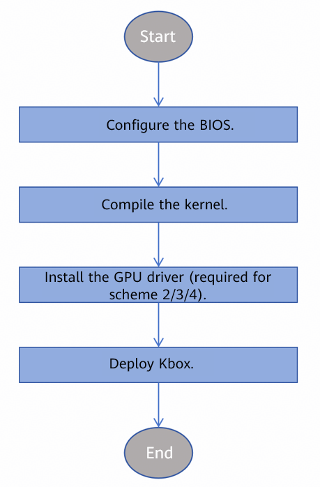

## 4 Configuring the BIOS<a name="ZH-CN_TOPIC_0000002518385450" id="configuring-the-bios"></a>

### 4.1 Inserting DIMMs<a name="ZH-CN_TOPIC_0000002518385442"></a>

The BIOS version of the specified server has restrictions on the DIMM insertion method. Before setting the BIOS, ensure that you have inserted DIMMs in the same way as described in this section.

[**Figure 1** DIMM insertion](#dimm-insertion) shows the DIMM insertion methods. Each row in the table corresponds to the CPU ID and each column corresponds to the number of inserted DIMMs. Insert the DIMMs based on the CPU ID and the number of inserted DIMMs, as well as their corresponding row and column in the table.

**Figure 1** DIMM insertion<a name="fig10693358191820"></a><a id="dimm-insertion"></a>


### 4.2 (Hardware Configuration Scheme 1/2) Configuring the BIOS<a name="ZH-CN_TOPIC_0000002549865263"></a>

This section describes how to configure the BIOS in hardware configuration schemes 1 and 2, including MISC, performance, memory, and PCIe options, to improve server performance.

**Restarting the Server and Entering the BIOS Setup Screen<a name="section2017525320112"></a>**

1. Log in to the remote management platform of the server. On the Remote Virtual Console, press **Del** or **F4** after the system boot screen is displayed.

    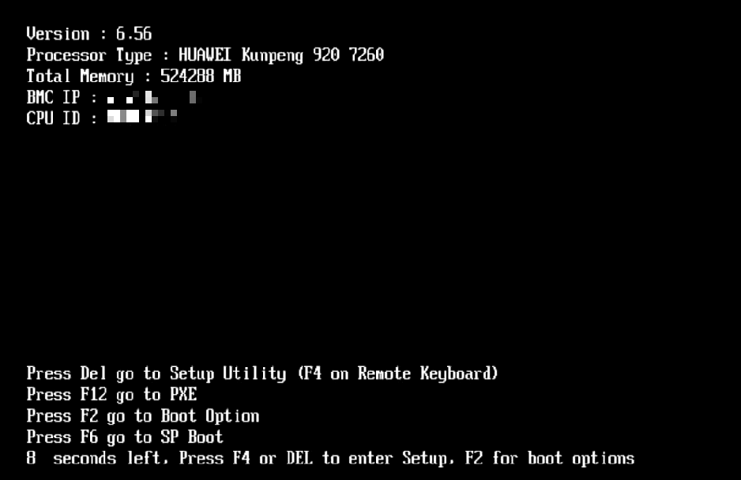

2. Enter the BIOS password to access the BIOS setup screen.

    

**Configuring MISC Options<a name="section131715818217"></a>**

Set **Support Smmu** and **Support 44Bit** as follows.

1. On the BIOS setup screen, choose **Advanced** > **MISC Config**.

    

2. On the **MISC Config** screen, set **Support Smmu** to **Disabled**.

    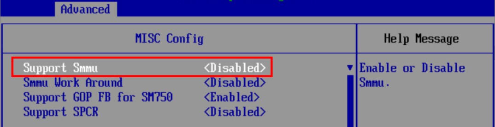

3. (Hardware configuration scheme 1) Set **Support 44Bit** to **Enabled**.

    

4. Save the settings and exit.

**Configuring Performance Options<a name="section18236319121"></a>**

1. On the BIOS setup screen, choose **Advanced** > **Performance Config**.

    

2. On the **Performance Config** screen, set **Power Policy** to **Performance**. Save the setting and exit.

    

**Configuring Memory Options<a name="section2544330723"></a>**

Set **Memory Frequency** and **Custom Refresh Rate** as follows.

1. On the BIOS setup screen, choose **Advanced** > **Memory Config**.
2. On the **Memory Config** screen, set **Memory Frequency** to **2933** and **Custom Refresh Rate** to **Auto**. Save the settings and exit.

    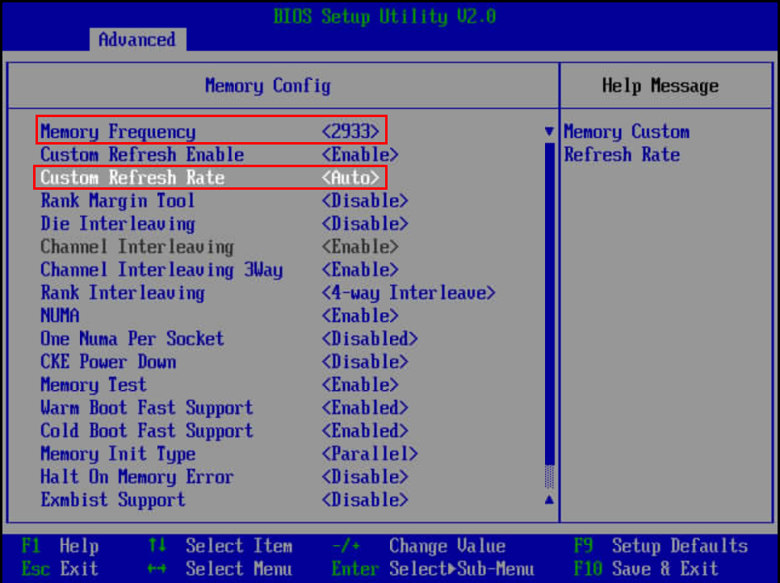

**(Hardware Configuration Scheme 1, Optional) Configuring PCIe Options<a name="section1053210511726"></a>**

If hardware configuration scheme 1 is used and the hardware decoding function of the encoding card is required, you need to set PCIe options to configure encoding card bandwidth splitting. In this way, the encoding card can achieve better performance and compatibility in various scenarios.

1. On the BIOS setup screen, choose **Advanced** > **PCIe Config**.
2. On the **PCIe Config** screen, set the PCIe splitting option of the slot where the NETINT Quadra card is installed to **x4**, save the settings, and exit.

    For example, if the NETINT Quadra card is installed in slot 3, set **Slot3 BandWidth Splitting** to **x4**.

    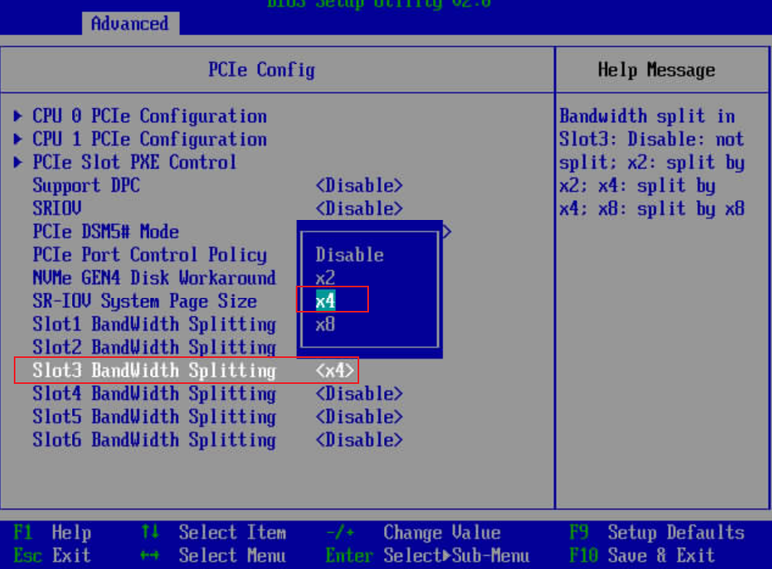

3. Access the server OS. Run the **nvme** command to confirm that the PCIe splitting setting takes effect.

    1. The NETINT encoding card uses the NVMe protocol. If NVMe is not installed in the environment, install it.

        ```shell
        yum install nvme-cli
        ```

    2. After installing the NETINT encoding card, run the following command to check whether the card is correctly identified:

        ```shell
        nvme list
        ```

        If information similar to the following is displayed, the NETINT card is correctly installed. The command output is only an example.

        ```shell
        Node          SN                   Model            Namespace Usage                    Format           FW Rev
        ------------- -------------------- ---------------- --------- ------------------------ ---------------- --------
        /dev/nvme0n1  Q2A325A11DC082-0454A QuadraT2A        1         8.59  TB /   8.59  TB    4 KiB +  0 B     48F6rKr1
        /dev/nvme1n1  Q2A325A11DC082-0454B QuadraT2A        1         8.59  TB /   8.59  TB    4 KiB +  0 B     48F6rKr1
        ```

    > **NOTE:**
    >
    >- One NETINT Quadra card has two chips, corresponding to two device nodes. The preceding output shows one NETINT Quadra card, which corresponds to two device nodes.

### 4.3 (Hardware Configuration Scheme 3/4) Configuring the BIOS<a name="ZH-CN_TOPIC_0000002518385436"></a>

This section describes how to configure the BIOS in hardware configuration scheme 3 and 4, including MISC, performance, and memory options, to improve server performance.

**Restarting the Server and Entering the BIOS Setup Screen<a name="section2017525320112"></a>**

1. Log in to the remote management platform of the server. On the Remote Virtual Console, press **Del** or **F4** after the system boot screen is displayed.

    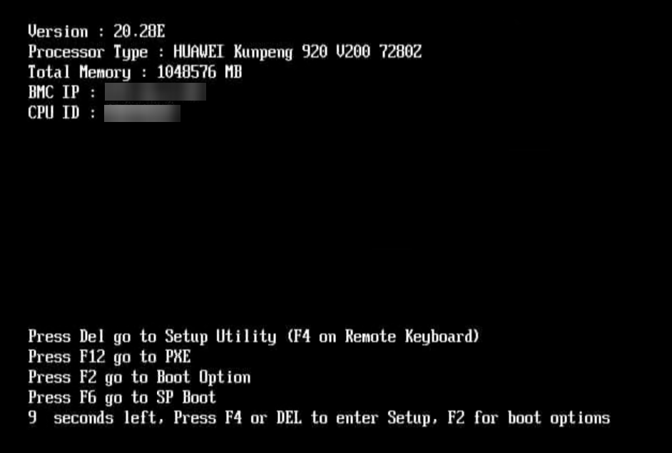

2. Enter the BIOS password to access the BIOS setup screen.

    

**Configuring MISC Options<a name="section131715818217"></a>**

Configure the **Support Smmu** option as follows.

1. On the BIOS setup screen, choose **Advanced** > **MISC Configuration**.

    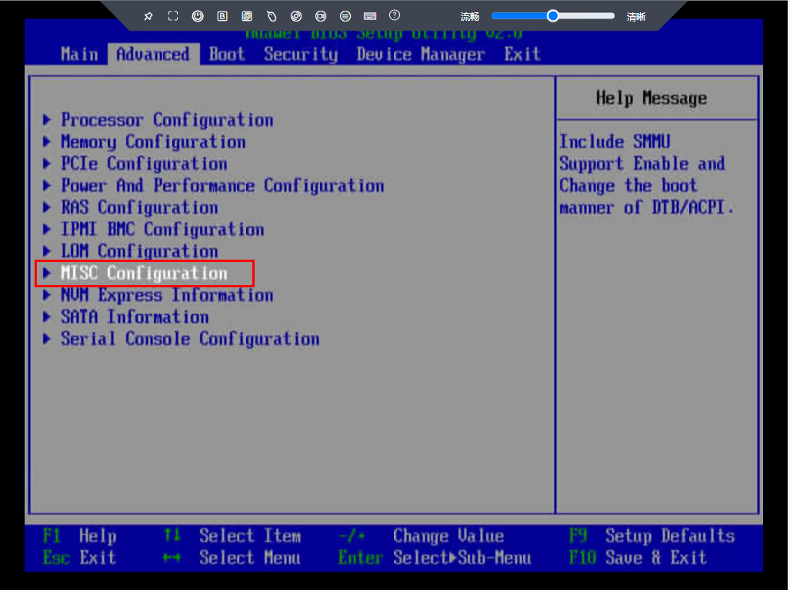

2. On the **MISC Configuration** screen, set **Support Smmu** to **Disabled**. Save the setting and exit.

    

**Configuring Performance Options<a name="section18236319121"></a>**

1. On the BIOS setup screen, choose **Advanced** > **Power And Performance Configuration**.

    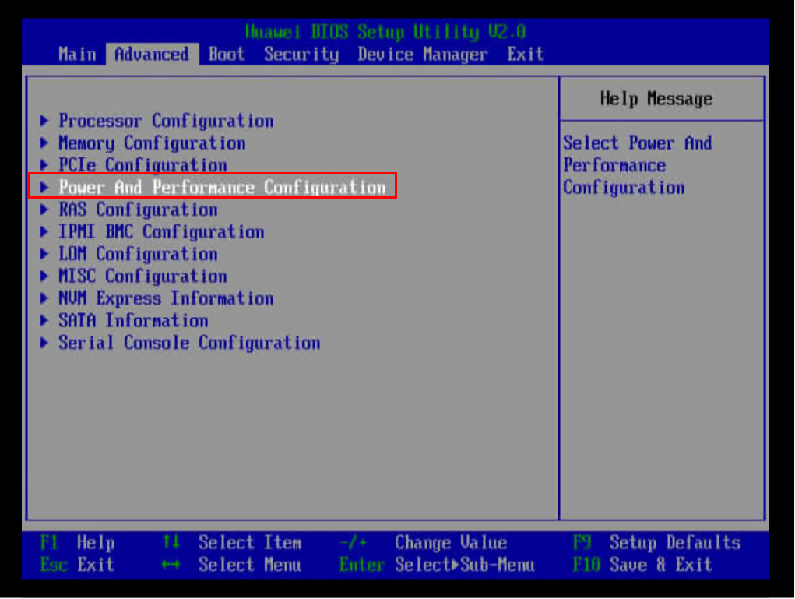

2. On the **Power And Performance Configuration** screen, set **Power Policy** to **Performance**. Save the setting and exit.

    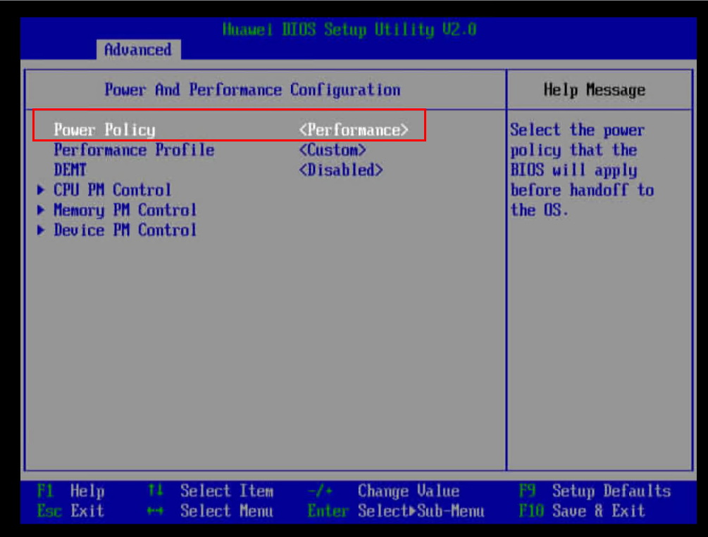

**Configuring Memory Options<a name="section2544330723"></a>**

Set **Memory Frequency** and **Custom Refresh Rate** as follows.

1. On the BIOS setup screen, choose **Advanced** > **Memory Configuration**.

    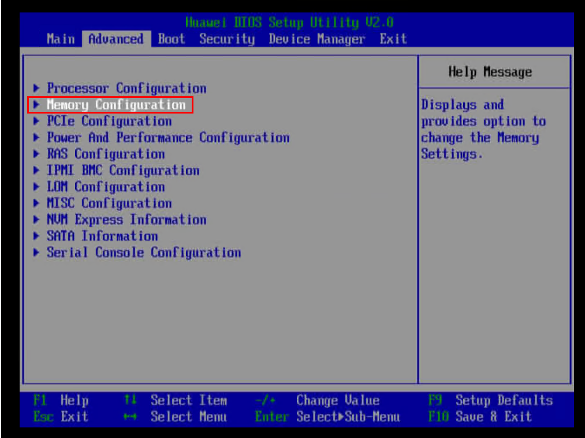

2. On the **Memory Configuration** screen, set **Memory Frequency** to **4800** for hardware configuration scheme 3 or to **5200** for hardware configuration scheme 4. Set **Custom Refresh Rate** to **Auto**, save the settings, and exit.

    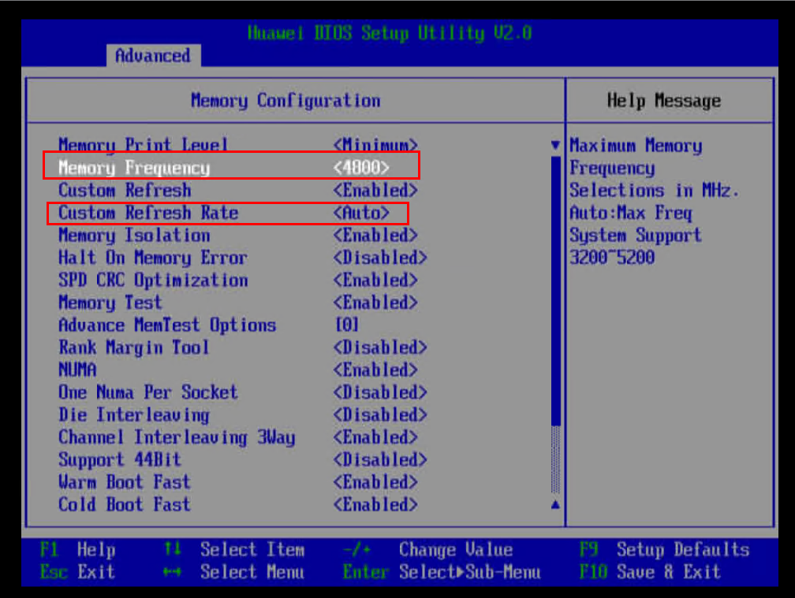

## 5. Binding NICs to CPUs<a name="ZH-CN_TOPIC_0000002518225524"></a>

When the CPU occupied by the network service is the same as the CPU bound to the container, the CPU resources in the container may be abnormal. To avoid this problem, bind NICs with heavy traffic and heavy load to idle CPUs.

> **NOTE:**
>
>- Perform the following operations each time the server is restarted.
>- If multiple NICs are used on the server, perform the following steps for each NIC.

1. <a name="zh-cn_topic_0000001259692597_zh-cn_topic_0000001256733899_li189522054171512"></a>Run the following command to check the PCI device number of a NIC: This document uses NIC **enp125s0f1** as an example.

    ```shell
    ethtool -i enp125s0f1 | grep bus-info | awk '{print $2}'
    ```

    In the following command output, the PCI device number of **enp125s0f1** is **0000:7d:00.1**.

    ```shell
    0000:7d:00.1
    ```

2. Run the following command to query the interrupts related to the NIC.

    In the command, *${id_pci}* indicates the NIC device number obtained in [1](#zh-cn_topic_0000001259692597_zh-cn_topic_0000001256733899_li189522054171512).

    ```shell
    cat /proc/interrupts | grep "${id_pci}" | awk -F: '{print $1}'
    ```

    In the following command output, the interrupts corresponding to the NIC are 358 and 359.

    ```shell
    358
    359
    ```

    > **NOTE:**
    >
    >If the NIC involves a large number of interrupts, check whether the interrupts are bound to different CPUs and determine whether to change the bound CPUs based on the check result.

3. Query the CPUs to which the interrupts are bound. *${break_value}* in the command is the NIC interrupt ID queried in the previous step.

    ```shell
    cat /proc/irq/${break_value}/smp_affinity_list
    ```

    - If the interrupts are bound to different CPUs and the CPUs bound to the NIC interrupts do not conflict with the CPUs bound to the container, skip the following steps in this section.
    - If most of the interrupts are on the same CPU or the NIC interrupts with high CPU usage need to be bound to an idle CPU, bind the NIC interrupts to a reserved CPU based on [4](#zh-cn_topic_0000001259692597_zh-cn_topic_0000001256733899_li1667182211497) and [5](#zh-cn_topic_0000001259692597_zh-cn_topic_0000001256733899_li1985492711497). The CPU in the NUMA node to which the NIC belongs is preferred.

4. <a name="zh-cn_topic_0000001259692597_zh-cn_topic_0000001256733899_li1667182211497"></a>Check the NUMA node to which the NIC connects based on the PCI device number.

    In the command, *${id_pci}* indicates the device number of the NIC. You can check the device number based on [1](#zh-cn_topic_0000001259692597_zh-cn_topic_0000001256733899_li189522054171512). Run the following command. The value of **NUMA node** in the command output is the NUMA node to which the NIC belongs.

    ```shell
    lspci -vvvs ${id_pci}
    ```

    In the following command output, the NUMA node of **enp125s0f1** obtained based on the PCI device number is 0.

    ```shell
    7d:00.1 Ethernet controller: Huawei Technologies Co., Ltd. HNS GE/10GE/25GE Network Controller (rev 21)
            Control: I/O- Mem+ BusMaster+ SpecCycle- MemWINV- VGASnoop- ParErr- Stepping- SERR- FastB2B- DisINTx-
            Status: Cap+ 66MHz- UDF- FastB2B- ParErr- DEVSEL=fast >TAbort- <TAbort- <MAbort- >SERR- <PERR- INTx-
            Latency: 0
            NUMA node: 0
            Region 0: Memory at 121040000 (64-bit, prefetchable) [size=64K]
            Region 2: Memory at 120400000 (64-bit, prefetchable) [size=1M]
            Capabilities: [40] Express (v2) Endpoint, MSI 00
    ```

5. <a name="zh-cn_topic_0000001259692597_zh-cn_topic_0000001256733899_li1985492711497"></a>Bind NIC interrupts to a reserved CPU. The CPU in the NUMA node to which the NIC belongs is preferred.

    In the following commands, *${break_1}* and *${break_2}* are the IDs of the two NIC interrupts.

    - Bind interrupt *${break_1}* to CPU 1.

        ```shell
        echo 1 > /proc/irq/${break_1}/smp_affinity_list
        ```

    - Bind interrupt *${break_2}* to CPU 2.

        ```shell
        echo 2 > /proc/irq/${break_2}/smp_affinity_list
        ```

    Take NIC **enp125s0f1** as an example. The corresponding interrupts are **358** and **359**, and the corresponding commands are as follows:

    ```shell
    echo 1 > /proc/irq/358/smp_affinity_list
    echo 2 > /proc/irq/359/smp_affinity_list
    ```

    > **NOTE:**
    >
    >After obtaining the NUMA node to which the NIC belongs, run the following command to view the core range of the NUMA node:
    >
    >```shell
    >lscpu
    >```
    >
    >As shown in the command output, the core range of NUMA node 0 is 0 to 31.
    >
    >```shell
    >NUMA node0 CPU(s):               0-31
    >NUMA node1 CPU(s):               32-63
    >NUMA node2 CPU(s):               64-95
    >NUMA node3 CPU(s):               96-127
    >```

## 6 (Hardware Configuration Scheme 1) Configuring the GPU Working Mode<a name="ZH-CN_TOPIC_0000002518225504"></a>

If hardware configuration scheme 1 is used, set the GPU working mode to the high-performance mode to enable the GPU to run at the maximum frequency and maintain the optimal GPU performance. This operation needs to be performed each time the system is restarted.

Run the following command:

```shell
find /sys -name power_dpm_force_performance_level | xargs -I {} sh -c "echo high > '{}'"
```

## 7 Compiling the Kernel<a name="ZH-CN_TOPIC_0000002518385448"></a>

### 7.1 Preparations<a name="ZH-CN_TOPIC_0000002518225520"></a>

The Kbox cloud phone container supports kernel source code compilation on openEuler 24.03 LTS SP1 (kernel version 6.6.0-72.0.0). Before the compilation, configure the network environment and software repository of the server, and synchronize the server system time to download compilation dependencies.

> **NOTE:**
>
>- The kernel configurations and modifications in the "Compiling the Kernel" section are for functional reference only. It is not recommended that Kunpeng BoostKit for Cloud Phone demos be used in commercial solutions. Customers or ISVs must perform necessary security assessment before commercial use. Using Kunpeng BoostKit for Cloud Phone demos implies the user's acceptance of all associated security risks.
>- For details about how to install openEuler, see the [official openEuler document](https://docs.openeuler.org/en/docs/24.03_LTS_SP3/server/installation_upgrade/installation/installation_preparations.html).

During the compilation, use the **root** user to log in and perform operations.

1. Disable the warning "your kernel does not support swap memory limit..." and enable cgroup v2.

    Modify the **/etc/default/grub** file by adding parameters **cgroup_enable=memory swapaccount=1 systemd.unified_cgroup_hierarchy=1** to the end of the **GRUB_CMDLINE_LINUX** configuration item.

    1. Check the current configuration.

        ```shell
        cat /etc/default/grub | grep "cgroup_enable=memory swapaccount=1 systemd.unified_cgroup_hierarchy=1"
        ```

    2. If the command output is empty, run the following command to configure the kernel boot items:

        ```shell
        sed -i '/GRUB_CMDLINE_LINUX/s/\"$//' /etc/default/grub; sed -i '/GRUB_CMDLINE_LINUX/s/$/ cgroup_enable=memory swapaccount=1 systemd.unified_cgroup_hierarchy=1\"/' /etc/default/grub
        ```

    3. Check the modification result.

        ```shell
        cat /etc/default/grub | grep "GRUB_CMDLINE_LINUX"
        ```

        The following is a command output example. It is normal if there are other fixed parameters.

        ```shell
        GRUB_CMDLINE_LINUX="cgroup_enable=memory swapaccount=1 systemd.unified_cgroup_hierarchy=1"
        ```

    4. Update the GRUB configuration file.

        ```shell
        grub2-mkconfig -o /boot/efi/EFI/openEuler/grub.cfg
        ```

    > **NOTE:**
    >
    >The configuration takes effect after the system is restarted. You can restart the system after operations in [Compiling and Installing the Kernel](#compiling-and-installing-the-kernel) are completed to make all settings take effect.

2. Disable SELinux.

    1. Configure SELinux.

        ```shell
        sed -i "s|^SELINUX=.*|SELINUX=disabled|g" /etc/selinux/config
        ```

    2. Check the modification result.

        ```shell
        cat /etc/selinux/config | grep "^SELINUX="
        ```

        Ensure that the command output is as follows:

        ```shell
        SELINUX=disabled
        ```

    > **NOTE:**
    >
    >- If there is no **/etc/selinux/config** file, run the following command to create a file and write the SELinux rule into the file:
    >
    > ```shell
    > echo "SELINUX=disabled" > /etc/selinux/config
    >    ```
    >
    >- The configuration takes effect after the system is restarted. You can restart the system after operations in [Compiling and Installing the Kernel](#compiling-and-installing-the-kernel) are completed to make all settings take effect.

3. When multiple Kbox containers are started, the file access workload is heavy on the host. In this case, adjust the maximum number of inotify instances that can be created.
    1. Check the current configuration.

        ```shell
        cat /etc/sysctl.conf | grep "fs.inotify.max_user_instances=8192"
        ```

    2. If the command output is empty, run the following command to configure the maximum number of inotify instances:

        ```shell
        echo "fs.inotify.max_user_instances=8192" >> /etc/sysctl.conf
        ```

    3. Check the modification result.

        ```shell
        cat /etc/sysctl.conf | grep "fs.inotify.max_user_instances"
        ```

        Ensure that the command output is as follows:

        ```shell
        fs.inotify.max_user_instances=8192
        ```

    4. Make the modification take effect.

        ```shell
        sysctl -p
        ```

4. Install base dependencies.

    ```shell
    yum install -y make dpkg dpkg-devel openssl openssl-devel ncurses ncurses-devel bison flex bc libdrm build elfutils-libelf-devel patch gcc
    ```

    > **NOTE:**
    >
    >If a package fails to be obtained during the installation, manually obtain the package based on the address provided in the message and install it. After the installation is successful, continue to install the remaining dependency packages.

5. Install Docker and lxcfs, start the lxcfs service, and set the lxcfs service to automatically start upon system startup. If Docker and lxcfs have been installed, skip this step.

    ```shell
    yum install -y docker lxc lxcfs lxcfs-tools 
    systemctl start lxcfs && systemctl enable lxcfs
    ```

    > **NOTE:**
    >
    >If an error is reported during lxcfs startup, restart the service or contact Huawei technical support.

6. Upgrade Docker to version 24.0.0 if the Docker version installed using **yum** is earlier than 24.0.0.

    Download the **docker-24.0.0.tgz** file from the link provided in [Software Environment](#software-requirements). Decompress the package in any directory and copy the files in the binary package to **/usr/bin**.

    ```shell
    tar -xvf docker-24.0.0.tgz
    cp docker/* /usr/bin
    systemctl restart docker
    ```

7. (Optional) (Hardware configuration scheme 2/3/4) In the case of high container density, the udev-worker process on the host may exhibit periodic spikes in CPU usage due to the handling of loop devices. Run the following commands to disable the udev function if necessary:
    
    The following operations are for reference only. By default, they are automatically executed in the container startup script and do not need to be manually executed.

    Stop related services. The following commands need to be executed again after the server is restarted.

    ```shell
    sudo systemctl stop systemd-udevd-control.socket
    sudo systemctl stop systemd-udevd-kernel.socket
    sudo systemctl stop systemd-udevd.service
    ```

    Check whether the services are stopped as expected.

    ```shell
    sudo systemctl status systemd-udevd-control.socket | grep 'Active:'
    sudo systemctl status systemd-udevd-kernel.socket | grep 'Active:'
    sudo systemctl status systemd-udevd.service | grep 'Active:'
    ```

    Expected output:

    ```shell
    Active: inactive (dead) since ...
    ```

### 7.2 Compiling and Installing the Kernel<a name="ZH-CN_TOPIC_0000002549745269"></a>

#### 7.2.1 Downloading Kernel Source Code<a name="ZH-CN_TOPIC_0000002549865295"></a>

This section describes how to obtain the correct kernel source code version and decompress the kernel source code.

1. Download the kernel source package **kernel-6.6.0-72.0.0.zip** from the link provided in [Software Environment](#software-requirements) to your local PC, upload the package to the **/usr/src/kernels** directory on the server, and decompress it.

    ```shell
    cd /usr/src/kernels
    unzip kernel-6.6.0-72.0.0.zip
    ```

2. Disable the local version number.

    ```shell
    cd /usr/src/kernels/kernel-6.6.0-72.0.0
    touch .scmversion
    ```

#### 7.2.2 Applying Kernel Patches<a name="ZH-CN_TOPIC_0000002549865259"></a>

Apply kernel patches into the kernel source code directory to support Kbox.

1. Create a directory for storing the dependency packages required for environment setup and change the directory permission.

    ```shell
    mkdir ~/dependency
    chmod -R 700 ~/dependency
    ```

2. Decompress **Kbox-patches-AOSP15.zip** and upload the **patchForKernel** and **patchForExagear** directories in the **Kbox-patches-AOSP15** folder to the **~/dependency** directory on the server. Assign appropriate permissions on the uploaded files and directories. You are not advised to assign the write permission for other user groups.
3. Copy the transcoding patch to the kernel source code directory.

    ```shell
    cp ~/dependency/patchForExagear/hostOS/0001-exagear-kernel-module.patch /usr/src/kernels/kernel-6.6.0-72.0.0
    ```

4. Copy the kernel patches to the kernel source code directory.

    ```shell
    cp ~/dependency/patchForKernel/openEuler_24.03/kernel_6.6.0-72.0.0/*.patch /usr/src/kernels/kernel-6.6.0-72.0.0
    ```

5. Apply kernel patches.

    ```shell
    cd /usr/src/kernels/kernel-6.6.0-72.0.0
    for patch_name in *.patch; do echo $patch_name; patch -p1 < $patch_name; done
    ```

#### 7.2.3 Compiling and Installing the Kernel<a name="ZH-CN_TOPIC_0000002549865277"></a>

##### 7.2.3.1 Generating and Configuring a .config File<a name="ZH-CN_TOPIC_0000002518385420"></a>

Generate a .config file and configure kernel compilation options. This file is used to specify the functions and features to be enabled.

1. Copy the config file in the **/boot** directory to the source code directory and rename the file to **.config**.

    > **NOTE:**
    >
    >- In the command, the name of the config file in the **/boot** directory is only an example. You can use the **uname -r** command to view the actual file name. The config file version must match the OS kernel version.
    >- If the **config-`uname -r`** file does not exist in the **/boot** directory, copy any file prefixed with **config-** in the **/boot** directory to the kernel source code directory on the server and rename the file **.config**.

    ```shell
    cp /boot/config-`uname -r` /usr/src/kernels/kernel-6.6.0-72.0.0/.config
    ```

2. Generate a .config file.

    ```shell
    cd /usr/src/kernels/kernel-6.6.0-72.0.0/
    make menuconfig
    ```

3. Select **Load** on the following page.

    

4. Select **OK** on the following page.

    

5. Configure the kernel compilation options.

    On the page shown in [**Figure 1** Kernel configuration page](#kernel-configuration-page), configure the kernel compilation options according to [**Table 1** Kernel compilation options](#kernel-compilation-options).

    **Figure 1** Kernel configuration page<a name="fig4732181117012"></a><a id="kernel-configuration-page"></a>
    

    **Table 1** Kernel compilation options<a id="kernel-compilation-options"></a>

    |Configuration Item|Required Value|Configuration Prompt|Configuration Result Written to the .config File|
    |--|--|--|--|
    |KBOX|Y|[*] Kernel support for Kbox|CONFIG_KBOX=y|
    |ANDROID_BINDER_DEVICES|binder,hwbinder,vndbinder|(binder,hwbinder,vndbinder) Android Binder devices|CONFIG_ANDROID_BINDER_DEVICES="binder,hwbinder,vndbinder"|
    |HISI_PMU|M|\<M> HiSilicon SoC PMU drivers|CONFIG_HISI_PMU=m|
    |SYSTEM_TRUSTED_KEYS|Clear out this field.|( ) Additional X.509 keys for default system keyring|CONFIG_SYSTEM_TRUSTED_KEYS=""|
    |DEBUG_INFO_DWARF4|N (Press **Enter** to go to the **Debug information** submenu and press the space bar to select **Disable debug information**.)|Debug information (Disable debug information)|# CONFIG_DEBUG_INFO_DWARF4 is not set|
    |PSI_DEFAULT_DISABLED|N|[  ] Require boot parameter to enable pressure stall information tracking|# CONFIG_PSI_DEFAULT_DISABLED is not set|

    **Table 2** Configuration for enabling the F2FS kernel compilation option<a id="configuration-for-enabling-the-f2fs-kernel-compilation-option"></a>

    |Configuration Item|Required Value|Configuration Prompt|Configuration Result Written to the .config File|
    |--|--|--|--|
    |CONFIG_F2FS_FS|Y|[\*] F2FS filesystem support|CONFIG_F2FS_FS=y|  

    To enable container support for booting with the F2FS file system, you need to configure the preceding kernel compilation options.

    **Table 3** (Optional) Configurations for enabling the NFS kernel compilation options <a id="configurations-for-enabling-the-nfs-kernel-compilation-options"></a>

    |Configuration Item|Required Value|Configuration Prompt|Configuration Result Written to the .config File|
    |--|--|--|--|
    |CONFIG_NFS_FS|M|[M] NFS client support|CONFIG_NFS_FS=m|
    |CONFIG_NFSD|M|[M] NFS server support|CONFIG_NFSD=m|
    |CONFIG_NFS_V4|M|[M] NFS client support for NFS version 4|CONFIG_NFS_V4=m|

    To enable container booting via NFS mount, you need to configure the preceding kernel compilation options.

    > **NOTE:**
    >
    >Configuration methods:
    >- Press the up, down, left, and right arrow keys to navigate the menu.
    >- Press **Enter** to select a submenu or edit the content of a selected item.
    >- Press **Esc** twice to exit.
    >- Press **/** for search.
    >- Press **Y** to compile the selected item into the kernel. The corresponding item is displayed as **[*]**.
    >- Press **N** to exclude the selected item. The corresponding item is displayed as **\[\]**.
    >- Press **M** to compile the selected item into a module (in KO format). The corresponding item is displayed as **<M\>**.

    See the example configuration:

    1. On the configuration page, press **/** to search, type **STAGING**, and press **Enter**. The search result is displayed, as shown in the following figure.

        

    2. Confirm the number of the configuration item, for example, **(1)** in the following figure. Press **1** to select the configuration item.

        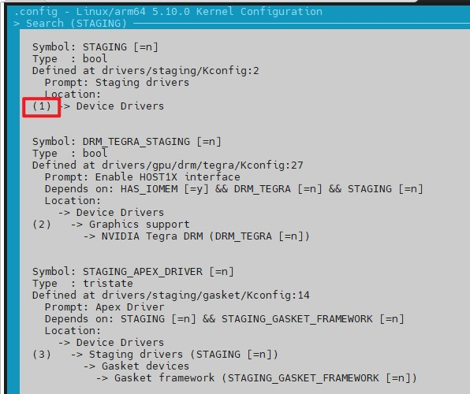

    3. Press **y** to compile the selected item into the kernel, use the left and right arrow keys to navigate to **<Exit\>**, and press **<Enter\>**.

        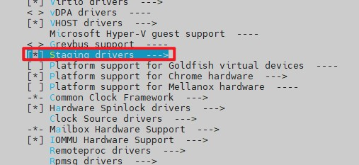

    4. On the kernel configuration home page, configure the next item as required.

6. After the configuration is complete, select **Save** on the kernel configuration home page.

    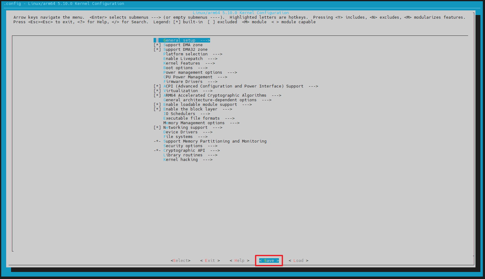

7. Select **OK** on the following page.

    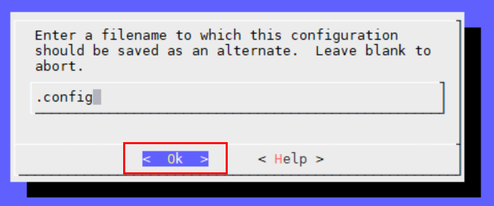

8. Select **Exit** on the following page.

    

9. The following page is displayed. Select **Exit**. The .config file is generated in the current directory.

    

##### 7.2.3.2 Compiling and Installing the Kernel<a name="ZH-CN_TOPIC_0000002549745263" id="compiling-and-installing-the-kernel"></a>

This section describes how to compile and install kernel 6.6.0-72.0.0 on openEuler 24.03 LTS SP1.

1. <a name="zh-cn_topic_0000001505919657_zh-cn_topic_0000001373652281_zh-cn_topic_0000001259572633_zh-cn_topic_0000001212014022_li295103241"></a>Compile the kernel.

    ```shell
    cd /usr/src/kernels/kernel-6.6.0-72.0.0
    make -j64
    ```

    > **NOTE:**
    >
    >If the following information is displayed during the compilation, ensure that the server system time is the current time.
    >
    >```shell
    >make[2]: warning:  Clock skew detected.  Your build may be incomplete.
    >```
    >
    >Run the **tzselect** command. Enter the numbers corresponding to your time zone in sequence. After the command is executed, copy the file to **/etc/localtime**.
    >
    >```shell
    >tzselect
    >cp -f /usr/share/zoneinfo/Asia/Beijing /etc/localtime
    >```

2. Check whether the kernel is compiled successfully.

    Check whether **vmlinux** files are generated in the compilation path. If **vmlinux** files are generated, the compilation is successful. You can proceed to the next step. If not, check whether an error is reported during compilation, rectify the fault, and perform [1](#zh-cn_topic_0000001505919657_zh-cn_topic_0000001373652281_zh-cn_topic_0000001259572633_zh-cn_topic_0000001212014022_li295103241) again.

    ```shell
    ll vmlinux*
    ```

    If information similar to the following is displayed, the compilation is successful:

    ```shell
    -rwxr-xr-x   1 root root 39495600 Dec  8 17:06 vmlinux
    -rw-r--r--   1 root root   214542 Dec  8 17:06 vmlinux.a
    -rw-r--r--   1 root root 49125656 Dec  8 17:06 vmlinux.o
    ```

3. Install the kernel modules.

    ```shell
    make modules_install
    ```

4. Install the kernel.

    ```shell
    make install
    ```

    > **NOTE:**
    >
    >- Before installing the kernel, ensure that dkms is not installed in the system. Otherwise, the error message "Error! Bad return status for module build on kernel: ..." may be displayed during kernel installation. The solution is as follows:
    > 1. Check whether dkms is installed in the system.
    >
    >        ```shell
    >        yum list installed | grep dkms
    >        ```
    >
    >        If a command output is displayed, dkms has been installed.
    > 2. Remove dkms.
    >
    >        ```shell
    >        yum remove -y dkms
    >        ```
    >
    > 3. Reinstall the kernel.
    >
    >        ```shell
    >        make install
    >        ```
    >
    >- During kernel installation, the following error message may be displayed. In this case, you need to run the **make install** command again.
    >
    > ```shell
    > dracut-install: Failed to find module 'uds' /lib/modules/6.6.0/kernel/drivers/block/uds.ko
    > dracut-install: Failed to find module 'kvdo' /lib/modules/6.6.0/kernel/drivers/block/kvdo.ko
    >    ```

5. Update the boot items.

    ```shell
    grub2-mkconfig -o /boot/efi/EFI/openEuler/grub.cfg
    ```

    Set the boot kernel to **openEuler (6.6.0) 24.03 (LTS-SP1)**.

    ```shell
    grub2-set-default 'openEuler (6.6.0) 24.03 (LTS-SP1)'
    ```

    Reboot the OS for the new kernel to take effect.

    ```shell
    reboot
    ```

6. Check the version of the new kernel. If the version is 6.6.0, the correct kernel is installed.

    ```shell
    uname -r
    ```

    > **NOTE:**
    >
    >If the new kernel cannot be accessed after the reboot, select the new kernel to access the system after the BIOS enters the GRUB boot mode, or contact technical support.
    >If the amdgpu kernel module fails to be installed after the reboot, run the **modprobe amdgpu** command to manually install the module.

## 8 Deploying Kbox<a name="ZH-CN_TOPIC_0000002518225514"></a>

### 8.1 Determining the GPU Topology<a id="determining-the-gpu-topology"></a>

This section describes how to obtain information about the GPU rendering nodes and their associated NUMA nodes on the server.

**Hardware Configuration Scheme 1<a name="section15510204125011"></a>**

1. <a name="li34656503552"></a>Query GPU rendering nodes.

    ```shell
    ll /dev/dri/by-path/ | grep renderD
    ```

    Example command output:

    ```shell
    lrwxrwxrwx 1 root root 13 Oct 25 10:58 pci-0000:03:00.0-render -> ../renderD128
    lrwxrwxrwx 1 root root 13 Oct 25 10:58 pci-0000:83:00.0-render -> ../renderD129
    ```

    This indicates that two AMD GPUs are inserted into the server, and the rendering nodes are **renderD128** and **renderD129**.

2. Query the NUMA node to which a GPU rendering node belongs.

    ```shell
    cat /sys/bus/pci/devices/0000\:XX\:00.0/numa_node 
    ```

    Replace *XX* in the command with the IP address of a node queried in [1](#li34656503552). Take **renderD128** as an example. The query command is as follows:

    ```shell
    cat /sys/bus/pci/devices/0000\:03\:00.0/numa_node
    ```

    The following figure shows the command output.

    ```shell
    0
    ```

    This indicates that **renderD128** belongs to NUMA node 0.

**Hardware Configuration Scheme 2/3/4<a name="section1941402516517"></a>**

Check the NUMA node to which the GPU nodes belong.

```shell
lspci -vvv -d :0200 | grep NUMA
```

Each DaoCloud DC1000 has four GPU nodes. The following uses the 4 x DaoCloud DC1000 configuration as an example. Each line in the command output corresponds to a GPU node (renderD node, numbered from 128) in sequence. Example command output:

```shell
NUMA node: 0
NUMA node: 0
NUMA node: 0
NUMA node: 0
NUMA node: 0
NUMA node: 0
NUMA node: 0
NUMA node: 0
NUMA node: 2
NUMA node: 2
NUMA node: 2
NUMA node: 2
NUMA node: 2
NUMA node: 2
NUMA node: 2
NUMA node: 2
```

The command output shows that, in the **/dev/dri/** directory, rendering nodes **renderD128** to **renderD135** belong to NUMA0 and **renderD136** to **renderD143** belong to NUMA2.

### 8.2 (Hardware Configuration Scheme 1, Optional) Upgrading the NVMe Firmware<a name="ZH-CN_TOPIC_0000002549745271"></a>

This section is required only when hardware configuration scheme 1 is used and the hardware decoding function of the encoding card needs to be enabled. If hardware decoding is not required, skip this section.

Before deploying the environment, check whether the encoding card is correctly detected by the NVMe driver and check the NVMe firmware version. If the version is different from that provided in this section, upgrade the firmware.

1. Check whether the encoding card is correctly detected by the NVMe driver.

    ```shell
    nvme list
    ```

    If the following information is displayed, the encoding card is correctly detected. The command output is only an example.

    ```shell
    Node          SN                   Model            Namespace Usage                    Format           FW Rev
    ------------- -------------------- ---------------- --------- ------------------------ ---------------- --------
    /dev/nvme0n1  Q2A325A11DC082-0454A QuadraT2A        1         8.59  TB /   8.59  TB    4 KiB +  0 B     48F6rKr1
    /dev/nvme1n1  Q2A325A11DC082-0454B QuadraT2A        1         8.59  TB /   8.59  TB    4 KiB +  0 B     48F6rKr1
    ```

    If the firmware version (the **FW Rev** column) is inconsistent with the 4.8.F-Android15 firmware version, refer to the following steps to upgrade the encoding card firmware.

    > **NOTE:**
    >
    >About the NVMe firmware version: The larger the numbers and the later the letters, the newer the version.

2. Extract the 4.8.F-Android15 firmware upgrade package from **Quadra_V_***XXX***_.zip** (*XXX* indicates the version number. Use the actual package name in the following commands) and upgrade the firmware.

    ```shell
    unzip Quadra_VXXX.zip
    cd Quadra_VXXX/
    tar -zxvf Quadra_FW_VXXX.tar.gz
    cd Quadra_FW_VXXX/
    chmod +x quadra_auto_upgrade.sh
    ./quadra_auto_upgrade.sh
    ```

    The upgrade takes about 1 minute.

3. After the upgrade is complete, reboot the system for the upgrade to take effect.

    ```shell
    reboot
    ```

### 8.3 (Hardware Configuration Scheme 2/3/4) Installing the GPU Driver<a name="ZH-CN_TOPIC_0000002518385424"></a>

You need to install the GPU driver each time the server is restarted if you use configuration scheme 2/3/4.

1. Obtain **VAGPU-25.03.01.01-RC13-A15.tgz** by referring to [Software Environment](#software-requirements), upload it to the **~/dependency/** directory, and decompress it to obtain the kernel-mode GPU driver.

    ```shell
    cd ~/dependency/
    tar -zxvf VAGPU-25.03.01.01-RC13-A15.tgz
    ```

2. Install the PCIe driver for the GPU.

    ```shell
    cd ~/dependency/VAGPU-25.03.01.01-RC13-A15/openEuler-6.6.0+/ko_fw
    insmod va_pci.ko
    ```

3. Copy the firmware in the driver package to the **/lib/firmware/** directory of the OS.

    ```shell
    cp rgx* /lib/firmware/
    ```

4. Install the GPU driver.

    The GPU driver starts a kworker process for each GPU node. A single DaoCloud DC1000 card has four nodes. To improve the performance of kworker processes, you are advised to use the **kworkerCores** parameter to bind kworker processes to CPU cores. Each value of the **kworkerCores** parameter indicates a core bound to the kworker process of the corresponding GPU node.

    When binding GPU driver processes to CPU cores, **ensure that the CPU cores bound to the kworker processes and GPU rendering nodes belong to the same CPU socket**. For details about how to query the CPU socket to which a GPU rendering node belongs, see [Determining the GPU Topology](#determining-the-GPU-topology).

    The following core binding methods are for reference only. You can make adjustments based on actual circumstances.

    Hardware configuration scheme 2 (Kunpeng 920 + 4 x DaoCloud DC1000)

    ```shell
    insmod va_gfx.ko kworkerCores=0,0,1,1,32,32,33,33,64,64,65,65,96,96,97,97
    ```

    Hardware configuration scheme 3 (new Kunpeng 920 processor model + 8 x DaoCloud DC1000)

    ```shell
    insmod va_gfx.ko kworkerCores=80,80,81,81,82,82,83,83,0,0,1,1,2,2,3,3,240,240,241,241,242,242,243,243,160,160,161,161,162,162,163,163
    ```

    Hardware configuration scheme 4 (new Kunpeng 920 processor model + 8 x DaoCloud DC1000)

    ```shell
    insmod va_gfx.ko kworkerCores=64,64,65,65,66,66,67,67,0,0,1,1,2,2,3,3,192,192,193,193,194,194,195,195,128,128,129,129,130,130,131,131
    ```

5. Wait until the script execution is complete and check the kernel logs.

    ```shell
    dmesg | grep VAGPU | grep version
    ```

    In the command output, if the kernel-mode driver version and GPU firmware version are the same (content in bold), the GPU driver is installed.

    ```shell
    PVR_K:  28823: Meta firmware version: 1.18@6276027 build: release branch:  commit: 67e785a8 tag: VAGPU-25.03.01.01-RC13-A15
    ...
    ```

> **NOTE:**
>
>To change the driver version, you need to uninstall the drivers and install the drivers of another version.
>
>1. Delete all containers to release the drivers.
>2. Uninstall the drivers in sequence.
>
> ```shell
> rmmod va_gfx
> rmmod va_pci
>    ```

### 8.4 Uploading the ExaGear Transcoding Package<a name="ZH-CN_TOPIC_0000002549745297"></a>

When a script is used to start the Kbox container, ExaGear transcoding is required. This function is automatically enabled if the ExaGear transcoding package exists in the **~/dependency** directory. Therefore, upload the ExaGear transcoding package to this directory in advance. If the automatic enabling fails, manually enable the ExaGear transcoding function.

1. Upload the ExaGear transcoding package **ExaGear_ARM32-ARM64.tar.gz** to **~/dependency**. Assign appropriate permissions on the uploaded files and directories. You are not advised to assign the write permission for other user groups.
2. <a name="li178196349414"></a>Decompress the transcoding package and adjust the permissions.

    ```shell
    cd ~/dependency/
    tar -xzvf ExaGear_ARM32-ARM64.tar.gz
    chown -R root:root ExaGear_ARM32-ARM64
    ```

    > **NOTE:**
    >
    >Only one ExaGear transcoding package can be retained in the **~/dependency** directory. If an earlier ExaGear transcoding package exists, delete it. Otherwise, the error message "Many ubt_a32a64 files exist!" is displayed when the Kbox container is started.

Generally, you do not need to perform the following steps.

If ExaGear transcoding fails to be automatically enabled, perform the following steps to manually enable this function after decompressing the transcoding package (that is, after [step 2](#li178196349414) is performed).

1. Mount the binfmt_misc file system.

    It is mounted by default. If not, manually mount it.

    ```shell
    mount -t binfmt_misc none /proc/sys/fs/binfmt_misc
    ```

2. Create an **/opt/exagear** directory for storing the **ubt_a32a64** file.

    ```shell
    mkdir -p /opt/exagear 
    chmod -R 700 /opt/exagear
    ```

3. Copy the **ubt_a32a64** file to the **/opt/exagear** directory.

    ```shell
    cp ~/dependency/ExaGear_ARM32-ARM64/ubt_a32a64 /opt/exagear/
    ```

4. Mount and register the ExaGear transcoding rules.

    ```shell
    echo ":ubt_a32a64:M::\x7fELF\x01\x01\x01\x00\x00\x00\x00\x00\x00\x00\x00\x00\x02\x00\x28\x00:\xff\xff\xff\xff\xff\xff\xff\x00\xff\xff\xff\xff\xff\xff\xff\xff\xfe\xff\xff\xff:/opt/exagear/ubt_a32a64:POCF" > /proc/sys/fs/binfmt_misc/register
    ```

5. Check whether the ExaGear rules are successfully registered and ensure that the directories for storing the **ubt_a32a64** file are consistent with **/opt/exagear/ubt_a32a64**.

    ```shell
    cat /proc/sys/fs/binfmt_misc/ubt_a32a64
    ```

    If the following information is displayed, the registration is successful:

    ```shell
    enabled 
    interpreter /opt/exagear/ubt_a32a64 
    flags: POCF 
    offset 0 
    magic 7f454c4601010100000000000000000002002800 
    mask ffffffffffffff00fffffffffffffffffeffffff
    ```
