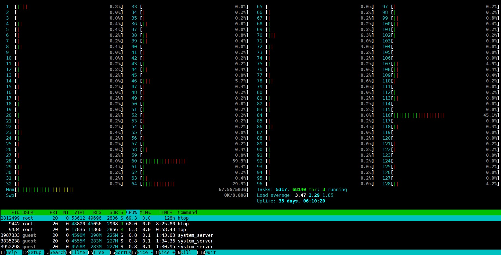
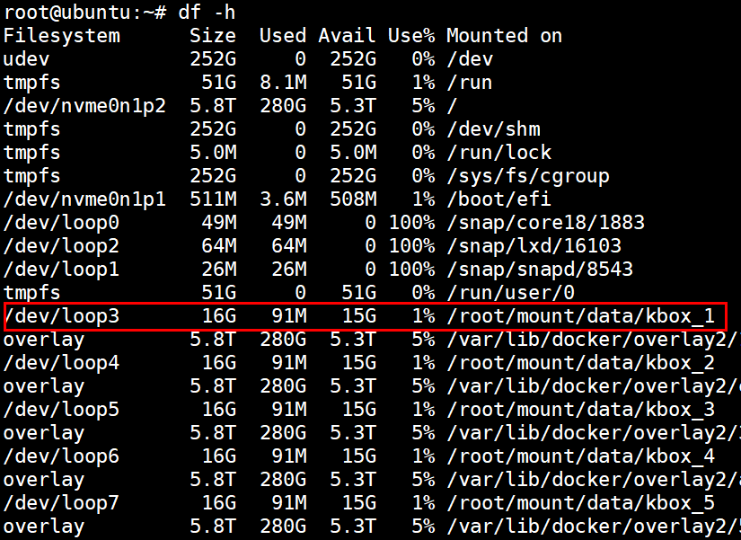

# Routine Maintenance<a name="ZH-CN_TOPIC_0000002552623629"></a>

## 1 O&M Overview<a name="ZH-CN_TOPIC_0000002518346014"></a>

The Kbox cloud phone container is a virtual mobile phone that enables the Android system virtualization solution based on the Docker container technology and provides cloud services through cloud servers. With the built-in Android system and network terminals built by vendors, the Kbox cloud phone container can be used in service scenarios such as cloud hosting, cloud applications, and cloud terminals.

To meet high-density and low-cost service requirements, the Kbox cloud phone uses the container passthrough architecture to start the complete Android system on Linux. The following figure shows the architecture of the Kbox cloud phone container.


This document describes the routine maintenance of the Kbox cloud phone container.

- O&M objects

    Suites such as the Kbox cloud phone container and its operating environment and subcomponents

- O&M types

    Inspection, performance monitoring, log management, risky operations, and routine maintenance

## 2 Inspection <a name="ZH-CN_TOPIC_0000002549705881"></a>

### 2.1 Overview <a name="ZH-CN_TOPIC_0000002518186100"></a>

This section describes how to inspect the Kbox cloud phone container and its operating environment, monitor the real-time container running status and resource usage, and handle problems that affect the normal running of the Kbox cloud phone container.

### 2.2 Inspection Items and Periods<a name="ZH-CN_TOPIC_0000002549705885"></a>

[**Table 1**](#inspection-items-and-periods) lists the inspection items of the Kbox cloud phone container.

**Table 1** Inspection items and periods<a id="inspection-items-and-periods"></a>

|Check Item|Inspection Period|
|--|--|
| Container status, including the container running status and process status in the container.|Runtime|
| Container resource consumption, such as the memory, CPU, and storage consumption of the Kbox cloud phone container.|Runtime|

### 2.3 Checking the Container Status<a name="ZH-CN_TOPIC_0000002549825871"></a>

#### 2.3.1 Container Status During Startup<a name="ZH-CN_TOPIC_0000002549705877"></a>

After starting the Kbox cloud phone container, run the following commands to check whether the container is started successfully. In the command, *${index}* indicates the ID of the started instance.

```shell
docker exec -it kbox_${index} sh
getprop | grep boot
```

If the value of `sys.boot_completed` is `1` in the command output, the container is started successfully. Otherwise, the container fails to be started. In this case, contact Huawei technical support. Command output:

```shell
[service.bootanim.exit]: [1]
[sys.boot.reason]: [reboot,factory_reset]
[sys.boot.reason.last]: [reboot]
[sys.boot_completed]: [1]
[sys.bootstat.first_boot_completed]: [1]
[sys.rescue_boot_count]: [1]
```

#### 2.3.2 Container Running Status<a name="ZH-CN_TOPIC_0000002549825873"></a>

To verify if the Kbox cloud phone container is running normally, you can inspect its process status. Run the following commands. *${index}* indicates the ID of the started instance.

```shell
docker exec -it kbox_${index} sh
ps -elf
```

If the parent process of more than 10 processes changes to `sh` (the process ID is 1), as shown in the following figure, a crash occurs in the container. In this case, restart the container or contact Huawei technical support.


Run the following command to restart the container:

```shell
./android_kbox.sh restart ${index}
```

### 2.4 Container Resource Consumption<a name="ZH-CN_TOPIC_0000002549825883"></a>

During the running of the Kbox cloud phone container, run the following command to obtain the system resource consumption of the container in a timely manner:

```shell
docker stats
```

The preceding command can dynamically display the resource consumption of the Kbox cloud phone container, including the CPU usage, memory usage, network I/O statistics, and drive I/O statistics, as shown in the following figure.


> **NOTE**
>
>If the CPU usage and memory usage exceed 80% of the total, the container may respond slowly. In this case, you are advised to clear background apps.

## 3 Monitoring<a name="ZH-CN_TOPIC_0000002549825875"></a>

### 3.1 Overview <a name="ZH-CN_TOPIC_0000002518346028"></a>

This section describes how to monitor the server system resource consumption of the Kbox cloud phone container to help learn about the system resource usage, trend, and alarms in a timely manner.

### 3.2 CPU Usage<a name="ZH-CN_TOPIC_0000002518346032"></a>

During the running of the Kbox cloud phone container, run the `top` command to view the real-time status of running processes, including the CPU usage and memory usage of each process, as shown in the following figure.

```shell
top
```


This command can be used to check whether a process with high CPU usage exists in the Kbox cloud phone container. If yes, check whether the process is abnormal.

You can use the `htop` command to view the real-time information about the CPU load, memory usage, and swap space.

```shell
htop
```

As shown in the following figure, in addition to the real-time information about CPU load, memory usage, and swap space, the tasks, threads, average load, and system uptime are also displayed. The process information in the system is displayed at the bottom.



> **NOTE:**
>
>If the host OS is openEuler, run the following command to install the htop tool first.
>
>```shell
>yum install htop
>```

### 3.3 System Memory<a name="ZH-CN_TOPIC_0000002518186120"></a>

Run the `free` command to query the server memory usage, including the physical memory, virtual swap file memory, and shared memory regions, as well as buffers used by system cores.

```shell
free
```

Command output:

```shell
                total        used        free      shared  buff/cache   available
Mem:        527039424     4531436   518860944        4860     3647044   519951396
Swap:        83888604           0    83888604
```

### 3.4 System Storage<a name="ZH-CN_TOPIC_0000002549825891"></a>

Run the `df` command to view the drive usage statistics of the file system in the Kbox cloud phone container operating environment.

```shell
df -h
```

In the following figure, the Kbox cloud phone container data is stored in `/root/mount/data/`. The contents in the red rectangle show the data storage information of container kbox_1. The storage size is `16G`, and the current usage is `1%`. If the value of `Use%` is less than or equal to 85%, the drive usage is normal. Otherwise, clear the drive space.



### 3.5 GPU Usage<a name="ZH-CN_TOPIC_0000002518186118"></a>

#### 3.5.1 Querying the AMD GPU Status<a name="ZH-CN_TOPIC_0000002549825889"></a>

**GPU Usage Status<a name="section112831151115117"></a>**

Use the RadeonTop tool to view the GPU usage in the Kbox cloud phone container operating environment. To download and install RadeonTop, perform the following steps:

1. Obtain and upload the RadeonTop tool package to the server.

    [Link](https://download-ib01.fedoraproject.org/pub/epel/8/Everything/aarch64/Packages/r/radeontop-1.4-2.el8.aarch64.rpm)

2. Install the tool.

    ```shell
    rpm -ivh radeontop-1.4-2.el8.aarch64.rpm
    ```

3. After the installation is successful, run the following command to query the GPU usage:

    ```shell
    radeontop
    ```

4. Check the command output. As shown in the following figure, the `VRAM` row indicates the video RAM usage.

    

**GPU Temperature<a name="section115451839147"></a>**

During the running of the Kbox cloud phone container, if the GPU temperature is too high, the server may break down. Therefore, when running large-scale games or applications, you need to monitor the GPU temperature in the operating environment.

In the Kbox cloud phone container operating environment, run the following command to query the GPU temperature:

```shell
cat /sys/kernel/debug/dri/*/amdgpu_pm_info |grep Temp
```

The following figure shows the query result. If the temperature is higher than 80°C for a long time, contact Huawei technical support.


#### 3.5.2 Querying the DaoCloud DC1000 Status<a name="ZH-CN_TOPIC_0000002518346034"></a>

Use the tool provided in the GPU driver package `VAGPU-25.03.01.01-RC20.tgz` to check the GPU status.

1. Obtain the **VAGPU-25.03.01.01-RC20.tgz** package and decompress it. Then, upload the extracted GPU tool package **tools-3.2.2_sp1.tgz** to the server. For details, see [Software Environment](install_guide.md#ZH-CN_TOPIC_0000002518352230) in chapter "Environment Setup" of the _Installation Guide_.
2. Refer to the description document in the `tools-doc-3.2.2_sp1.tgz` package to use this tool.

## 4 Log Management<a name="ZH-CN_TOPIC_0000002549705891"></a>

### 4.1 Overview <a name="ZH-CN_TOPIC_0000002518186114"></a>

This chapter describes how to manage logs during the running of the Kbox cloud phone container, including log query and dump.

### 4.2 Kbox Cloud Phone Container Logs<a name="ZH-CN_TOPIC_0000002518346022"></a>

#### 4.2.1 Container Metadata<a name="ZH-CN_TOPIC_0000002549705873"></a>

You can run the `inspect` command provided by Docker to view container details. In the following command, *${index}* indicates the ID of the started instance.

```shell
docker inspect kbox_${index}
```

After the preceding command is executed, all metadata information of the container is returned in JSON array format. In most cases, if you only need to obtain a specific piece of data about the container, you can extract the required data from the JSON data. For example, to obtain the IP address of the container, run the following command. [**Table 1**](#common-commands-for-querying-container-data) lists the commands for querying other container data.

```shell
docker inspect --format='{{range .NetworkSettings.Networks}}{{.IPAddress}}{{end}}' kbox_${index}
```

The IP address of the container is displayed in the command output.

**Table 1** Common commands for querying container data<a id="common-commands-for-querying-container-data"></a>

|Item|Command|
|--|--|
|Obtaining the CPU bound to a container|**docker inspect --format='{{.Name }} {{ .HostConfig.CpusetCpus }}' kbox_**|
|Obtaining the memory size (in bytes) of a container|**docker inspect --format='{{.Name }} {{ .HostConfig.Memory }}' kbox_**|

#### 4.2.2 Logcat Logs<a name="ZH-CN_TOPIC_0000002518346018"></a>

If an exception occurs during container running, you can query logs to locate the fault. To query the logcat logs of the Kbox cloud phone container in real time, run the following command. *${index}* indicates the ID of the started instance.

```shell
docker exec -it kbox_${index} logcat
```

To save the logcat logs of the container, run the following command to save the logs to the `log.log` file in the current directory. The log storage path and log file name can be changed as required.

```shell
docker exec -it kbox_${index} logcat -d >> ./log.log
```

#### 4.2.3 Process Information<a name="ZH-CN_TOPIC_0000002518346012"></a>

Run the following command to list the running processes in the Kbox cloud phone container. *${index}* indicates the ID of the started instance.

```shell
docker exec -it kbox_${index} ps -elf
```

#### 4.2.4 Top Information<a name="ZH-CN_TOPIC_0000002549825881"></a>

The `top` command is a common performance analysis tool that displays the resource usage of each process in the system in real time. Run the following `top` command in the Kbox cloud phone container. *${index}* indicates the ID of the started instance.

```shell
docker exec -it kbox_${index} top
```

#### 4.2.5 Application Stack Information During ANR<a name="ZH-CN_TOPIC_0000002518186110"></a>

If an application not responding (ANR) event occurs in the Kbox cloud phone container, you need to collect related application stack information. The information is stored in the `/data/anr/` directory of the container.

#### 4.2.6 dumpsys Information <a name="ZH-CN_TOPIC_0000002549825887"></a>

dumpsys is a tool running on Android devices. It provides information about system services. You can run the following command to obtain the diagnosis output of all system services of the container. In the command, *${index*} indicates the ID of the started instance.

```shell
docker exec -it kbox_${index} dumpsys
```

After the preceding command is run, a large amount of data is displayed. Generally, you need to specify the services to be checked in the command.

- To obtain the complete list of system services supported by dumpsys, run the following command:

    ```shell
    docker exec -it kbox_${index} dumpsys -l
    ```

- To obtain the container memory information, run the following command:

    ```shell
    docker exec -it kbox_${index} dumpsys meminfo
    ```

    The following figure shows the command output.

    

#### 4.2.7 Container Property Information<a name="ZH-CN_TOPIC_0000002549705875"></a>

Run the following `getprop` command to read property information from the Kbox cloud phone container. *${index}* indicates the ID of the started instance.

```shell
docker exec -it kbox_${index} getprop
```

### 4.3 Operating Environment Logs<a name="ZH-CN_TOPIC_0000002549825885"></a>

#### 4.3.1 dmesg Logs <a name="ZH-CN_TOPIC_0000002549705871"></a>

If the Kbox cloud phone container is abnormal, collect dmesg logs for fault location.

The dmesg logs contain device initialization logs, kernel module logs, and application crash information, which are helpful for subsequent cause analysis and fault location.

Generally, dmesg logs are stored in the `/var/log/` directory on the server. You can also run the following command to obtain dmesg logs:

```shell
dmesg -T
```

### 4.4 Maintenance Tool<a name="ZH-CN_TOPIC_0000002549705887"></a>

#### 4.4.1 Overview<a name="ZH-CN_TOPIC_0000002549705889"></a>

To enhance the testability, serviceability, and maintainability of the cloud phone prototype, the Kbox cloud phone container provides Kbox\_maintainer. This tool integrates functions such as log collection, resource check, and fault rectification, significantly improving the overall performance of the cloud phone prototype.

> **NOTE:**
>
>The Kbox_maintainer tool is contained in `Kbox_AOSP11.zip`. For details about how to obtain the `Kbox_AOSP11.zip` package, see [Software Environment](install_guide.md#ZH-CN_TOPIC_0000002518352230) in the *Installation Guide*.

#### 4.4.2 Collecting Logs<a name="ZH-CN_TOPIC_0000002518346024"></a>

Logs collected by Kbox\_maintainer include Android logs and server logs. For details, see [**Table 1** Collecting logs using Kbox\_maintainer](#collecting-logs-using-kbox-maintainer).

**Table 1** Collecting logs using Kbox\_maintainer<a id="collecting-logs-using-kbox-maintainer"></a>

|Category|Details|
|--|--|
|Android logs| Run the `logcat` command to collect logs in the log buffer.|
|Android logs| Collect the application stack information (in `/data/anr`) during an ANR.|
|Android logs| Run the `dumpsys activity`, `dumpsys meminfo`, and `dumpsys input` commands to collect necessary dumpsys information.|
|Android logs| Run the `ps -a` command to collect process information.|
|Android logs| Run the `getprop` command to collect system property information.|
|Server logs| Collect syslog and kernel logs in `/var/log`.|
|Server logs| Run the `dmesg -T` command to view the startup information.|
|Server logs| Run the `docker stats/docker inspect` command to collect Docker logs.|

Kbox\_maintainer can collect logs of a single container or all containers, and pack the collected logs. It provides the `log` subcommand. You can add a container ID or container name after `log` to collect logs of the specified container. If no container ID is specified, logs of all containers are collected by default. See the following examples:

```shell
python3 kbox_maintainer.py log
python3 kbox_maintainer.py log kbox_1
```

> **NOTE:**
>
>When you use the log collection function, if a log collection task takes a long time, a possible cause is that there are too many logs in the `/var/log` directory. You can clear the logs as required.

#### 4.4.3 Checking Resources<a name="ZH-CN_TOPIC_0000002518346030"></a>

Kbox\_maintainer provides the resource check function. It collects information about the memory, CPU, storage, and GPU of the Kbox cloud phone container and server. To query information about a specific item, refer to the commands in the **Details** column in [**Table 1** Checking resources using Kbox\_maintainer](#checking-resources-using-kbox-maintainer). Alternatively, you can batch collect data using Kbox\_maintainer.

**Table 1** Checking resources using Kbox\_maintainer<a id="checking-resources-using-kbox-maintainer"></a>

|Category|Details|
|--|--|
|Memory information| Run `dumpsys meminfo` to obtain the memory information.|
|CPU information| Run the `top` command to collect the top 10 processes with the highest CPU usage.|
|CPU information| Run `/proc/cpuinfo` to obtain basic CPU information.|
|Storage Information| Run `df -h` to obtain the storage usage.|
|GPU information.| Run `/sys/kernel/debug/dri/*/amdgpu_pm_info` to obtain the GPU temperature information.|
|GPU information.| Run `lspci` to obtain GPU PCI device information.|

Kbox\_maintainer can collect resource information about a single container or all containers, and pack the collected information. It provides the `resource` subcommand. You can add a container ID or container name after `resource` to collect resource information of the specified container. If no container ID is specified, information about all container resources is collected by default. See the following examples:

```shell
python3 kbox_maintainer.py resource
python3 kbox_maintainer.py resource kbox_1
```

#### 4.4.4 Diagnosing and Rectifying Faults<a name="ZH-CN_TOPIC_0000002518186116"></a>

Kbox\_maintainer allows you to view the service status of the Kbox cloud phone container for routine inspection and recovery of cloud phones. For details, see [**Table 1** Diagnosing and rectifying faults using Kbox\_maintainer](#diagnosing-and-rectifying-faults-using-kbox-maintainer).

**Table 1** Diagnosing and rectifying faults using Kbox\_maintainer<a id="diagnosing-and-rectifying-faults-using-kbox-maintainer"></a>

|Category|Details|
|--|--|
|Basic cloud phone status|**getprop | grep sys.boot_completed**|

Kbox\_maintainer provides the `check` subcommand. You can add a container ID or container name after `check` to check the service status of the specified container. If no container ID is specified, the status of all containers is checked by default. See the following examples:

```shell
python3 kbox_maintainer.py check
python3 kbox_maintainer.py check kbox_1
```

Kbox\_maintainer provides the `recover` subcommand. You can add a container ID or container name after `recover` to recover the service status of the specified container. If no container ID is specified, the status of all containers is recovered by default. See the following examples:

```shell
python3 kbox_maintainer.py recover
python3 kbox_maintainer.py recover kbox_1
```

## 5 Risky Operations<a name="ZH-CN_TOPIC_0000002518346016"></a>

### 5.1 Forbidden Operations<a name="ZH-CN_TOPIC_0000002549705883"></a>

None. If you have any questions, contact Huawei technical support.

### 5.2 Risky Operations<a name="ZH-CN_TOPIC_0000002518186112"></a>

Risk levels for operations are classified as follows:

- Minor: Operation that does not modify the feature configurations but may result in the loss of user-defined key data.
- Major: Operation that may cause managed resources to be unreachable or interrupt some services running on a node.
- Critical: Operation that may cause interruption of a large number of services on the entire network.

For details about risky operations on server hardware, see [**Table 1** Risky operations on hardware](#risky-operations-on-hardware). For details about risky operations on software, see [**Table 2** Risky operations on software](#risky-operations-on-software).

**Table 1** Risky operations on hardware<a id="risky-operations-on-hardware"></a>

|No.|Operation|Impact|Risk Level|Production Environment Requirements|Testing Environment Requirements|
|--|--|--|--|--|--|
|1|Replacing server parts| Perform this operation in strict accordance with the operation instructions to avoid function failures and hardware damage.|Critical| This operation must be performed within the maintenance and test period approved by the customer. This operation must be performed by maintenance personnel. This operation must be approved by the customer.|This operation must be performed by maintenance personnel or with their consent.|
|2|Powering off unexpectedly during the CPLD upgrade| The AC power failure may damage the CPLD file, affecting the functions. Re-upgrading is required.|Critical| This operation must be performed within the maintenance and test period approved by the customer. This operation must be performed by maintenance personnel. This operation must be approved by the customer.|This operation must be performed by maintenance personnel or with their consent.|
|3|Powering off unexpectedly during the BIOS upgrade| This failure may damage the BIOS and affect its functions. Re-upgrading is required.|Critical| This operation must be performed within the maintenance and test period approved by the customer. This operation must be performed by maintenance personnel. This operation must be approved by the customer.|This operation must be performed by maintenance personnel or with their consent.|
|4|Powering off unexpectedly during the iBMC upgrade| An AC power failure during the iBMC upgrade may cause damage to the iBMC hardware, rendering the server management page inaccessible. If this occurs, the iBMC hardware must be replaced.|Critical| This operation must be performed within the maintenance and test period approved by the customer. This operation must be performed by maintenance personnel. This operation must be approved by the customer.|This operation must be performed by maintenance personnel or with their consent.|
|5|Installing/Removing a server in/from a cabinet| Perform this operation in strict accordance with the service and maintenance guidelines to avoid hardware damages and personal injuries.|Critical| This operation must be performed within the maintenance and test period approved by the customer. This operation must be performed by maintenance personnel. This operation must be approved by the customer.|This operation must be performed by maintenance personnel or with their consent.|

**Table 2** Risky operations on software<a id="risky-operations-on-software"></a>

|No.|Operation|Operation Entry|Impact|Risk Level|Workaround|Production Environment Requirements|Testing Environment Requirements|
|--|--|--|--|--|--|--|--|
|1| Running the `service network restart` command during the normal operation of the system|Log in to the host and run the `service network restart` command.| The host, service provisioning, and VM startup may fail.|Critical|None| This operation must be performed within the maintenance and test period approved by the customer. This operation must be performed by maintenance personnel. This operation must be approved by the customer.|This operation must be performed by maintenance personnel or with their consent.|
|2| Running the `ping -I` command on the host (specifying a network interface)|Log in to the host and run the `ping -I` command.| Host network communication may be interrupted. Running the `ping` command to check the network is recommended.|Critical|None| This operation must be performed within the maintenance and test period approved by the customer. This operation must be performed by maintenance personnel. This operation must be approved by the customer.|This operation must be performed by maintenance personnel or with their consent.|
|3| Manually deleting or modifying the message log files|Log in to the host and run the `rm` command to delete message logs from the `/var/log` directory.| Logs cannot be printed.|Critical|None| This operation must be performed within the maintenance and test period approved by the customer. This operation must be performed by maintenance personnel. This operation must be approved by the customer.|This operation must be performed by maintenance personnel or with their consent.|
|4| Clearing the user-defined information in the BIOS flash memory|Log in to the iBMC CLI and run the `ipmcset -d clearcmos` command.| Deleted information cannot be recovered.|Critical|None| This operation must be performed within the maintenance and test period approved by the customer. This operation must be performed by maintenance personnel. This operation must be approved by the customer.|This operation must be performed by maintenance personnel or with their consent.|
|5| Restoring the iBMC factory settings|Log in to the iBMC CLI and run the `ipmcset -d restore` command.| User data cannot be recovered once factory settings are restored.|Critical|None| This operation must be performed within the maintenance and test period approved by the customer. This operation must be performed by maintenance personnel. This operation must be approved by the customer.|This operation must be performed by maintenance personnel or with their consent.|
|6| Changing the IP address of a server|Log in to the host and run the `ifconfig` command to change the IP address.| This operation may affect service processes on the host and current service operations.|Critical|None| This operation must be performed within the maintenance and test period approved by the customer. This operation must be performed by maintenance personnel. This operation must be approved by the customer.|This operation must be performed by maintenance personnel or with their consent.|
|7| Running the `rm -rf` command to delete files|Log in to the host and delete files on the host or files required by the commercial release package.| This operation may affect service processes on the host and the cloud phone service.|Critical|None| This operation must be performed within the maintenance and test period approved by the customer. This operation must be performed by maintenance personnel. This operation must be approved by the customer.|This operation must be performed by maintenance personnel or with their consent.|

## 6 Routine O&M<a name="ZH-CN_TOPIC_0000002549825879"></a>

### 6.1 Querying Docker Information<a name="ZH-CN_TOPIC_0000002549825877"></a>

**Table 1** Querying Docker information<a id="querying-docker-information"></a>

|Item|Query Command|
|--|--|
|Docker software information|**docker info**|
|Docker container information|**docker inspect**|

### 6.2 Querying Android Information<a name="ZH-CN_TOPIC_0000002549705879"></a>

**Table 1** Querying Android information<a id="querying-android-information"></a>

|Item|Query Command|
|--|--|
|Android log information|**logcat**|
|Android process information|**ps -a**|
|Android stack information|**ls /data/anr/**|
|Android system properties|**getprop**<br>**cat /system/build.prop**|
|Android background services|**service list**|
|Android bugreport tool reports|**bugreport**|
|Android dumpsys information|**dumpsys**|

### 6.3 Querying Server Information<a name="ZH-CN_TOPIC_0000002518186104"></a>

**Table 1** Querying server information<a id="querying-server-information"></a>

|Item|Query Command|
|--|--|
|OS version of the server|**cat /etc/os-release**|
|Kernel version of the host system|**uname -r**|
|NUMA information|**numactl**|
|PCI device information|**lspci**|
|CPU information|**lscpu**<br>**cat /proc/cpuinfo**|
|Memory usage|**free**<br>**cat /proc/meminfo**|
|Drive storage|**df -h**<br>**cat /proc/loadavg**<br>**cat /proc/partitions**|
|System uptime|**uptime**|
|Process information|**top**<br>**ps**|
|I/O information|**cat /proc/iomem**<br>**cat /proc/ioports**|
|System log information|**/var/log/**|
|System environment variables|**env**|
|Startup information|**dmesg -T**|
|Network status|**ifconfig**<br>**ping**<br>**netstat**<br>**tcpdump**|

>  **NOTE:**
>
> If the host OS is openEuler 22.03, some firewall ports need to be enabled in the online gaming scenario. (The port number is defined by the game vendor. For example, the port used by Honor of Kings is 50012.) Otherwise, the network may be abnormal and users may fail to log in to games. Configure the firewall as follows:
>
> 1. Enable port 50012 (Honor of Kings is used as an example).
>
>    ```shell
>    firewall-cmd --zone=public --add-port=50012/tcp --permanent
>    ```
>
> 2. Reload the firewall configuration.
>
>    ```shell
>    firewall-cmd --reload
>    ```
>

### 6.4 Customizing Android System Properties<a name="ZH-CN_TOPIC_0000002518186102"></a>

The Kbox cloud phone container allows users to customize system properties and override original system properties as required. To use custom properties, create a `local.prop` file in the startup path to record custom system properties and their values. After a container is started, properties in this file are parsed and applied to override the original properties during container initialization. The format of the `local.prop` file is as follows:

```shell
ro.product.board=HUAWEI
ro.product.brand=HUAWEI
ro.product.manufacturer=Huawei
ro.product.model=Huawei
ro.product.odm.brand=HUAWEI
ro.product.odm.manufacturer=Huawei
ro.product.odm.model=Huawei
ro.product.product.brand=HUAWEI
ro.product.product.manufacturer=Huawei
ro.product.product.model=Huawei
ro.product.system.brand=HUAWEI
ro.product.system.manufacturer=Huawei
ro.product.system.model=Huawei
ro.product.system_ext.brand=HUAWEI
ro.product.system_ext.manufacturer=Huawei
ro.product.vendor.brand=HUAWEI
ro.product.vendor.manufacturer=Huawei
ro.product.vendor.model=Huawei
ro.product.vendor.name=Huawei_arm64
```

During the startup of a Kbox container, the `local.prop` file in the startup path is pushed to the `/data` directory of the container. During the initialization, each custom attribute in this file is parsed and applied to override the system properties.

You can refer to the following command to query a custom property (`ro.product.system_ext.brand` for example) in a Kbox container. `index` indicates the Kbox container ID.

```shell
docker exec -it kbox_${index} getprop ro.product.system_ext.brand
```

## 7 References<a name="ZH-CN_TOPIC_0000002518346020"></a>

### 7.1 Performance Metrics Reference<a name="ZH-CN_TOPIC_0000002518186106"></a>

**Table 1** Kbox cloud phone container performance metrics<a id="kbox-cloud-phone-container-performance-metrics"></a>

|No.|Category|Key Performance Metric|Reference Value|
|--|--|--|--|
|1|Kbox cloud phone container performance|Container startup duration| Repeatedly start a Kbox cloud phone container for 100 times and observe the startup duration of each time. The container startup duration is stable and aligns with expectations.|
||Kbox cloud phone container performance|Container startup duration| Start the Kbox cloud phone containers (maximum density) for three times and observe the startup duration of each container. The container startup duration is stable and aligns with expectations.|
||Kbox cloud phone container performance|App startup duration| Start and exit KuGou 1,000 times, and record the startup duration of each time. The startup duration is stable and aligns with expectations.|
||Kbox cloud phone container performance|CPU usage| Run KuGou for 30 minutes and observe the CPU usage of the container. The CPU usage aligns with expectations and does not increase rapidly.|
||Kbox cloud phone container performance|Memory usage| Run KuGou for 30 minutes and observe the memory usage of the container. The memory usage aligns with expectations and does not increase rapidly.|
||Kbox cloud phone container performance|Memory usage| Install and uninstall KuGou for 30 times and observe the memory usage of the container. The memory usage aligns with expectations and does not increase rapidly.|
||Kbox cloud phone container performance|Storage usage| Run KuGou for 30 minutes and observe the storage usage of the container. The storage usage aligns with expectations and does not increase rapidly.|
||Kbox cloud phone container performance|Storage usage| Install and uninstall KuGou for 30 times and observe the storage usage of the container. The storage usage aligns with expectations and does not increase rapidly.|
|2|Server performance|CPU usage| Run KuGou Music simultaneously across Kbox cloud phone containers at maximum density for 10 minutes, and observe the server CPU usage trend. The server CPU usage aligns with expectations, and the growth of performance metrics matches expected trends.|
||Server performance|GPU usage| Run KuGou Music simultaneously across Kbox cloud phone containers at maximum density for 10 minutes, and observe the server GPU usage trend. The server GPU usage aligns with expectations, and the growth of performance metrics matches expected trends.|
||Server performance|GPU temperature| Run KuGou Music simultaneously across Kbox cloud phone containers at maximum density for 10 minutes, and observe the server GPU temperature trend. The server GPU temperature aligns with expectations, and the growth of performance metrics matches expected trends.|
||Server performance|Memory usage| Run KuGou Music simultaneously across Kbox cloud phone containers at maximum density for 10 minutes, and observe the server memory usage trend. The server memory usage aligns with expectations, and the growth of performance metrics matches expected trends.|
|3|Stability|Application installation and uninstallation success rate| Install and then uninstall KuGou for 1,000 times in a single Kbox cloud phone container. The success rate is not lower than 99.9%.|
||Stability|Application opening and closing success rate| Open and then close KuGou for 1,000 times in a single Kbox cloud phone container. The success rate is not lower than 99.9%.|
||Stability|Container startup and deletion success rate| Start and then delete Kbox cloud phone containers (maximum density) for 100 times. The success rate is not lower than 99.9%.|
||Stability|Cross operations upon containers (startup, connection, disconnection, and deletion)| Start, connect, and then restart Kbox cloud phone containers (maximum density) for 50 times. The success rate is 100%, and all Kbox cloud phone containers can be successfully deleted.|
||Stability|Cross operations upon containers (startup, connection, disconnection, and deletion)| Start, connect, restart, and then reconnect Kbox cloud phone containers (maximum density) for 100 times. The success rate is not lower than 99.9%.|
||Stability|Container connection and disconnection success rate| Connect to and disconnect from Kbox cloud phone containers (maximum density) for 100 times. The success rate is not lower than 99.9%.|
||Stability|Event receiving success rate of VInput devices| Send a press and release event to the mouse, touch device, handle 1, and handle 2 of Kbox cloud phone containers (maximum density) for 1,000 times. The event can be successfully received.|
||Stability|Stable running of containers for 7 x 24 hours| Run KuGou in Kbox cloud phone containers (maximum density) for 7 x 24 hours. The performance metrics of the Kbox cloud phone containers and the server are normal. After the containers run KuGou for 7 x 24 hours, no artifact, blank screen, green screen, frame freezing, suspension, or crash occurs.|
|4|Load and stress|Container runtime status| Install and then run KuGou in Kbox cloud phone containers (maximum density) for 30 minutes. KuGou is successfully installed and started in the containers. After the containers run KuGou for 30 minutes, no artifact, blank screen, green screen, frame freezing, suspension, or crash occurs.|
