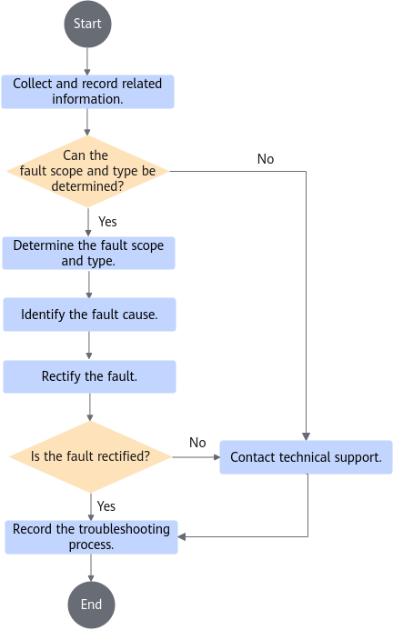

# User Guide<a name="ZH-CN_TOPIC_0000002521735840"></a>

## 1 Starting and Uninstalling a Cloud Phone Instance<a name="ZH-CN_TOPIC_0000002518225838"></a>

### 1.1 Mounting an Android Image<a name="ZH-CN_TOPIC_0000002549865629"></a>

The official Kbox demo image provided by Huawei Mirrors repository does not contain the Android Kbox binary. Therefore, containers cannot be normally started using this image. If you use this demo image, download the Android Kbox binary to the local host and use the script to create an original Kbox image that can start containers properly.

**Table 1** Obtaining and using images<a id="obtaining-and-using-images"></a>

|Image Name + Tag|How to Obtain|Usage|
|--|--|--|
| Set by the user| Set by the user| Compile the image based on the instructions in the corresponding section. This image contains the Android Kbox binary, and containers can be started properly.|
| kbox:demo | Official Kbox demo image provided by Huawei Mirrors repository| This image does not contain the Android Kbox binary, and containers cannot be started properly. You need to create a Kbox image and apply commercial binaries.|
| kbox:origin | Created using a script| This image is created based on **kbox:demo** and the Android Kbox binary, and containers can be started properly.|

**Mounting the Kbox Demo Image<a name="section16531422174717"></a>**

Upload the Kbox demo image package to the **~/dependency** directory (this directory is only an example and can be customized) and mount the image package.

You can customize the image name and tag in the format of *{Name}:{Tag}*. In this example, the image name is **kbox:demo**.

> **NOTE:**
>
>The image name and tag can contain only digits and letters. The image name must start with a digit or lowercase letter.

```shell
cd ~/dependency
docker import android.tar kbox:demo
```

**Creating a Kbox Image and Applying Commercial Binaries<a name="section8328138123920"></a>**

> **NOTE:**
>
>If you use the official Kbox demo image provided by Huawei Mirrors repository, perform the operations in this part to ensure that the image contains the Android Kbox binary.
>If you use an image prepared by yourself:
>
>- If you adopt configuration scheme 1, skip all steps in this part.
>- If you adopt configuration scheme 2/3/4, skip step 2 in this part.

1. Decompress **Kbox-patches-AOSP15.zip** and upload the **deploy_scripts** directory in the **Kbox-patches-AOSP15** folder to the **~/dependency** directory on the server.
2. Upload the Android Kbox binary package **BoostKit-boostcph-kbox_\*_15.zip** to **~/dependency/deploy_scripts**.
3. (Hardware configuration scheme 2/3/4) If hardware configuration scheme 2/3/4 is used, decompress the GPU driver package **VAGPU-25.03.01.01-RC13-A15.tgz** to obtain **va_driver.tgz** and upload **va_driver.tgz** to the **~/dependency/deploy_scripts** directory on the server.
4. Create a Kbox image that contains the Android Kbox binary. In the following commands, **kbox:demo** is the official Kbox demo image imported in the previous step, and **kbox:origin** is the new image that contains the Android Kbox binary.
    - For hardware configuration scheme 1:

        ```shell
        cd ~/dependency/deploy_scripts
        chmod +x make_image_aosp15.sh
        ./make_image_aosp15.sh kbox:demo kbox:origin
        ```

    - For hardware configuration scheme 2/3/4:

        ```shell
        cd ~/dependency/deploy_scripts
        chmod +x make_image_aosp15.sh
        ./make_image_aosp15.sh kbox:demo kbox:origin va_driver.tgz
        ```

### 1.2 Starting and Uninstalling a Cloud Phone Instance<a name="ZH-CN_TOPIC_0000002518225854"></a>

Ensure that the **kbox_config.cfg** file exists in the startup path of the cloud phone instance. The container uses the configuration in this file. Therefore, ensure that the configuration in the **kbox_config.cfg** file is correct. If the configuration file does not exist in the startup path, the cloud phone cannot be started.

You can change map configurations (see [**Table 1** Parameters for configuring the GPU, CPU, and path to the data volume in **kbox_config.cfg**](#parameters-for-configuring-the-GPU-CPU-and-path-to-the-data-volume-in-kbox_config.cfg)) of a channel to select the GPU, CPU, and path to the data volume used by the container of this channel. In this way, you can flexibly configure resources used by the cloud phone to achieve optimal performance.

**Table 1** Parameters for configuring the GPU, CPU, and path to the data volume in **kbox_config.cfg**<a id="parameters-for-configuring-the-GPU-CPU-and-path-to-the-data-volume-in-kbox_config.cfg"></a>

|Parameter Name|Parameter Description|Configuration Description|
|--|--|--|
| KBOX_GPU_MAP (configuration scheme 1) KBOX_VA_GPU_MAP (configuration scheme 2/3/4)| Selects the GPU used by a container.| The first entry in the **KBOX_GPU_MAP** list indicates the Kbox cloud phone whose index is 1. The allocated GPU node is **/dev/dri/renderD128**. The **renderD128** node belongs to NUMA0. Therefore, the CPU core range configured in **KBOX_CPUSET_MAP** for NUMA0 of the Kunpeng 920 processor should be 0 to 31. The first entry in the **KBOX_VA_GPU_MAP** list indicates the Kbox cloud phone whose index is 1. The allocated GPU node is **/dev/dri/renderD128**. Nodes **renderD128** to **renderD135** belong to NUMA0. Therefore, the CPU core range configured in **KBOX_CPUSET_MAP** for NUMA0 of the Kunpeng 920 processor should be 0 to 31. The CPU core range configured in **KBOX_CPUSET_MAP** for NUMA0 of the new Kunpeng 920 processor model should be 0 to 79.|
| KBOX_CPUSET_MAP | Selects the CPU used by a container.| The first entry in the **KBOX_GPU_MAP** list indicates the Kbox cloud phone whose index is 1. The allocated GPU node is **/dev/dri/renderD128**. The **renderD128** node belongs to NUMA0. Therefore, the CPU core range configured in **KBOX_CPUSET_MAP** for NUMA0 of the Kunpeng 920 processor should be 0 to 31. The first entry in the **KBOX_VA_GPU_MAP** list indicates the Kbox cloud phone whose index is 1. The allocated GPU node is **/dev/dri/renderD128**. Nodes **renderD128** to **renderD135** belong to NUMA0. Therefore, the CPU core range configured in **KBOX_CPUSET_MAP** for NUMA0 of the Kunpeng 920 processor should be 0 to 31. The CPU core range configured in **KBOX_CPUSET_MAP** for NUMA0 of the new Kunpeng 920 processor model should be 0 to 79.|
| KBOX_MOUNT_MAP | Selects the path to the data volume used by a container.| None|

> **NOTE:**
>
>To ensure the stable running and optimal performance of the Kbox cloud phone, ensure that the physical CPU cores and GPU rendering nodes bound to a container belong to the same CPU socket.

The Kbox cloud phone container supports the graphics acceleration layer. You can enable this feature by setting **ENABLE_RENDER_LAYER** in the **kbox_config.cfg** file to **1**. You can also configure the graphics acceleration layer in the **kbox_render_accelerating_configuration.xml** file in the **~/dependency/deploy_scripts** directory. For details about the configuration items, see section "Configuration Items of the Graphics Acceleration Layer" in [Video Stream Engine User Guide (Android 15)](https://gitcode.com/wyc3111/vmi/blob/CloudPhone15/docs/en/user_guide.md). If you need to modify the configuration of the graphics acceleration layer after starting the cloud phone container for the first time, modify the application-specific settings in the configuration file, manually copy the file to the **/data/local/tmp** directory of the cloud phone container, and restart the application for the modification to take effect.

1. Decompress **Kbox-patches-AOSP15.zip** and upload the **deploy_scripts** directory in the **Kbox-patches-AOSP15** folder to the **~/dependency** directory on the server.
2. (Optional) To start a video stream cloud phone instance with the C2 decoder enabled (applicable to configuration scheme 1), set **ENABLE_AMD_C2_DECODE** to **1** in the **kbox_config.cfg** file in the **deploy_scripts** directory. **0** (default) and any other values indicate disabled. The C2 decoder needs to be enabled or disabled during the initial container startup; dynamic switching is not supported. Built-in cloud phone applications will automatically select the appropriate decoder based on their specific requirements.

    ```shell
    ENABLE_AMD_C2_DECODE=0
    ```

3. Run the **android_kbox_aosp15.sh** script to start a container.

    ```shell
    cd ~/dependency/deploy_scripts
    chmod +x android_kbox_aosp15.sh
    ./android_kbox_aosp15.sh start {*image_name:tag*}  *${index1}*   
    ```

    [**Table 2** Default configurations](#default-configurations) lists the default configurations of a Kbox basic cloud phone.

    **Table 2** Default configurations<a id="default-configurations"></a>

    |Configuration Item|Kbox Basic Cloud Phone|
    |--|--|
    |Scenario|Mobile office/hosting|
    |vCPUs|2|
    |CPU core binding policy|2 containers/2 cores|
    |Memory|6GB|
    |System storage|16GB|
    |Resolution|720\*1280|

    Example: Start an instance whose ID is 1.

    ```shell
    ./android_kbox_aosp15.sh start kbox:origin  1
    ```

    > **NOTE:**
    >
    >- During the container startup, errors such as "writing syncT "procError"" and "exec /system/bin/chmod: no such file" may occur. These errors do not affect the functions and can be ignored.
    >- When a container is started, the specified *${index1}* corresponds to ports bound to the container. For example, **index1=10** indicates that the container uses ports 8010 and 8510. Ensure that the corresponding ports are not occupied.
    >- You can run the following command to query the Kbox kernel dynamic switch status:
    >
    > ```shell
    > cat /sys/kernel/kbox/kbox_enable
    >    ```
    >
    > If **1** is displayed, the switch is enabled. If **0** is displayed, the switch is disabled.
    > You can run the following command to manually enable the switch:
    >
    > ```shell
    > echo 1 > /sys/kernel/kbox/kbox_enable
    >    ```

4. Run the following command to check whether a Kbox container is started successfully. *${index}* indicates the ID of the instance.

    ```shell
    docker exec -it kbox_${index} getprop | grep boot_completed
    ```

    In the output, if the value of **sys.boot_completed** is **1**, the startup is successful.

5. Stop and delete a Kbox container.

    In the Kbox solution, data volumes are mounted by default. The default **docker stop** and **docker rm** commands cannot completely clear container data. Run the following script to completely clear files on the host.

    Run the **android_kbox_aosp15.sh** script to stop and delete a running Kbox container.

    Stop and delete a container whose ID is *${index}*.

    ```shell
    ./android_kbox_aosp15.sh delete ${index}
    ```

6. Restart Kbox containers.

    In the Kbox solution, data volumes are mounted by default. The default **docker restart** command cannot restart a container. Instead, run the following script to restart a container.

    Run the **android_kbox_aosp15.sh** script to restart a Kbox container.

    Restart a container whose ID is *${index}*.

    ```shell
    ./android_kbox_aosp15.sh restart ${index}
    ```

### 1.3 Querying Version Information<a name="ZH-CN_TOPIC_0000002518225866"></a>

This section provides two methods to obtain the Kbox version information.

Method 1: using the obtained software package

Obtain **BoostKit-boostcph-kbox_\*_15.zip** by referring to [Software Environment](./compile_guide.md#12-software-environment) and decompress it. Query the **kbox_version.txt** file to obtain the version of the software package.

```shell
unzip BoostKit-boostcph-kbox_*_15.zip
unzip Kbox-BoostKit-boostcph-kbox_*_15.zip
cat ./products/kbox_version.txt
```

The command output shows the Kbox version information. An example is as follows:

```shell
Product Name: Kunpeng BoostKit
Product Version: 26.0.RC1
Component Name: BoostKit-boostcph-kbox
Component Version: 8.0.RC1
Component AppendInfo: 15.0.0_r17
```

Method 2: Running the following command to query the version of the started container. In the command, *${index}* indicates the ID of the started instance. For details about the command output example, see the query result of method 1.

```shell
docker exec -it kbox_${index} cat /system/vendor/etc/kbox_version.txt
```

### 1.4 (Optional) Enabling Containers to Boot with the F2FS File System<a name="ZH-CN_TOPIC_0000002549832548"></a>

Previously, cloud phone containers used the ext4 file system, which is commonly used on servers but differs from the F2FS file system used by physical devices. The following steps describe how to enable cloud phones to boot with the F2FS file system, aligning them with physical devices to improve emulation fidelity.

#### 1.4.1 **Environment Setup**

   For details, see [8.2.1.1 Environment Setup](feature_guide.md#ZH-CN_TOPIC_000000254986594100).
  
#### 1.4.2 **Enabling the Configuration Item**<a name="ZH-CN_TOPIC_0000002549832549"></a>

   Set **ENABLE_F2FS** in the **kbox_config.cfg** file to **1**.

   ```text
   ENABLE_F2FS=1
   ```

#### 1.4.3 **Verifying Whether the Configuration Takes Effect**

   After the container is started, access the container environment to view the mount point information.

   ```shell
   mount | grep -i /data
   ```

   If the output indicates that the mount type of the corresponding partition is `f2fs`, the feature is enabled successfully.

### 1.5 (Optional) Resizing the /system Partition Inside the Container<a name="ZH-CN_TOPIC_0000002549132549"></a>

A detection tool revealed that the size of the **/system** partition inside the cloud phone container was identical to the root directory space on the host, reaching nearly 1 TB. This creates a massive discrepancy compared with physical devices. The following steps describe how to resize the **/system** partition of the cloud phone to match real phones, thereby improving emulation fidelity.

#### 1.5.1 **Environment Setup**

   For details, see [9.2 Usage](feature_guide.md#ZH-CN_TOPIC_0000002549865942).

#### 1.5.2 **Triggering the Partition Expansion Logic**<a name="ZH-CN_TOPIC_0000002549832550"></a>

   In the cloud phone configuration file **kbox_config.cfg**, set **SYSTEM_PARTITION_SIZE_MB** to the target capacity for the **/system** partition, in MB.

   ```txt
   SYSTEM_PARTITION_SIZE_MB=${target_/system_partition_size_in_MB}
   ```

#### 1.5.3 **Verifying Whether the Configuration Takes Effect**

   After the container is started, run the following command in the container to check the actual capacity of the system partition:

   ```shell
   df -h /system
   ```

   If the size (MB) displayed in the `Size` column matches the configured size (MB), the partition has been resized successfully.

### 1.6 (Optional) Enabling Container Booting via NFS Mount

This feature allows data storage to be mounted to a remote location through NFS, implementing decoupled storage and compute and storage reuse.

#### 1.6.1 **Environment Setup**

For details, see [NFS Mount Support](feature_guide.md#nfs-mount-support).

#### 1.6.2 **NFS Mount**

In the container configuration file **kbox_config.cfg**, set the **NFS_DIR** attribute to **/tmp/nfs** and run the **nstart** command to start the cloud phone.

```shell
./android_kbox.sh nstart kbox:origin 1
```

Run the **ndelete** command to delete the cloud phone.

```shell
./android_kbox.sh ndelete 1
```

#### 1.6.3 **Verifying Whether the Configuration Takes Effect**

Check whether the **data/containerd** content in the mount directory matches the container ID.

```shell
cat /tmp/nfs/data/kbox_1/data/containerd
```

### 1.7 (Optional) Dynamically Regulating the CPU Frequency of the Cloud Phone<a name="ZH-CN_TOPIC_000000254983254923"></a>

On physical devices, the system dynamically regulates the CPU frequency to balance load and power consumption. In contrast, cloud phones run in a containerized environment relying on the host, where the underlying physical CPU frequency typically remains constant, differing from physical devices. The following steps describe how to implement dynamic CPU frequency regulation for cloud phones to improve emulation fidelity.

#### 1.7.1 **Environment Setup**

   For details, see [Installing the Feature](feature_guide.md#ZH-CN_TOPIC_0000002518386097) in "Dynamic CPU Frequency Simulation and Regulation".

#### 1.7.2 **Implementing Changes**<a name="ZH-CN_TOPIC_000000254983255011"></a>

   Currently, third-party detection applications obtain the CPU operating frequency of the current device by reading the **scaling_cur_freq** and **cpuinfo_cur_freq** files. To improve emulation fidelity of cloud phones, run the following command inside the container to read the list of frequencies supported by the CPU before the modification. In addition, you need to modify both files.

   ```shell
   cat /sys/devices/system/cpu/cpu${cpu_id}/cpufreq/scaling_available_frequencies
   ```

   Next, run the following two commands inside the container to modify the frequencies. It is recommended that the input frequency values match one of the supported CPU frequencies retrieved in the previous step.

   ```shell
   echo ${target_frequency} > /sys/devices/system/cpu/cpu${cpu_id}/cpufreq/scaling_cur_freq
   ```

   ```shell
   echo ${target_frequency} > /sys/devices/system/cpu/cpu${cpu_id}/cpufreq/cpuinfo_cur_freq
   ```

   If the container restarts, the previous modifications will become invalid, and the CPU frequency values will restore to defaults.

   To achieve dynamic CPU frequency regulation, you can copy and paste the following shell script to any path inside the container and execute it. This allows you to observe dynamic CPU frequency changes in third-party applications (such as "Device Info"). In this script, **sleep 1** specifies a 1-second interval between changes, which can be modified as required. The **FREQS** array stores the potential CPU frequency values, and **CPU_ID** specifies the ID of the CPU to be modified. These three values can be adjusted based on your actual requirements.

   ```shell
   CPU_ID=0
   FREQS=(554000 860000 956000 1042000 1128000 1224000 1320000 1397000 1512000 1628000 1748000 1858000 1954000)

   while true; do
      for FREQ in "${FREQS[@]}"; do
         echo $FREQ > /sys/devices/system/cpu/cpu${CPU_ID}/cpufreq/scaling_cur_freq 2>/dev/null
         echo $FREQ > /sys/devices/system/cpu/cpu${CPU_ID}/cpufreq/cpuinfo_cur_freq 2>/dev/null
         echo "CPU${CPU_ID} frequency dynamically regulated to: $FREQ"
         sleep 1
      done
   done
   ```

#### 1.7.3 **Verifying Whether the Configuration Takes Effect**

   After starting the container, install a third-party application (such as "Device Info") inside the container to check whether the CPU frequency matches the expected value. If it matches, the CPU frequency regulation has successfully taken effect.

## 2 SCRCPY Test<a name="ZH-CN_TOPIC_0000002549865635"></a>

On Windows, you are advised to use the SCRCPY software for debugging and accessing Kbox containers in graphics mode. The SCRCPY version must be 2.4 (recommended) or later. Obtain SCRCPY from the official website and install it.

To connect to a started Kbox instance using the Android Debug Bridge (ADB) on Windows, perform the following steps:

1. Obtain and install the SCRCPY projection software.
2. Open the Windows command prompt and go to the SCRCPY installation path.
3. Connect to the cloud phone using ADB.

    ```shell
    adb connect $ip:$port
    ```

    Replace *$ip* and *$port* with the actual IP address and port number of the container.

    The connection is successful if information similar to the following is displayed.

    ```shell
    connected to xx.xx.xx.xx:xxxx
    ```

4. Query the devices that are successfully connected.

    ```shell
    adb devices
    ```

    Example command output:

    ```shell
    List of devices attached
    xx.xx.xx.xx:xxxx      device
    xx.xx.xx.xx:xxxx      device
    ...
    ```

5. Invoke **scrcpy.exe** to start screen projection.

    ```shell
    scrcpy.exe -s $ip:$port
    ```

6. Drag the APK to be tested to the page and wait for the installation.
7. After the APK is successfully installed, run the APK to start the test.

## 3 (Optional) Configuring the Docker Environment<a name="ZH-CN_TOPIC_0000002549745615"></a>

Docker is not within the delivery scope of this solution. The environment configuration provided in this section is for reference only. You are not advised to use Kunpeng BoostKit for Cloud Phone demos as a commercial solution. Customers or ISVs must perform necessary security assessment before commercial use. Using Kunpeng BoostKit for Cloud Phone demos implies the user's acceptance of all associated security risks.

**Creating a Separate Partition and Enabling IPv6 for Containers<a name="section66764141138"></a>**

1. The default Docker directory is **/var/lib/docker**, which stores all Docker files including images. This directory may be fully occupied. As a result, Docker and the host may become unavailable. For this reason, it is a good practice to create a separate partition (logical volume) for Docker files.
2. By default, IPv6 is disabled for Docker. However, some applications depend on the IPv6 protocol. If IPv6 is disabled, some functions of these applications may be abnormal. The following provides a method to enable the IPv6 protocol for Docker.

Recommended modification method:

1. Create a directory for Docker files. Mount an idle drive whose file system type is ext4 as an independent partition. The following uses **sda** as an example.

    Create a **/root/sda/docker** directory and add a line **/dev/sda /root/sda/docker ext4 defaults 0 0** to the **/etc/fstab** file. If **/dev/sda** has been mounted or it has a non-ext4 file system, replace **sda** in the following command with the name of a valid drive.

    ```shell
    mkdir -p /root/sda/docker
    echo "/dev/sda /root/sda/docker ext4 defaults 0 0" >> /etc/fstab
    ```

2. Go to the **/root/sda/docker** path.

    1. Open the **/etc/docker/daemon.json** file.

        ```shell
        vim /etc/docker/daemon.json
        ```

    2. Press **i** to enter the insert mode and add the **"data-root": "/root/sda/docker", "ipv6": true,"fixed-cidr-v6": "2001:db8::/64"** properties to the file to configure the Docker data storage location and enable the IPv6 protocol. The file must comply with the JSON format.

        ```shell
        {
        "debug": true,
        "data-root": "/root/sda/docker",
        "ipv6": true,
        "fixed-cidr-v6": "2001:db8::/64"
        }
        ```

    3. Press **Esc**, type **:wq!**, and press **Enter** to save the settings and exit.

    > **NOTE:**
    >
    >Modify the **/etc/docker/daemon.json** file. If the file does not exist, run the following commands to create the file and write related content to the file:
    >
    >```shell
    >touch /etc/docker/daemon.json
    >cat >/etc/docker/daemon.json <<EOF
    >{
    >"debug":true,
    >"data-root":"/root/sda/docker",
    >"ipv6":true,
    >"fixed-cidr-v6":"2001:db8::/64"
    >}
    >EOF
    >```

3. Restart the Docker service.

    > **NOTE:**
    >
    >Before restarting the Docker service, ensure that no other container is running. If any other container is running in the environment, clear it.

    ```shell
    systemctl restart docker
    ```

4. Reload the content of the **/etc/fstab** file.

    ```shell
    mount -a
    ```

## 4 Emulation Device Parameter Configuration<a name="ZH-CN_TOPIC_0000002518385792"></a>

### 4.1 Property Configuration Methods<a name="ZH-CN_TOPIC_0000002549745645"></a>

Before configuring properties, you need to connect to and access the container.

This document provides two methods for accessing a container: [Using the CLI on a PC](#section155521166386) and [Using the Server Terminal](#section473111277384). You can select either method as required.

**Using the CLI on a PC<a name="section155521166386"></a>**

1. Start the Kbox container.
2. At the PC command prompt, connect to the container instance using the **adb** CLI.

    ```shell
    adb connect ip:port
    ```

    Some commands (such as **getevent**) require root permissions.

    ```shell
    adb -s ip:port root
    ```

3. Access the container using the **adb** CLI.

    ```shell
    adb -s ip:port shell
    ```

    After accessing the container, run corresponding commands to configure cloud phone parameters.

    > **NOTE:**
    >
    >In the **adb** commands used in this document, *ip* indicates the IP address of the server and *port* indicates the ADB port number.

**Using the Server Terminal<a name="section473111277384"></a>**

1. Start the Kbox container.
2. On the server terminal interface, access the container using the **docker** CLI.

    ```shell
    docker exec -it kbox_${index} sh
    ```

    After accessing the container, run corresponding commands to configure cloud phone parameters.

### 4.2 Configuring System Properties<a name="ZH-CN_TOPIC_0000002549745623"></a>

#### 4.2.1 Configuring GPS System Properties<a name="ZH-CN_TOPIC_0000002549865627"></a>

##### 4.2.1.1 GPS Properties<a name="ZH-CN_TOPIC_0000002518385802"></a>

This section describes the GPS system properties.

> **NOTE:**
>
>Data types of the parameters in the following table are described as follows:
>
>- A valid double-type parameter value contains 15 or 16 digits. If a value is outside the valid range, use the scientific notation. Otherwise, garbled characters are displayed. Due to the type conversion of double-precision floating-point data, some upper-layer applications may encounter precision fluctuations even if the value is within the value range.
>- A valid float-type parameter value contains 6 or 7 digits. If a value is outside the valid range, use the scientific notation. Otherwise, garbled characters are displayed. Due to the type conversion of floating-point data, some upper-layer applications may encounter precision fluctuations even if the value is within the value range.

|Configuration Item|Description|Type|Value Range|Default Value|Description|
|--|--|--|--|--|--|
| persist.gps.mock.latitude | Latitude, in degrees.| double | [-90°, 90°]| 30.188433°| The default value is the latitude of Hangzhou, China. Due to code restrictions, the longitude and latitude cannot both be set to **0** simultaneously in the Android environment.|
| persist.gps.mock.longitude | Longitude, in degrees.| double | [-180°, 180°]| 120.199818°| The default value is the longitude of Hangzhou, China. Due to code restrictions, the longitude and latitude cannot both be set to **0** simultaneously in the Android environment.|
| persist.gps.mock.altitude | Altitude, in meters.| double | Unlimited. It can be positive, negative, or 0.| 0| The default value indicates that the current altitude is 0 m.|
| persist.gps.mock.speed | Current moving speed, in meters per second.| float | [0, 343] m/s| 0| The initial value indicates that the device is in the static state. If the speed exceeds 343 m/s, the Android system stops reporting GPS data.|
| persist.gps.mock.bearing | Current steering angle, in degrees.| float | [0°, 360°)| 0| The initial value indicates due north.|
| persist.gps.mock.accuracy | Current positioning accuracy, in meters.| float | Greater than or equal to 0 m| 20| The initial value indicates that the positioning error is ±20 m.|

##### 4.2.1.2 Example Configuration<a name="ZH-CN_TOPIC_0000002518225836"></a>

This section provides an example of configuring GPS properties.

1. Call the setprop method to set property values. The following uses **gps.mock.latitude** and **gps.mock.longitude** as an example. The methods for setting other properties are the same.

    ```shell
    setprop persist.gps.mock.latitude 30.188433
    setprop persist.gps.mock.longitude 120.193818
    ```

2. Check the current GPS properties.

    ```shell
    getprop | grep "persist.gps.mock."
    ```

    Example command output:

    ```shell
    [persist.gps.mock.latitude]: [30.188433]
    [persist.gps.mock.longitude]: [120.193818]
    ```

    > **NOTE:**
    >
    >To query string texts on Windows, use the **findstr** command instead of the **grep** command. In the following scenarios where the **grep** command is used in this chapter, perform operations based on your service scenario.
    >
    >```shell
    >adb -s ip:port shell getprop | findstr "persist.gps.mock."
    >```

3. After the container is restarted, query the GPS data of the location service. Run the following command in the container to query the latest GPS data:

    ```shell
    dumpsys location | grep  "last location"
    ```

    Check whether the GPS properties take effect based on the returned value. Example command output:

    ```shell
    last location=Location[gps 30.188433,120.193818 hAcc=20.0 et=+3d21h54m53s533ms alt=0.0 mslAlt=-8.068903955722352 vel=0.0 bear=0.0 {Bundle[{satellites=0, maxCn0=0, meanCn0=0}]}]
    ```

    |Returned Frame Parameter|Description|
    |--|--|
    |gps|Location information. The format is [Latitude],[Longitude].|
    |hAcc|Current positioning error, in meters.|
    |alt|Altitude, in meters.|
    |bear|Current steering angle, in degrees.|
    |vel|Current moving speed, in meters per second.|

4. Check whether the GPS data of the location service matches the preset value.

#### 4.2.2 Configuring Telephony Properties<a name="ZH-CN_TOPIC_0000002518385780"></a>

##### 4.2.2.1 Telephony Properties<a name="ZH-CN_TOPIC_0000002549745611"></a>

This section describes the Telephony properties.

|Configuration Item|Description|Type|Value Range|Default Value|Description|
|--|--|--|--|--|--|
| persist.sys.prop.writeimei | International mobile equipment identity (IMEI)| int | A numeric string of 15 to 17 digits| 86 + a string of 15 random digits| **86**: China|
| persist.gsm.operator.alphacph | Network operator name| string | A string of 1 to 20 letters, digits, or spaces| China Mobile | - |
| persist.gsm.operator.numericcph | Network operator code| int | A numeric string of 5 to 6 digits| 46000 | The value consists of a three-digit country/region code of the network operator and a two-digit or three-digit mobile network code. For example, **460** indicates China (cn), and **00** indicates China Mobile.|
| persist.sys.prop.writeimsi | International mobile subscriber identity (IMSI)| int | A numeric string of 15 digits| 46000 + a string of random digits| The first five to six digits indicate the operator code of the SIM card. The composition of the operator code is the same as that of the network operator code. **460** indicates China (cn), and **00** indicates China Mobile.|
| persist.gsm.sim.operator.alphacph | Operator name of the SIM card| string | A string of 1 to 20 letters, digits, or spaces| China Mobile | - |
| persist.sys.prop.writesimserial | Serial number of the SIM card| int | 20 digits| 898603 + a string of random digits + [****]| **89** indicates the international dialing prefix, **86** indicates China, and **00** indicates China Mobile.|
| persist.sys.prop.writephonenum | Mobile number.| int | A numeric string of 7 to 11 digits| 15551236565 | - |

> **NOTE:**
>
>- You need to restart the container for the property settings to take effect.
>- During container startup, the system checks whether the characters and value length are valid. If they are invalid, the default values are used.

##### 4.2.2.2 Example Configuration<a name="ZH-CN_TOPIC_0000002518225876"></a>

This section provides an example of configuring Telephony properties.

1. Call the **setprop** method to set the **IMEI** value.

    ```shell
    setprop persist.sys.prop.writeimei 861456987456321
    ```

    Restart the container and enter ***#06#** on the dialing screen.

2. Call the **setprop** method to set the network operator name and code.

    ```shell
    setprop persist.gsm.operator.alphacph "China Telecom"
    setprop persist.gsm.operator.numericcph 46011
    ```

    Restart the container and query the setting result in the application.

    

    > **NOTE:**
    >
    >In AOSP 15, the network operator code **46000** is bound to the network operator name **China Mobile**. If the network operator code is **46000**, the network operator name cannot be changed separately. For other network operator codes, you can change the operator name separately.

3. Call the **setprop** method to set IMSI and SIM card operator name.

    > **NOTE:**
    >
    >The AOSP source package contains the **packages/providers/TelephonyProvider/assets/latest_carrier_id/carrier_list.textpb** file.
    >This file maintains the mapping between some SIM card operator codes and SIM card operator names. The mapping cannot be manually modified through Telephony mock. The values that are not maintained in the file can be configured as required.

    ```shell
    setprop persist.sys.prop.writeimsi 460100123456789
    setprop persist.gsm.sim.operator.alphacph "China test1"
    ```

    Restart the container, enter ***#*#4636#*#*** on the dialing screen, and query the mobile phone information. The IMSI can be queried.
    The SIM card operator name and SIM card operator code are displayed.

    

4. Call the **setprop** method to set the SIM card serial number.

    ```shell
    setprop persist.sys.prop.writesimserial 89864567890123456789
    ```

    Restart the container and run the following command to query the setting result:

    ```shell
    dumpsys isub | grep -i iccid
    ```

    

    > **NOTE:**
    >
    >1. The SIM card serial number must be set to a number starting with 8986. Otherwise, the SIM card serial number will be left empty.
    >2. If you use the following command during Android image compilation:
    >
    > ```shell
    > lunch kbox_arm64-trunk_staging-user
    >    ```
    >
    > Due to the information security mechanism of the user mode, the end of the queried SIM card serial number is blocked by an asterisk (*). This is normal and does not affect the actual functions. You can use related applications for verification.
    > If you use the following command to specify the userdebug mode during Android image compilation, the complete serial number can be displayed.
    >
    > ```shell
    > lunch kbox_arm64-trunk_staging-userdebug
    >    ```

5. Call the **setprop** method to set the phone number.

    ```shell
    setprop persist.sys.prop.writephonenum 12345678901
    ```

    Restart the container and query the setting result in the application.

    

#### 4.2.3 Configuring Properties of the Acceleration Sensor and Gyroscope Sensor<a name="ZH-CN_TOPIC_0000002549745631"></a>

##### 4.2.3.1 Properties of the Acceleration Sensor and Gyroscope Sensor<a name="ZH-CN_TOPIC_0000002518225840"></a>

This section describes the properties of the acceleration sensor and gyroscope sensor.

|Configuration Item|Description|Type|Value Range|Default Value|Description|
|--|--|--|--|--|--|
| persist.sensors.mock.delaytime | Data collection frequency, in microseconds| int | [20000,1000000] | 200000 | If the value of **persist.sensors.mock.delaytime** is not within the range of [20000, 1000000], the default value is used.|
| persist.sensors.mock.acce.data.x | **persist.sensors.mock.acce.data.x** indicates the acceleration (gravity included, m/s²) along the x-axis.| float | [-3.402823466e+38,3.402823466e+38] | The default value of the acceleration sensor on the x-axis are **9.833359**. You can query the default value using a related application. The default value is not displayed in **persist.sensors.mock.acce.data.x**. Android 15 quantizes the data collected at the underlying layer together with the resolution value into a new value. The acceleration resolution is 1/4032.| If the value of **persist.sensors.mock.acce.data.x** contains invalid characters that are not digits or decimal points, the setting is invalid and the default value is used. Note that a valid float type parameter value contains 6 or 7 digits. If a value is outside the valid range, use the scientific notation, for example, 3.40282e+38. Otherwise, garbled characters are displayed. Due to the type conversion of floating-point data, some upper-layer applications may encounter precision fluctuations even if the value is within the value range.|
| persist.sensors.mock.gyro.data.x | **persist.sensors.mock.gyro.data.x** indicates the rotation rate (radian/second) along the x-axis.| float | [-3.402823466e+38,3.402823466e+38] | The default value of the gyroscope on the x-axis is **9.833359**. You can query the default value using a related application. The default value is not displayed in **persist.sensors.mock.gyro.data.x**. Android 15 quantizes the data collected at the underlying layer together with the resolution value into a new value. The gyroscope resolution is 1/1000.| If the value of **persist.sensors.mock.gyro.data.x** contains invalid characters that are not digits or decimal points, the setting is invalid and the default value is used. Note that a valid float type parameter value contains 6 or 7 digits. If a value is outside the valid range, use the scientific notation, for example, 3.40282e+38. Otherwise, garbled characters are displayed. Due to the type conversion of floating-point data, some upper-layer applications may encounter precision fluctuations even if the value is within the value range.|
| persist.sensors.mock.acce.data.y | **persist.sensors.mock.acce.data.y** indicates the acceleration (gravity included) along the y-axis.| float | [-3.402823466e+38,3.402823466e+38] | The default value of the acceleration sensor on the y-axis is **0.184357**. You can query the default value using a related application. The default value is not displayed in **persist.sensors.mock.acce.data.y**. Android 15 quantizes the data collected at the underlying layer together with the resolution value into a new value. The acceleration resolution is 1/4032.| If the value of **persist.sensors.mock.acce.data.y** contains invalid characters that are not digits or decimal points, the setting is invalid and the default value is used. Note that a valid float type parameter value contains 6 or 7 digits. If a value is outside the valid range, use the scientific notation, for example, 3.40282e+38. Otherwise, garbled characters are displayed. Due to the type conversion of floating-point data, some upper-layer applications may encounter precision fluctuations even if the value is within the value range.|
| persist.sensors.mock.gyro.data.y | **persist.sensors.mock.gyro.data.y** indicates the rotation rate along the y-axis.| float | [-3.402823466e+38,3.402823466e+38] | The default value of the gyroscope on the y-axis is **0.184357**. You can query the default value using a related application. The default value is not displayed in **persist.sensors.mock.gyro.data.y**. Android 15 quantizes the data collected at the underlying layer together with the resolution value into a new value. The gyroscope resolution is 1/1000.| If the value of **persist.sensors.mock.gyro.data.y** contains invalid characters that are not digits or decimal points, the setting is invalid and the default value is used. Note that a valid float type parameter value contains 6 or 7 digits. If a value is outside the valid range, use the scientific notation, for example, 3.40282e+38. Otherwise, garbled characters are displayed. Due to the type conversion of floating-point data, some upper-layer applications may encounter precision fluctuations even if the value is within the value range.|
| persist.sensors.mock.acce.data.z | **persist.sensors.mock.acce.data.z** indicates the acceleration (gravity included) along the z-axis.| float | [-3.402823466e+38,3.402823466e+38] | The default value of the acceleration sensor on the z-axis is **0.101028**. You can query the default value using a related application. The default value is not displayed in **persist.sensors.mock.acce.data.z**. Android 15 quantizes the data collected at the underlying layer together with the resolution value into a new value. The acceleration resolution is 1/4032.| If the value of **persist.sensors.mock.acce.data.z** contains invalid characters that are not digits or decimal points, the setting is invalid and the default value is used. Note that a valid float type parameter value contains 6 or 7 digits. If a value is outside the valid range, use the scientific notation, for example, 3.40282e+38. Otherwise, garbled characters are displayed. Due to the type conversion of floating-point data, some upper-layer applications may encounter precision fluctuations even if the value is within the value range.|
| persist.sensors.mock.gyro.data.z | **persist.sensors.mock.gyro.data.z** indicates the rotation rate along the z-axis.| float | [-3.402823466e+38,3.402823466e+38] | The default value of the gyroscope on the z-axis is **0.101028**. You can query the default value using a related application. The default value is not displayed in **persist.sensors.mock.gyro.data.z**. Android 15 quantizes the data collected at the underlying layer together with the resolution value into a new value. The gyroscope resolution is 1/1000.| If the value of **persist.sensors.mock.gyro.data.z** contains invalid characters that are not digits or decimal points, the setting is invalid and the default value is used. Note that a valid float type parameter value contains 6 or 7 digits. If a value is outside the valid range, use the scientific notation, for example, 3.40282e+38. Otherwise, garbled characters are displayed. Due to the type conversion of floating-point data, some upper-layer applications may encounter precision fluctuations even if the value is within the value range.|

> **NOTE:**
>
>Value conversion formula for Android 15: If the input value is of the float type and the resolution is of the double type, `double incRes = 0.125 x resolution`, and `value = round(static_cast<double>(value)/incRes) x incRes`, where the round function is used to round a value of the double type.

##### 4.2.3.2 Example Configuration<a name="ZH-CN_TOPIC_0000002549745641"></a>

This section provides an example of configuring properties of the acceleration sensor and gyroscope sensor.

1. Call the **setprop** method to input the acceleration sensor data.

    ```shell
    setprop persist.sensors.mock.acce.data.x 5432.43
    setprop persist.sensors.mock.acce.data.y 456
    setprop persist.sensors.mock.acce.data.z 756
    ```

2. View the configured acceleration data.

    > **NOTE:**
    >
    >You can use a relevant application for verification.

3. Call the **setprop** method to input the gyroscope data.

    ```shell
    setprop persist.sensors.mock.gyro.data.x 1.12
    setprop persist.sensors.mock.gyro.data.y 2.12
    setprop persist.sensors.mock.gyro.data.z 3.12
    ```

4. View the gyroscope data.

#### 4.2.4 Configuring Properties of Multiple VInput Devices<a name="ZH-CN_TOPIC_0000002549745651"></a>

##### 4.2.4.1 VInput Properties<a name="ZH-CN_TOPIC_0000002549865633"></a>

This section describes the VInput properties.

|Configuration Item|Description|Type|Value Requirement|Description|
|--|--|--|--|--|
| persist.sys.input.mouse.name | Creating device identity properties for the mouse| string | The value is a string of 1 to 64 characters, which can contain only letters, digits, and underscores (_).| If a parameter is set to an invalid value, the setting is invalid.|
| persist.sys.input.gamepad1.name | Creating device identity properties for handle 1| string | The value is a string of 1 to 64 characters, which can contain only letters, digits, and underscores (_).| If a parameter is set to an invalid value, the setting is invalid.|
| persist.sys.input.gamepad2.name | Creating device identity properties for handle 2| string | The value is a string of 1 to 64 characters, which can contain only letters, digits, and underscores (_).| If a parameter is set to an invalid value, the setting is invalid.|

This section describes the VInput properties.

##### 4.2.4.2 Example Configuration<a name="ZH-CN_TOPIC_0000002518385778"></a>

This section provides an example of configuring VInput properties.

1. Call the **setprop** method to create a mouse device, and view the result using the **getevent** method.

    ```shell
    setprop persist.sys.input.mouse.name mouse
    getevent
    ```

    Example command output:

    ```shell
    add device 1: /dev/input/event4
      name:     "mouse"
    add device 2: /dev/input/event3
      name:     "Touch Pad"
    could not get driver version for /dev/input/event0, Inappropriate ioctl for device
    could not get driver version for /dev/input/event1, Inappropriate ioctl for device
    ```

2. Call the **setprop** method to create the first handle device, and view the result using the **getevent** method.

    ```shell
    setprop persist.sys.input.gamepad1.name gamepad1
    getevent
    ```

    Example command output:

    ```shell
    add device 1: /dev/input/event5
      name:     "gamepad1"
    add device 2: /dev/input/event4
      name:     "mouse"
    add device 3: /dev/input/event3
      name:     "Touch Pad"
    could not get driver version for /dev/input/event0, Inappropriate ioctl for device
    could not get driver version for /dev/input/event1, Inappropriate ioctl for device
    ```

3. Call the **setprop** method to create the second handle device, and view the result using the **getevent** method.

    ```shell
    setprop persist.sys.input.gamepad2.name gamepad2
    getevent
    ```

    Example command output:

    ```shell
    add device 1: /dev/input/event6
      name:     "gamepad2"
    add device 2: /dev/input/event5
      name:     "gamepad1"
    add device 3: /dev/input/event4
      name:     "mouse"
    add device 4: /dev/input/event3
      name:     "Touch Pad"
    could not get driver version for /dev/input/event0, Inappropriate ioctl for device
    could not get driver version for /dev/input/event1, Inappropriate ioctl for device
    ```

## 5 Troubleshooting<a name="ZH-CN_TOPIC_0000002549865625"></a>

### 5.1 Overview<a name="ZH-CN_TOPIC_0000002549745649"></a>

#### 5.1.1 Troubleshooting Principles<a name="ZH-CN_TOPIC_0000002549865617"></a>

- Fault analysis, locating, and troubleshooting principles:
    - Restore services as soon as possible.
    - Collect fault data immediately and save the data to mobile storage media or other computers.
    - Before crafting a troubleshooting solution, evaluate the impact to ensure service continuity.
    - If a fault occurs on a third-party hardware device, view the documentation of the device or call the service hotline of the third party for assistance.
    - If a fault cannot be located or rectified according to the manual, contact technical support in a timely manner to minimize the service interruption time.

- Precautions:
    - Strictly comply with operation regulations and industrial safety regulations to ensure personnel and equipment safety.
    - Analyze the fault symptom, identify the cause, and then rectify the fault. If the cause is unknown, do not perform operations to prevent the fault from worsening.
    - Before rectifying a fault, keep all on-site records relevant to the fault and do not delete any data or logs.
    - To ensure customer network security and privacy, obtain the customer's consent and authorization before collecting fault logs.
    - Before making any modifications, back up data manually or using a script.
    - Take electrostatic discharge (ESD) prevention measures, for example, wearing an ESD wrist strap when replacing or maintaining devices.
    - Record original information in detail when any problem occurs during maintenance.
    - All major operations such as restarting processes must be documented. In addition, these operations must be performed by qualified personnel who have confirmed the feasibility of the operations, backed up necessary files, and taken contingency and security measures.
    - When the system recovers, check the system running status to confirm that the fault has been rectified. Write associated troubleshooting reports in a timely manner.
    - Exercise caution when performing risky operations and running risky commands.

- Requirements for maintenance personnel:
    - Have basic knowledge of network devices, OSs, and databases, and be skilled at running common commands for maintenance.
    - Understand the logical structure of the on-site service system, mapping relationship between components and on-site devices, and physical connections between on-site devices.
    - Be familiar with the service processes and system structure and be skilled at operating the software and hardware related to a specific service.
    - Know how to locate and rectify common faults.
    - Be adept with remote access.

#### 5.1.2 Troubleshooting Process<a name="ZH-CN_TOPIC_0000002518225870"></a>

The troubleshooting process consists of the following operations: collecting fault information, diagnosing the fault, locating the fault, and rectifying the fault.

**Figure 1** General troubleshooting process<a name="fig1890714518232"></a><a id="general-troubleshooting-process"></a>


**Fault Information Collection<a name="section196271610142212"></a>**

Collect as much fault information as possible to facilitate fault location and rectification.

**Fault Diagnosis<a name="section4572941192214"></a>**

Determine the type and scope of the fault based on the collected information.

**Fault Locating<a name="section3895552182410"></a>**

Identify the possible causes of the fault. You need to analyze and compare the possible causes of the fault and determine the root cause.

The common methods for locating the fault are as follows:

- View client logs, especially the alarms.
- View server logs, especially the alarms.
- View OS logs, especially the alarms.
- Check the resource usage, especially the full load and overload of resources.
- Check operation logs for misoperations.
- View configuration files and check whether configurations are correct.

**Troubleshooting<a name="section18134350132614"></a>**

Rectify the fault based on the fault causes. This process involves checking and repairing devices, modifying configurations, and restarting processes, containers, and servers.

> **NOTE:**
>
>Contact technical support for handling critical faults.
>During the troubleshooting, the maintenance personnel may perform operations that may affect service data, such as modifying configurations and restarting VMs. Therefore, to ensure data security, save onsite data and back up related databases, alarm information, and log files before the troubleshooting.
>If system maintenance personnel cannot rectify the fault, contact technical support for assistance.

### 5.2 Information Collection<a name="ZH-CN_TOPIC_0000002518225852"></a>

#### 5.2.1 Statement<a name="ZH-CN_TOPIC_0000002549865653"></a>

Observe the following principles during information collection:

- Perform maintenance operations only after receiving explicit approval from the customer. Any operation without explicit customer approval is prohibited.
- Do not transfer fault location data out of the customer's network without the customer's approval.

#### 5.2.2 Basic Information Collection<a name="ZH-CN_TOPIC_0000002549865655"></a>

**Collecting Site Information<a name="section4323131116418"></a>**

After a fault occurs, collect site information for technical support and R&D engineers to learn about the site. In addition, provide the phone numbers of onsite engineers to ensure smooth communication.

[**Table 1** Site information to be collected](#site-information-to-be-collected) lists site information to be collected.

**Table 1** Site information to be collected<a id="site-information-to-be-collected"></a>

|Carrier or Enterprise|Site|Networking Diagram|Onsite Engineer Name and Phone Number|Customer Name and Phone Number|
|--|--|--|--|--|
|Version information|-|-|-|-|
|Remote maintenance information|-|-|-|-|

**Collecting Basic Fault Information<a name="section19389174953610"></a>**

Collect basic fault information to learn about the site, current device status, device status before the fault occurred, and possible causes of the fault. For details, see [**Table 2** Basic fault information to be collected](#basic-fault-information-to-be-collected).

**Table 2** Basic fault information to be collected<a id="basic-fault-information-to-be-collected"></a>

|Required Information|Collected Information|
|--|--|
|Symptom|-|
|Fault occurrence time|-|
|Fault occurrence frequency|-|
|Impacts on services|-|
|Fault handling progress|-|
|Operations performed in the system when the fault occurs|-|
|Operations performed for rectifying the fault that occurred during maintenance|-|
|Measures taken to handle the fault|-|
|Effect of the measures taken to handle the fault|-|
|Whether alarms are generated|-|
|Whether site alarm information is collected|-|

**Collecting Fault-related Alarm Information<a name="section350713449381"></a>**

Collect alarm information related to the fault for further analyzing, locating, and rectifying the fault. For details, see [**Table 3** Alarm information to be collected](#alarm-information-to-be-collected).

**Table 3** Alarm information to be collected<a id="alarm-information-to-be-collected"></a>

|Parameter|Value|
|--|--|
|Alarm ID|-|
|Alarm severity|-|
|Alert name|-|
|Alarm source/object|-|
|Generation time|-|
|Area|-|
|Type|-|
|Possible causes|-|
|Additional information|-|

**Collecting Log Information<a name="section168781199405"></a>**

Collect system logs and view details about user operations and operation time in the system to analyze and locate the fault. [**Table 4** Logs to be collected](#logs-to-be-collected) lists the logs to be collected.

**Table 4** Logs to be collected<a id="logs-to-be-collected"></a>

|Category|Details|
|--|--|
| Android logs| Run the **logcat** command to collect logs in the log buffer.|
| Collect the application stack information (in **/data/anr**) during an ANR.|
| Run the **dumpsys activity**, **dumpsys meminfo**, and **dumpsys input** commands to collect necessary dumpsys information.|
| Run the **ps –a** command to collect process information.|
| Run the **getprop** command to collect system property information.|
| Server logs| Collect syslog and kernel logs in **/var/log**.|
| Run the **dmesg -T** command to collect and view the startup information.|
| Run the **docker stats/docker inspect** command to collect Docker logs.|

The Kbox_maintainer tool provides the one-click log collection capability. For details about how to use Kbox_maintainer to collect logs, see section "Collecting Logs" in [Routine Maintenance](routine_maintenance.md).
