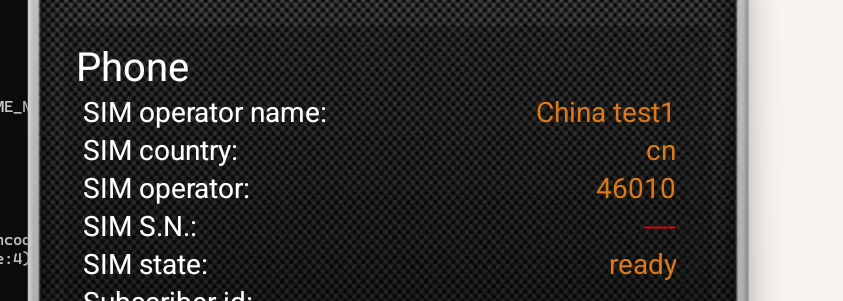
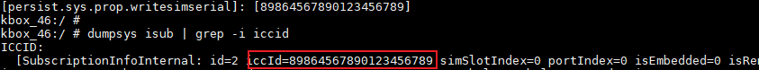
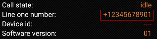
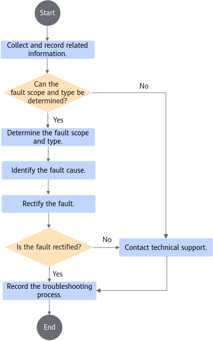

# User Guide<a name="ZH-CN_TOPIC_0000002521735840"></a>

<!-- md-trans-meta sourceCommit=a0e3693322469c84660413f959e180326c482c4f translatedAt=2026-09-22T14:52:59.365Z pushedAt=2026-09-24T02:18:16.976Z -->

## Starting and Uninstalling a Cloud Phone Instance<a name="ZH-CN_TOPIC_0000002518225838"></a>

### Mounting the Android Image<a name="ZH-CN_TOPIC_0000002549865629"></a>

The official Kbox demo image provided by Huawei Mirrors repository does not contain the Android Kbox binary. Therefore, containers cannot be normally started using this image. If you use this demo image, download the Android Kbox binary to the local host and use the script to create an original Kbox image that can start containers properly. After mounting the original Kbox image, create a new Kbox image that integrates the NETINT codec library if hardware decoding is required.

**Table 1** Obtaining and using images<a id="obtaining-and-using-images"></a>

|Image Name + Tag|How to Obtain|Usage|
|---|---|---|
|Defined by the user|Compiled by the user| Compile the image based on the instructions in the corresponding section. This image contains the Android Kbox binary, and containers can be started properly.|
|kbox:demo|Official Kbox demo image provided by Huawei Mirrors repository| This image does not contain the Android Kbox binary, and containers cannot be started properly. You need to create a Kbox image and apply commercial binaries.|
|kbox:origin|Created using a script| This image is created based on `kbox:demo` and the Android Kbox binary, and containers can be started properly.|
|kbox:latest|Created using a script| This image is created based on `kbox:origin` and the codec library to enable hardware decoding for configuration scheme 1. Containers can be started properly.|

**Mounting the Kbox Demo Image<a name="section16531422174717"></a>**

Obtain the `android.tar` package based on [Software Environment](install_guide.md#software-requirements), upload it to the `~/dependency` directory (this directory is used as an example and can be customized), and mount the package.

You can customize the image name and tag in the format of *{Name}:{Tag}*. In this example, the image name is `kbox:demo`.

> **NOTE**
>
>The image name and tag can contain only digits and letters. The image name must start with a digit or lowercase letter.

```bash
cd ~/dependency
docker import android.tar kbox:demo
```

**Creating a Kbox Image and Applying Commercial Binaries<a name="section8328138123920"></a>**

> **NOTE**
>
>If you use the official Kbox demo image provided by Huawei Mirrors repository, perform the operations in this part to ensure that the image contains the Android Kbox binary.
>If you use an image prepared by yourself:
>
>- If you adopt hardware configuration scheme 1, skip all steps in this part.
>- If you adopt hardware configuration scheme 2/3/4/5, skip step 2 in this part.

1. Decompress `Kbox-patches-AOSP15.zip` and upload the `deploy_scripts` directory in the `Kbox-patches-AOSP15` folder to the `~/dependency` directory on the server.
2. Upload the Android Kbox binary package `BoostKit-boostcph-kbox_*_15.zip` to the `~/dependency/deploy_scripts` directory.
3. (For hardware configuration scheme 2/3/4/5) When you adopt hardware configuration scheme 2/3/4/5, decompress the GPU driver package `VAGPU-A15-C-F-26.02.06.00.RC2.tgz` to obtain `VAGPU-A15-C-F-26.02.06.00.RC2`, and upload it to the `~/dependency/deploy_scripts` directory on the server.
4. Create a Kbox image that contains the Android Kbox binary. In the following commands, `kbox:demo` is the official Kbox demo image imported in the previous step, and `kbox:origin` is the new image that contains the Android Kbox binary.
    - For configuration scheme 1:

        ```bash
        cd ~/dependency/deploy_scripts
        chmod +x make_image_aosp15.sh
        ./make_image_aosp15.sh kbox:demo kbox:origin
        ```

    - For configuration scheme 2/3/4/5:

        ```bash
        cd ~/dependency/deploy_scripts
        chmod +x make_image_aosp15.sh
        ./make_image_aosp15.sh kbox:demo kbox:origin VAGPU-A15-C-F-26.02.06.00.RC2
        ```

**(Configuration Scheme 1, Optional) Creating a Kbox Image and Enabling Hardware Decoding<a name="section1799111466509"></a>**

If no encoding card is used in the environment, you cannot create and use an image with the hardware decoding function enabled.

1. Decompress `Kbox-patches-AOSP11.zip` and upload the `Kbox-patches-AOSP11/make_img_sample` directory to the `~/dependency` directory on the server.
2. Obtain `NETINT-vXXX.tar.gz` based on [Software Environment](install_guide.md#software-requirements), rename it `NETINT.tar.gz`, and place it in the `~/dependency/make_img_sample/decode_iso_build` directory. Grant execute permissions on the image creation script in this directory.

    ```shell
    cd ~/dependency/make_img_sample/decode_iso_build
    chmod +x Dockerfile make_image.sh
    ```

    > **NOTE:**
    >
    >The `NETINT.tar.gz` package for Quadra is different from that for T432. Select the correct version.

3. Create an image with hardware decoding enabled.

    Create a `kbox:latest` image based on the `kbox:origin` image. The two image names can be customized.

    ```shell
    ./make_image.sh kbox:origin kbox:latest
    ```

    The parameters entered during instance startup must be the same as the name and tag you specify when creating an image.

### Starting and Uninstalling a Cloud Phone Instance<a name="ZH-CN_TOPIC_0000002518225854"></a>

Ensure that the `kbox_config.cfg` and `hardware_bind.cfg` files exist in the startup path of the cloud phone instance. The container uses the configuration in these files. Therefore, ensure that the configurations in these files are correct. If the configuration files do not exist in the startup path, the cloud phone cannot be started.

Modify the values for the corresponding instance in the map configuration parameters shown in [**Table 1**](#kbox-cpu-gpu-configuration) to select the GPU and CPU used by that container instance. Configure the data volume storage path in [**Table 2**](#kbox-mount-configuration) to flexibly configure the resources used by the cloud phone and achieve optimal performance.

**Table 1** GPU and CPU configurations in hardware_bind.cfg<a id="kbox-cpu-gpu-configuration"></a>

|Parameter|Parameter Description|Configuration|
|--|--|--|
|VIDEO_GPU_MAP_AMDXXX (hardware configuration scheme 1) VIDEO_GPU_MAP_HBXXX (hardware configuration scheme 2/3/4)|Sets the GPU node allocation range for servers of different specifications.|`VIDEO_GPU_MAP_AMDXXX` indicates the GPU node range allocated to the cloud phone container on a server using hardware configuration scheme 1. `VIDEO_GPU_MAP_HBXXX` indicates the GPU node range allocated to the cloud phone container on a server using hardware configuration scheme 2, 3, 4, or 5. Nodes are allocated through a modulo operation based on the server specification and the container index.|
|MODE0_CPUSXXX, MODE1_CPUSXXX|Sets the CPU core allocation range for servers of different specifications.|`MODE0_CPUSXXX` indicates the CPU core allocation range in core binding mode. `MODE1_CPUSXXX` indicates the CPU core allocation range in NUMA binding mode. During container startup, the `android_kbox.sh` script selects the corresponding CPU core range based on the container specification.|

**Table 2** Data volume storage path configuration in kbox_config.cfg<a id="kbox-mount-configuration"></a>

|Parameter|Description|Configuration|
|--|--|--|
|USERDATA| This path is the user data directory in the cloud phone container. User data is mounted to this directory when the container starts. |None|

> **NOTE**
>
>To ensure the stable running and optimal performance of the Kbox cloud phone, ensure that the physical CPU cores and GPU rendering nodes bound to a container belong to the same CPU chip.

The Kbox cloud phone container allows users to customize system properties and override original system properties as required. To use custom properties, create a `local.prop` file in the startup path to record custom system properties. After a container is started, properties in this file are parsed and applied to override the original properties during container initialization.

The Kbox cloud phone container supports the graphics acceleration layer. You can enable this feature by setting `ENABLE_RENDER_LAYER` in the `kbox_config.cfg` file to `1`. You can also configure the graphics acceleration layer in the `kbox_render_accelerating_configuration.xml` file in the `~/dependency/deploy_scripts` directory. For details about the configuration items, see section "Configuration Items of the Graphics Acceleration Layer" in [Video Stream Engine User Guide (Android 15)](https://gitcode.com/boostkit/vmi/blob/CloudPhone15/docs/en/user_guide.md). If you need to modify the configuration of the graphics acceleration layer after starting the cloud phone container for the first time, modify the application-specific settings in the configuration file, manually copy the file to the `/data/local/tmp` directory of the cloud phone container, and restart the application for the modification to take effect.

1. Decompress `Kbox-patches-AOSP15.zip` and upload the `deploy_scripts` directory in the `Kbox-patches-AOSP15` folder to the `~/dependency` directory on the server.
2. (Optional) Enable hardware decoding.
    1. (Hardware configuration scheme 1) Modify the `kbox_config.cfg` file in the `deploy_scripts` directory by setting `T432_QUADRA_DECODE_ENABLE` to `1`. At the same time, refer to the following steps to configure NETINT card nodes.
        1. Run the following command to view the nodes of the encoding card chips.

            ```shell
            nvme list
            ```

            The following is an example of the command output. The information in the `Node` column indicates the NVMe nodes of the chips of the NETINT Quadra encoding card. One encoding card has two chips.

            ```shell
            Node          SN                   Model            Namespace Usage                    Format           FW Rev
            ------------- -------------------- ---------------- --------- ------------------------ ---------------- --------
            /dev/nvme0n1  Q2A325A11DC082-0454A QuadraT2A        1         8.59  TB /   8.59  TB    4 KiB +  0 B     48F6rKr1
            /dev/nvme1n1  Q2A325A11DC082-0454B QuadraT2A        1         8.59  TB /   8.59  TB    4 KiB +  0 B     48F6rKr1
            ```

        2. Check the mapping between NVMe nodes and PCIe bus numbers.

            {index} is the NVMe node number returned in the previous step. For example, in `/dev/nvme0n1`, the {index} of this node is `0`.

            ```shell
            find /sys/devices/ -name nvme{index}
            ```

            In the following command output, `0000:05:00.0` indicates the bus number of the device.

            ```shell
            /sys/devices/pci0000:00/0000:00:0e.0/0000:05:00.0/nvme/nvme0
            /sys/devices/virtual/nvme-subsystem/nvme-subsys0/nvme0
            ```

        3. Check the mapping between the node and NUMA based on the bus number.

            {busID} is the bus number obtained in the previous step. For example, in the command output for nvme0, {busID} is `0000:05:00.0`.

            ```shell
            lspci -vvvs {busID} | grep NUMA
            ```

            Command output:

            ```shell
            NUMA node: 0
            ```

        4. Change the value of `NETINT` in the `hardware_bind.cfg` file based on the NUMA information corresponding to the NVMe node of the encoding card.

            For servers powered by Kunpeng 920 processors, write NVMe nodes belonging to NUMA0 and NUMA1 in the `NETINT0` field, and NVMe nodes belonging to NUMA2 and NUMA3 in the `NETINT1` field.

            Two nodes need to be added for each device in a field. For example, for NVMe device 2, you need to add nodes `/dev/nvme2` and `/dev/nvme2n1`.

            ```shell
            # NETINT encoding card device node
            NETINT0="/dev/nvme0,/dev/nvme0n1,/dev/nvme1,/dev/nvme1n1"
            NETINT1="/dev/nvme2,/dev/nvme2n1,/dev/nvme3,/dev/nvme3n1"
            ```

            > **NOTE**
            >
            >- If the value of `NETINT` is empty when the container is started for the first time, do not set `T432_QUADRA_DECODE_ENABLE` to `1`. Do not set `T432_QUADRA_DECODE_ENABLE` to `1` also when the container is restarted. Otherwise, a black screen will occur for a short period of time when you play a video.
            >- To enable hardware decoding of the NETINT encoding card, set `T432_QUADRA_DECODE_ENABLE` to `1` in `kbox_config.cfg`.
            >- For an environment where one Quadra T2A encoding card is installed, configure the device node information based on the site requirements. The following configuration is for reference.
            >
            > ```shell
            >
            > # Nodes of NETINT encoding card devices
            >
            > NETINT0="/dev/nvme0,/dev/nvme0n1,/dev/nvme1,/dev/nvme1n1"
            > NETINT1="/dev/nvme0,/dev/nvme0n1,/dev/nvme1,/dev/nvme1n1"
            > ```

    2. (Hardware configuration scheme 2/3/4/5) Modify the `kbox_config.cfg` file under the `deploy_scripts` directory by setting `ENABLE_HARD_DECODE` to `1`.

        > **NOTE**
        >
        >If software decoding is used at startup (`ENABLE_HARD_DECODE=0`), hardware decoding can be switched to through a restart with `ENABLE_HARD_DECODE=1`.

3. (Optional) To start a kbox cloud phone instance with the C2 decoder enabled (applicable for hardware configuration scheme 1), set `ENABLE_AMD_C2_DECODE` to `1` in the `kbox_config.cfg` file under the "deploy_scripts" directory, and disable hardware decoding by setting `T432_QUADRA_DECODE_ENABLE` to `0`. The C2 decoder must be enabled or disabled before the container is started for the first time. Once the container has started, switching by modifying the `ENABLE_AMD_C2_DECODE` parameter in `kbox_config.cfg` and restarting the container is not supported. Built-in apps in the cloud phone will choose the decoder on their own as needed.

    ```bash
    ENABLE_AMD_C2_DECODE=1
    T432_QUADRA_DECODE_ENABLE=0
    ```

4. Start the container by running the `android_kbox_aosp15.sh` script.

    ```bash
    cd ~/dependency/deploy_scripts
    chmod +x android_kbox_aosp15.sh
    ./android_kbox_aosp15.sh start {image name:tag} ${index1} ${index2}
    ```

    ${index1} indicates the start ID of the instances to be started, and ${index2} indicates the end ID. If only a single instance is started, the ${index2} parameter can be omitted.

    [**Table 2** Default configurations](#default-configurations) lists the default configurations of a Kbox basic cloud phone.

    **Table 2** Default configurations<a id="default-configurations"></a>

    |Configuration Item|Kbox Basic Cloud Phone|
    |--|--|
    |Scenario|Mobile office/hosting|
    |vCPU|2|
    |Core binding policy|2 containers/2 cores|
    |Memory|6 GB|
    |System storage|16 GB|
    |Resolution |720 x 1280|

    Example: start an instance numbered 1.

    ```bash
    ./android_kbox_aosp15.sh start kbox:origin  1
    ```

    Example: start multiple instances numbered 1 to 9.

    ```bash
    ./android_kbox_aosp15.sh start kbox:origin 1 9
    ```

    > **NOTE**
    >
    >- When a Kbox cloud phone container is started, the dynamic Kbox kernel switch is automatically enabled to enable necessary Linux kernel functions.
    >- During container startup, errors such as "writing syncT "procError"" and "exec /system/bin/chmod: no such file" may occur. These errors do not affect normal functions and can be ignored.
    >- When starting a container, the specified ${index1} corresponds to the port bound to the container. For example, when index1=10, ports 8010/8510 are used. Ensure that the corresponding ports are not occupied during startup.
    >- You can query the status of the dynamic Kbox kernel switch by running the following command:
    >
    > ```bash
    > cat /sys/kernel/kbox/kbox_enable
    >    ```
    >
    > If `1` is displayed, the switch is enabled. If `0` is displayed, the switch is disabled.
    > You can run the following command to manually enable the switch:
    >
    > ```bash
    > echo 1 > /sys/kernel/kbox/kbox_enable
    >    ```

5. Run the following command to check whether a Kbox container is started successfully. ${index} indicates the ID of the instance.

    ```bash
    docker exec -it kbox_${index} getprop | grep boot_completed
    ```

    In the output, if the value of `sys.boot_completed` is `1`, the startup is successful.

6. Stop and delete a Kbox container.

    In the Kbox solution, data volumes are mounted by default. The default `docker stop` and `docker rm` commands cannot completely clear container data. You need to run a script to completely clear files on the host.

    Run the `android_kbox_aosp15.sh` script to stop and delete running Kbox containers.

    Stop and delete the container numbered `${index}`.

    ```bash
    ./android_kbox_aosp15.sh delete ${index}
    ```

    Stop and delete multiple containers numbered 1 to 9.

    ```bash
    ./android_kbox_aosp15.sh delete 1 9
    ```

7. Restart Kbox containers.

    In the Kbox solution, data volumes are mounted by default. The default `docker restart` command cannot restart a container. Instead, run the following script to restart a container.

    Run the `android_kbox_aosp15.sh` script to restart Kbox containers.

    Restart the container numbered `${index}`.

    ```bash
    ./android_kbox_aosp15.sh restart ${index}
    ```

    Restart multiple containers numbered 1 to 9.

    ```bash
    ./android_kbox_aosp15.sh restart 1 9
    ```

    > **NOTE**
    >
    >If hardware configuration scheme 1 is used, you must enable or disable the C2 decoder during the initial container startup; dynamic switching is not supported. Built-in cloud phone applications will automatically select the appropriate decoder based on their specific requirements.

### Querying Version Information<a name="ZH-CN_TOPIC_0000002518225866"></a>

This section provides two methods to obtain the Kbox component version information.

Method 1: using the obtained software package

Obtain `BoostKit-boostcph-kbox_*_15.zip` based on [Software Environment](install_guide.md#software-requirements), decompress it, and query the `kbox_version.txt` file to check the version number of the current software package.

```bash
unzip BoostKit-boostcph-kbox_*_15.zip
unzip Kbox-BoostKit-boostcph-kbox_*_15.zip
cat ./products/kbox_version.txt
```

The command output shows the Kbox version information. An example is as follows:

```bash
Product Name: Kunpeng BoostKit
Product Version: 26.0.RC1
Component Name: BoostKit-boostcph-kbox
Component Version: 8.0.RC1
Component AppendInfo: 15.0.0_r17
```

Method 2: Run the following command to query the version in the started container. In the command, ${index} indicates the ID of the started instance. For details about the command output example, see the query result of method 1.

```bash
docker exec -it kbox_${index} cat /system/vendor/etc/kbox_version.txt
```

### (Optional) Enabling Containers to Boot with the F2FS File System<a name="ZH-CN_TOPIC_0000002549832548"></a>

Previously, cloud phone containers used the ext4 file system, which is commonly used on servers but differs from the F2FS file system used by physical devices. The following steps describe how to enable cloud phones to boot with the F2FS file system, aligning them with physical devices to improve emulation fidelity.

#### Environment Setup

Set up the environment by following the instructions in [Usage](feature_guide.md#ZH-CN_TOPIC_0000002549865941) of chapter "Boot in F2FS Format".

#### Enabling the Configuration Item<a name="ZH-CN_TOPIC_0000002549832549"></a>

Set `ENABLE_F2FS` in the `kbox_config.cfg` file to `1`.

```text
ENABLE_F2FS=1
```

#### Verifying Whether the Configuration Takes Effect

After the container is started, access the container environment to view the mount point information.

```bash
mount | grep -i /data
```

If the output indicates that the mount type of the corresponding partition is `f2fs`, the feature is enabled successfully.

### (Optional) Enabling the Shared Data Volume Feature<a id="ZH-CN_TOPIC_000000254983254923"></a>

Currently, the data volumes of cloud phone containers are mounted independently on the host, and data volumes are isolated between containers, resulting in multiple independent and duplicate data volumes for multiple containers. The shared data volume feature enables multiple containers to be created from the same image, thereby achieving data volume sharing across containers.

#### Environment Setup

   This feature is included when Kbox cloud phone components version 26.2.RC1 or later are integrated.

#### Modification Method<a id="ZH-CN_TOPIC_000000254983255011"></a>

1. Set the configuration item `START_SHARE_DATA` in the cloud phone configuration file `kbox_config.cfg`. This configuration item defaults to `0`, meaning disabled. Set it to `1` to enable the shared data volume feature.

2. After setting `START_SHARE_DATA` to `1`, create an image following the original video stream process, and launch an Android cloud phone instance. After configuring the cloud phone instance, for example, downloading games and software, execute the following command:

    ```bash
    docker commit cloud phone instance  image name
    ```

   Example:

   ```bash
   docker commit kbox_1 kbox:game_name
   ```

   At this point, the data of the cloud phone instance is frozen into a new image layer. Then, based on this new image, start new cloud phones, and all new cloud phone instances can share the data in the new image.

#### Verifying Whether the Configuration Takes Effect

   After the container is started, if the software packaged in the image is visible inside the container, the shared data volume has taken effect successfully.

### (Optional) Resizing the /system Partition Inside the Container<a name="ZH-CN_TOPIC_0000002549132549"></a>

A detection tool revealed that the size of the `/system` partition inside the cloud phone container was identical to the root directory space on the host, reaching nearly 1 TB. This creates a massive discrepancy compared with physical devices. The following steps describe how to resize the `/system` partition of the cloud phone to match physical devices, thereby improving emulation fidelity.

#### Environment Setup

Set up the environment by following the instructions in [Usage Guide](feature_guide.md#ZH-CN_TOPIC_0000002549865942) of chapter "/system Partition Size Adjustment".

#### Triggering the Partition Expansion Logic<a name="ZH-CN_TOPIC_0000002549832550"></a>

In the cloud phone configuration file `kbox_config.cfg`, set `SYSTEM_PARTITION_SIZE_MB` to the target capacity for the `/system` partition, in MB.

```txt
SYSTEM_PARTITION_SIZE_MB=${expected /system partition size value (MB)}
```

#### Verifying Whether the Configuration Takes Effect

After the container is started, run the following command in the container to check the actual capacity of the system partition:

```bash
df -h /system
```

If the size displayed in the `Size` column matches the configured size, the partition has been resized successfully.

### (Optional) Enabling Containers to Boot with NFS Mount

This feature allows data storage to be mounted to a remote device through NFS, implementing decoupled storage and compute and storage reuse.

#### Environment Setup

Set up the environment by following the instructions in [NFS Mount Support](feature_guide.md#nfs-mount-support).

#### NFS Mount

In the container configuration file `kbox_config.cfg`, set the `NFS_DIR` property to `/tmp/nfs`. Start the cloud phone using the `nstart` command:

```bash
./android_kbox_aosp15.sh nstart kbox:origin 1
```

Run the `ndelete` command to delete the cloud phone. After deletion by `ndelete`, the image file is saved by default.

```bash
./android_kbox_aosp15.sh ndelete kbox:origin 1
```

#### Verifying Whether the Configuration Takes Effect

Run the following command:

```bash
docker inspect kbox_1 | jq -r '.[].Mounts[] | select(.Destination=="/data") | .Source'
```

The expected result is `/tmp/nfs/data/kbox_1/data`.

### (Optional) Dynamically Regulating the CPU Frequency of the Cloud Phone<a name="ZH-CN_TOPIC_000000254983254923"></a>

On physical devices, the system dynamically regulates the CPU frequency to balance load and power consumption. In contrast, cloud phones run in a containerized environment relying on the host, where the underlying physical CPU frequency typically remains constant, differing from physical devices. The following steps describe how to implement dynamic CPU frequency regulation for cloud phones to improve emulation fidelity.

#### Environment Setup

Set up the environment by following the instructions in [Installing the Feature](feature_guide.md#ZH-CN_TOPIC_0000002518386097) of chapter "Dynamic CPU Frequency Emulation and Regulation".

#### Modification Method<a name="ZH-CN_TOPIC_000000254983255011"></a>

1. Current third-party detection applications generally read the two files `scaling_cur_freq` and `cpuinfo_cur_freq` to retrieve the current device's CPU operating frequency. To improve the emulation capabilities of the cloud phone device, enter the following command in the container to read the frequency list supported by the CPU before modification. In addition, you need to modify both files.

    ```bash
    cat /sys/devices/system/cpu/cpu${target_cpu_id}/cpufreq/scaling_available_frequencies
    ```

2. Next, run the following two commands inside the container to modify the frequencies. It is recommended that the input frequency values match one of the supported CPU frequencies retrieved in the previous step.

    ```bash
    echo ${target_frequency} > /sys/devices/system/cpu/cpu${target_cpu_id}/cpufreq/scaling_cur_freq
    ```

    ```bash
    echo ${target_frequency} > /sys/devices/system/cpu/cpu${target_cpu_id}/cpufreq/cpuinfo_cur_freq
    ```

    If the container restarts, the previous modifications will become invalid, and the CPU frequency values will restore to defaults.

3. To achieve dynamic CPU frequency regulation, you can copy and paste the following shell script to any path inside the container and execute it. This allows you to observe dynamic CPU frequency changes in third-party applications (such as "Device Info"). In this script, `sleep 1` specifies a 1-second interval between changes, which can be modified as required. The `FREQS` array stores the potential CPU frequency values, and `CPU_ID` specifies the index of the CPU to be modified. These three values can be adjusted based on your actual requirements.

    ```bash
    CPU_ID=0
    FREQS=(554000 860000 956000 1042000 1128000 1224000 1320000 1397000 1512000 1628000 1748000 1858000 1954000)

    while true; do
        for FREQ in "${FREQS[@]}"; do
            echo $FREQ > /sys/devices/system/cpu/cpu${CPU_ID}/cpufreq/scaling_cur_freq 2>/dev/null
            echo $FREQ > /sys/devices/system/cpu/cpu${CPU_ID}/cpufreq/cpuinfo_cur_freq 2>/dev/null
            echo "CPU${CPU_ID} frequency dynamically regulated to: $FREQ"
            sleep 1
        done
    done
    ```

#### Verifying Whether the Configuration Takes Effect

After starting the container, install a third-party application (such as "Device Info") inside the container to check whether the CPU frequency matches the expected value. If it matches, the CPU frequency regulation has successfully taken effect.

## Performing SCRCPY Tests<a name="ZH-CN_TOPIC_0000002549865635"></a>

On Windows, it is recommended to use the SCRCPY screen mirroring software for debugging and to access the Kbox container graphically. SCRCPY version 2.4 or later is required, and version 2.4 is recommended. Obtain and install it from official channels.

To connect to a started Kbox instance using ADB on Windows, perform the following steps:

1. Obtain and install the SCRCPY screen mirroring software by yourself.
2. Open the Windows command prompt (CMD) and go to the SCRCPY installation path.
3. Use ADB to connect to the cloud phone.

    ```bash
    adb connect $ip:$port
    ```

    In the command, replace $ip and $port with the actual IP address and port number of the container.

    If the connection is successful, the following message is displayed.

    ```bash
    connected to xx.xx.xx.xx:xxxx
    ```

4. Query the devices that are currently connected successfully.

    ```bash
    adb devices
    ```

    Example command output:

    ```bash
    List of devices attached
    xx.xx.xx.xx:xxxx      device
    xx.xx.xx.xx:xxxx      device
    ...
    ```

5. Call `scrcpy.exe` to start screen mirroring.

    ```bash
    scrcpy.exe -s $ip:$port
    ```

6. Drag the APK to be tested to the page and wait for the installation.
7. After the APK is successfully installed, run the APK to start the test.

## (Optional) Configuring the Docker Environment<a name="ZH-CN_TOPIC_0000002549745615"></a>

Docker is not within the delivery scope of this solution. The environment configuration provided in this section is for reference only. You are not advised to use Kunpeng BoostKit for Cloud Phone demos as a commercial solution. Customers or ISVs must perform necessary security assessment before commercial use. Using the Kunpeng BoostKit for Cloud Phone demos implies the user's acceptance of all associated security risks.

**Creating a Separate Partition and Enabling IPv6 for Containers<a name="section66764141138"></a>**

1. The default Docker directory is `/var/lib/docker`, which stores all Docker files including images. This directory may be fully occupied. As a result, Docker and the host may become unavailable. For this reason, it is a good practice to create a separate partition (logical volume) for Docker files.
2. By default, IPv6 is disabled for Docker. However, some applications depend on the IPv6 protocol. If IPv6 is disabled, some functions of these applications may be abnormal. The following provides a method to enable the IPv6 protocol for Docker.

Recommended modification method:

1. Create a directory for Docker files. Mount an idle drive whose file system type is ext4 as an independent partition. The following uses `sda` as an example.

    Create a `/root/sda/docker` directory and add a line `/dev/sda /root/sda/docker ext4 defaults 0 0` to the `/etc/fstab` file. If `/dev/sda` has been mounted or it has a non-ext4 file system, replace `sda` in the following command with the name of a valid drive.

    ```bash
    mkdir -p /root/sda/docker
    echo "/dev/sda /root/sda/docker ext4 defaults 0 0" >> /etc/fstab
    ```

2. Select the `/root/sda/docker` path.

    1. Open the `/etc/docker/daemon.json` file.

        ```bash
        vim /etc/docker/daemon.json
        ```

    2. Press **i** to enter the insert mode and add the `"data-root": "/root/sda/docker", "ipv6": true,"fixed-cidr-v6": "2001:db8::/64"` properties to the file to configure the Docker data storage location and enable the IPv6 protocol. The file must comply with the JSON format.

        ```bash
        {
        "debug": true,
        "data-root": "/root/sda/docker",
        "ipv6": true,
        "fixed-cidr-v6": "2001:db8::/64"
        }
        ```

    3. Press **Esc**, type `:wq!`, and press **Enter** to save the settings and exit.

    > **NOTE**
    >
    >Modify the `/etc/docker/daemon.json` file. If the file does not exist, run the following commands to create the file and write related content to the file:
    >
    >```bash
    >touch /etc/docker/daemon.json
    >cat >/etc/docker/daemon.json <<EOF
    >{
    >"debug":true,
    >"data-root":"/root/sda/docker",
    >"ipv6":true,
    >"fixed-cidr-v6":"2001:db8::/64"
    >}
    >EOF
    >```

3. Restart the Docker service.

    > **NOTE**
    >
    >Before restarting the Docker service, ensure that no other container is running. If any other container is running in the environment, clear it.

    ```bash
    systemctl restart docker
    ```

4. Reload the content of the `/etc/fstab` file.

    ```bash
    mount -a
    ```

## Configuring Emulated Device Parameters<a name="ZH-CN_TOPIC_0000002518385792"></a>

### Property Configuration Methods<a name="ZH-CN_TOPIC_0000002549745645"></a>

Before configuring properties, you need to connect to and access the container.

This document provides two methods for accessing a container: [Using the CLI on a PC](#section155521166386) and [Using the Server Terminal](#section473111277384). You can select either method as required.

**Using the CLI on a PC<a name="section155521166386"></a>**

1. Start the Kbox container.
2. Connect to the container instance via `adb` on the PC CLI.

    ```bash
    adb connect ip:port
    ```

    Some commands (such as `getevent`) require root permissions.

    ```bash
    adb -s ip:port root
    ```

3. Access the container using the `adb` CLI.

    ```bash
    adb -s ip:port shell
    ```

    After accessing the container, run corresponding commands to configure cloud phone parameters.

    > **NOTE**
    >
    >In the `adb` commands used in this document, *ip* indicates the IP address of the server and *port* indicates the ADB port number.

**Using the Server Terminal<a name="section473111277384"></a>**

1. Start the Kbox container.
2. On the server terminal interface, access the container using the `docker` CLI.

    ```bash
    docker exec -it kbox_${index} sh
    ```

    After accessing the container, run corresponding commands to configure cloud phone parameters.

### Configuring System Properties<a name="ZH-CN_TOPIC_0000002549745623"></a>

#### Configuring GPS System Properties<a name="ZH-CN_TOPIC_0000002549865627"></a>

##### GPS Properties<a name="ZH-CN_TOPIC_0000002518385802"></a>

This section describes the GPS system property configuration items.

> **NOTE**
>
>Data types of the parameters in the following table are described as follows:
>
>- A valid double-type parameter value contains 15 or 16 digits. If a value exceeds this digit limit, use scientific notation. Otherwise, garbled characters are displayed. Due to the type conversion of double-precision floating-point data, some upper-layer applications may encounter precision fluctuations even if the value is within the digit limit.
>- A valid float-type parameter value contains 6 or 7 digits. If a value exceeds this digit limit, use scientific notation. Otherwise, garbled characters are displayed. Due to the type conversion of floating-point data, some upper-layer applications may encounter precision fluctuations even if the value is within the digit limit.

|Configuration Item|Meaning|Type|Value Range|Default Value|Description|
|---|---|---|---|---|---|
|persist.gps.mock.latitude| Latitude, in degrees|double|[-90, 90]|30.188433| The default value is the latitude of Hangzhou, China. Due to code restrictions, the longitude and latitude cannot be set to `0` at the same time in the Android 15 environment.|
|persist.gps.mock.longitude| Longitude, in degrees|double|[-180, 180]|120.199818| The default value is the longitude of Hangzhou, China. Due to code restrictions, the longitude and latitude cannot be set to `0` at the same time in the Android 15 environment.|
|persist.gps.mock.altitude| Altitude, in meters.|double|Unlimited. It can be positive, negative, or 0.|0| The default value indicates that the current altitude is 0 m.|
|persist.gps.mock.speed| Current moving speed, in meters per second|float|[0, 343]|0| The default value indicates that the device is currently stationary. If the speed exceeds 343 m/s, the Android system stops reporting GPS data.|
|persist.gps.mock.bearing| Current bearing angle, in degrees|float|[0, 360)|0| The initial value indicates due north.|
|persist.gps.mock.accuracy| Current positioning accuracy, in meters|float|Greater than or equal to 0|20| The initial value indicates that the positioning error is ±20 m.|

##### Configuration Examples<a name="ZH-CN_TOPIC_0000002518225836"></a>

This section provides examples of GPS system property configuration.

1. Call the `setprop` method to set the value of the current property. The following uses the `gps.mock.latitude` and `gps.mock.longitude` system properties as an example. The methods for setting other properties are the same.

    ```bash
    setprop persist.gps.mock.latitude 30.188433
    setprop persist.gps.mock.longitude 120.193818
    ```

2. Check the current GPS properties.

    ```bash
    getprop | grep "persist.gps.mock."
    ```

    Example command output:

    ```bash
    [persist.gps.mock.latitude]: [30.188433]
    [persist.gps.mock.longitude]: [120.193818]
    ```

    > **NOTE**
    >
    >To query string texts on Windows, use the `findstr` command instead of the `grep` command. In the following scenarios where the `grep` command is used in this chapter, perform operations based on your service scenario.
    >
    >```bash
    >adb -s ip:port shell getprop | findstr "persist.gps.mock."
    >```

3. After the container is restarted, query the GPS data of the location service. Run the following command in the container to query the latest GPS data:

    ```bash
    dumpsys location | grep -A 1 "gps provider:"
    ```

    Check whether the GPS properties take effect based on the returned value. Example command output:

    ```bash
    gps provider:
    last location=Location[gps 30.188433,120.193818 hAcc=20.0 et=+3d21h54m53s533ms alt=0.0 mslAlt=-8.068903955722352 vel=0.0 bear=0.0 {Bundle[{satellites=0, maxCn0=0, meanCn0=0}]}]
    ```

    |Returned Frame Parameter|Meaning|
    |--|--|
    |gps|Location information. The format is [Latitude],[Longitude].|
    |hAcc|Current positioning error, in meters|
    |alt|Altitude, in meters.|
    |bear|Current bearing angle, in degrees|
    |vel|Current moving speed, in meters per second|

4. Check whether the GPS data of the location service matches the preset values.

#### Configuring Telephony Properties<a name="ZH-CN_TOPIC_0000002518385780"></a>

##### Telephony Properties<a name="ZH-CN_TOPIC_0000002549745611"></a>

This section describes the Telephony property configuration items.

|Configuration Item|Meaning|Type|Value Range|Default Value|Description|
|---|---|---|---|---|---|
|persist.sys.prop.writeimei| International mobile equipment identity (IMEI)|int|A numeric string of 15 to 17 digits|86 + a string of 15 random digits|`86`: China|
|persist.gsm.operator.alphacph| Network operator name|string|A string of 1 to 20 letters, digits, or spaces|China Mobile|-|
|persist.gsm.operator.numericcph| Network operator code|int|A numeric string of 5 to 6 digits|46000| The value consists of a three-digit country/region code of the network operator and a two-digit or three-digit mobile network code. For example, `460` indicates China (cn), and `00` indicates China Mobile.|
|persist.sys.prop.writeimsi| International mobile subscriber identity (IMSI)|int|A numeric string of 15 digits|46000 + a string of random digits| The first five or six digits indicate the operator code of the SIM card. The composition of the operator code is the same as that of the network operator code. `460` indicates China (cn), and `00` indicates China Mobile.|
|persist.gsm.sim.operator.alphacph| Operator name of the SIM card|string|A string of 1 to 20 letters, digits, or spaces|China Mobile|-|
|persist.sys.prop.writesimserial| Serial number of the SIM card|int|A numeric string of 20 digits|898603 + a string of random digits| `89` indicates the international code, `86` indicates China, and `00` indicates China Mobile.|
|persist.sys.prop.writephonenum| Mobile number|int|A numeric string of 7 to 11 digits|15551236565|-|

> **NOTE**
>
>- You need to restart the container for the property settings to take effect.
>- During container startup, the system checks whether the characters and value length are valid. If they are invalid, the default values are used.

##### Configuration Examples<a name="ZH-CN_TOPIC_0000002518225876"></a>

This section provides Telephony property configuration examples.

1. Call the `setprop` method to set the IMEI value.

    ```bash
    setprop persist.sys.prop.writeimei 861456987456321
    ```

    Restart the container and enter `*#06#` on the dialing screen.

2. Call the `setprop` method to set the network operator name and code.

    ```bash
    setprop persist.gsm.operator.alphacph "China Telecom"
    setprop persist.gsm.operator.numericcph 46011
    ```

    Restart the container and query the setting result in the application.

    

    > **NOTE**
    >
    >In AOSP15, the network operator code 46000 is strongly bound to the network operator name "China Mobile". When the network operator code is 46000, the network operator name cannot be modified separately. For other network operator codes, the operator name can be modified separately as needed.

3. Call the `setprop` method to set IMSI and SIM card operator name.

    > **NOTE**
    >
    >The AOSP source code contains the following file: `packages/providers/TelephonyProvider/assets/latest_carrier_id/carrier_list.textpb`
    >This file maintains the mapping between some SIM card operator codes and SIM card operator names. The mapping relationships maintained in this file cannot be manually modified through telephony mock. Values not maintained in this file can be configured as needed.

    ```bash
    setprop persist.sys.prop.writeimsi 460100123456789
    setprop persist.gsm.sim.operator.alphacph "China test1"
    ```

    Restart the container, enter `*#*#4636#*#*` on the dialing screen, and query the mobile phone information. The IMSI can be queried.

    Query the SIM card operator name and operator code in the application.

    

4. Call the `setprop` method to set the SIM card serial number.

    ```bash
    setprop persist.sys.prop.writesimserial 89864567890123456789
    ```

    Restart the container and run the following command to query the setting result:

    ```bash
    dumpsys isub | grep iccid
    ```

    

    > **NOTE**
    >
    >1. Currently, the control can only modify the SIM card serial number to a number starts with 8986. Otherwise, the SIM card serial number will be set to empty.
    >2. When querying the SIM card serial number through a command, if the user mode is selected when compiling the Android image:
    >
    > ```bash
    > lunch kbox_arm64_15-trunk_staging-user
    >    ```
    >
    > Due to the information security mechanism of the user mode, asterisks will appear at the end of the serial number to mask it. This is a normal phenomenon and does not affect the actual function. Users can use relevant applications to verify it.
    > When compiling the Android image, use the following command to select the userdebug mode. In this way, the complete serial number can be viewed.
    >
    > ```bash
    > lunch kbox_arm64_15-trunk_staging-userdebug
    >    ```

5. Call the `setprop` method to set the phone number.

    ```bash
    setprop persist.sys.prop.writephonenum 12345678901
    ```

    Restart the container and query the setting result in the application.

    

#### Configuring Properties of the Acceleration Sensor and Gyroscope Sensor<a name="ZH-CN_TOPIC_0000002549745631"></a>

##### Properties of the Acceleration Sensor and Gyroscope Sensor<a name="ZH-CN_TOPIC_0000002518225840"></a>

This section describes the configuration items of the acceleration sensor and gyroscope sensor properties.

|Configuration Item|Meaning|Type|Value Range|Default Value|Description|
|---|---|---|---|---|---|
|persist.sensors.mock.delaytime| Data collection interval, in microseconds|int|[20000,1000000]|200000| If the value of `persist.sensors.mock.delaytime` is not within the range [20000, 1000000], the default value is used.|
|persist.sensors.mock.acce.data.x| Acceleration along the x-axis (gravity included), in m/s².|float|[-3.402823466e+38,3.402823466e+38]| The default values for both the acceleration and gyroscope on the x-axis are `9.833359`. You can query the default value using a related application. The default value is not displayed in `persist.sensors.mock.acce.data.x` or `persist.sensors.mock.gyro.data.x`. Android 15 quantizes the data collected at the underlying layer together with the resolution value into a new value. The acceleration resolution is 1/4032, and the gyroscope resolution is 1/1000.|If the value of `persist.sensors.mock.acce.data.x` contains invalid characters that are neither digits nor decimal points, the setting is invalid and the default value is used. Note that a valid float type parameter value contains 6 or 7 significant digits. If a value exceeds this digit limit, use scientific notation, for example, 3.40282e+38. Otherwise, digits exceeding this limit will be garbled. Due to the type conversion of floating-point data, some upper-layer applications may encounter precision fluctuations even if the value is within the digit limit.|
|persist.sensors.mock.gyro.data.x| Rotation rate along the x-axis, in rad/s.|float|[-3.402823466e+38,3.402823466e+38]| The default values for both the acceleration and gyroscope on the x-axis are `9.833359`. You can query the default value using a related application. The default value is not displayed in `persist.sensors.mock.acce.data.x` or `persist.sensors.mock.gyro.data.x`. Android 15 quantizes the data collected at the underlying layer together with the resolution value into a new value. The acceleration resolution is 1/4032, and the gyroscope resolution is 1/1000.|If the value of `persist.sensors.mock.gyro.data.x` contains invalid characters that are neither digits nor decimal points, the setting is invalid and the default value is used. Note that a valid float type parameter value contains 6 or 7 significant digits. If a value exceeds this digit limit, use scientific notation, for example, 3.40282e+38. Otherwise, digits exceeding this limit will be garbled. Due to the type conversion of floating-point data, some upper-layer applications may encounter precision fluctuations even if the value is within the digit limit.|
|persist.sensors.mock.acce.data.y| Acceleration along the y-axis (gravity included).|float|[-3.402823466e+38,3.402823466e+38]| The default value for the acceleration on the y-axis is `0.184357`. You can query the default value using a related application. The default value is not displayed in `persist.sensors.mock.acce.data.y`. Android 15 quantizes the data collected at the underlying layer together with the resolution value into a new value. The acceleration resolution is 1/4032.|If the value of `persist.sensors.mock.acce.data.y` contains invalid characters that are neither digits nor decimal points, the setting is invalid and the default value is used. Note that a valid float type parameter value contains 6 or 7 significant digits. If a value exceeds this digit limit, use scientific notation, for example, 3.40282e+38. Otherwise, digits exceeding this limit will be garbled. Due to the type conversion of floating-point data, some upper-layer applications may encounter precision fluctuations even if the value is within the digit limit.|
|persist.sensors.mock.gyro.data.y| Rotation rate along the y-axis.|float|[-3.402823466e+38,3.402823466e+38]| The default value for the gyroscope on the y-axis is `0.184357`. You can query the default value using a related application. The default value is not displayed in `persist.sensors.mock.gyro.data.y`. Android 15 quantizes the data collected at the underlying layer together with the resolution value into a new value. The gyroscope resolution is 1/1000.|If the value of `persist.sensors.mock.gyro.data.y` contains invalid characters that are neither digits nor decimal points, the setting is invalid and the default value is used. Note that a valid float type parameter value contains 6 or 7 significant digits. If a value exceeds this digit limit, use scientific notation, for example, 3.40282e+38. Otherwise, digits exceeding this limit will be garbled. Due to the type conversion of floating-point data, some upper-layer applications may encounter precision fluctuations even if the value is within the digit limit.|
|persist.sensors.mock.acce.data.z| Acceleration along the z-axis (gravity included).|float|[-3.402823466e+38,3.402823466e+38]| The default value for the acceleration on the z-axis is `0.101028`. You can query the default value using a related application. The default value is not displayed in `persist.sensors.mock.acce.data.z`. Android 15 quantizes the data collected at the underlying layer together with the resolution value into a new value. The acceleration resolution is 1/4032.|If the value of `persist.sensors.mock.acce.data.z` contains invalid characters that are neither digits nor decimal points, the setting is invalid and the default value is used. Note that a valid float type parameter value contains 6 or 7 significant digits. If a value exceeds this digit limit, use scientific notation, for example, 3.40282e+38. Otherwise, digits exceeding this limit will be garbled. Due to the type conversion of floating-point data, some upper-layer applications may encounter precision fluctuations even if the value is within the digit limit.|
|persist.sensors.mock.gyro.data.z| Rotation rate along the z-axis.|float|[-3.402823466e+38,3.402823466e+38]| The default value for the gyroscope on the z-axis is `0.101028`. You can query the default value using a related application. The default value is not displayed in `persist.sensors.mock.gyro.data.z`. Android 15 quantizes the data collected at the underlying layer together with the resolution value into a new value. The gyroscope resolution is 1/1000.|If the value of `persist.sensors.mock.gyro.data.z` contains invalid characters that are neither digits nor decimal points, the setting is invalid and the default value is used. Note that a valid float type parameter value contains 6 or 7 significant digits. If a value exceeds this digit limit, use scientific notation, for example, 3.40282e+38. Otherwise, digits exceeding this limit will be garbled. Due to the type conversion of floating-point data, some upper-layer applications may encounter precision fluctuations even if the value is within the digit limit.|

> **NOTE**
>
>Value conversion formula for Android 15: If the input value is of the float type and the resolution is of the double type, `double incRes = 0.125 x resolution`, and `value = round(static_cast<double>(value)/incRes) x incRes`, where the round function is used to round a value of the double type.

##### Configuration Examples<a name="ZH-CN_TOPIC_0000002549745641"></a>

This section provides examples of configuring acceleration and gyroscope properties.

1. Call the `setprop` method to input the acceleration sensor data.

    ```bash
    setprop persist.sensors.mock.acce.data.x 5432.43
    setprop persist.sensors.mock.acce.data.y 456
    setprop persist.sensors.mock.acce.data.z 756
    ```

2. View the configured acceleration data.

    > **NOTE**
    >
    >You can use a relevant application for verification.

3. Call the `setprop` method to input the gyroscope data.

    ```bash
    setprop persist.sensors.mock.gyro.data.x 1.12
    setprop persist.sensors.mock.gyro.data.y 2.12
    setprop persist.sensors.mock.gyro.data.z 3.12
    ```

4. View the gyroscope data.

#### Configuring Properties of Multiple VInput Devices<a name="ZH-CN_TOPIC_0000002549745651"></a>

##### VInput Properties<a name="ZH-CN_TOPIC_0000002549865633"></a>

This section describes the VInput property configuration items.

|Configuration Item|Meaning|Type|Value Requirement|Description|
|---|---|---|---|---|
|persist.sys.input.mouse.name| Creating device identity properties for the mouse|string| The value is a string of 1 to 64 characters, which can contain only letters, digits, and underscores (_).|If the configured value does not meet the requirements, the value is invalid.|
|persist.sys.input.gamepad1.name| Creating device identity properties for gamepad 1|string| The value is a string of 1 to 64 characters, which can contain only letters, digits, and underscores (_).|If the configured value does not meet the requirements, the value is invalid.|
|persist.sys.input.gamepad2.name| Creating device identity properties for gamepad 2|string| The value is a string of 1 to 64 characters, which can contain only letters, digits, and underscores (_).|If the configured value does not meet the requirements, the value is invalid.|

##### Configuration Examples<a name="ZH-CN_TOPIC_0000002518385778"></a>

This section provides VInput attribute configuration examples.

1. Call the `setprop` method to create a mouse device, and view the result using the `getevent` method.

    ```bash
    setprop persist.sys.input.mouse.name mouse
    getevent
    ```

    Example command output:

    ```bash
    add device 1: /dev/input/event4
      name:     "mouse"
    add device 2: /dev/input/event3
      name:     "Touch Pad"
    could not get driver version for /dev/input/event0, Inappropriate ioctl for device
    could not get driver version for /dev/input/event1, Inappropriate ioctl for device
    ```

2. Call the `setprop` method to create the first gamepad device, and view the result using the `getevent` method.

    ```bash
    setprop persist.sys.input.gamepad1.name gamepad1
    getevent
    ```

    Example command output:

    ```bash
    add device 1: /dev/input/event5
      name:     "gamepad1"
    add device 2: /dev/input/event4
      name:     "mouse"
    add device 3: /dev/input/event3
      name:     "Touch Pad"
    could not get driver version for /dev/input/event0, Inappropriate ioctl for device
    could not get driver version for /dev/input/event1, Inappropriate ioctl for device
    ```

3. Call the `setprop` method to create the second gamepad device, and view the result using the `getevent` method.

    ```bash
    setprop persist.sys.input.gamepad2.name gamepad2
    getevent
    ```

    Example command output:

    ```bash
    add device 1: /dev/input/event6
      name:     "gamepad2"
    add device 2: /dev/input/event5
      name:     "gamepad1"
    add device 3: /dev/input/event4
      name:     "mouse"
    add device 4: /dev/input/event3
      name:     "Touch Pad"
    could not get driver version for /dev/input/event0, Inappropriate ioctl for device
    could not get driver version for /dev/input/event1, Inappropriate ioctl for device
    ```

### System Function Parameter Configuration

|Configuration Item|Meaning|Type|Value Range|Default Value|Description|
|---|---|---|---|---|---|
|sys.vmi.vk.texturecompress| Texture compression switch. Vulkan RGB and RGBA textures can be compressed into BC7 textures. ETC2 textures can be decoded into RGBA textures and then compressed into BC7 textures.|int|`0`: disabled; `1`: enabled|1| The setting of texture compression cannot be changed during application running. To change the setting, exit the application first. The function does not support texture postprocessing. If postprocessing is applied, rendering exceptions may occur. In this case, you need to disable texture compression and restart the application.|
|sys.vmi.gl.texturecompress| Texture compression switch. Textures can be converted into the RGBA format through OpenGL ES adaptive scalable texture compression (ASTC) and then compressed into BC3 textures.|int|`0`: disabled; `1`: enabled|1| The setting of texture compression cannot be changed during application running. To change the setting, exit the application first.|
|ro.vmi.adaptive.vsync| Switch for toggling the adaptive vertical synchronization (vsync) function, which is disabled by default.|int|`0`: disabled; `1`: enabled|0| The modification of this item takes effect upon a restart.|

## Troubleshooting<a name="ZH-CN_TOPIC_0000002549865625"></a>

### Overview<a name="ZH-CN_TOPIC_0000002549745649"></a>

#### Troubleshooting Principles<a name="ZH-CN_TOPIC_0000002549865617"></a>

- Fault analysis, locating, and troubleshooting principles:
    - Restore services as soon as possible.
    - Collect fault data immediately and save the data to mobile storage media or other computers.
    - Before crafting a troubleshooting solution, evaluate the impact to ensure service continuity.
    - If a fault occurs on a third-party hardware device, view the documentation of the device or call the service hotline of the third party for assistance.
    - If a fault cannot be located or rectified according to the manual, contact technical support in a timely manner to minimize the service interruption time.

- Precautions before troubleshooting:
    - Strictly comply with operation regulations and industrial safety regulations to ensure personnel and equipment safety.
    - Analyze the fault symptom, identify the cause, and then rectify the fault. If the cause is unknown, avoid blind operations to prevent the fault from worsening.
    - Before rectifying a fault, keep all on-site records relevant to the fault and do not delete any data or logs.
    - To ensure customer network security and privacy, obtain the customer's consent and authorization before collecting fault logs.
    - Before making any modifications, back up data manually or using a script.
    - Take electrostatic discharge (ESD) prevention measures, for example, wearing an ESD wrist strap when replacing or maintaining devices.
    - Record raw information in detail when any issue occurs during maintenance.
    - All major operations such as restarting processes must be documented. In addition, these operations may only be performed by qualified personnel after the corresponding backup, contingency, and security measures have been taken.
    - After the system recovers, check the system running status to confirm that the fault has been rectified. Write associated troubleshooting reports in a timely manner.
    - Exercise caution when performing risky operations and running risky commands.

- Requirements for maintenance personnel:
    - Have basic knowledge of network devices, OSs, and databases, and be skilled at running common commands for maintenance.
    - Understand the logical structure of the on-site service system, mapping relationship between components and on-site devices, and physical connections between on-site devices.
    - Be familiar with the service processes and system structure and be skilled at operating the software and hardware related to the service.
    - Know how to locate and rectify common faults.
    - Be proficient in using remote access methods.

#### Troubleshooting Process<a name="ZH-CN_TOPIC_0000002518225870"></a>

The troubleshooting process consists of the following operations: collecting fault information, diagnosing the fault, locating the fault, and rectifying the fault.

**Figure 1** General troubleshooting process<a name="fig1890714518232"></a><a id="general-troubleshooting-process"></a>


**Fault Information Collection<a name="section196271610142212"></a>**

Collect as much fault information as possible to facilitate fault location and rectification.

**Fault Diagnosis<a name="section4572941192214"></a>**

Determine the type and scope of the fault based on the collected information.

**Fault Location<a name="section3895552182410"></a>**

Identify the possible causes of the fault. You need to analyze and compare the possible causes of the fault and determine the root cause.

The commonly used methods for fault location are as follows:

- View client logs, especially the alarms.
- View server logs, especially the alarms.
- View OS logs, especially the alarms.
- Check the resource usage, especially the full load and overload of resources.
- Check operation logs for misoperations.
- View configuration files and check whether configurations are correct.

**Rectification<a name="section18134350132614"></a>**

Fault rectification refers to the process of rectifying a fault according to different causes of the fault. This process involves checking and repairing devices, modifying configurations, and restarting processes, containers, and servers.

> **NOTE**
>
>Contact technical support for handling critical faults.
>During the troubleshooting, the maintenance personnel may perform operations that may affect service data, such as modifying configurations and restarting VMs. Therefore, to ensure data security, save onsite data and back up related databases, alarm information, and log files before the troubleshooting.
>If system maintenance personnel cannot rectify the fault, contact technical support for assistance.

### Information Collection<a name="ZH-CN_TOPIC_0000002518225852"></a>

#### Statement<a name="ZH-CN_TOPIC_0000002549865653"></a>

Observe the following principles during information collection:

- All maintenance operations must be authorized by the customer. Any maintenance operation beyond the scope of the customer's approval is prohibited.
- Transferring fault location data outside the customer's network must be authorized by the customer.

#### Basic Information Collection<a name="ZH-CN_TOPIC_0000002549865655"></a>

**Collecting Site Information<a name="section4323131116418"></a>**

After a fault occurs, collect site information for technical support and R&D engineers to learn about the situation. In addition, provide the phone numbers of onsite engineers to ensure smooth communication.

The following table lists the site information to be collected.

**Table 1** Site information to be collected<a id="site-information-to-be-collected"></a>

|Carrier or Enterprise|Site|Networking Diagram|Onsite Engineer Name and Phone Number|Customer Name and Phone Number|
|--|--|--|--|--|
|Version information|-|-|-|-|
|Remote maintenance information|-|-|-|-|

**Collecting Basic Fault Information<a name="section19389174953610"></a>**

Collect basic fault information to learn about the fault, current status, device status before the fault occurred, and possible causes of the fault. For details, see the following table.

**Table 2** Basic fault information to be collected<a id="basic-fault-information-to-be-collected"></a>

|Required Information|Collected Information|
|--|--|
|Symptom|-|
|Fault occurrence time|-|
|Fault occurrence frequency|-|
|Impact on services|-|
|Fault handling progress|-|
|Operations performed in the system when the fault occurs|-|
|Operations performed for resolving issues that occurred during maintenance|-|
|Measures taken to handle the fault|-|
|Effect of the measures taken to handle the fault|-|
|Whether alarms are generated|-|
|Whether site alarm information is collected|-|

**Collecting Fault-Related Alarm Information<a name="section350713449381"></a>**

Collect alarm information related to the fault for further analyzing, locating, and rectifying the fault. For details, see the following table.

**Table 3** Alarm information to be collected<a id="alarm-information-to-be-collected"></a>

|Parameter|Value|
|--|--|
|Alarm ID|-|
|Alarm severity|-|
|Alarm name|-|
|Alarm source/object|-|
|Generated at|-|
|Region|-|
|Type|-|
|Possible causes|-|
|Additional information|-|

**Collecting Log Information<a name="section168781199405"></a>**

Collect system logs and view details about user operations and operation time in the system to analyze and locate the fault. The main logs to be collected are listed in the following table.

**Table 4** Log collection items<a id="log-collection-items"></a>

|Log Category|Details|
|--|--|
| Android logs | Run the `logcat` command to collect logs in the log buffer. |
| Android logs | Collect the application stack information (in `/data/anr`) during an ANR. |
| Android logs | Run the `dumpsys activity`, `dumpsys meminfo`, and `dumpsys input` commands to collect necessary dumpsys information. |
| Android logs | Run the `ps -a` command to collect process information. |
| Android logs | Run the `getprop` command to collect system property information. |
| Server logs | Collect syslog and kernel logs in `/var/log`. |
| Server logs | Run the `dmesg -T` command to collect and view the startup information. |
| Server logs | Run the `docker stats`/`docker inspect` command to collect Docker logs. |

The Kbox_maintainer tool provides the one-click log collection capability. For details about how to use Kbox_maintainer to collect logs, see section "Collecting Logs" in [Routine Maintenance](routine_maintenance.md).

## Change History

|Release|Date|Description|
|--|--|--|
|01|2026-09-30|This is the first official release.|
