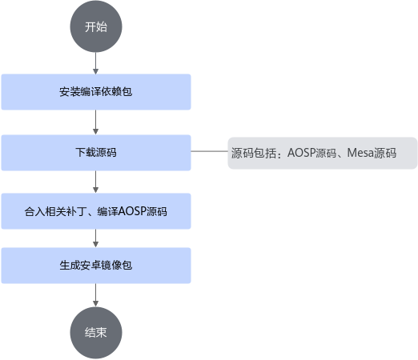
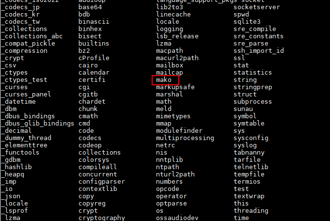

# 编译指南<a name="ZH-CN_TOPIC_0000002521735842"></a>

## 1 环境准备<a name="ZH-CN_TOPIC_0000002518346174"></a>

### 1.1 硬件环境<a name="ZH-CN_TOPIC_0000002549825993"></a>

Kbox安卓镜像的编译仅支持在x86_64服务器下进行，服务器要求的操作系统为Ubuntu 22.04 LTS，编译前请确保您的硬件环境满足要求。

Kbox安卓镜像编译构建的硬件环境要求如[**表 1** Kbox安卓镜像编译构建硬件环境要求](#Kbox安卓镜像编译构建硬件环境要求)所示。

**表 1** Kbox安卓镜像编译构建硬件环境要求<a id="Kbox安卓镜像编译构建硬件环境要求"></a>

|设备型号|用途|服务器OS版本|
|--|--|--|
|x86_64服务器|Kbox安卓镜像编译制作|Ubuntu 22.04 LTS推荐：ubuntu-22.04-live-server-amd64.iso|

> **说明：** 
>
>- 本文档测试服务器型号为2288H V5。
>- 服务器需有访问外网权限，以方便下载OS镜像。

### 1.2 软件环境<a name="ZH-CN_TOPIC_0000002549705993"></a>

编译Kbox安卓镜像需要使用AOSP源码包，华为提供的Kbox二进制文件包和ExaGear转码包，您需要通过本节提供的渠道获取相应的包并对华为提供的软件包进行完整性校验，以便进行后续的编译步骤。

**获取软件包<a name="section038565445713"></a>**

Kbox安卓镜像编译构建的软件环境要求如[**表 1** Kbox安卓镜像编译构建软件环境要求](#Kbox安卓镜像编译构建软件环境要求)所示。

**表 1** Kbox安卓镜像编译构建软件环境要求<a id="Kbox安卓镜像编译构建软件环境要求"></a>

|序号|软件|说明|获取地址|
|--|--|--|--|
|1|AOSP源码|版本：android-15.0.0_r17|[获取链接](https://android.googlesource.com/platform/manifest)|
|2|BoostKit-boostcph-kbox_*_15.zip|Android Kbox二进制文件包|[获取链接](https://www.hikunpeng.com/zh/developer/boostkit/arm-native?application=Kbox%E4%BA%91%E6%89%8B%E6%9C%BA%E5%AE%B9%E5%99%A8#application-soft)|
|3|Kbox-patches-AOSP15.zip|Android代码补丁Demo包、编译脚本Demo包|[获取链接](https://raw.gitcode.com/boostkit/Kbox-patches/archive/refs/heads/AOSP15.zip)|
|4|Meson|1.1.0|[获取链接](https://github.com/mesonbuild/meson/releases/download/1.1.0/meson-1.1.0.tar.gz)|
|5|Mesa|Mesa参考Demo24.3.4|[获取链接](https://gitcode.com/boostkit/mesa/tree/24.3.4)|

> **说明：** <br>
>
>1、以上软件包名仅供参考，部分下载方式可能会导致软件包名与表格产生差异。请以获取的实际包名为准，参考表格适当进行更名，以方便后续步骤中的使用。<br>
>2、Mesa源码仓库当前默认分支为22.1.7，使用git clone方式获取源码注意切换分支。<br>

**软件包完整性校验<a name="section12800195641510"></a>**

为了防止软件包在传递过程或存储期间被恶意篡改，从鲲鹏社区获取软件包时需下载对应的数字签名文件用于完整性验证。

1. 获取软件数字证书和软件包。

    请参见[**表 1** Kbox安卓镜像编译构建软件环境要求](#Kbox安卓镜像编译构建软件环境要求)。

2. <a name="li1273482318125"></a>从[华为企业业务网站](https://support.huawei.com/enterprise/zh/tool/pgp-verify-TL1000000054)或[运营商网站](http://support.huawei.com/carrier/digitalSignatureAction)获取校验工具和校验方法。
3. 使用[2](#li1273482318125)获取到的签名验证指南文档对下载的软件包进行PGP数字签名校验。

> **说明：** 
>
>如果校验失败，请不要使用该软件包，先联系华为技术支持工程师解决。
>使用软件包安装/升级之前，也需要按上述过程先验证软件包的数字签名，确保软件包未被篡改。
>使用软件包前请先阅读《[鲲鹏应用使能套件BoostKit用户许可协议 2.0](https://www.hikunpeng.com/zh/legal/developer/boostkit/software/protocol)》，如确认继续使用，则默认同意协议的条款和条件。

## 2 编译构建流程<a name="ZH-CN_TOPIC_0000002549826003"></a>

了解Kbox安卓镜像编译构建流程，可以帮助您更好地理解编译过程中的各个环节。

Kbox安卓镜像编译构建的流程如[**图 1** Kbox安卓镜像编译构建流程](#Kbox安卓镜像编译构建流程)所示。

**图 1** Kbox安卓镜像编译构建流程<a name="fig19747839194513"></a><a id="Kbox安卓镜像编译构建流程"></a>


## 3 安装编译依赖包<a name="ZH-CN_TOPIC_0000002549826019"></a>

进行编译前，需要为环境配置源，安装python3的Mako模块以及Meson等依赖包。

1. 根据实际网络环境配置源，以便安装编译源码需要的依赖包。
2. 配置完成后，更新索引。

    ```shell
    sudo apt update
    ```

3. 安装编译环境所需依赖包。

    ```shell
    sudo apt-get install glslang-tools
    sudo apt-get install libgl1-mesa-dev g++-multilib git flex bison gperf build-essential
    sudo apt-get install tofrodos python3-markdown xsltproc dpkg-dev libsdl1.2-dev
    sudo apt-get install git-core gnupg zip curl zlib1g-dev gcc-multilib
    sudo apt-get install libc6-dev-i386 libx11-dev libncurses5-dev lib32ncurses5-dev x11proto-core-dev
    sudo apt-get install libxml2-utils unzip m4 lib32z-dev ccache libssl-dev gettext python3-mako libncurses5
    sudo apt-get install python3-chardet python3-markupsafe python3-packaging python3-pkg-resources python3-pygments
    sudo apt-get install python3-pyparsing python3-six python3-yaml python2 python2.7 
    sudo apt-get install python3 python3-apport python3-apt python3-attr python3-automat 
    sudo apt-get install python3-blinker python3-certifi python3-cffi-backend 
    sudo apt-get install python3-click python3-colorama python3-commandnotfound 
    sudo apt-get install python3-configobj python3-constantly 
    sudo apt-get install python3-cryptography python3-dbus python3-debconf 
    sudo apt-get install python3-debian python3-dev python3-distro python3-distro-info 
    sudo apt-get install python3-distupgrade python3-distutils python3-entrypoints
    sudo apt-get install python3-gdbm python3-gi python3-hamcrest python3-httplib2 
    sudo apt-get install python3-hyperlink python3-idna python3-importlib-metadata 
    sudo apt-get install python3-incremental python3-jinja2 python3-json-pointer 
    sudo apt-get install python3-jsonpatch python3-jsonschema python3-jwt 
    sudo apt-get install python3-keyring python3-launchpadlib python3-lazr.restfulclient 
    sudo apt-get install python3-lazr.uri python3-lib2to3
    sudo apt-get install python3-more-itertools python3-nacl python3-netifaces python3-newt 
    sudo apt-get install python3-oauthlib python3-openssl python3-pip 
    sudo apt-get install python3-problem-report python3-pyasn1
    sudo apt-get install python3-pyasn1-modules python3-pymacaroons python3-pyrsistent 
    sudo apt-get install python3-requests python3-requests-unixsocket python3-secretstorage 
    sudo apt-get install python3-serial python3-service-identity
    sudo apt-get install python3-setuptools python3-simplejson
    sudo apt-get install python3-software-properties python3-systemd python3-twisted 
    sudo apt-get install python3-update-manager python3-urllib3 python3-wadllib
    sudo apt-get install python3-wheel python3-zipp python3-zope.interface
    sudo apt-get install python-is-python3 ninja-build autoconf
    ```

    若遇到如下图所示的提示信息，选择“Cancel”即可。

    

4. 确认服务器的python3环境是否包含Mako模块。若无，请为服务器的python3环境安装Mako模块。
    1. 执行如下命令，进入python3环境：

        ```shell
        python3
        ```

        

    2. 进入python3环境后，执行如下命令，查看包含的模块信息。

        ```shell
        help("modules")
        ```

        

        如图所示，若回显中包含Mako模块，则可继续后文步骤。若不包含，可通过执行“pip3 install mako”安装Mako模块。请确保python3环境中包含Mako模块，再继续后文的步骤。

        

    3. 退出python命令模式。

        ```shell
        exit()
        ```

5. 在用户目录下创建“buildtools”目录，并为目录拥有者添加读、写和可执行权限。

    ```shell
    mkdir /home/buildtools
    chmod -R 700 /home/buildtools
    ```

6. 安装Meson。

    请参见[1.2-软件环境](#Kbox安卓镜像编译构建软件环境要求)中的链接下载源码包后，将源码包中的“meson-1.1.0.tar.gz”文件上传至“/home/buildtools”目录并解压。

    ```shell
    cd /home/buildtools
    tar -xvpf meson-1.1.0.tar.gz
    ln -s /home/buildtools/meson-1.1.0/meson.py /usr/local/bin/meson15.py
    ```

7. 设置环境变量。
    1. 在“~/.bashrc”文件末尾添加如下内容。

        ```shell
        cat >> ~/.bashrc <<EOF
        export PATH=/home/buildtools/meson-1.1.0:$PATH
        EOF
        ```

    2. 使环境变量生效。

        ```shell
        source ~/.bashrc
        ```

## 4 编译AOSP源码与镜像生成<a name="ZH-CN_TOPIC_0000002549705989"></a>

### 4.1 下载AOSP源码<a name="ZH-CN_TOPIC_0000002518186238"></a>

Kbox安卓镜像使用AOSP 15进行编译，请参考本节操作步骤下载源码。

1. 在用户目录下创建“aosp”目录，并为目录拥有者添加读、写和可执行权限。

    ```shell
    mkdir /home/aosp
    chmod -R 700 /home/aosp
    ```

    > **说明：** 
    >
    >用户目录剩余空间要求大于300GB，AOSP源码约130GB，编译后接近300GB。

2. 按照谷歌官方指导，下载并安装repo工具，然后下载版本为android-15.0.0_r17的AOSP源码，并进行编译。

    ```shell
    cd /home/aosp
    repo init -u https://android.googlesource.com/platform/manifest -b android-15.0.0_r17
    repo sync
    ```

### 4.2 下载Mesa Demo源码<a name="ZH-CN_TOPIC_0000002549825989"></a>

Kbox安卓镜像编译过程中使用到Mesa第三方库，请参考本节操作步骤下载源码。

1. 在用户目录下创建“sourcecode”目录，并为目录拥有者添加读、写和可执行权限。

    ```shell
    mkdir /home/sourcecode
    chmod -R 700 /home/sourcecode
    ```

2. 请参见[1.2-软件环境](#Kbox安卓镜像编译构建软件环境要求)中的链接下载Mesa源码包后，将源码包上传至“/home/sourcecode”目录，解压并重命名后，复制到“aosp/external”目录。

    ```shell
    cd /home/sourcecode
    unzip mesa-24.3.4.zip
    mv mesa-24.3.4 mesa3d
    rm -rf /home/aosp/external/mesa3d
    cp -rf ./mesa3d /home/aosp/external/
    ```

> **说明：**
>
>执行命令可能会出现“No such file or directory”类报错，原因为依赖包解压所得文件夹名称发生变化，需以实际文件夹名称为准。
>例如unzip mesa-24.3.4.zip得到了mesa-aosp15_7.3.0，则改为执行如下命令。
>
>```shell
>cd /home/sourcecode
>unzip mesa-24.3.4.zip
>mv mesa-aosp15_7.3.0 mesa3d
>rm -rf /home/aosp/external/mesa3d
>cp -rf ./mesa3d /home/aosp/external/
>```

### 4.3 合入Kbox安卓补丁<a name="ZH-CN_TOPIC_0000002518346170" id="合入Kbox安卓补丁"></a>

在AOSP源码包中合入Kbox安卓补丁包。

1. 下载Kbox安卓补丁源码。

    请参见[1.2-软件环境](#Kbox安卓镜像编译构建软件环境要求)中的链接下载源码包后，将源码包上传至“/home/sourcecode”目录，并解压。

    ```shell
    cd /home/sourcecode
    unzip Kbox-patches-AOSP15.zip
    ```

2. 合入Kbox安卓补丁。

    ```shell
    cd /home/sourcecode/Kbox-patches-AOSP15/patchForAndroid15
    ./apply-patch.sh /home/aosp
    ```

> **说明：** 
>
>为了方便用户快速体验和部署Kbox云手机套件，提供了Kbox安卓补丁。该补丁仅作为功能性参考，不是商用交付范围，不做商业承诺，建议客户或ISV在商用前进行必要的安全评估，若选择使用鲲鹏BoostKit云手机参考方案需自行承担安全风险。

### 4.4 合入二进制内容<a name="ZH-CN_TOPIC_0000002549705997"></a>

在AOSP源码包中合入Kbox二进制软件包。

1. 请参见[1.2-软件环境](#Kbox安卓镜像编译构建软件环境要求)中的链接下载源码包后，解压二进制文件包（BoostKit-boostcph-kbox_\*_15.zip），获得Kbox-\*-aosp15.0-binary.zip压缩包，将此压缩包中的“product_prebuilt”、“products”目录上传至“/home/dependency”目录。

    请对上传文件、目录的权限进行合理配置，其他用户属组建议不配置写权限。

2. 将二进制内容复制到AOSP源码根目录。

    ```shell
    cd /home/dependency
    cp -rf product_prebuilt /home/aosp/
    ```

3. 在AOSP源码目录创建“vendor/kbox”目录，拷贝“products”目录至该目录。

    ```shell
    mkdir -p /home/aosp/vendor/kbox
    chmod -R 700 /home/aosp/vendor/kbox
    cd /home/dependency
    cp -rf products /home/aosp/vendor/kbox
    ```

4. 在“/home/aosp/vendor/kbox/products”目录下，通过以下命令修改kbox.mk文件里的DNS地址。

    此命令中的net.dns1=xxx.xxx.xxx.xxx需要替换成配置容器的DNS地址。需保证配置的地址可用，否则可能导致编译获得的镜像不可用。

    ```shell
    sed -i "s|net.dns1=.*|net.dns1=xxx.xxx.xxx.xxx \\\\|" /home/aosp/vendor/kbox/products/kbox.mk
    ```

    > **说明：** 
    >
    >- 示例仅作为格式参考，请根据实际情况自行配置可用的公共DNS地址，以保证容器连接网络正常。
    >- DNS地址也可以通过修改Kbox容器内部文件“/system/vendor/build.prop”配置，容器重启后配置生效。
    >- 如配置时有疑问，请联系华为运维人员支撑。

### 4.5 编译AOSP并生成镜像<a name="ZH-CN_TOPIC_0000002549826011"></a>

编译AOSP源码生成Kbox安卓镜像。

1. 编译AOSP源码。
    1. 生成您自己的唯一发布密钥集用于对部署的Android操作系统映像进行签名。

        ```shell
        cd /home/aosp/
        rm -rf ./build/target/product/security/release*
        chmod +x ./development/tools/make_key
        ./development/tools/make_key build/target/product/security/releasekey '/C=xx/ST=xxx/L=xxx/O=xxx/OU=xx/CN=xxx/emailAddress=xxxxx@xxx.com'
        ```

        > **说明：** 
        >
        >在执行**make_key**命令时，会提示输入密码，可以直接按回车跳过。
        >**make_key**命令参数介绍如下：
        >- “build/target/product/security/releasekey”表示要生成key的名字。
        >- 后面的参数表示公司相关信息，请根据实际情况填写，含义解释如[**表 1** **make_key**参数说明](#make_key参数说明)所示。

        **表 1** **make_key**参数说明<a id="make_key参数说明"></a>

        |参数名称|参数解释|
        |--|--|
        |C|Country Name (2 letter code)|
        |ST|State or Province Name (full name)|
        |L|Locality Name (eg, city)|
        |O|Organization Name (eg, company)|
        |OU|Organizational Unit Name (eg, section)|
        |CN|Common Name (eg, your name or your server’s hostname)|
        |emailAddress|Contact email address|

    2. 将envsetup.sh中所有用到的命令加载到环境变量中。

        ```shell
        source build/envsetup.sh
        ```

    3. 选择编译模式。

        ```shell
        lunch kbox_arm64_15-trunk_staging-user
        ```

        > **说明：** 
        >
        >- 若需要采用userdebug模式编译镜像，请将上述**lunch**命令后的选项后缀由“user”修改为“userdebug”。以“kbox_arm64_15”为例：
        >
        > ```shell
        > lunch kbox_arm64_15-trunk_staging-userdebug
        >    ```
        >
        >- Kbox还提供了精简版本镜像，在一般镜像的基础上去除了部分系统预装应用，以获得更好的内存占用与性能表现。
        > 使用如下编译选项以编译精简镜像：
        >
        > ```shell
        > lunch kbox_arm64_15_optimized-trunk_staging-user
        >    ```

    4. 执行编译。

        ```shell
        make clean
        make -j
        ```

        > **说明：** 
        >
        >在执行上述命令时，“-j”后的数字参数要根据服务器实际的CPU核数来定。CPU核数可通过以下命令查询。
        >
        >```shell
        >cat /proc/cpuinfo |grep "processor" | wc -l
        >```
        >
        >可不指定核数，直接执行**make**命令，则默认用1个核进行编译，也可用“-j”参数指定核数进行编译，可指定的数字最大为服务器实际的CPU核数，本文以64核为例进行说明。
        >正常情况下，能够编译完成。有时可能由于并发编译顺序导致编译出现问题，可尝试重新执行**make**命令。

2. 请参见[1.2-软件环境](#Kbox安卓镜像编译构建软件环境要求)中的链接下载源码包后，解压Kbox-patches-AOSP15.zip（与[4.3-合入Kbox安卓补丁](#合入Kbox安卓补丁)相同），将Kbox-patches-AOSP15文件夹中的“make_img_sample”目录上传至“/home/dependency”目录。

    请对上传文件、目录的权限进行合理配置，其他用户属组建议不配置写权限。

3. 拷贝生成镜像脚本至“/home/aosp”目录，并添加可执行权限。

    ```shell
    cd /home/dependency/make_img_sample/kbox15_android_build
    cp create-package.sh /home/aosp/
    cd /home/aosp
    chmod +x create-package.sh
    ```

4. 运行脚本，生成Kbox安卓镜像。

    > **说明：** 
    >
    >制作镜像的时候需要root权限，请用root用户执行脚本，且执行脚本时，目录需要使用绝对路径。

    ```shell
    ./create-package.sh /home/aosp/out/target/product/kbox_arm64_15/system.img
    ```

    至此，Kbox安卓镜像制作完成，在当前目录下会生成名为android.tar的Kbox镜像。
