# 安装指南<a name="ZH-CN_TOPIC_0000002552895803"></a>

## 1 部署说明<a name="ZH-CN_TOPIC_0000002549745285"></a>

为了方便用户快速部署Kbox，鲲鹏BoostKit提供了Demo部署脚本与Demo补丁，请参考以下操作步骤，基于鲲鹏服务器体验云手机Demo。

## 2 环境准备<a name="ZH-CN_TOPIC_0000002518385428"></a>

### 2.1 硬件环境<a name="ZH-CN_TOPIC_0000002549865261"></a>

部署Kbox云手机容器环境前请确保您的环境满足已验证的硬件环境要求。

Kbox云手机容器环境部署的硬件环境配置方案要求如[**表 1** Kbox云手机容器环境部署硬件配置方案要求](#Kbox云手机容器环境部署硬件配置方案要求)所示。

**表 1** Kbox云手机容器环境部署硬件配置方案要求<a id="Kbox云手机容器环境部署硬件配置方案要求"></a>

|配置项|硬件配置方案一|硬件配置方案二|硬件配置方案三|硬件配置方案四|
|--|--|--|--|--|
|服务器|鲲鹏服务器|鲲鹏服务器|鲲鹏服务器|鲲鹏服务器|
|CPU|2\*鲲鹏920 7260处理器，64 <Core@2.6GHz>|2\*鲲鹏920 7260处理器，64 <Core@2.6GHz>|2\*鲲鹏920 7280Z处理器，80 <Core@2.9GHz>|2\*鲲鹏920 7260W处理器，64 Core@2.2GHz|
|内存|16\*DDR4 RDIMM内存-32GB-2933MT/s|16\*DDR4 RDIMM内存-32GB-2933MT/s|16\*DDR5 DIMM内存-64GB-4800MT/s|16\*DDR5 DIMM内存-64GB-5200MT/s|
|硬盘|系统盘：2\*固态硬盘-480GB-SATA 6Gb/s-读取密集型数据盘：2\*ES3521A V6固态硬盘-1920GB-SATA 6Gb/s-读取密集型|系统盘：2\*固态硬盘-480GB-SATA 6Gb/s-读取密集型<br>数据盘：2\*ES3521A V6固态硬盘-1920GB-SATA 6Gb/s-读取密集型|系统盘：1\*S3521A V6固态硬盘-1920GB-SATA 6Gb/s-读取密集型<br>数据盘：2\*S3521A V6固态硬盘-1920GB-SATA 6Gb/s-读取密集型|系统盘：1\*固态硬盘-480GB-SATA 6Gb/s-2.5 inch height-读密集型<br>1\*S4510 固态硬盘-960GB-SATA 6Gb/s-读取密集型<br>数据盘：1\*ES3600P V6固态硬盘-6400GB-NVMe 64Gb/s<br>1\*ES3500P V5固态硬盘-4000GB-NVMe 32Gb/s|
|网卡|板载：1\*（4\*GE接口卡）1\*TM280板载灵活网卡-25GE/10GE光口-4端口-SFP28（不含光模块）<br>外接：1\*Mellanox网卡|板载：1\*（4\*GE接口卡）1\*TM280板载灵活网卡-25GE/10GE光口-4端口-SFP28（不含光模块）<br>外接：1\*Mellanox网卡|板载：1\*（4\*GE接口卡）1\*TM280板载灵活网卡-2\*25GE/10GE光口-4端口-SFP28（不含光模块）<br>外接：1\*Mellanox网卡|板载：1\*（4\*GE接口卡）1\*TM280板载灵活网卡-2\*25GE/10GE光口-4端口-SFP28（不含光模块）|
|Riser卡|RISER1与RISER2模组相同，均为：PCIe X16 + PCIe X8|RISER1与RISER2模组相同，均为：PCIe X8\*3|前置Riser（x8\*2）\*2+后置Riser（x8\*2）\*2+Riser3（x8\*2）\*1|后置Riser（x16+x8\*2）\*2+Riser3（x8\*2）\*1|
|编码卡|1 \*NETINT Quadra T2A（X8）|无|无|无|
|GPU|2\*AMD W6800|4\*道客DC 1000|8\*道客DC 1000|8\*道客DC1000|
|操作系统|openEuler 24.03 LTS SP1|openEuler 24.03 LTS SP1|openEuler 24.03 LTS SP1|openEuler 24.03 LTS SP1|
|系统/内核版本|6.6.0-72.0.0|6.6.0-72.0.0|6.6.0-72.0.0|6.6.0-72.0.0|

> **说明：** 
>
>- 选择鲲鹏服务器兼容的Mellanox网卡，通过[鲲鹏计算兼容性查询工具](https://info.support.huawei.com/computing/tools/compatibility-query/enterprise/kunpeng-computing/component-compatibility)可查询具体型号网卡。
>- NETINT驱动针对Android15系统仅支持Quadra卡。

### 2.2 软件环境<a name="ZH-CN_TOPIC_0000002518385414"></a>

在openEuler 24.03 LTS SP1（对应内核版本6.6.0-72.0.0）操作系统下部署Kbox安卓容器前，请通过本节提供的渠道获取相应的软件包，并对华为提供的软件包进行完整性校验，以便进行后续的部署步骤。

**获取软件包<a name="section18549163914575"></a>**

Kbox安卓容器目前支持Android 15系统，环境部署的软件环境要求如[**表 1** Kbox安卓容器环境搭建软件环境要求](#Kbox安卓容器环境搭建软件环境要求)所示，请使用推荐软件包进行下载部署。

**表 1** Kbox安卓容器环境搭建软件环境要求<a id="Kbox安卓容器环境搭建软件环境要求"></a>

|序号|软件包|说明|获取地址|配置方案一|配置方案二|配置方案三|配置方案四|
|--|--|--|--|--|--|--|--|
| 1 | android.tar | Kbox安卓镜像包 | 自行编译（请参见[编译指南](compile_guide.md)进行编译） | √ | √ | √ | √ |
| 2 | BoostKit-boostcph-kbox_*_15.zip | Android Kbox二进制文件包 | [获取链接](https://www.hikunpeng.com/zh/developer/boostkit/arm-native?application=Kbox%E4%BA%91%E6%89%8B%E6%9C%BA%E5%AE%B9%E5%99%A8#application-soft) | √ | √ | √ | √ |
| 3 | kernel-6.6.0-72.0.0.zip | openEuler 24.03 LTS SP1 Kernel源码 | [获取链接](https://gitee.com/openeuler/kernel/repository/archive/6.6.0-72.0.0.zip) | √ | √ | √ | √ |
| 4 | ExaGear_ARM32-ARM64.tar.gz | ExaGear转码二进制包 | 请联系华为技术支持获取 | √ | √ | √ | √ |
| 5 | Kbox-patches-AOSP15.zip | 内核补丁Demo包、容器部署脚本Demo包 | [获取链接](https://gitcode.com/boostkit/Kbox-patches/tree/AOSP15) | √ | √ | √ | √ |
| 6 | Quadra_V*XXX*.zip | NETINT编码卡Quadra软固件及文档包。配套版本V4.8.F-Android15 | [获取链接](https://www.netint.cn/quadra-firmware-downloads-android15/)<br>下载密码:test123 | √ | - | - | - |
| 7 | VAGPU-25.03.01.01-RC13-A15.tgz | 显卡驱动 | 请联系华为技术支持获取 | - | √ | √ | √ |
| 8 | docker-24.0.0.tgz | Docker 24.0.0版本二进制包 | [获取链接](https://download.docker.com/linux/static/stable/aarch64/docker-24.0.0.tgz) | √ | √ | √ | √ |

> **说明：** 
>
>- √：是指使用对应硬件配置方案时需要安装该软件项目。
>- -：是指使用对应硬件配置方案时不需要安装该软件项目。
>以上软件包名仅供参考，部分下载方式可能会导致软件包名与表格产生差异。请以获取的实际包名为准，参考表格适当进行更名，以方便后续步骤中的使用。

**软件包完整性校验<a name="zh-cn_topic_0000001506119857_zh-cn_topic_0000001323011582_zh-cn_topic_0000001214652748_section1134661021416"></a>**

为了防止软件包在传递过程或存储期间被恶意篡改，从鲲鹏社区获取软件包时需下载对应的数字签名文件用于完整性验证。

1. 请参见[**表 1** Kbox安卓容器环境搭建软件环境要求](#Kbox安卓容器环境搭建软件环境要求)获取软件包。
2. <a name="zh-cn_topic_0000001506119857_zh-cn_topic_0000001323011582_zh-cn_topic_0000001214652748_li1273482318125"></a>从[华为企业业务网站](https://support.huawei.com/enterprise/zh/tool/pgp-verify-TL1000000054)或[运营商网站](http://support.huawei.com/carrier/digitalSignatureAction)获取校验工具和校验方法。
3. 使用[2](#zh-cn_topic_0000001506119857_zh-cn_topic_0000001323011582_zh-cn_topic_0000001214652748_li1273482318125)获取到的签名验证指南文档对下载的软件包进行PGP数字签名校验。

> **说明：** 
>
>- 如果校验失败，请不要使用该软件包，先联系华为技术支持工程师解决。
>- 使用软件包安装/升级之前，也需要按上述过程先验证软件包的数字签名，确保软件包未被篡改。
>- 使用软件包前请先阅读《[鲲鹏应用使能套件BoostKit用户许可协议 2.0](https://www.hikunpeng.com/zh/legal/developer/boostkit/software/protocol)》，如确认继续使用，则默认同意协议的条款和条件。

## 3 部署流程简述<a name="ZH-CN_TOPIC_0000002518385446"></a>

本章节提供Kbox安卓容器环境部署流程，帮助您更好地理解部署过程中的各个环节。其中，当使用硬件配置方案二、三、四时需要执行安装显卡驱动操作步骤。

容器环境部署的流程如[**图 1** 环境部署流程](#环境部署流程)所示。

**图 1** 环境部署流程<a name="fig269321515327"></a><a id="环境部署流程"></a>

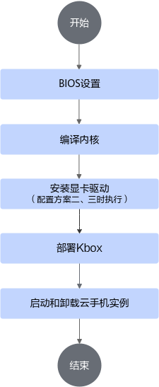

## 4 配置BIOS<a name="ZH-CN_TOPIC_0000002518385450" id="配置BIOS"></a>

### 4.1 内存插入顺序说明<a name="ZH-CN_TOPIC_0000002518385442"></a>

环境部署指定的服务器BIOS版本对内存的插入格式有限制。在进行BIOS设置之前，请确保内存插入格式如本章节提供的所示。

内存插入格式如[**图 1** 内存插入格式](#内存插入格式)所示。表格的每一行对应CPU的编号，每一列对应插入内存数量，分别根据插入内存的数量和CPU编号找到表格中对应的行和列，确定插入内存条的卡槽位置。

**图 1** 内存插入格式<a name="fig10693358191820"></a><a id="内存插入格式"></a>


### 4.2 （硬件配置方案一、二）配置BIOS<a name="ZH-CN_TOPIC_0000002549865263"></a>

本章节提供硬件配置方案一、二两种环境BIOS配置步骤，包括MISC、Performance、Memory和PCIe相关选项的配置，用以提高服务器性能。

**重启服务器进入BIOS设置界面<a name="section2017525320112"></a>**

1. 登录服务器远程管理平台。进入远程虚拟控制台，出现系统启动界面后，按下“Del”键或“F4”键。

    

2. 输入BIOS密码，即可进入BIOS设置界面。

    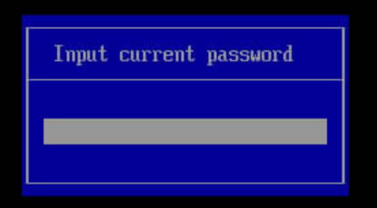

**配置MISC相关选项<a name="section131715818217"></a>**

配置MISC中的“Support Smmu”和“Support 44Bit”选项。

1. 在BIOS设置界面，依次选择“Advanced \> MISC Config”。

    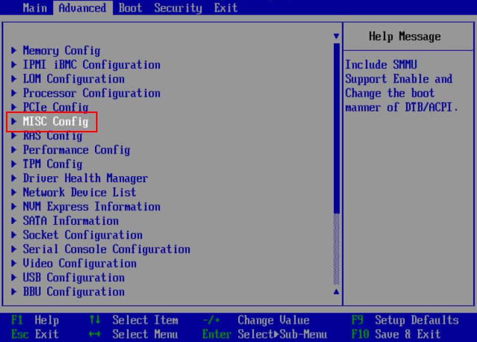

2. 进入MISC Config设置界面后，将“Support Smmu”选项设置为“Disabled”。

    

3. （硬件配置方案一）仅对于硬件配置方案一，需要将“Support 44Bit”选项设置为“Enabled”。

    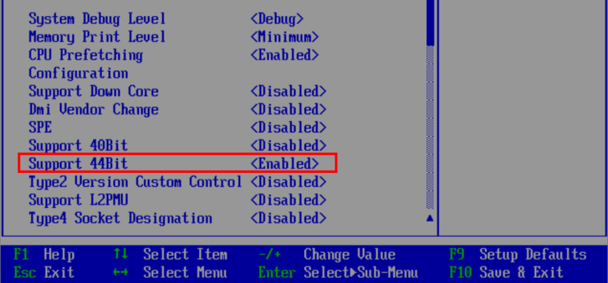

4. 保存并退出。

**配置Performance相关选项<a name="section18236319121"></a>**

1. 在BIOS设置界面，依次选择“Advanced \> Performance Config”。

    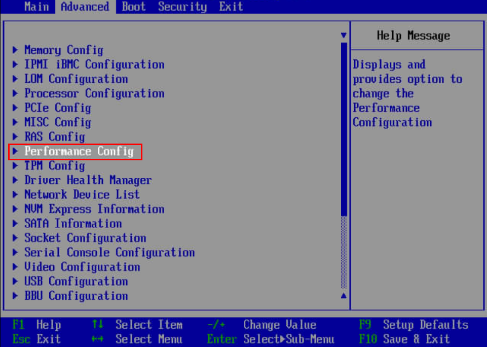

2. 进入Performance Config设置页面后，将“Power Policy”选项设置为“Performance”后保存并退出。

    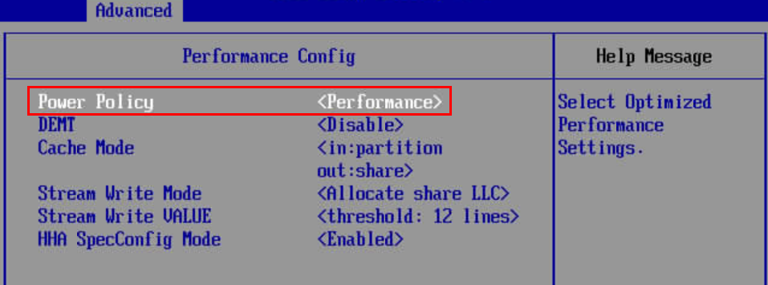

**配置Memory相关选项<a name="section2544330723"></a>**

配置Memory中的“Memory Frequency”和“Custom Refresh Rate”选项。

1. 在BIOS设置界面，依次选择“Advanced \> Memory Config”。
2. 进入Memory Config设置页面后，将“Memory Frequency”选项设置为“2933”，将“Custom Refresh Rate”选项设置为“Auto”后保存并退出。

    

**（硬件配置方案一，可选）配置PCIe相关选项<a name="section1053210511726"></a>**

使用硬件配置方案一并需要使能编码卡硬件解码功能时，需要通过配置PCIe选项，完成编码卡分叉选项的配置，使编码卡在不同应用场景中具有更好的性能和兼容性。

1. 在BIOS设置界面，依次选择“Advanced \> PCIe Config”。
2. 进入PCIe Config设置页面后，首先配置PCIe分叉选项：将NETINT编码卡Quadra所在Slot的分叉设置为“x4”后保存并退出BIOS配置。

    例如Quadra安装在Slot3时，需要将“Slot3 BandWidth Splitting”选项设置为“x4”。

    

3. 进入服务器OS系统，确认PCIe分叉功能是否实现，可以通过调用**nvme**命令来查看。

    1. NETINT编码卡使用NVMe协议，若环境未安装NVMe则需完成NVMe的安装。

        ```shell
        yum install nvme-cli
        ```

    2. 将卡插上后执行以下命令查看NETINT编码卡是否被正确识别。

        ```shell
        nvme list
        ```

        回显如下表示NETINT编码卡安装正确。该内容为回显示例，请以实际为准。

        ```shell
        Node          SN                   Model            Namespace Usage                    Format           FW Rev
        ------------- -------------------- ---------------- --------- ------------------------ ---------------- --------
        /dev/nvme0n1  Q2A325A11DC082-0454A QuadraT2A        1         8.59  TB /   8.59  TB    4 KiB +  0 B     48F6rKr1
        /dev/nvme1n1  Q2A325A11DC082-0454B QuadraT2A        1         8.59  TB /   8.59  TB    4 KiB +  0 B     48F6rKr1
        ```

    > **说明：** 
    >
    >- 1张NETINT Quadra卡有2颗芯片，对应2个设备节点。以上回显中为1张NETINT Quadra卡，对应2个设备节点。

### 4.3 （硬件配置方案三、四）配置BIOS<a name="ZH-CN_TOPIC_0000002518385436"></a>

本章节提供硬件配置方案三、四的环境BIOS配置步骤，包括MISC、Performance、Memory相关选项的配置，用以提高服务器性能。

**重启服务器进入BIOS设置界面<a name="section2017525320112"></a>**

1. 登录服务器远程管理平台。进入远程虚拟控制台，出现系统启动界面后，按下“Del”键或“F4”键。

    

2. 输入BIOS密码，即可进入BIOS设置界面。

    

**配置MISC相关选项<a name="section131715818217"></a>**

配置MISC中的“Support Smmu”选项。

1. 在BIOS设置界面，依次选择“Advanced \> MISC Configuration”。

    

2. 进入MISC Configuration设置界面后，将“Support Smmu”选项设置为“Disabled”后保存并退出。

    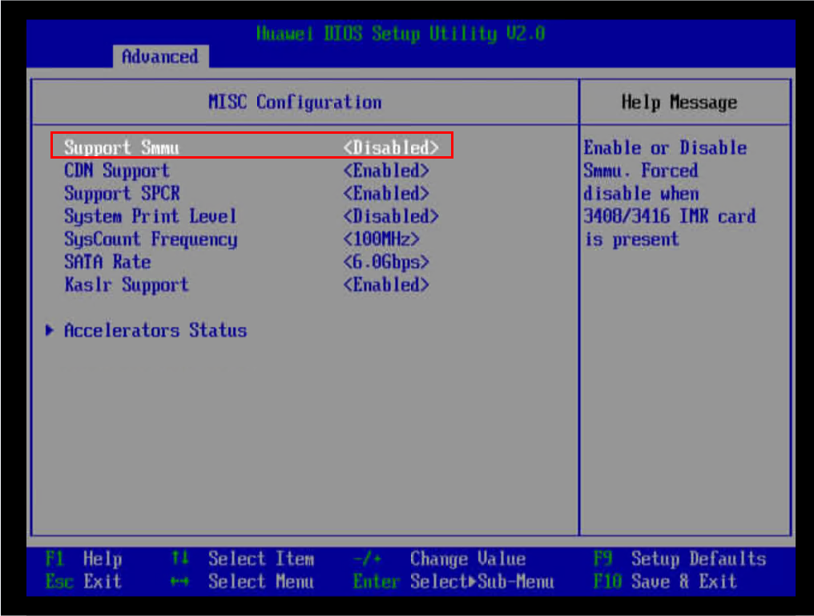

**配置Performance相关选项<a name="section18236319121"></a>**

1. 在BIOS设置界面，依次选择“Advanced \> Power And Performance Configuration”。

    

2. 进入Power And Performance Configuration设置页面后，将“Power Policy”选项设置为“Performance”后保存并退出。

    

**配置Memory相关选项<a name="section2544330723"></a>**

配置Memory中的“Memory Frequency”和“Custom Refresh Rate”选项。

1. 在BIOS设置界面，依次选择“Advanced \> Memory Configuration”。

    

2. 进入Memory Configuration设置页面后，硬件配置方案三将**Memory Frequency**选项设置为“4800”，配置方案四将**Memory Frequency**选项设置为“5200”，将**“Custom Refresh Rate”**选项设置为“Auto”后保存BIOS配置并退出设置界面。

    

## 5 网卡绑定CPU<a name="ZH-CN_TOPIC_0000002518225524"></a>

网络服务占用的CPU与容器绑定的CPU重叠时，会造成容器内CPU资源异常。为了避免这种情况出现，请将流量较大、负载较重的网卡绑定至空闲CPU。

> **说明：** 
>
>- 本节内容在每次服务器重启后，都需要重新执行。
>- 服务器上使用多张网卡时，每张网卡均需要进行如下步骤确认。

1. <a name="zh-cn_topic_0000001259692597_zh-cn_topic_0000001256733899_li189522054171512"></a>执行命令，查看网卡**pci设备号**。本文以网卡enp125s0f1为例进行说明。

    ```shell
    ethtool -i enp125s0f1 | grep bus-info | awk '{print $2}'
    ```

    回显如下所示，表示网卡enp125s0f1的pci设备号为0000:7d:00.1。

    ```shell
    0000:7d:00.1
    ```

2. 执行命令，查询网卡涉及的中断。

    命令中的${id_pci}为[1](#zh-cn_topic_0000001259692597_zh-cn_topic_0000001256733899_li189522054171512)中查到的网卡设备号。

    ```shell
    cat /proc/interrupts | grep "${id_pci}" | awk -F: '{print $1}'
    ```

    回显如下所示，表示网卡对应的中断为358、359。

    ```shell
    358
    359
    ```

    > **说明：** 
    >
    >若查询网卡涉及的中断时，回显包含多个中断号，则需要判断中断是否分散地绑在不同CPU上，根据判断结果来确定是否修改中断绑定的CPU。

3. 查询中断绑定在哪个CPU上，命令中的${break_value}为查询到的网卡中断号。

    ```shell
    cat /proc/irq/${break_value}/smp_affinity_list
    ```

    - 若中断是分散地绑在不同CPU上，且分散后网卡中断绑定的CPU与容器绑定的CPU不冲突，则可跳过本小节后续内容，不进行任何操作。
    - 若其中大部分集中在同一个CPU上或需要将占用CPU过高的网卡中断绑定到空闲CPU上，可根据[4](#zh-cn_topic_0000001259692597_zh-cn_topic_0000001256733899_li1667182211497)和[5](#zh-cn_topic_0000001259692597_zh-cn_topic_0000001256733899_li1985492711497)，将其绑定在预留的CPU（优先网卡所属的NUMA node CPU）上。

4. <a name="zh-cn_topic_0000001259692597_zh-cn_topic_0000001256733899_li1667182211497"></a>根据网卡的**pci设备号**，查看网卡所属的NUMA node。

    命令中的${id_pci}为网卡设备号，可通过本节内容的[1](#zh-cn_topic_0000001259692597_zh-cn_topic_0000001256733899_li189522054171512)进行查看。执行命令，回显中的NUMA node参数对应的值即为网卡所属的NUMA node。

    ```shell
    lspci -vvvs ${id_pci}
    ```

    回显如下所示，根据pci设备号查询得到的网卡enp125s0f1所属的NUMA node为0。

    ```shell
    7d:00.1 Ethernet controller: Huawei Technologies Co., Ltd. HNS GE/10GE/25GE Network Controller (rev 21)
            Control: I/O- Mem+ BusMaster+ SpecCycle- MemWINV- VGASnoop- ParErr- Stepping- SERR- FastB2B- DisINTx-
            Status: Cap+ 66MHz- UDF- FastB2B- ParErr- DEVSEL=fast >TAbort- <TAbort- <MAbort- >SERR- <PERR- INTx-
            Latency: 0
            NUMA node: 0
            Region 0: Memory at 121040000 (64-bit, prefetchable) [size=64K]
            Region 2: Memory at 120400000 (64-bit, prefetchable) [size=1M]
            Capabilities: [40] Express (v2) Endpoint, MSI 00
    ```

5. <a name="zh-cn_topic_0000001259692597_zh-cn_topic_0000001256733899_li1985492711497"></a>网卡中断绑定至预留CPU（优先网卡所属的NUMA node CPU）上。

    命令中的${break_1}、${break_2}依次为两个网卡中断的值。

    - 将中断${break_1}绑定至1 CPU。

        ```shell
        echo 1 > /proc/irq/${break_1}/smp_affinity_list
        ```

    - 将中断${break_2}绑定至2 CPU。

        ```shell
        echo 2 > /proc/irq/${break_2}/smp_affinity_list
        ```

    以网卡enp125s0f1为例，它对应的中断为358、359，绑定命令依次为：

    ```shell
    echo 1 > /proc/irq/358/smp_affinity_list
    echo 2 > /proc/irq/359/smp_affinity_list
    ```

    > **说明：** 
    >
    >查询得到网卡所属的NUMA node后，NUMA node对应的core区间可执行如下命令查看。
    >
    >```shell
    >lscpu
    >```
    >
    >如回显所示，NUMA node0其对应的core区间为0~31。
    >
    >```shell
    >NUMA node0 CPU(s):               0-31
    >NUMA node1 CPU(s):               32-63
    >NUMA node2 CPU(s):               64-95
    >NUMA node3 CPU(s):               96-127
    >```

## 6 （硬件配置方案一）配置GPU工作模式<a name="ZH-CN_TOPIC_0000002518225504"></a>

使用硬件配置方案一时将GPU卡工作模式设置为高性能模式，使GPU运行在最高频率，保持GPU性能最优。该操作每次系统重启都需重新配置一次。

执行如下命令设置GPU卡工作模式为高性能模式。

```shell
find /sys -name power_dpm_force_performance_level | xargs -I {} sh -c "echo high > '{}'"
```

## 7 编译内核<a name="ZH-CN_TOPIC_0000002518385448"></a>

### 7.1 编译准备<a name="ZH-CN_TOPIC_0000002518225520"></a>

Kbox云手机容器支持在openEuler 24.03 LTS SP1（对应内核版本6.6.0-72.0.0）操作系统下进行内核源码的编译。在编译开始前，请正确配置服务器的网络环境、软件源、并同步服务器系统时间，以便下载相关的编译依赖包。

> **说明：** 
>
>- 编译内核中涉及的内核配置与修改仅作为功能性参考，不建议使用鲲鹏BoostKit云手机参考方案作为商用方案。若选择使用鲲鹏BoostKit云手机参考方案需自行承担安全风险，客户或ISV在商用前请进行必要的安全评估。
>- openEuler操作系统的安装请参见[openEuler官方网站文档](https://docs.openeuler.openatom.cn/zh/docs/24.03_LTS_SP3/server/installation_upgrade/installation/installation_preparations.html)。

编译时请使用root账号登录和操作。

1. 禁用警告“your kernel does not support swap memory limit...”，并生效cgroup v2。

    修改“/etc/default/grub”文件，在“GRUB_CMDLINE_LINUX”配置项的末尾添加参数“cgroup_enable=memory swapaccount=1 systemd.unified_cgroup_hierarchy=1”。

    1. 查看现有配置。

        ```shell
        cat /etc/default/grub | grep "cgroup_enable=memory swapaccount=1 systemd.unified_cgroup_hierarchy=1"
        ```

    2. 当以上指令回显为空时，执行下述命令配置内核启动项。

        ```shell
        sed -i '/GRUB_CMDLINE_LINUX/s/\"$//' /etc/default/grub; sed -i '/GRUB_CMDLINE_LINUX/s/$/ cgroup_enable=memory swapaccount=1 systemd.unified_cgroup_hierarchy=1\"/' /etc/default/grub
        ```

    3. 查看修改结果。

        ```shell
        cat /etc/default/grub | grep "GRUB_CMDLINE_LINUX"
        ```

        示例回显如下，若启动参数中存在其他固有参数为正常现象。

        ```shell
        GRUB_CMDLINE_LINUX="cgroup_enable=memory swapaccount=1 systemd.unified_cgroup_hierarchy=1"
        ```

    4. 更新grub配置文件。

        ```shell
        grub2-mkconfig -o /boot/efi/EFI/openEuler/grub.cfg
        ```

    > **说明：** 
    >
    >该配置在系统重启后生效。重启步骤可以暂缓执行，待完成章节[编译并安装Kernel](#编译并安装Kernel)后一并进行重启操作。

2. 禁用SELinux。

    1. 配置SELinux。

        ```shell
        sed -i "s|^SELINUX=.*|SELINUX=disabled|g" /etc/selinux/config
        ```

    2. 查看修改结果。

        ```shell
        cat /etc/selinux/config | grep "^SELINUX="
        ```

        确认指令回显如下。

        ```shell
        SELINUX=disabled
        ```

    > **说明：** 
    >
    >- 若“/etc/selinux/config”文件不存在，则执行以下指令创建文件并写入SELinux规则。
    >
    > ```shell
    > echo "SELINUX=disabled" > /etc/selinux/config
    >    ```
    >
    >- 该配置在系统重启后生效。重启步骤可以暂缓执行，待完成章节[编译并安装Kernel](#编译并安装Kernel)后一并进行重启操作。

3. 启动多路Kbox容器时，主机侧文件访问量大，需调整用户可创建的inotify instances的上限。
    1. 查看现有配置。

        ```shell
        cat /etc/sysctl.conf | grep "fs.inotify.max_user_instances=8192"
        ```

    2. 当以上指令回显为空时，执行下述命令配置inotify instances的上限。

        ```shell
        echo "fs.inotify.max_user_instances=8192" >> /etc/sysctl.conf
        ```

    3. 查看修改结果。

        ```shell
        cat /etc/sysctl.conf | grep "fs.inotify.max_user_instances"
        ```

        确认回显如下。

        ```shell
        fs.inotify.max_user_instances=8192
        ```

    4. 使修改生效。

        ```shell
        sysctl -p
        ```

4. 安装基础依赖包。

    ```shell
    yum install -y make dpkg dpkg-devel openssl openssl-devel ncurses ncurses-devel bison flex bc libdrm build elfutils-libelf-devel patch gcc
    ```

    > **说明：** 
    >
    >如果安装过程中有获取包失败的情况，请根据提示中的网址，手动获取安装包进行安装，安装成功后，继续安装尚未安装的依赖包。

5. 安装Docker组件与lxcfs，并启动lxcfs服务，设置lxcfs为开机自启动。如已自定义安装Docker与lxcfs，可跳过此步骤。

    ```shell
    yum install -y docker lxc lxcfs lxcfs-tools 
    systemctl start lxcfs && systemctl enable lxcfs
    ```

    > **说明：** 
    >
    >如遇到lxcfs启动报错，请尝试重启服务，或者联系华为技术支持工程师协助解决。

6. Docker升级到24.0.0版本。若**yum**安装的Docker版本低于24.0.0版本，则需要升级版本。

    请参见[软件环境](#Kbox安卓容器环境搭建软件环境要求)中的下载链接，下载docker-24.0.0.tgz文件。在任意目录下，解压，并将二进制包中的文件拷贝到“/usr/bin”下。

    ```shell
    tar -xvf docker-24.0.0.tgz
    cp docker/* /usr/bin
    systemctl restart docker
    ```

7. （可选）（硬件配置方案二、三）容器密度较大时，由于需要处理loop设备，宿主机上的udev-worker进程可能有周期性CPU占用冲高现象，可通过以下命令禁用udev功能以规避。
    
    以下操作仅供参考，默认会在容器启动脚本中自动执行，无需手动执行。

    停止相关服务，以下指令服务器重启后需重新执行
    ```shell
    sudo systemctl stop systemd-udevd-control.socket
    sudo systemctl stop systemd-udevd-kernel.socket
    sudo systemctl stop systemd-udevd.service
    ```
    查看服务是否按照预期停止
    ```shell
    sudo systemctl status systemd-udevd-control.socket | grep 'Active:'
    sudo systemctl status systemd-udevd-kernel.socket | grep 'Active:'
    sudo systemctl status systemd-udevd.service | grep 'Active:'
    ```
    预期回显
    ```shell
    Active: inactive (dead) since ...
    ```

### 7.2 编译及安装内核<a name="ZH-CN_TOPIC_0000002549745269"></a>

#### 7.2.1 下载Kernel源码<a name="ZH-CN_TOPIC_0000002549865295"></a>

请参见该章节获取正确的内核源码版本并解压内核源码，为内核编译做准备。

1. 请参见[软件环境](#Kbox安卓容器环境搭建软件环境要求)中的下载链接获取Kernel源码文件kernel-6.6.0-72.0.0.zip，本地下载后上传至服务器的“/usr/src/kernels”目录，并解压内核源码。

    ```shell
    cd /usr/src/kernels
    unzip kernel-6.6.0-72.0.0.zip
    ```

2. 禁用本地版本号。

    ```shell
    cd /usr/src/kernels/kernel-6.6.0-72.0.0
    touch .scmversion
    ```

#### 7.2.2 合入内核补丁<a name="ZH-CN_TOPIC_0000002549865259"></a>

在内核源码目录中合入内核补丁，以适用于Kbox。

1. 创建目录，存放搭建环境需要的依赖包，并修改目录权限。

    ```shell
    mkdir ~/dependency
    chmod -R 700 ~/dependency
    ```

2. 解压Kbox-patches-AOSP15.zip，将Kbox-patches-AOSP15文件夹中的“patchForKernel”目录、“patchForExagear”目录上传至服务器的“~/dependency”目录下。请对上传文件、目录的权限进行合理配置，其他用户属组建议不配置写权限。
3. 拷贝转码补丁到内核源码目录。

    ```shell
    cp ~/dependency/patchForExagear/hostOS/0001-exagear-kernel-module.patch /usr/src/kernels/kernel-6.6.0-72.0.0
    ```

4. 拷贝内核补丁至内核源码目录。

    ```shell
    cp ~/dependency/patchForKernel/openEuler_24.03/kernel_6.6.0-72.0.0/*.patch /usr/src/kernels/kernel-6.6.0-72.0.0
    ```

5. 合入内核补丁。

    ```shell
    cd /usr/src/kernels/kernel-6.6.0-72.0.0
    for patch_name in *.patch; do echo $patch_name; patch -p1 < $patch_name; done
    ```

#### 7.2.3 编译及安装内核<a name="ZH-CN_TOPIC_0000002549865277"></a>

##### 7.2.3.1 生成并配置.config文件<a name="ZH-CN_TOPIC_0000002518385420"></a>

生成.config文件并进行内核编译选项的配置。该文件用于指定需要使能的功能和特性。

1. 拷贝“/boot”目录下的config文件到源码目录，并重命名为.config。

    > **说明：** 
    >
    >- 命令中的“/boot”目录下的config文件名称仅为示例，实际的文件名称要通过**uname -r**命令确认，拷贝的config文件版本要与操作系统的内核版本保持一致。
    >- 若“/boot”目录下不存在config-\`uname -r\`文件，可以将“/boot”目录下的任意一个config-前缀的文件拷贝至服务器的Kernel源码目录，并重命名为.config。

    ```shell
    cp /boot/config-`uname -r` /usr/src/kernels/kernel-6.6.0-72.0.0/.config
    ```

2. 生成.config文件。

    ```shell
    cd /usr/src/kernels/kernel-6.6.0-72.0.0/
    make menuconfig
    ```

3. 执行命令后，在出现的界面中选择“Load”，如图所示。

    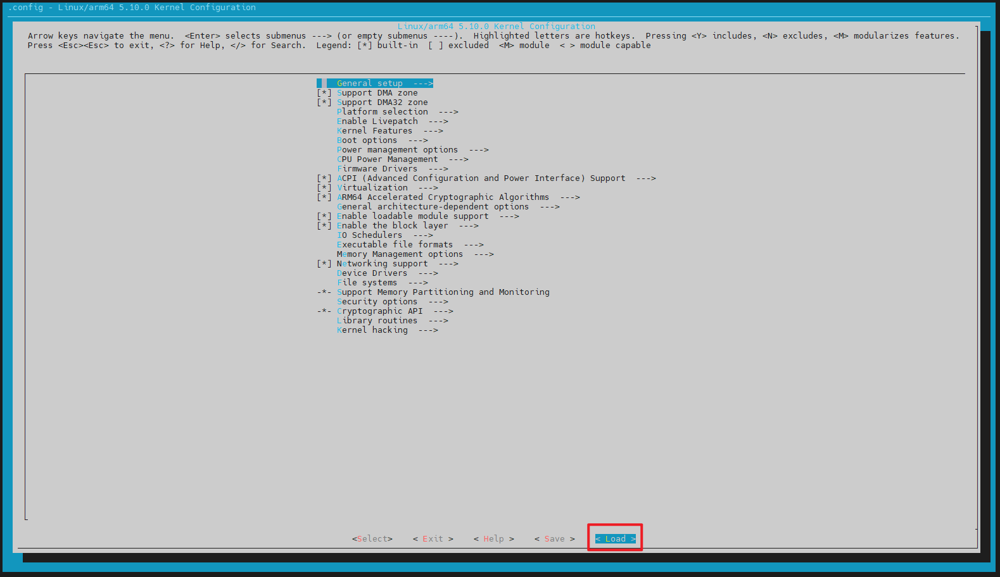

4. 出现如图所示的界面时，选择“OK”。

    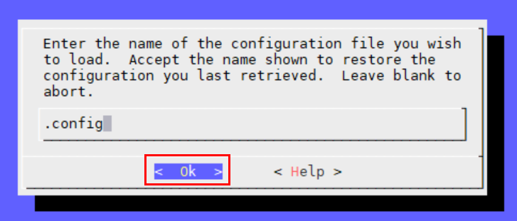

5. 配置内核编译选项。

    在出现如[**图 1** 内核配置界面](#内核配置界面)所示的内核配置界面中，进行内核编译选项的配置，具体配置项如[**表 1** 内核编译选项配置说明](#内核编译选项配置说明)所示。

    **图 1** 内核配置界面<a name="fig4732181117012"></a><a id="内核配置界面"></a>
    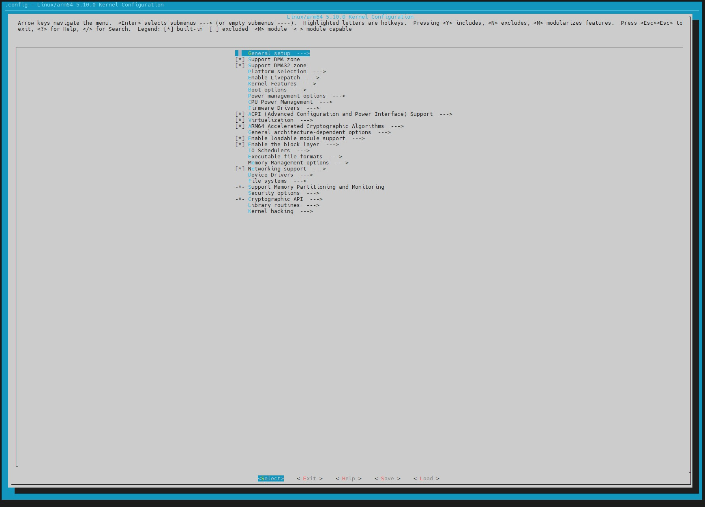

    **表 1** 内核编译选项配置说明<a id="内核编译选项配置说明"></a>

    |配置项|配置要求|配置结果对照|.config中显示的配置结果|
    |--|--|--|--|
    |KBOX|Y|[*] Kernel support for Kbox|CONFIG_KBOX=y|
    |ANDROID_BINDER_DEVICES|binder,hwbinder,vndbinder|(binder,hwbinder,vndbinder) Android Binder devices|CONFIG_ANDROID_BINDER_DEVICES="binder,hwbinder,vndbinder"|
    |HISI_PMU|M|\<M> HiSilicon SoC PMU drivers|CONFIG_HISI_PMU=m|
    |SYSTEM_TRUSTED_KEYS|清空内容|( ) Additional X.509 keys for default system keyring|CONFIG_SYSTEM_TRUSTED_KEYS=""|
    |DEBUG_INFO_DWARF4|N（回车进入Debug information，在选项中单击空格选择Disable debug information）|Debug information (Disable debug information)|# CONFIG_DEBUG_INFO_DWARF4 is not set|
    |PSI_DEFAULT_DISABLED|N|[  ] Require boot parameter to enable pressure stall information tracking|# CONFIG_PSI_DEFAULT_DISABLED is not set|

    **表 2** 使能f2fs内核编译选项配置说明<a id="使能f2fs内核编译选项配置说明"></a>

    |配置项|配置要求|配置结果对照|.config中显示的配置结果|
    |--|--|--|--|
    |CONFIG_F2FS_FS|Y|[\*] F2FS filesystem support|CONFIG_F2FS_FS=y|  

    如果要使能容器支持以f2fs文件格式启动，则还要进行上面内核编译选项的配置

    **表 3** （可选）使能nfs内核编译选项配置说明<a id="使能f2fs内核编译选项配置说明"></a>

    |配置项|配置要求|配置结果对照|.config中显示的配置结果|
    |--|--|--|--|
    |CONFIG_NFS_FS|M|[M] NFS client support|CONFIG_NFS_FS=m|
    |CONFIG_NFSD|M|[M] NFS server support|CONFIG_NFSD=m|
    |CONFIG_NFS_V4|M|[M] NFS client support for NFS version 4|CONFIG_NFS_V4=m|

    如果要使能容器支持以nfs挂载启动，则还要进行上面内核编译选项的配置。

    > **说明：** 
    >
    >配置方法说明：
    >- 键盘的上下左右键进行菜单导航。
    >- “Enter”键选择子菜单或编辑选中项内容。
    >- 连按2次“Esc”退出。
    >- “/”用于搜索。
    >- “Y”将选中项编译进内核，对应项显示为：\[\*\]。
    >- “N”将选中项排除，对应项显示为：\[\]。
    >- “M”键将选中的项编译成模块（编译成ko的形式），对应项显示为：<M\>。

    配置示例如下：

    1. 在配置界面，按“/”键打开搜索，输入“STAGING”，按回车进行确认，出现下图的搜索结果。

        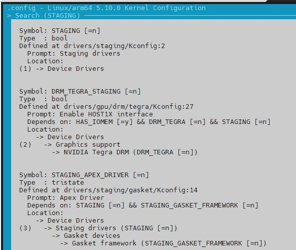

    2. 确认配置项的编号，如图中的“（1）”，按数字“1”进行选择。

        

    3. 按“y”键将选中项调整为编译进内核，然后使用左右键导航到“<Exit\>”，按“<Enter\>”确认返回。

        

    4. 返回到内核配置首页，进行下一项的配置。

6. 完成配置后，在内核配置首页选择，选择“Save”。

    

7. 出现如图所示的界面时，选择“Ok”。

    

8. 出现如图所示的界面时，选择“Exit”。

    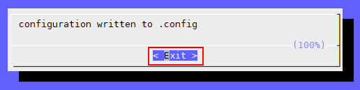

9. 执行完上述操作，进入如图所示的初始界面，选择“Exit”，当前文件夹下即可生成.config文件。

    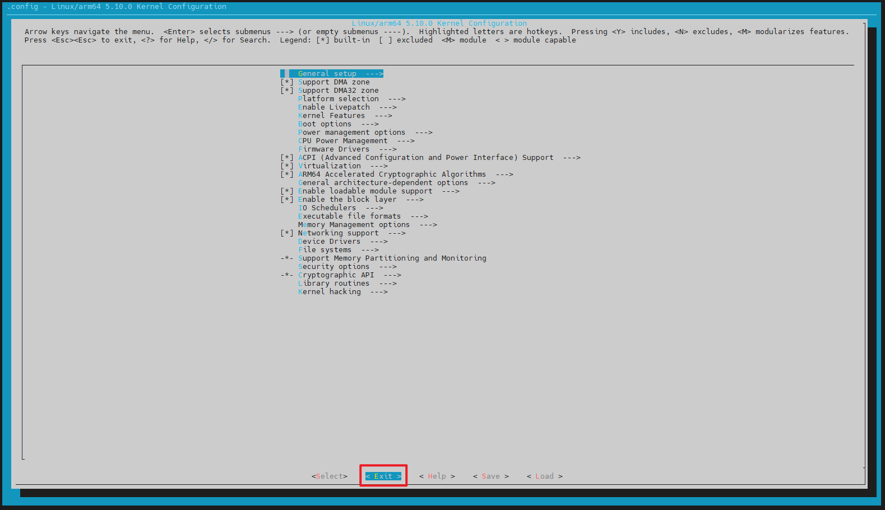

##### 7.2.3.2 编译并安装Kernel<a name="ZH-CN_TOPIC_0000002549745263" id="编译并安装Kernel"></a>

本章节描述了在openEuler 24.03 LTS SP1操作系统上编译和安装6.6.0-72.0.0版本内核的详细步骤。

1. <a name="zh-cn_topic_0000001505919657_zh-cn_topic_0000001373652281_zh-cn_topic_0000001259572633_zh-cn_topic_0000001212014022_li295103241"></a>编译内核。

    ```shell
    cd /usr/src/kernels/kernel-6.6.0-72.0.0
    make -j64
    ```

    > **说明：** 
    >
    >若编译过程中存在如下提示信息，则需要确保服务器系统时间为最新时间。
    >
    >```shell
    >make[2]: warning:  Clock skew detected.  Your build may be incomplete.
    >```
    >
    >执行**tzselect**命令，根据实际情况依次输入以下选项对应时区的数字，例如：Asia-\>Beijing-\>YES，执行完成后拷贝文件到“/etc/localtime”。
    >
    >```shell
    >tzselect
    >cp -f /usr/share/zoneinfo/Asia/Beijing /etc/localtime
    >```

2. 检查内核是否编译成功。

    可查看编译路径下是否生成vmlinux文件，有vmlinux文件生成，说明编译执行成功，再继续执行后续步骤；如未生成vmlinux文件，请检查编译是否报错并解决后重新执行[1](#zh-cn_topic_0000001505919657_zh-cn_topic_0000001373652281_zh-cn_topic_0000001259572633_zh-cn_topic_0000001212014022_li295103241)。

    ```shell
    ll vmlinux*
    ```

    回显如下三个文件时，表示编译成功。

    ```shell
    -rwxr-xr-x   1 root root 39495600 Dec  8 17:06 vmlinux
    -rw-r--r--   1 root root   214542 Dec  8 17:06 vmlinux.a
    -rw-r--r--   1 root root 49125656 Dec  8 17:06 vmlinux.o
    ```

3. 安装内核模块。

    ```shell
    make modules_install
    ```

4. 安装内核。

    ```shell
    make install
    ```

    > **说明：** 
    >
    >- 在安装内核前，请确保系统中没有安装dkms，否则可能会导致安装内核时出现报错信息：“Error! Bad return status for module build on kernel: ...”，解决方法如下：
    > 1. 查看系统中是否已安装dkms。
    >
    >        ```shell
    >        yum list installed | grep dkms
    >        ```
    >
    >        若该指令执行后出现回显，则表明已安装dkms。
    > 2. 删除dkms。
    >
    >        ```shell
    >        yum remove -y dkms
    >        ```
    >
    > 3. 重新安装内核。
    >
    >        ```shell
    >        make install
    >        ```
    >
    >- 在安装内核时，可能出现以下报错信息，此时需要重新执行**make install**以解决该问题。
    >
    > ```shell
    > dracut-install: Failed to find module 'uds' /lib/modules/6.6.0/kernel/drivers/block/uds.ko
    > dracut-install: Failed to find module 'kvdo' /lib/modules/6.6.0/kernel/drivers/block/kvdo.ko
    >    ```

5. 更新启动项。

    ```shell
    grub2-mkconfig -o /boot/efi/EFI/openEuler/grub.cfg
    ```

    设置启动内核为：openEuler \(6.6.0\) 24.03 \(LTS-SP1\)。

    ```shell
    grub2-set-default 'openEuler (6.6.0) 24.03 (LTS-SP1)'
    ```

    重启操作系统，新内核即可生效。

    ```shell
    reboot
    ```

6. 使用如下命令检查新内核版本，如果版本号仅显示**6.6.0**，则说明启动内核正确。

    ```shell
    uname -r
    ```

    > **说明：** 
    >
    >如果重启后未能进入新编译的内核，请在BIOS进入grub启动后选择新编译的内核进入系统，或者联系技术支持工程师协助解决。
    >如果重启后，amdgpu内核模块未能成功安装，可以使用**modprobe amdgpu**命令手动安装。

## 8 部署Kbox<a name="ZH-CN_TOPIC_0000002518225514"></a>

### 8.1 确定GPU拓扑结构<a id="确定GPU拓扑结构"></a>

本章节描述了如何在服务器上获取GPU渲染节点及其所属的NUMA节点的信息。

**硬件配置方案一<a name="section15510204125011"></a>**

1. <a name="li34656503552"></a>获取GPU渲染节点命令。

    ```shell
    ll /dev/dri/by-path/ | grep renderD
    ```

    回显示例如下。

    ```shell
    lrwxrwxrwx 1 root root 13 Oct 25 10:58 pci-0000:03:00.0-render -> ../renderD128
    lrwxrwxrwx 1 root root 13 Oct 25 10:58 pci-0000:83:00.0-render -> ../renderD129
    ```

    说明该服务器插了两张AMD GPU，渲染节点分别为renderD128，renderD129。

2. 查询NUMA节点命令。

    ```shell
    cat /sys/bus/pci/devices/0000\:XX\:00.0/numa_node 
    ```

    其中，指令中的“XX”应按[1](#li34656503552)中的实际回显IP地址进行修改。以回显renderD128为例，查询指令应为：

    ```shell
    cat /sys/bus/pci/devices/0000\:03\:00.0/numa_node
    ```

    回显如下所示。

    ```shell
    0
    ```

    该回显表明GPU渲染节点renderD128所在NUMA节点为0。

**硬件配置方案二、三、四<a name="section1941402516517"></a>**

查看GPU节点所属的NUMA节点。

```shell
lspci -vvv -d :0200 | grep NUMA
```

道客DC 1000每张单卡对应有4个GPU节点，以4\*道客DC 1000的配置为例，回显输出的每行和GPU节点（renderD节点，编号从128开始）顺序依次对应。示例回显如下：

```shell
NUMA node: 0
NUMA node: 0
NUMA node: 0
NUMA node: 0
NUMA node: 0
NUMA node: 0
NUMA node: 0
NUMA node: 0
NUMA node: 2
NUMA node: 2
NUMA node: 2
NUMA node: 2
NUMA node: 2
NUMA node: 2
NUMA node: 2
NUMA node: 2
```

当前回显表示/dev/dri/目录下的渲染节点renderD128~143中，renderD128~135属于NUMA0，renderD136~143属于NUMA2。

### 8.2 （硬件配置方案一，可选）升级NVMe固件版本<a name="ZH-CN_TOPIC_0000002549745271"></a>

该章节仅在使用硬件配置方案一，并且需要使能编码卡硬件解码功能时才需要执行。若不需要使能硬件解码则跳过该章节。

部署环境前，在确认编码卡是否被NVMe驱动正确识别的同时检查NVMe固件版本，若与本文档提供的版本不一致则需要进行固件版本升级。

1. 查看编码卡是否被NVMe驱动正确识别。

    ```shell
    nvme list
    ```

    回显如下说明识别正确。该内容为回显示例，请以实际为准。

    ```shell
    Node          SN                   Model            Namespace Usage                    Format           FW Rev
    ------------- -------------------- ---------------- --------- ------------------------ ---------------- --------
    /dev/nvme0n1  Q2A325A11DC082-0454A QuadraT2A        1         8.59  TB /   8.59  TB    4 KiB +  0 B     48F6rKr1
    /dev/nvme1n1  Q2A325A11DC082-0454B QuadraT2A        1         8.59  TB /   8.59  TB    4 KiB +  0 B     48F6rKr1
    ```

    如果固件版本（最右侧的FW Rev一栏）与4.8.F-Android15配套固件版本不一致，请参见以下步骤对编码卡上的固件进行升级。

    > **说明：** 
    >
    >NVMe固件版本比较的规则是：数字越大，字母越靠后，版本越新。

2. 请从**Quadra_V_XXX_.zip**（其中，XXX为版本号信息，仅做示例使用，下列步骤请按实际名称解压）中获取4.8.F-Android15固件升级包并升级固件**。**

    ```shell
    unzip Quadra_VXXX.zip
    cd Quadra_VXXX/
    tar -zxvf Quadra_FW_VXXX.tar.gz
    cd Quadra_FW_VXXX/
    chmod +x quadra_auto_upgrade.sh
    ./quadra_auto_upgrade.sh
    ```

    升级大约持续1分钟。

3. 升级完成后需重启系统生效。

    ```shell
    reboot
    ```

### 8.3 （硬件配置方案二、三、四）安装显卡驱动<a name="ZH-CN_TOPIC_0000002518385424"></a>

使用硬件配置方案二、三、四每次服务器重启后，都需要重新执行安装显卡驱动步骤。

1. 请参见[软件环境](#Kbox安卓容器环境搭建软件环境要求)获取VAGPU-25.03.01.01-RC13-A15.tgz，上传至“~/dependency/”目录，解压后获取显卡内核态驱动。

    ```shell
    cd ~/dependency/
    tar -zxvf VAGPU-25.03.01.01-RC13-A15.tgz
    ```

2. 安装显卡PCIe驱动。

    ```shell
    cd ~/dependency/VAGPU-25.03.01.01-RC13-A15/openEuler-6.6.0+/ko_fw
    insmod va_pci.ko
    ```

3. 将驱动包里的固件拷贝到系统的“/lib/firmware/”目录。

    ```shell
    cp rgx* /lib/firmware/
    ```

4. 安装显卡图形驱动。

    GPU驱动会为每个显卡节点启动一个kworker进程，道客DC 1000单卡有4个节点。为保障kworker进程性能，建议使用kworkerCores参数为每个kworker进程绑定CPU，kworkerCores参数依次表示每个显卡节点对应kworker进程的绑核。

    在安装显卡图形驱动绑核时，**请确保kworker进程绑定的CPU核和GPU渲染节点同属一个CPU片**。GPU渲染节点所属CPU片的查询方式请参见[确定GPU拓扑结构](#确定GPU拓扑结构)章节。

    以下绑核方式仅作为参考，请依据实际情况做出调整。

    硬件配置方案二（鲲鹏920 7260处理器 + 4\*道客DC 1000）：

    ```shell
    insmod va_gfx.ko kworkerCores=0,0,1,1,32,32,33,33,64,64,65,65,96,96,97,97
    ```

    硬件配置方案三（鲲鹏920 7280Z处理器 + 8\*道客DC 1000）：

    ```shell
    insmod va_gfx.ko kworkerCores=80,80,81,81,82,82,83,83,0,0,1,1,2,2,3,3,240,240,241,241,242,242,243,243,160,160,161,161,162,162,163,163
    ```

    硬件配置方案四（鲲鹏920 7260W处理器 + 8\*道客DC 1000）：

    ```shell
    insmod va_gfx.ko kworkerCores=64,64,65,65,66,66,67,67,0,0,1,1,2,2,3,3,192,192,193,193,194,194,195,195,128,128,129,129,130,130,131,131
    ```

5. 等待脚本执行完成，查看内核日志。

    ```shell
    dmesg | grep VAGPU | grep version
    ```

    回显信息中显卡内核态驱动版本号和显卡固件版本号相同，如下加粗内容，则表明显卡驱动安装完成。

    ```shell
    PVR_K:  28823: Meta firmware version: 1.18@6276027 build: release branch:  commit: 67e785a8 tag: VAGPU-25.03.01.01-RC13-A15
    ...
    ```

> **说明：** 
>
>更换驱动版本时，需要卸载驱动后重新安装其他版本驱动。
>
>1. 删掉所有的容器，解除对驱动的占用。
>2. 顺序卸载驱动。
>
> ```shell
> rmmod va_gfx
> rmmod va_pci
>    ```

### 8.4 上传ExaGear转码包<a name="ZH-CN_TOPIC_0000002549745297"></a>

使用脚本启动Kbox容器时，会自动根据“~/dependency”目录下的ExaGear转码包自动使能ExaGear转码功能，因此需要提前将ExaGear转码包上传到对应目录，若自动使能失败，则需要手动进行ExaGear转码使能。

1. 将ExaGear转码包（ExaGear_ARM32-ARM64.tar.gz）上传至“~/dependency”目录。请对上传文件、目录的权限进行合理配置，其他用户属组建议不配置写权限。
2. <a name="li178196349414"></a>解压转码包，并调整权限。

    ```shell
    cd ~/dependency/
    tar -xzvf ExaGear_ARM32-ARM64.tar.gz
    chown -R root:root ExaGear_ARM32-ARM64
    ```

    > **说明：** 
    >
    >“~/dependency”目录下只允许保留一份ExaGear转码包，旧版本的ExaGear转码包需要删除，否则在后续启动Kbox容器时会出现“Many ubt_a32a64 files exist!”报错。

一般情况下无需进行以下步骤。

仅当ExaGear转码未能成功自动使能时，请在解压转码包（即执行完[步骤2](#li178196349414)）后执行以下步骤，以手动使能ExaGear转码。

1. 挂载binfmt_misc文件系统。

    默认已挂载，如未挂载，请手动执行。

    ```shell
    mount -t binfmt_misc none /proc/sys/fs/binfmt_misc
    ```

2. 创建“/opt/exagear”目录，用于存放ubt_a32a64文件。

    ```shell
    mkdir -p /opt/exagear 
    chmod -R 700 /opt/exagear
    ```

3. 将ubt_a32a64文件拷贝至“/opt/exagear”目录。

    ```shell
    cp ~/dependency/ExaGear_ARM32-ARM64/ubt_a32a64 /opt/exagear/
    ```

4. 挂载注册ExaGear转码规则。

    ```shell
    echo ":ubt_a32a64:M::\x7fELF\x01\x01\x01\x00\x00\x00\x00\x00\x00\x00\x00\x00\x02\x00\x28\x00:\xff\xff\xff\xff\xff\xff\xff\x00\xff\xff\xff\xff\xff\xff\xff\xff\xfe\xff\xff\xff:/opt/exagear/ubt_a32a64:POCF" > /proc/sys/fs/binfmt_misc/register
    ```

5. 查看ExaGear规则是否注册成功，确保“/opt/exagear/ubt_a32a64”路径信息一致。

    ```shell
    cat /proc/sys/fs/binfmt_misc/ubt_a32a64
    ```

    显示如下信息时，表示已经成功注册。

    ```shell
    enabled 
    interpreter /opt/exagear/ubt_a32a64 
    flags: POCF 
    offset 0 
    magic 7f454c4601010100000000000000000002002800 
    mask ffffffffffffff00fffffffffffffffffeffffff
    ```
