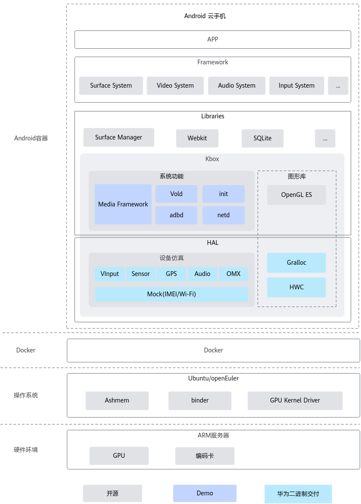
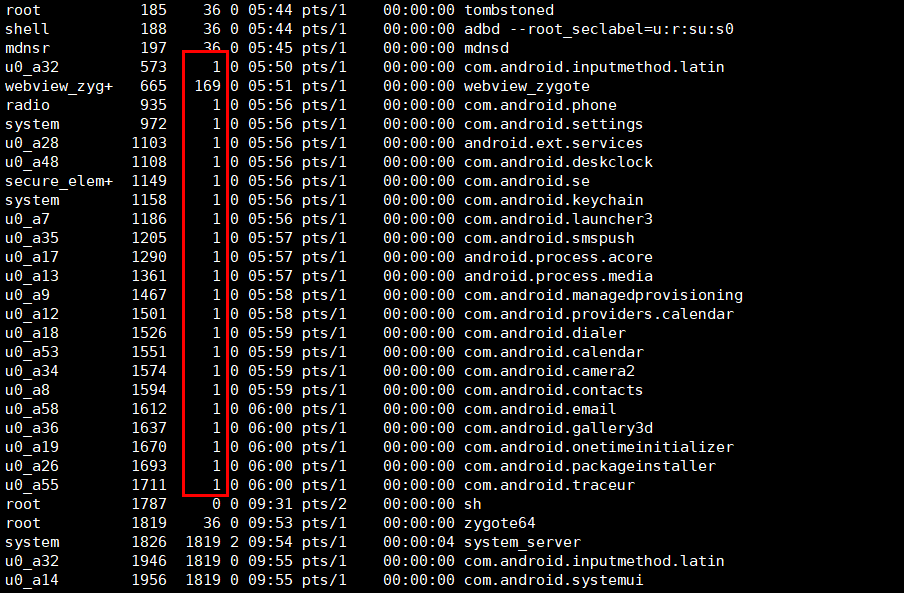
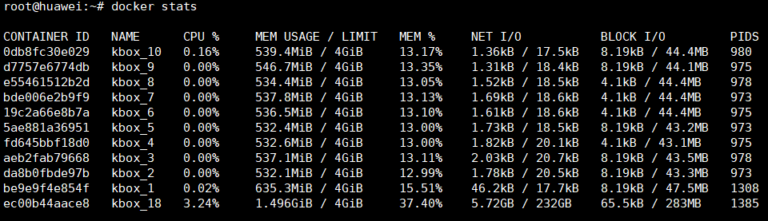
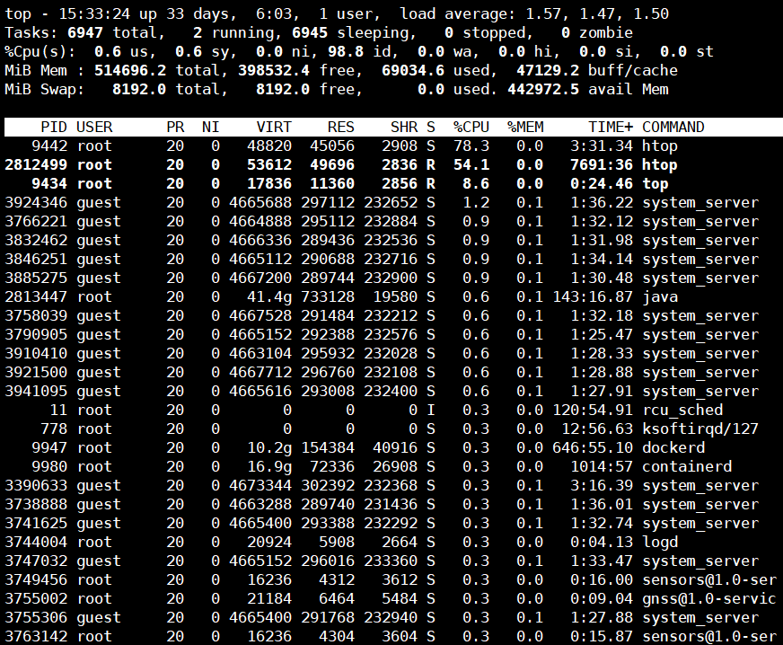
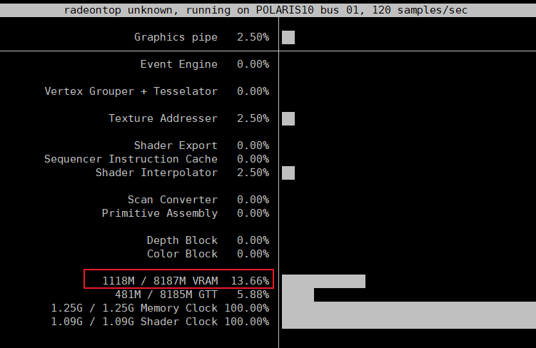
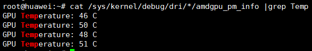
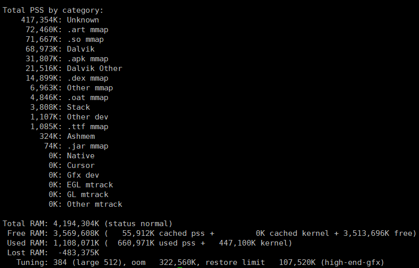

# 例行维护<a name="ZH-CN_TOPIC_0000002552775785"></a>

## 1 运维概述<a name="ZH-CN_TOPIC_0000002549705313"></a>

Kbox云手机容器是基于Docker容器技术，使能Android系统的虚拟化方案，通过云服务器提供云服务的虚拟手机。Kbox云手机容器可凭借自带的Android系统及厂商架设的网络终端，通过网络应用在云托管、云应用和云终端等业务场景。

Kbox云手机为满足高密度低成本的业务诉求，采用容器直通架构，基于容器的方法在Linux系统上启动完整Android系统。Kbox云手机容器架构图如[**图 1** Kbox云手机容器架构图](#Kbox云手机容器架构图)所示。

**图 1** Kbox云手机容器架构图<a name="fig4553133553919"></a><a id="Kbox云手机容器架构图"></a>


本文档主要用于描述Kbox云手机容器例行维护相关内容。

- 运维对象

    包括Kbox云手机容器及其运行环境的套件及其子部件。

- 运维功能

    提供对运维对象的巡检、监控、日志管理、高危操作和日常维护等能力。

## 2 巡检<a name="ZH-CN_TOPIC_0000002518185490"></a>

### 2.1 简介<a name="ZH-CN_TOPIC_0000002518185546"></a>

本章主要介绍对Kbox云手机容器及其运行环境的巡检操作，检查Kbox云手机容器部署环境，实时监控容器运行状况及其资源占用，及时发现并处理影响容器正常运行的问题，保证Kbox云手机容器稳定运行。

### 2.2 巡检项目和周期<a name="ZH-CN_TOPIC_0000002518345464"></a>

Kbox云手机容器巡检项目参考[**表 1** Kbox云手机容器巡检项目和周期](#Kbox云手机容器巡检项目和周期)。

**表 1** Kbox云手机容器巡检项目和周期<a id="Kbox云手机容器巡检项目和周期"></a>

|检查分类|检查项|巡检周期|
|--|--|--|
|Kbox云手机容器|容器状态，包括容器运行状态和容器内进程状态等。|运行时|
|Kbox云手机容器|容器资源消耗，如Kbox云手机容器使用的内存、CPU和存储等。|运行时|

### 2.3 检查容器状态<a name="ZH-CN_TOPIC_0000002549825335"></a>

#### 2.3.1 启动时容器状态<a name="ZH-CN_TOPIC_0000002518185466"></a>

启动Kbox云手机容器后，执行以下命令检查启动是否成功，其中“$\{index\}“为启动实例的编号。

```shell
docker exec -it kbox_${index} sh
getprop | grep boot
```

若回显信息中，sys.boot\_completed显示为“1“，则表示启动成功，否则，说明容器启动失败，请联系华为技术支持。回显示例如下。

```shell
[service.bootanim.exit]: [1]
[sys.boot.reason]: [reboot,factory_reset]
[sys.boot.reason.last]: [reboot]
[sys.boot_completed]: [1]
[sys.bootstat.first_boot_completed]: [1]
[sys.rescue_boot_count]: [1]
```

#### 2.3.2 运行时容器状态<a name="ZH-CN_TOPIC_0000002549825301"></a>

在Kbox云手机容器运行过程中，可通过检查其进程状态来判断容器是否正常。执行以下命令，其中“$\{index\}“为启动实例的编号。

```shell
docker exec -it kbox_${index} sh
ps -elf
```

若超过10个进程的父进程变为进程sh（进程号为1），如下图所示，则说明容器内发生了crash，容器当前处于异常情况，请重启容器或联系华为技术支持。



重启容器命令如下：

```shell
./android_kbox.sh restart ${index}
```

### 2.4 检查容器资源消耗<a name="ZH-CN_TOPIC_0000002549705259"></a>

在Kbox云手机容器运行的过程中，若需要及时掌握容器使用的系统资源，可以执行以下命令。

```shell
docker stats
```

上述命令可动态显示Kbox云手机容器使用的资源消耗情况，包括CPU使用率、内存使用率、网络I/O数据以及磁盘I/O数据等，如下图所示。



> **说明：** 
>CPU使用率和内存使用率超过总量的80%时，可能会出现容器反应卡顿的情况，此时建议清理后台应用。

## 3 监控<a name="ZH-CN_TOPIC_0000002549705277"></a>

### 3.1 简介<a name="ZH-CN_TOPIC_0000002518345484"></a>

本章主要介绍Kbox云手机容器在运行过程中对服务器系统资源消耗的监控方法，让用户及时了解系统资源使用情况、趋势和告警。

### 3.2 CPU使用详情<a name="ZH-CN_TOPIC_0000002518345436"></a>

在Kbox云手机容器运行过程中，可通过**top**命令查看系统中正在运行的进程的实时状态，包括各个进程的CPU占用率和内存消耗情况等，如下图所示。

```shell
top
```



通过该命令，可以监控Kbox云手机容器中是否有CPU占用率过高的进程，若有，则需要进一步排查该进程是否异常。

另外，还可通过**htop**命令更直观地显示CPU负载、内存消耗以及交换空间的实时信息。

```shell
htop
```

如下图所示，除CPU负载、内存消耗以及交换空间的实时信息外，还显示了任务、线程、平均负载及系统运行时间信息，最下方列出了系统中的进程信息。


> **说明：** 
>当Host OS为openEuler时，使用htop工具时需要先安装，安装命令如下。
>
>```shell
>yum install htop
>```

### 3.3 系统内存<a name="ZH-CN_TOPIC_0000002518185482"></a>

使用**free**命令可查询到服务器内存使用情况，包括实体内存、虚拟的交换文件内存、共享内存区域以及系统核心使用的缓冲区等。

```shell
free
```

回显示例如下。

```shell
                total        used        free      shared  buff/cache   available
Mem:        527039424     4531436   518860944        4860     3647044   519951396
Swap:        83888604           0    83888604
```

### 3.4 系统存储<a name="ZH-CN_TOPIC_0000002549705335"></a>

使用**df**命令可查看Kbox云手机容器运行环境上文件系统磁盘使用情况统计。

```shell
df -h
```

如下图所示Kbox云手机容器数据存储在“/root/mount/data/“下，红色矩形中为容器kbox\_1的数据存储信息，其存储大小为“16G“，当前使用率为“1%“。若“Use%“的值不大于85%，则磁盘空间使用率正常，否则需要清理磁盘空间。


### 3.5 GPU使用详情<a name="ZH-CN_TOPIC_0000002549705267"></a>

#### 3.5.1 AMD GPU状态查询<a name="ZH-CN_TOPIC_0000002518185500"></a>

**GPU使用状态<a name="section112831151115117"></a>**

使用radeontop工具可查看Kbox云手机容器运行环境上GPU使用状态。radeontop工具通过以下步骤下载并安装。

1. 获取radeontop工具包并上传到服务器。

    [获取链接](https://download-ib01.fedoraproject.org/pub/epel/8/Everything/aarch64/Packages/r/radeontop-1.4-2.el8.aarch64.rpm)

2. 安装命令如下。

    ```shell
    rpm -ivh radeontop-1.4-2.el8.aarch64.rpm
    ```

3. 编译或安装成功后执行以下命令查看GPU使用状态。

    ```shell
    radeontop
    ```

4. 如下图所示，VRAM一行表示显存使用率。

    

**GPU温度<a name="section115451839147"></a>**

在Kbox云手机容器运行过程中，若GPU温度过高，可能会导致服务器宕机的异常情况，因此在运行大型游戏或应用时，需要监控运行环境上GPU的温度。

在Kbox云手机容器运行环境上，可采用以下命令查询GPU温度。

```shell
cat /sys/kernel/debug/dri/*/amdgpu_pm_info |grep Temp
```

如下图所示为查询结果。若温度长期高于80°C，请联系华为技术支持。



#### 3.5.2 道客DC 1000状态查询<a name="ZH-CN_TOPIC_0000002518185532"></a>

使用GPU驱动包VAGPU-25.03.01.01-RC13-A15.tgz中提供的工具，以查看GPU状态。

1. 请参见《Kbox云手机容器 特性指南（Android 15）》文档中“软件部署”章节中的“[软件环境](https://www.hikunpeng.com/document/detail/zh/kunpengcps/cpturbokit/kboxcpc_ad15/kunpengcpskbox_20_0131.html)”小节获取VAGPU-25.03.01.01-RC13-A15.tgz包并解压，将解压获得的显卡工具包tools-3.2.2\_sp1.tgz上传至服务器。
2. 显卡工具包tools-3.2.2\_sp1.tgz的具体使用方法可以请参见tools-doc-3.2.2\_sp1.tgz压缩包中的说明文档。

## 4 日志管理<a name="ZH-CN_TOPIC_0000002518345474"></a>

### 4.1 简介<a name="ZH-CN_TOPIC_0000002518185510"></a>

本章主要介绍在Kbox云手机容器运行过程中的日志管理方法，包括日志查询、转储等。

### 4.2 Kbox云手机容器日志<a name="ZH-CN_TOPIC_0000002518345396"></a>

#### 4.2.1 容器元数据<a name="ZH-CN_TOPIC_0000002518345386"></a>

可使用Docker提供的**inspect**命令查看容器的详细信息，如下命令，其中“$\{index\}“为启动实例的编号。

```shell
docker inspect kbox_${index}
```

上述命令会以JSON数组的格式返回容器的所有元数据信息。多数情况下，只需要获取容器的特定数据信息，则可直接从JSON数据中截取需要的数据，如只获取容器的IP地址可使用如下命令。其他容器数据查询命令如[**表 1** 常用容器数据查询命令](#常用容器数据查询命令)所示。

```shell
docker inspect --format='{{range .NetworkSettings.Networks}}{{.IPAddress}}{{end}}' kbox_${index}
```

回显结果为本容器的IP地址信息。

**表 1** 常用容器数据查询命令<a id="常用容器数据查询命令"></a>

|查询项|命令|
|--|--|
|获取容器绑定的CPU|**docker inspect --format='{{.Name }} {{ .HostConfig.CpusetCpus }}' kbox_**|
|获取容器的内存大小（单位为字节）|**docker inspect --format='{{.Name }} {{ .HostConfig.Memory }}' kbox_**|

#### 4.2.2 容器内logcat日志<a name="ZH-CN_TOPIC_0000002549825243"></a>

当容器运行出现异常时，可以查询日志进行辅助定位。实时查询Kbox云手机容器的logcat日志，可执行如下命令，其中“$\{index\}“为启动实例的编号。

```shell
docker exec -it kbox_${index} logcat
```

若需要保存容器logcat日志，可执行如下命令，将日志保存到当前目录的“log.log“中。日志保存路径和名称可按照业务需要进行修改。

```shell
docker exec -it kbox_${index} logcat -d >> ./log.log
```

#### 4.2.3 容器内进程信息<a name="ZH-CN_TOPIC_0000002518345428"></a>

在Kbox云手机容器中可执行如下命令列出当前正在运行的进程信息，其中“$\{index\}“为启动实例的编号。

```shell
docker exec -it kbox_${index} ps -elf
```

#### 4.2.4 容器内top信息<a name="ZH-CN_TOPIC_0000002549825273"></a>

**top**命令是常用的性能分析工具，能够实时显示系统中各个进程的资源占用情况，在Kbox云手机容器中执行如下所示的**top**命令查询系统中进程的资源占用情况，其中“$\{index\}“为启动实例的编号。

```shell
docker exec -it kbox_${index} top
```

#### 4.2.5 ANR时应用堆栈信息<a name="ZH-CN_TOPIC_0000002549825251"></a>

在Kbox云手机容器内若出现了应用程序未响应（ANR，Application Not Responding）时，需要搜集相关应用堆栈信息，该信息保存在容器的“/data/anr/“路径下。

#### 4.2.6 dumpsys信息<a name="ZH-CN_TOPIC_0000002549825235"></a>

dumpsys是在Android设备上运行的工具，可提供有关系统服务的信息，执行如下命令获取容器的所有系统服务诊断输出，其中“$\{index\}“为启动实例的编号。

```shell
docker exec -it kbox_${index} dumpsys
```

上述命令执行后，输出的数据信息会比较多，一般情况下需要在命令中指定需要检查的服务。

- 获取dumpsys支持的系统服务完整列表可执行如下命令。

    ```shell
    docker exec -it kbox_${index} dumpsys -l
    ```

- 获取容器内存信息可执行如下命令。

    ```shell
    docker exec -it kbox_${index} dumpsys meminfo
    ```

    结果如下图所示。

    

#### 4.2.7 容器属性信息<a name="ZH-CN_TOPIC_0000002518345450"></a>

可通过**getprop**命令从Kbox云手机容器中读取属性信息，命令如下所示，其中“$\{index\}“为启动实例的编号。

```shell
docker exec -it kbox_${index} getprop
```

### 4.3 运行环境日志<a name="ZH-CN_TOPIC_0000002549705299"></a>

#### 4.3.1 dmesg日志<a name="ZH-CN_TOPIC_0000002549825261"></a>

Kbox云手机容器出现异常时，需要搜集dmesg日志以便进行问题定位。

dmesg日志中包含设备初始化日志、内核模块日志，还会记录应用崩溃的相关信息，对于后续根因分析和定位有很大帮助。

dmesg日志一般保存在服务器的“/var/log/“路径下，也可直接执行如下命令获取。

```shell
dmesg -T
```

### 4.4 维护工具<a name="ZH-CN_TOPIC_0000002518185564"></a>

#### 4.4.1 工具简介<a name="ZH-CN_TOPIC_0000002549825293"></a>

为增强云手机原型的可测试性、可服务性和可维护性，Kbox云手机容器提供了Kbox\_maintainer（维护工具）。该工具集成了日志收集、资源检查、故障恢复等多项功能，显著提升了云手机原型的整体性能。

> **说明：** 
>Kbox\_maintainer工具包含在Kbox\_AOSP15.zip中，Kbox\_AOSP15.zip的获取方式请参见《Kbox云手机容器 特性指南（Android 15）》文档中“软件部署”章节中的“[软件环境](https://www.hikunpeng.com/document/detail/zh/kunpengcps/cpturbokit/kboxcpc_ad15/kunpengcpskbox_20_0131.html)”小节。

#### 4.4.2 日志收集<a name="ZH-CN_TOPIC_0000002518345380"></a>

Kbox\_maintainer（维护工具）收集的日志信息包括Android日志和服务器日志，请参考[**表 1** Kbox\_maintainer日志收集](#Kbox_maintainer日志收集)。

**表 1** Kbox\_maintainer日志收集<a id="Kbox_maintainer日志收集"></a>

|日志类别|详情|
|--|--|
|Android日志|通过**logcat**命令收集日志缓存区中日志。|
|Android日志|收集ANR时的应用堆栈信息（/data/anr）。|
|Android日志|通过dumpsys activity，dumpsys meminfo，dumpsys input收集必要的dumpsys信息。|
|Android日志|通过**ps -a**收集进程信息。|
|Android日志|通过**getprop**收集系统属性信息。|
|服务器日志|收集/var/log目录下的syslog和kernel日志。|
|服务器日志|通过**dmesg -T**查看开机信息。|
|服务器日志|通过**docker stats/docker inspect**收集Docker相关日志。|

Kbox\_maintainer（维护工具）支持单个容器和全部容器日志收集，收集后打包。提供**log**命令字段，可通过容器号或容器名参数，收集指定容器的日志。不带容器号，默认收集所有容器日志。例如：

```shell
python3 kbox_maintainer.py log
python3 kbox_maintainer.py log kbox_1
```

> **说明：** 
>在使用日志收集功能时，如果收集日志时间过长，原因可能是“/var/log“下的日志过多导致的，可按需进行清理。

#### 4.4.3 资源检查<a name="ZH-CN_TOPIC_0000002518345418"></a>

Kbox\_maintainer（维护工具）提供资源检查功能，收集Kbox云手机容器及服务器的内存、CPU、存储和GPU等信息，单独查询某项信息时请参见[**表 1** Kbox\_maintainer资源检查](#Kbox_maintainer资源检查)详情中的命令（容器内运行相关命令即可），或者使用Kbox\_maintainer工具批量收集所有数据。

**表 1** Kbox\_maintainer资源检查<a id="Kbox_maintainer资源检查"></a>

|日志类别|详情（容器内运行相应命令）|
|--|--|
|内存信息|通过dumpsys meminfo命令获取。|
|CPU信息|通过top命令收集CPU占用率最高的前10个进程。|
|CPU信息|获取CPU基本信息（/proc/cpuinfo）。|
|存储信息|通过df -h获取存储使用率。|
|GPU信息|采用/sys/kernel/debug/dri/*/amdgpu_pm_info获取GPU温度。|
|GPU信息|通过lspci命令获取GPU PCI设备相关信息。|

Kbox\_maintainer（维护工具）支持单个容器和全部容器资源信息收集，收集后打包。提供**resource**命令字段，可通过容器号或容器名参数，收集指定容器的资源情况。不带容器号，默认收集所有容器资源情况。例如：

```shell
python3 kbox_maintainer.py resource
python3 kbox_maintainer.py resource kbox_1
```

#### 4.4.4 故障检查及恢复<a name="ZH-CN_TOPIC_0000002518185554"></a>

Kbox\_maintainer（维护工具）支持查看Kbox云手机容器的服务状态，用于云手机日常的巡检和恢复，请参考[**表 1** Kbox\_maintainer故障检查及恢复](#Kbox_maintainer故障检查及恢复)。

**表 1** Kbox\_maintainer故障检查及恢复<a id="Kbox_maintainer故障检查及恢复"></a>

|检查类别|详情|
|--|--|
|基础云手机状态|**getprop | grep sys.boot_completed**|

Kbox\_maintainer（维护工具）提供**check**命令字段，可通过容器号或容器名参数，检查指定容器的服务状态。不带容器号，默认检查所有容器状态。例如：

```shell
python3 kbox_maintainer.py check
python3 kbox_maintainer.py check kbox_1
```

Kbox\_maintainer（维护工具）提供**recover**命令字段，可通过容器号或容器名参数，恢复指定容器的服务状态。不带容器号，默认恢复所有容器状态。例如：

```shell
python3 kbox_maintainer.py recover
python3 kbox_maintainer.py recover kbox_1
```

## 5 高危操作<a name="ZH-CN_TOPIC_0000002549705289"></a>

### 5.1 禁用操作一览表<a name="ZH-CN_TOPIC_0000002518185474"></a>

暂无，如有疑问，请联系华为技术支持。

### 5.2 高危操作一览表<a name="ZH-CN_TOPIC_0000002549705241"></a>

风险操作由低到高等级划分如下：

- Minor：操作本身不会修改特性配置，但可能导致用户自定义的关键数据丢失的操作。
- Major：操作可能导致被管资源脱管或节点上承载的部分业务中断。
- Critical：操作可能导致全网大量业务中断。

服务器的硬件高危操作请参见[**表 1** 硬件类高危操作](#硬件类高危操作)，软件类高危操作请参见[**表 2** 软件类高危操作](#软件类高危操作)。

**表 1** 硬件类高危操作<a id="硬件类高危操作"></a>

|序号|高危操作描述|影响|风险等级|产品环境操作要求|测试环境操作要求|
|--|--|--|--|--|--|
|1|更换服务器部件|更换服务器部件需要严格按照操作指导执行，否则有可能导致功能异常甚至损坏硬件。|Critical|必须在客户同意的维测时段操作。必须由维护人员执行。必须得到客户的同意后才可操作。|必须由维护人员执行或得到其同意。|
|2|在CPLD升级过程中异常掉电|升级CPLD过程中AC掉电可能导致CPLD文件损坏，影响功能，需要重新升级恢复。|Critical|必须在客户同意的维测时段操作。必须由维护人员执行。必须得到客户的同意后才可操作。|必须由维护人员执行或得到其同意。|
|3|在BIOS升级过程中异常掉电|升级BIOS过程中AC掉电可能导致BIOS损坏，影响功能，需要重新升级恢复。|Critical|必须在客户同意的维测时段操作。必须由维护人员执行。必须得到客户的同意后才可操作。|必须由维护人员执行或得到其同意。|
|4|在iBMC升级过程中异常掉电|升级iBMC过程中AC掉电可能导致iBMC硬件损坏，影响服务器管理页面无法登录，需要重新更换iBMC硬件。|Critical|必须在客户同意的维测时段操作。必须由维护人员执行。必须得到客户的同意后才可操作。|必须由维护人员执行或得到其同意。|
|5|服务器上下柜操作|服务器上下柜操作必须严格遵守服务与维护指南，否则有可能损坏硬件，甚至导致操作人员受伤。|Critical|必须在客户同意的维测时段操作。必须由维护人员执行。必须得到客户的同意后才可操作。|必须由维护人员执行或得到其同意。|

**表 2** 软件类高危操作<a id="软件类高危操作"></a>

|序号|高危操作描述|操作入口|影响|风险等级|规避措施|产品环境操作要求|测试环境操作要求|
|--|--|--|--|--|--|--|--|
|1|在系统正常运行时主机上执行**service network restart**命令重启主机的网络进程。|登录主机系统，执行**service network restart**。|可能导致主机故障、业务发放失败、虚拟机启动失败。|Critical|无|必须在客户同意的维测时段操作。必须由维护人员执行。必须得到客户的同意后才可操作。|必须由维护人员执行或得到其同意。|
|2|在主机执行**ping -I**命令（指定网卡的**ping**命令）。|登录主机系统，执行**ping -I**命令。|通过指定网卡执行ping任务，可能导致主机网络中断。建议改为使用ping命令检查网络。|Critical|无|必须在客户同意的维测时段操作。必须由维护人员执行。必须得到客户的同意后才可操作。|必须由维护人员执行或得到其同意。|
|3|直接手动删除或者修改message日志文件。|登录主机系统，执行**rm**命令删除/var/log目录下message日志。|导致日志无法打印。|Critical|无|必须在客户同意的维测时段操作。必须由维护人员执行。必须得到客户的同意后才可操作。|必须由维护人员执行或得到其同意。|
|4|清除BIOS Flash上的用户自定义信息。|登录iBMC命令行界面，执行**ipmcset -d clearcmos**。|信息删除后无法恢复。|Critical|无|必须在客户同意的维测时段操作。必须由维护人员执行。必须得到客户的同意后才可操作。|必须由维护人员执行或得到其同意。|
|5|恢复iBMC出厂设置。|登录iBMC命令行界面，执行**ipmcset -d restore**。|恢复出厂后用户数据无法恢复。|Critical|无|必须在客户同意的维测时段操作。必须由维护人员执行。必须得到客户的同意后才可操作。|必须由维护人员执行或得到其同意。|
|6|修改服务器IP地址。|登录主机系统，执行**ifconfig**命令修改网卡IP地址。|该操作可能会影响主机的业务进程，影响当前业务操作。|Critical|无|必须在客户同意的维测时段操作。必须由维护人员执行。必须得到客户的同意后才可操作。|必须由维护人员执行或得到其同意。|
|7|执行**rm -rf**命令删除文件。|登录主机系统，删除主机中的文件或者商用发布包所需要的文件。|该操作可能会影响主机的业务进程和云手机业务。|Critical|无|必须在客户同意的维测时段操作。必须由维护人员执行。必须得到客户的同意后才可操作。|必须由维护人员执行或得到其同意。|

## 6 日常运维<a name="ZH-CN_TOPIC_0000002518345408"></a>

### 6.1 Docker信息查询<a name="ZH-CN_TOPIC_0000002549705323"></a>

**表 1** Docker信息查询<a id="Docker信息查询"></a>

|相关信息|查询命令|
|--|--|
|Docker软件信息|**docker info**|
|Docker容器相关信息|**docker inspect**|

### 6.2 Android信息查询<a name="ZH-CN_TOPIC_0000002518345374"></a>

**表 1** Android信息查询<a id="Android信息查询"></a>

|相关信息|查询命令|
|--|--|
|Android日志信息|**logcat**|
|Android进程信息|**ps -a**|
|Android堆栈信息|**ls /data/anr/**|
|Android系统属性|**getprop****cat /system/build.prop**|
|Android后台services信息|**service list**|
|Android bugreport工具报告|**bugreport**|
|Android dumpsys信息|**dumpsys**|

### 6.3 服务器信息查询<a name="ZH-CN_TOPIC_0000002549705233"></a>

**表 1** 服务器信息查询<a id="服务器信息查询"></a>

|相关信息|查询命令|
|--|--|
|服务器操作系统版本信息|**cat /etc/os-release**|
|主机系统内核版本|**uname -r**|
|NUMA信息|**numactl**|
|PCI设备信息|**lspci**|
|CPU信息|**lscpu****cat /proc/cpuinfo**|
|内存使用情况|**free****cat /proc/meminfo**|
|硬盘存储情况|**df -h****cat /proc/loadavg****cat /proc/partitions**|
|系统运行时间负载|**uptime**|
|进程相关信息|**top****ps**|
|IO相关信息|**cat /proc/iomem****cat /proc/ioports**|
|系统log信息|**/var/log/**|
|系统环境变量|**env**|
|开机信息|**dmesg -T**|
|网络状态检查|**ifconfig****ping****netstat****tcpdump**|

>  **说明：** 
> 当Host OS为openEuler 22.03时，联网游戏场景需要打开防火墙的某些端口（端口号由游戏厂商定义，如王者荣耀使用的端口为50012)，否则会出现网络异常无法登录游戏的情况。防火墙配置方法如下。
>
> 1. 启用50012端口，用于王者荣耀。
>
>    ```shell
>    firewall-cmd --zone=public --add-port=50012/tcp --permanent
>    ```
>
> 2. 重新加载防火墙配置。
>
>    ```shell
>    firewall-cmd --reload
>    ```
>

## 7 参考信息<a name="ZH-CN_TOPIC_0000002549825283"></a>

### 7.1 性能指标参考<a name="ZH-CN_TOPIC_0000002549825325"></a>

**表 1** Kbox云手机容器性能指标参考<a id="Kbox云手机容器性能指标参考"></a>

|序号|性能分类|关键性能指标|参考值|
|--|--|--|--|
|1|Kbox云手机容器性能|容器启动时间|反复启动单个Kbox云手机容器100次，观察容器启动时间，容器的启动时间稳定，无异常时长。|
|1|Kbox云手机容器性能|按照满规格路数，启动Kbox云手机容器3次，观察每一路的启动时间，容器的启动时间稳定，无异常时长。|
|1|Kbox云手机容器性能|APP启动时间|启动退出酷狗音乐1000次，记录每一次的启动时间，启动时间保持稳定，无异常数值。|
|1|Kbox云手机容器性能|CPU占用|运行酷狗音乐30min，观察容器的CPU占用，容器的CPU占用无异常，不持续快速增长。|
|1|Kbox云手机容器性能|内存占用|运行酷狗音乐30min，观察容器的内存占用，容器的内存占用无异常，不持续快速增长。|
|1|Kbox云手机容器性能|内存占用|连续安装卸载酷狗音乐30次，观察容器的内存占用，容器的内存占用无异常，不持续快速增长。|
|1|Kbox云手机容器性能|存储占用|运行酷狗音乐30min，观察容器的存储占用，容器的存储占用无异常，不持续快速增长。|
|1|Kbox云手机容器性能|存储占用|连续安装卸载酷狗音乐30次，观察容器的存储占用，容器的存储占用无异常，不持续快速增长。|
|2|服务器性能|CPU占用|满密度规格路数的Kbox云手机容器同时运行酷狗音乐10min，观察服务器的CPU占用数据走势，服务器的CPU占用符合预期，无异常性能数据增长。|
|2|服务器性能|GPU占用|满密度规格路数的Kbox云手机容器同时运行酷狗音乐10min，观察服务器的GPU占用数据走势，服务器的GPU占用符合预期，无异常性能数据增长。|
|2|服务器性能|GPU温度|满密度规格路数的Kbox云手机容器同时运行酷狗音乐10min，观察服务器的GPU温度数据走势，服务器的GPU温度符合预期，无异常性能数据增长。|
|2|服务器性能|内存占用|满密度规格路数的Kbox云手机容器同时运行酷狗音乐10min，观察服务器的内存占用数据走势，服务器的内存占用符合预期，无异常性能数据增长。|
|3|稳定性|APP安装卸载成功率|单路Kbox云手机容器安装卸载酷狗音乐1000次，成功率不低于99.9%。|
|3|稳定性|APP打开关闭成功率|单路Kbox云手机容器打开关闭酷狗音乐1000次，成功率不低于99.9%。|
|3|稳定性|容器启动删除成功率|启动删除满密度规格路数的Kbox云手机容器100次，成功率不低于99.9%。|
|3|稳定性|容器启动、连接、断连和删除交叉操作|按照满规格路数，启动、连接Kbox云手机容器，重启Kbox云手机容器50次，成功率100%，并能够成功删除所有Kbox云手机容器。|
|3|稳定性|容器启动、连接、断连和删除交叉操作|按照满规格路数，启动、连接Kbox云手机容器，重启、连接Kbox云手机容器100次，成功率不低于99.9%。|
|3|稳定性|容器连接断连成功率|按照满规格路数，连接断连Kbox云手机容器100次，成功率不低于99.9%。|
|3|稳定性|VInput设备接收事件成功率|按照满规格路数，同时向Kbox云手机容器的鼠标、触控设备、手柄1和手柄2发送某事件的按下与弹起1000次，验证均能成功收到。|
|3|稳定性|容器7*24小时稳定运行|按照满规格路数，Kbox云手机容器同时运行酷狗音乐7*24小时，Kbox云手机容器性能指标正常，服务器性能指标正常，且运行7*24小时后没有花屏、灰屏、绿屏、卡顿、无响应或闪退等问题。|
|4|压力负载测试|容器运行情况|按照满规格路数，Kbox云手机容器安装并打开酷狗音乐，持续运行30min，酷狗音乐安装并打开成功，且运行30min后没有花屏、灰屏、绿屏、卡顿、无响应或闪退等问题。|
