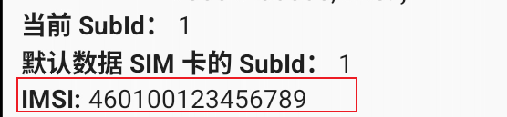
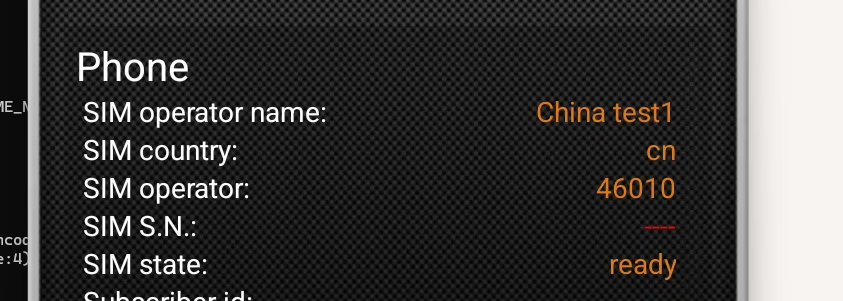
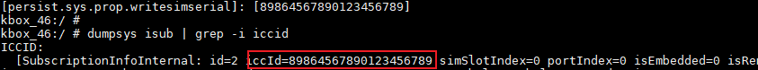

# 用户指南<a name="ZH-CN_TOPIC_0000002521735840"></a>

## 启动和卸载云手机实例<a name="ZH-CN_TOPIC_0000002518225838"></a>

### 挂载安卓镜像<a name="ZH-CN_TOPIC_0000002549865629"></a>

华为镜像仓提供的官方Kbox Demo镜像不包含Android Kbox二进制，所以使用该镜像无法正常启动容器。用户使用该Demo镜像时，需要下载Android Kbox二进制到本地，并使用脚本制作可正常启动的Kbox原始镜像。

**表 1** 镜像的获取方式与使用<a id="镜像的获取方式与使用"></a>

|镜像名称+tag|获取方式|使用方法|
|--|--|--|
|用户自行编译|用户自行编译|请参见章节自行编译，已包含Android Kbox二进制，容器可正常启动。|
|kbox:demo|华为镜像仓提供的官方Kbox Demo镜像|不包含Android Kbox二进制，容器无法正常启动，需要执行制作Kbox镜像：合入商用二进制步骤。|
|kbox:origin|使用脚本制作|基于kbox:demo和Android Kbox二进制制作的镜像，容器可以正常启动。|

**Kbox Demo镜像挂载<a name="section16531422174717"></a>**

上传Kbox Demo镜像包至“\~/dependency“目录（本文以此目录作为示例，用户可自行设置目录），并挂载。

镜像的名称和tag可以自行定义，格式为“\{名称\}:\{tag\}”，此处设置镜像名为kbox:demo。

> **说明：** 
>镜像名以及tag名中只可包含数字与字母，镜像名的首字符必须为小写字母或数字。

```shell
cd ~/dependency
docker import android.tar kbox:demo
```

**制作Kbox镜像：合入商用二进制<a name="section8328138123920"></a>**

> **说明：** 
>用户使用华为镜像仓提供的官方Kbox Demo镜像时，需要通过该小节的操作确保镜像中包含Android Kbox二进制。
>当用户使用自行编译的镜像时：
>
>- 硬件配置方案一：可跳过该小节的全部步骤。
>- 硬件配置方案二、三：可跳过该小节的步骤2。

1. 解压Kbox-AOSP15.zip，将Kbox-AOSP15文件夹中的“deploy\_scripts“目录上传至服务器的“\~/dependency“目录。
2. 上传Android Kbox二进制文件包BoostKit-boostcph-kbox\_\*\_15.zip到“\~/dependency/deploy\_scripts“目录。
3. （硬件配置方案二、三）使用硬件配置方案二、三时需要解压显卡驱动压缩包VAGPU-25.03.01.01-RC13-A15.tgz，获取va\_driver.tgz，上传到服务器的“\~/dependency/deploy\_scripts“目录。
4. 制作包含Android Kbox二进制的Kbox镜像，其中kbox:demo为上一步导入的官方Kbox Demo镜像，kbox:origin为包含Android Kbox二进制的新镜像。
    - 硬件配置方案一：

        ```shell
        cd ~/dependency/deploy_scripts
        chmod +x make_image_aosp15.sh
        ./make_image_aosp15.sh kbox:demo kbox:origin
        ```

    - 硬件配置方案二、三：

        ```shell
        cd ~/dependency/deploy_scripts
        chmod +x make_image_aosp15.sh
        ./make_image_aosp15.sh kbox:demo kbox:origin va_driver.tgz
        ```

华为镜像仓提供的官方Kbox Demo镜像不包含Android Kbox二进制，所以使用该镜像无法正常启动容器。用户使用该Demo镜像时，需要下载Android Kbox二进制到本地，并使用脚本制作可正常启动的Kbox原始镜像。

### 启动与卸载云手机实例<a name="ZH-CN_TOPIC_0000002518225854"></a>

启动云手机实例路径下应存在kbox\_config.cfg配置文件。容器会使用该文件中的配置，因此使用时应确保kbox\_config.cfg配置文件中的配置正确。若启动路径下无该配置文件，云手机将禁止启动。

通过修改中如[**表 1** kbox\_config.cfg配置文件中容器使用的GPU、CPU以及数据卷存放路径配置说明](#kbox_config.cfg配置文件中容器使用的GPU、CPU以及数据卷存放路径配置说明)所示的map中对应路数的值来选择该路容器使用的GPU、CPU以及数据卷存放路径，灵活配置云手机使用的资源，使性能达到最优。

**表 1** kbox\_config.cfg配置文件中容器使用的GPU、CPU以及数据卷存放路径配置说明<a id="kbox_config.cfg配置文件中容器使用的GPU、CPU以及数据卷存放路径配置说明"></a>

|参数名称|参数说明|配置说明|
|--|--|--|
|KBOX_GPU_MAP（硬件配置一）KBOX_VA_GPU_MAP（硬件配置二、三）|通过修改map中对应路数的值来选择该路容器使用的GPU。|KBOX_GPU_MAP列表里的第一个代表编号为1的Kbox云手机，分配的GPU节点是/dev/dri/renderD128，根据，renderD128节点属于NUMA0，因此鲲鹏920 7260处理器NUMA0对应的KBOX_CPUSET_MAP里配置的CPU核心取值范围应为0~31。KBOX_VA_GPU_MAP列表里的第一个代表编号为1的Kbox云手机，分配的GPU节点是/dev/dri/renderD128，根据，renderD128~135属于NUMA0，因此对于鲲鹏920 7260处理器NUMA0对应的KBOX_CPUSET_MAP里配置的CPU核心取值范围应为0~31。鲲鹏920 7280Z处理器NUMA0对应的KBOX_CPUSET_MAP里配置的CPU核心取值范围应为0~79。|
|KBOX_CPUSET_MAP|通过修改map中对应路数的值来选择该路容器使用的CPU。|KBOX_GPU_MAP列表里的第一个代表编号为1的Kbox云手机，分配的GPU节点是/dev/dri/renderD128，根据，renderD128节点属于NUMA0，因此鲲鹏920 7260处理器NUMA0对应的KBOX_CPUSET_MAP里配置的CPU核心取值范围应为0~31。KBOX_VA_GPU_MAP列表里的第一个代表编号为1的Kbox云手机，分配的GPU节点是/dev/dri/renderD128，根据，renderD128~135属于NUMA0，因此对于鲲鹏920 7260处理器NUMA0对应的KBOX_CPUSET_MAP里配置的CPU核心取值范围应为0~31。鲲鹏920 7280Z处理器NUMA0对应的KBOX_CPUSET_MAP里配置的CPU核心取值范围应为0~79。|
|KBOX_MOUNT_MAP|通过修改map中对应路数的值来选择该路容器使用的数据卷存放路径。|无|

> **说明：** 
>为确保Kbox云手机的稳定运行与最佳性能，请保障每个容器所绑定的CPU物理核和GPU渲染节点同属于一个CPU片。

Kbox云手机容器支持使能图形加速层，通过修改kbox\_config.cfg配置文件中的“ENABLE\_RENDER\_LAYER”为1进行使能。打开“\~/dependency/deploy\_scripts“路径下的“kbox\_render\_accelerating\_configuration.xml”配置文件，对应用的图形加速层功能进行配置。具体配置项描述请参见《[视频流引擎 特性指南（Android 15）](https://www.hikunpeng.com/document/detail/zh/kunpengcps/cpturbokit/videostreamengine_ad15/kunpengcpsvideo_20_0013.html)》中的“图形加速层配置项”章节。首次启动云手机容器后，若需要修改图形加速层功能的配置，修改配置文件中应用对应的配置，手动将其拷贝到云手机容器“/data/local/tmp“路径，重启应用生效。

1. 解压Kbox-AOSP15.zip，将Kbox-AOSP15文件夹中的“deploy\_scripts“目录上传至服务器的“\~/dependency“目录。
2. 通过android\_kbox\_aosp15.sh脚本启动容器。

    ```shell
    cd ~/dependency/deploy_scripts
    chmod +x android_kbox_aosp15.sh
    ./android_kbox_aosp15.sh start {镜像名称：tag}  ${index1}    
    ```

    Kbox基础云手机的默认配置信息如[**表 2** Kbox基础云手机的默认配置信息](#Kbox基础云手机的默认配置信息)所示。

    **表 2** Kbox基础云手机的默认配置信息<a id="Kbox基础云手机的默认配置信息"></a>

    |配置项|Kbox基础云手机|
    |--|--|
    |场景|移动办公/托管|
    |vCPUs|2|
    |绑核策略|2容器/2核|
    |内存|6GB|
    |系统存储|16GB|
    |分辨率|720*1280|

    启动脚本使用示例：启动一个编号为1的实例。

    ```shell
    ./android_kbox_aosp15.sh start kbox:origin  1
    ```

    > **说明：** 
    >- 启动容器的过程中可能会出现“writing syncT "procError"”、“exec /system/bin/chmod: no such file”等类似报错，该类报错不影响正常功能，忽略即可。
    >- 启动容器时，指定的$\{index1\}对应容器绑定的端口，例如index1=10时，对应使用端口8010/8510。在启动时需要确保对应的端口没有被占用。
    >- 可以通过以下指令查询Kbox内核动态开关状态。
    >
    > ```shell
    > cat /sys/kernel/kbox/kbox_enable
    >    ```
    >
    > 回显为“1“，表示Kbox内核动态开关为打开状态；回显为“0“，表示Kbox内核动态开关为关闭状态。
    > 若查询发现Kbox内核动态开关为关闭状态，请通过以下指令手动打开该开关。
    >
    > ```shell
    > echo 1 > /sys/kernel/kbox/kbox_enable
    >    ```

3. 执行如下命令确认Kbox容器是否启动成功，其中“$\{index\}“为启动实例的编号。

    ```shell
    docker exec -it kbox_${index} getprop | grep boot_completed
    ```

    若回显信息中的sys.boot\_completed显示为“1“，则启动成功。

4. 停止并删除Kbox容器的方法。

    由于Kbox方案默认挂载数据卷，默认的**docker stop**、**docker rm**命令不能彻底清理容器数据，需要使用脚本彻底清理主机侧文件。

    使用android\_kbox\_aosp15.sh脚本，停止并删除正在运行的Kbox容器。

    停止并删除编号为_$\{index\}_的容器。

    ```shell
    ./android_kbox_aosp15.sh delete ${index}
    ```

5. 重启Kbox容器的方法。

    由于Kbox方案默认挂载数据卷，在重启容器时，无法使用默认的**docker restart**命令进行重启，需要使用脚本执行容器的重启操作。

    使用android\_kbox\_aosp15.sh脚本重启Kbox容器。

    重启编号为_$\{index\}_的容器。

    ```shell
    ./android_kbox_aosp15.sh restart ${index}
    ```

启动云手机实例路径下应存在kbox\_config.cfg配置文件。容器会使用该文件中的配置，因此使用时应确保kbox\_config.cfg配置文件中的配置正确。若启动路径下无该配置文件，云手机将禁止启动。

### 查询版本号信息<a name="ZH-CN_TOPIC_0000002518225866"></a>

本章节提供两种获取Kbox组件版本信息，通过软件包查询和通过命令查询版本号信息。

方法一：通过获取的软件包查询版本号信息。

请参见[软件环境](compile_guide.md#Kbox安卓镜像编译构建软件环境要求)中获取并解压BoostKit-boostcph-kbox\_\*\_15.zip，通过查询kbox\_version.txt文件，确认当前软件包的版本号。

```shell
unzip BoostKit-boostcph-kbox_*_15.zip
unzip Kbox-BoostKit-boostcph-kbox_*_15.zip
cat ./products/kbox_version.txt
```

回显信息即为Kbox版本号信息，示例如下。

```shell
Product Name: Kunpeng BoostKit
Product Version: 25.3.0
Component Name: BoostKit-boostcph-kbox
Component Version: 7.3.0
Component AppendInfo: 15.0.0_r17
```

方法二：使用如下命令查询已启动的容器内的版本信息，其中“$\{index\}“为启动实例的编号，回显示例参见方法一的查询结果。

```shell
docker exec -it kbox_${index} cat /system/vendor/etc/kbox_version.txt
```

本章节提供两种获取Kbox组件版本信息，通过软件包查询和通过命令查询版本号信息。

## SCRCPY测试<a name="ZH-CN_TOPIC_0000002549865635"></a>

在Windows系统中，调试时推荐使用SCRCPY投屏软件，图形接入Kbox容器。SCRCPY版本要求在2.4版本及以上，推荐使用2.4版本，请通过官方渠道获取并安装。

在Windows系统中用adb连接已启动的Kbox实例的方法：

1. 请自行获取并安装SCRCPY投屏软件。
2. 打开Windows命令提示符窗口即CMD，并进入SCRCPY安装路径。
3. 使用adb连接云手机。

    ```shell
    adb connect $ip:$port
    ```

    其中，$ip和$port需要替换成容器的实际IP地址和端口号。

    连接成功后，示例回显如下。

    ```shell
    connected to xx.xx.xx.xx:xxxx
    ```

4. 执行命令，查询当前已经成功连接的设备。

    ```shell
    adb devices
    ```

    示例回显如下。

    ```shell
    List of devices attached
    xx.xx.xx.xx:xxxx      device
    xx.xx.xx.xx:xxxx      device
    ...
    ```

5. 调用scrcpy.exe启动投屏。

    ```shell
    scrcpy.exe -s $ip:$port
    ```

6. 将待测试的APK拖入界面中，等待安装。
7. APK安装成功后，运行APK，开始测试。

在Windows系统中，调试时推荐使用SCRCPY投屏软件，图形接入Kbox容器。SCRCPY版本要求在2.4版本及以上，推荐使用2.4版本，请通过官方渠道获取并安装。

## （可选）Docker环境配置<a name="ZH-CN_TOPIC_0000002549745615"></a>

Docker不在本解决方案交付范围内，本章节提供的环境配置仅作为功能参考。不建议使用鲲鹏BoostKit云手机Demo作为商用方案。若选择使用鲲鹏BoostKit云手机参考方案需自行承担安全风险，客户或ISV在商用前请进行必要的安全评估。

**为容器创建单独分区、使能容器IPv6<a name="section66764141138"></a>**

1. Docker的默认目录是“/var/lib/docker“，所有Docker相关文件，包括镜像，都存放在这个目录下。这个目录可能很快就会被占满，届时Docker和主机可能无法使用。因此，建议创建一个单独的分区（逻辑卷），用来存放Docker文件。
2. Docker默认未开启IPv6，而一些应用依赖于IPv6协议，缺少IPv6的支持可能会导致这些应用的部分功能出现异常。以下提供了一种方法以使能Docker的IPv6协议。

建议修改方式：

1. 新建一个目录存放Docker相关文件，并mount一个未被挂载且文件系统类型为ext4的磁盘作为独立的分区，这里以“sda“为例。

    新建目录“/root/sda/docker“，并在“/etc/fstab“文件中添加一行“/dev/sda /root/sda/docker ext4 defaults 0 0“。若“/dev/sda“已被挂载或非ext4类型文件系统，则按实际情况选择未被挂载且文件系统类型为ext4的磁盘，下列命令中的sda根据实际可挂载的磁盘名称更改。

    ```shell
    mkdir -p /root/sda/docker
    echo "/dev/sda /root/sda/docker ext4 defaults 0 0" >> /etc/fstab
    ```

2. 选择“/root/sda/docker“路径。

    1. 打开“/etc/docker/daemon.json“文件。

        ```shell
        vim /etc/docker/daemon.json
        ```

    2. 按“i“进入编辑模式，在文件中添加属性“"data-root": "/root/sda/docker", "ipv6": true,"fixed-cidr-v6": "2001:db8::/64"“，以配置Docker的数据存储位置、使能IPv6协议。该文件需要遵循JSON格式。

        ```shell
        {
        "debug": true,
        "data-root": "/root/sda/docker",
        "ipv6": true,
        "fixed-cidr-v6": "2001:db8::/64"
        }
        ```

    3. 按“Esc“键，输入**:wq!**，按“Enter“保存并退出编辑。

    > **说明：** 
    >修改“/etc/docker/daemon.json“文件，若“/etc/docker/daemon.json“文件不存在，则使用以下命令自行创建该文件并将内容写入。
    >
    >```shell
    >touch /etc/docker/daemon.json
    >cat >/etc/docker/daemon.json <<EOF
    >{
    >"debug":true,
    >"data-root":"/root/sda/docker",
    >"ipv6":true,
    >"fixed-cidr-v6":"2001:db8::/64"
    >}
    >EOF
    >```

3. 重启Docker服务。

    > **说明：** 
    >重启Docker服务前需要确保没有其他容器运行，如果有需要清理。

    ```shell
    systemctl restart docker
    ```

4. 重新加载“/etc/fstab“文件中的内容。

    ```shell
    mount -a
    ```

Docker不在本解决方案交付范围内，本章节提供的环境配置仅作为功能参考。不建议使用鲲鹏BoostKit云手机Demo作为商用方案。若选择使用鲲鹏BoostKit云手机参考方案需自行承担安全风险，客户或ISV在商用前请进行必要的安全评估。

## 仿真设备参数配置<a name="ZH-CN_TOPIC_0000002518385792"></a>

### 配置属性操作方式<a name="ZH-CN_TOPIC_0000002549745645"></a>

在进行配置属性前，需要先连接容器、进入容器，然后进行相应的属性操作。

本文提供两种进入容器的方式：[PC端命令行操作方式](#section155521166386)与[服务器终端界面操作方式](#section473111277384)，用户可根据实际情况任选一种。

**PC端命令行操作方式<a name="section155521166386"></a>**

1. 正常启动Kbox容器。
2. 在PC端的CMD界面，通过**adb**命令行连接容器实例。

    ```shell
    adb connect ip:port
    ```

    部分命令（如getevent）需要root权限。

    ```shell
    adb -s ip:port root
    ```

3. 通过**adb**命令行进入容器中。

    ```shell
    adb -s ip:port shell
    ```

    进入容器后即可执行相应的云手机参数配置命令。

    > **说明：** 
    >在本文档使用的**adb**命令中，ip是指服务器IP地址，port是adb端口号。

**服务器终端界面操作方式<a name="section473111277384"></a>**

1. 正常启动Kbox容器。
2. 在服务器的后台终端界面，通过**docker**命令行方式直接进入容器内。

    ```shell
    docker exec -it kbox_${index} sh
    ```

    进入容器后即可执行相应的云手机参数配置命令。

在进行配置属性前，需要先连接容器、进入容器，然后进行相应的属性操作。

### 配置系统属性<a name="ZH-CN_TOPIC_0000002549745623"></a>

#### 配置GPS系统属性<a name="ZH-CN_TOPIC_0000002549865627"></a>

##### GPS属性说明<a name="ZH-CN_TOPIC_0000002518385802"></a>

本章节介绍GPS系统属性配置项说明内容。

> **说明：** 
>对下表中的参数数据类型说明如下：
>
>- double类型参数有效值为15\~16位，若设置的数据有效值超过15\~16位，请采用科学计数法表示。由于double类型有效值位数限制，超出范围的数据会乱码。部分上层应用由于双精度浮点数类型转换，在有效数字范围内也存在精度浮动问题。
>- float类型参数有效值为6\~7位，若设置的数据有效值超过6\~7位，请采用科学计数法表示。由于float类型有效值位数限制，超出范围的数据会乱码。部分上层应用由于浮点数类型转换，在有效数字范围内也存在精度浮动问题。

|配置项名称|含义|类型|取值范围|默认值|说明|
|--|--|--|--|--|--|
|persist.gps.mock.latitude|纬度。单位：度。|double|纬度范围是[-90,90]度|30.188433度|默认值为杭州的纬度。Android因为代码限制，经纬度不能同时设置为零。|
|persist.gps.mock.longitude|经度。单位：度。|double|经度范围是[-180,180]度|120.199818度|初始值为杭州的经度。Android因为代码限制，经纬度不能同时设置为零。|
|persist.gps.mock.altitude|海拔高度，单位：米。|double|无限制，正负皆可|0米|初始值代表当前海拔高度为0米。|
|persist.gps.mock.speed|表示当前的移动速度，单位：米每秒。|float|[0,343]米每秒|0米每秒|初始值代表当前处于静止状态，超过343米每秒Android系统会停止上报GPS数据。|
|persist.gps.mock.bearing|当前的移动导向角，单位：度。|float|范围[0,360)度|0度|初始值代表正北方。|
|persist.gps.mock.accuracy|表示当前的定位精度，单位：米。|float|大于等于0米|20米|初始值代表定位误差为正负20米。|

本章节介绍GPS系统属性配置项说明内容。

##### 配置属性示例<a name="ZH-CN_TOPIC_0000002518225836"></a>

本章节提供GPS系统属性配置示例。

1. 调用**setprop**方法设置当前属性的值，以gps.mock.latitude和gps.mock.longitude系统属性为例，其他属性设置方式相同。

    ```shell
    setprop persist.gps.mock.latitude 30.188433
    setprop persist.gps.mock.longitude 120.193818
    ```

2. 检查当前的GPS系统属性值。

    ```shell
    getprop | grep "persist.gps.mock."
    ```

    回显示例如下。

    ```shell
    [persist.gps.mock.latitude]: [30.188433]
    [persist.gps.mock.longitude]: [120.193818]
    ```

    > **说明：** 
    >在Windows系统上查询字符串文本，请使用命令**findstr**替代命令**grep**，如下所示。本章后续使用**grep**命令的场景，请用户根据实际业务场景自行处理。
    >
    >```shell
    >adb -s ip:port shell getprop | findstr "persist.gps.mock."
    >```

3. 重启容器后，查询Location Service的GPS数据，进入容器后使用如下命令查询最近更新的GPS数据。

    ```shell
    dumpsys location | grep  "last location"
    ```

    根据返回值判断GPS属性是否生效。示例回显如下。

    ```shell
          
    last location=Location[gps 30.188433,120.193818 hAcc=20.0 et=+3d21h54m53s533ms alt=0.0 mslAlt=-8.068903955722352 vel=0.0 bear=0.0 {Bundle[{satellites=0, maxCn0=0, meanCn0=0}]}]
    ```

    |返回帧参数项|含义|
    |--|--|
    |gps|位置信息，格式为：[纬度],[经度]|
    |hAcc|表示当前的定位误差，单位：米|
    |alt|海拔高度，单位：米|
    |bear|当前的移动导向角，单位：度|
    |vel|表示当前的移动速度，单位：米每秒|

4. 检查Location Service的GPS数据值与设定值是否一致。

本章节提供GPS系统属性配置示例。

#### 配置Telephony系统属性<a name="ZH-CN_TOPIC_0000002518385780"></a>

##### Telephony属性说明<a name="ZH-CN_TOPIC_0000002549745611"></a>

本章节介绍Telephony属性配置项说明内容。

|配置项名称|含义|类型|取值范围|默认值|说明|
|--|--|--|--|--|--|
|persist.sys.prop.writeimei|国际移动设备识别码（IMEI）。|int|15~17位数字|86+15位随机值|86表示中国。|
|persist.gsm.operator.alphacph|网络运营商名字。|string|1~20位字母或数字或空格|China Mobile|-|
|persist.gsm.operator.numericcph|网络运营商代码。|int|5~6位数字|46000|由3位网络运营商国家代码+2~3位移动网络代码组成，比如460表示中国（cn），00表示中国移动。|
|persist.sys.prop.writeimsi|国际移动用户识别码（IMSI）。|int|15位数字|46000+随机值|前5~6位表示SIM卡运营商代码，组成和网络运营商代码相同，460表示中国（cn），00表示中国移动。|
|persist.gsm.sim.operator.alphacph|SIM卡运营商名字。|string|1~20位字母或数字或空格|China Mobile|-|
|persist.sys.prop.writesimserial|SIM卡序列号。|int|20位数字|898603+随机值+[****]|89为国际代码，86表示中国，00表示中国移动。|
|persist.sys.prop.writephonenum|手机号码。|int|7~11位数字|15551236565|-|

> **说明：** 
>
>- 所有属性设置后都需要重启容器才能生效。
>- 容器启动过程中做参数合法性校验，只会判断字符和长度是否合法，判断非法则采用默认值。

本章节介绍Telephony属性配置项说明内容。

##### 配置属性示例<a name="ZH-CN_TOPIC_0000002518225876"></a>

本章节提供Telephony属性配置示例。

1. 调用**setprop**方法设置“IMEI“值。

    ```shell
    setprop persist.sys.prop.writeimei 861456987456321
    ```

    重启容器后，拨号界面输入“\*\#06\#“，获得如下提示。

    

2. 调用**setprop**方法设置“网络运营商名字”和“网络运营商代码”。

    ```shell
    setprop persist.gsm.operator.alphacph "China Telecom"
    setprop persist.gsm.operator.numericcph 46011
    ```

    重启容器后，在应用中查询设置结果。

    

    > **说明：** 
    >aosp15中网络运营商代码46000与网络运营商名字“China Mobile”强绑定。当网络运营商为46000时，无法单独修改网络运营商名字。 对于其他的网络运营商代码，可以任意单独修改运营商名字。

3. 调用**setprop**方法设置“IMSI”和“SIM卡运营商名字”。

    > **说明：** 
    >aosp源码中有如下文件：packages/providers/TelephonyProvider/assets/latest\_carrier\_id/carrier\_list.textpb
    >该文件中维护了部分sim卡运营商代码和sim卡运营商名字的映射，文件中维护的映射关系无法通过telephony mock手动修改，文件中没有维护的值可以任意配置

    ```shell
    setprop persist.sys.prop.writeimsi 460100123456789
    setprop persist.gsm.sim.operator.alphacph "China test1"
    ```

    重启容器后，拨号界面输入“\*\#\*\#4636\#\*\#\*“，打开手机信息，可以查询到“IMSI”。

    

    在应用中查询到“SIM卡运营商名字”和“SIM卡运营商代码”。

    

4. 调用**setprop**方法设置“SIM卡序列号”。

    ```shell
    setprop persist.sys.prop.writesimserial 89864567890123456789
    ```

    重启容器后，通过命令查询设置结果。

    ```shell
    dumpsys isub | grep -i iccid
    ```

    

    > **说明：** 
    >1. 目前控制只能修改“SIM卡序列号”为国内序列号，要求前4位为8986， 否则会将“SIM卡序列号”设置为空。
    >2. 通过命令查询“SIM卡序列号”，如果编译Android镜像时选择user模式。
    >
    > ```shell
    > lunch kbox_arm64-trunk_staging-user
    >    ```
    >
    > 由于user模式的信息安全机制，序列号末尾的位置会出现星号遮挡，为正常现象不影响实际功能，用户可自行查找相关应用进行验证。
    > 编译Android镜像时，使用如下命令选择userdebug模式，即可看到完整的序列号。
    >
    > ```shell
    > lunch kbox_arm64-trunk_staging-userdebug
    >    ```

5. 调用**setprop**方法设置“手机号码”。

    ```shell
    setprop persist.sys.prop.writephonenum 12345678901
    ```

    重启容器后，在应用中查询设置结果。

    

本章节提供Telephony属性配置示例。

#### 配置加速度陀螺仪系统属性<a name="ZH-CN_TOPIC_0000002549745631"></a>

##### 加速度陀螺仪属性说明<a name="ZH-CN_TOPIC_0000002518225840"></a>

本章节介绍加速度陀螺仪属性配置项说明内容。

|配置项名称|含义|类型|取值范围|默认值|说明|
|--|--|--|--|--|--|
|persist.sensors.mock.delaytime|数据采集频率（以微秒为单位）。|int|[20000,1000000]|200000|当设置的persist.sensors.mock.delaytime的值不在[20000,1000000]内时，实际采用默认值。|
|persist.sensors.mock.acce.data.x|当配置项为persist.sensors.mock.acce.data.x，表示沿x轴的加速力（包括重力），单位：m/s^2。|float|[-3.402823466e+38,3.402823466e+38]|加速度x轴默认值均为9.833359，该默认值可通过相关应用软件查询，不体现在系统属性persist.sensors.mock.acce.data.x。但由于Android 15将底层采集的数据与resolution值一起计算量化成新值，加速度resolution=1/4032。|当设置的persist.sensors.mock.acce.data.x值包含非数字/小数点字符的非法字符时，设置无效采用默认值。注意float类型参数有效值为6-7位，若设置的数据有效值超过6-7位，请采用科学计数法表示，如3.40282e+38。由于float类型有效值位数限制，超出范围的数据会乱码。部分上层应用由于浮点数类型转换，在有效数字范围内也存在精度浮动问题。|
|persist.sensors.mock.gyro.data.x|当配置项为persist.sensors.mock.gyro.data.x，表示沿x轴的旋转速率，单位：弧度/秒。|float|[-3.402823466e+38,3.402823466e+38]|陀螺仪的x轴默认值均为9.833359，该默认值可通过相关应用软件查询，不体现在系统属性persist.sensors.mock.gyro.data.x上。但由于Android 15将底层采集的数据与resolution值一起计算量化成新值，陀螺仪resolution=1/1000。|当设置的persist.sensors.mock.gyro.data.x值包含非数字/小数点字符的非法字符时，设置无效采用默认值。注意float类型参数有效值为6-7位，若设置的数据有效值超过6-7位，请采用科学计数法表示，如3.40282e+38。由于float类型有效值位数限制，超出范围的数据会乱码。部分上层应用由于浮点数类型转换，在有效数字范围内也存在精度浮动问题。|
|persist.sensors.mock.acce.data.y|当配置项为persist.sensors.mock.acce.data.y，表示沿y轴的加速力（包括重力）。|float|[-3.402823466e+38,3.402823466e+38]|加速度的y轴默认值均为0.184357，该默认值可通过相关应用软件查询，不体现在系统属性persist.sensors.mock.acce.data.y上。但由于Android 15将底层采集的数据与resolution值一起计算量化成新值，加速度resolution=1/4032。|当设置的persist.sensors.mock.acce.data.y值包含非数字/小数点字符的非法字符时，设置无效采用默认值。注意float类型参数有效值为6-7位，若设置的数据有效值超过6-7位，请采用科学计数法表示，如3.40282e+38。由于float类型有效值位数限制，超出范围的数据会乱码。部分上层应用由于浮点数类型转换，在有效数字范围内也存在精度浮动问题。|
|persist.sensors.mock.gyro.data.y|配置项为persist.sensors.mock.gyro.data.y，表示沿y轴的旋转速率。|float|[-3.402823466e+38,3.402823466e+38]|陀螺仪的y轴默认值均为0.184357，该默认值可通过相关应用软件查询，不体现在系统属性persist.sensors.mock.gyro.data.y上。但由于Android 15将底层采集的数据与resolution值一起计算量化成新值，陀螺仪resolution=1/1000。|当设置的persist.sensors.mock.gyro.data.y值包含非数字/小数点字符的非法字符时，设置无效采用默认值。注意float类型参数有效值为6-7位，若设置的数据有效值超过6-7位，请采用科学计数法表示，如3.40282e+38。由于float类型有效值位数限制，超出范围的数据会乱码。部分上层应用由于浮点数类型转换，在有效数字范围内也存在精度浮动问题。|
|persist.sensors.mock.acce.data.z|当配置项为persist.sensors.mock.acce.data.z，表示沿z轴的加速力（包括重力）。|float|[-3.402823466e+38,3.402823466e+38]|加速度的z轴默认值均为0.101028，该默认值可通过相关应用软件查询，不体现在系统属性persist.sensors.mock.acce.data.z上。但由于Android 15将底层采集的数据与resolution值一起计算量化成新值，加速度resolution=1/4032。|当设置persist.sensors.mock.acce.data.z的值包含非数字/小数点字符的非法字符时，设置无效采用默认值。注意float类型参数有效值为6-7位，若设置的数据有效值超过6-7位，请采用科学计数法表示，如3.40282e+38。由于float类型有效值位数限制，超出范围的数据会乱码。部分上层应用由于浮点数类型转换，在有效数字范围内也存在精度浮动问题。|
|persist.sensors.mock.gyro.data.z|当配置项为persist.sensors.mock.gyro.data.z，表示沿z轴的旋转速率。|float|[-3.402823466e+38,3.402823466e+38]|陀螺仪的z轴默认值均为0.101028，该默认值可通过相关应用软件查询，不体现在系统属性persist.sensors.mock.gyro.data.z上。但由于Android 15将底层采集的数据与resolution值一起计算量化成新值，陀螺仪resolution=1/1000。|当设置persist.sensors.mock.gyro.data.z的值包含非数字/小数点字符的非法字符时，设置无效采用默认值。注意float类型参数有效值为6-7位，若设置的数据有效值超过6-7位，请采用科学计数法表示，如3.40282e+38。由于float类型有效值位数限制，超出范围的数据会乱码。部分上层应用由于浮点数类型转换，在有效数字范围内也存在精度浮动问题。|

> **说明：** 
>Android 15数值转换公式：输入value是float类型，resolution是double类型，double incRes = 0.125 \* resolution；value = round\(static\_cast<double\>\(value\) / incRes\) \* incRes，round是指double类型取整。

本章节介绍加速度陀螺仪属性配置项说明内容。

##### 配置属性示例<a name="ZH-CN_TOPIC_0000002549745641"></a>

本章节提供加速度陀螺仪属性配置示例。

1. 调用**setprop**方法注入加速度传感器数据。

    ```shell
    setprop persist.sensors.mock.acce.data.x 5432.43
    setprop persist.sensors.mock.acce.data.y 456
    setprop persist.sensors.mock.acce.data.z 756
    ```

2. 在应用中可以查看设置的加速度数据。

    

    > **说明：** 
    >用户可自行查找相关应用进行验证。

3. 调用**setprop**方法注入陀螺仪传感器数据。

    ```shell
    setprop persist.sensors.mock.gyro.data.x 1.12
    setprop persist.sensors.mock.gyro.data.y 2.12
    setprop persist.sensors.mock.gyro.data.z 3.12
    ```

4. 在应用中可查看陀螺仪数据。

    

本章节提供加速度陀螺仪属性配置示例。

#### 配置多VInput设备系统属性<a name="ZH-CN_TOPIC_0000002549745651"></a>

##### VInput属性说明<a name="ZH-CN_TOPIC_0000002549865633"></a>

本章节介绍VInput属性配置项说明内容。

|配置项名称|含义|类型|取值要求|说明|
|--|--|--|--|--|
|persist.sys.input.mouse.name|创建鼠标设备标识属性。|string|取值字符类型仅限字母、下划线、数字，字符长度范围为1～64位。|如果设置参数不合法，实际设置无效。|
|persist.sys.input.gamepad1.name|创建手柄1设备标识属性。|string|取值字符类型仅限字母、下划线、数字，字符长度范围为1～64位。|如果设置参数不合法，实际设置无效。|
|persist.sys.input.gamepad2.name|创建手柄2设备标识属性。|string|取值字符类型仅限字母、下划线、数字，字符长度范围为1～64位。|如果设置参数不合法，实际设置无效。|

本章节介绍VInput属性配置项说明内容。

##### 配置属性示例<a name="ZH-CN_TOPIC_0000002518385778"></a>

本章节提供VInput属性配置示例。

1. 调用**setprop**方法创建鼠标设备，通过**getevent**查看结果。

    ```shell
    setprop persist.sys.input.mouse.name mouse
    getevent
    ```

    回显示例如下。

    ```shell
    add device 1: /dev/input/event4
      name:     "mouse"
    add device 2: /dev/input/event3
      name:     "Touch Pad"
    could not get driver version for /dev/input/event0, Inappropriate ioctl for device
    could not get driver version for /dev/input/event1, Inappropriate ioctl for device
    ```

2. 调用**setprop**方法创建第一个手柄设备，通过**getevent**查看结果。

    ```shell
    setprop persist.sys.input.gamepad1.name gamepad1
    getevent
    ```

    回显示例如下。

    ```shell
    add device 1: /dev/input/event5
      name:     "gamepad1"
    add device 2: /dev/input/event4
      name:     "mouse"
    add device 3: /dev/input/event3
      name:     "Touch Pad"
    could not get driver version for /dev/input/event0, Inappropriate ioctl for device
    could not get driver version for /dev/input/event1, Inappropriate ioctl for device
    ```

3. 调用**setprop**方法创建第二个手柄设备，通过**getevent**查看结果。

    ```shell
    setprop persist.sys.input.gamepad2.name gamepad2
    getevent
    ```

    回显示例如下。

    ```shell
    add device 1: /dev/input/event6
      name:     "gamepad2"
    add device 2: /dev/input/event5
      name:     "gamepad1"
    add device 3: /dev/input/event4
      name:     "mouse"
    add device 4: /dev/input/event3
      name:     "Touch Pad"
    could not get driver version for /dev/input/event0, Inappropriate ioctl for device
    could not get driver version for /dev/input/event1, Inappropriate ioctl for device
    ```

本章节提供VInput属性配置示例。

## 故障处理<a name="ZH-CN_TOPIC_0000002549865625"></a>

### 概述<a name="ZH-CN_TOPIC_0000002549745649"></a>

#### 故障处理原则<a name="ZH-CN_TOPIC_0000002549865617"></a>

- 故障分析、定位和处理原则：
    - 以尽快恢复业务为原则。
    - 定位故障时，应及时采集故障数据信息，并尽量将采集到的故障数据信息保存在移动存储介质中或其它计算机中。
    - 在确定故障处理的方案时，应先评估影响，优先保证业务的正常运行。
    - 第三方的硬件故障，可查看第三方的相关资料或拨打第三方公司的服务电话。
    - 如果无法定位出故障点或无法按手册解决故障，及时联系技术支持，最大程度减少业务中断时间。

- 定位处理前注意事项：
    - 严格遵守操作规程和行业安全规程，确保人身安全与设备安全。
    - 应先分析故障现象，定位原因后再进行处理。在原因不明的情况下应避免盲目操作，导致问题扩大化。
    - 在处理故障前，需要保留好故障现场的任何记录，不能随意删除数据或日志。
    - 在处理故障时，为了确保客户网络的安全和隐私，如果需要采集相关故障日志，请事先得到客户的同意和授权。
    - 在进行任何修改前，应先通过脚本导出、手工备份等方式备份数据。
    - 更换和维护设备部件过程中，要做好防静电措施，佩戴防静电腕带。
    - 在维护过程中遇到的任何问题，应详细记录各种原始信息。
    - 所有的重大操作，如重启进程等操作，均应做记录，并在操作前仔细确认操作的可行性，在做好相应的备份、应急和安全措施后，方可由有资格的操作人员执行。
    - 在系统恢复后，必须对运行情况进行观察，确认故障已经排除并及时填写相关的处理报告。
    - 慎重使用高危操作及命令。

- 对维护人员的要求：
    - 具备网络设备、操作系统和数据库基础知识，掌握其常用的操作命令，并能熟练使用它们开展维护工作。
    - 熟知现场业务系统的逻辑结构、系统各部件和现场设备的对应关系以及现场设备之间的物理连接关系。
    - 熟悉业务流程、系统结构，能熟练操作业务相关的软硬件。
    - 了解基本故障相关定位和处理方法。
    - 掌握远程接入方式的使用。

#### 故障处理流程<a name="ZH-CN_TOPIC_0000002518225870"></a>

故障处理总体流程主要分为四个过程：故障信息收集、故障判断、故障定位、故障排除。

**图 1** 常见故障处理流程<a name="fig1890714518232"></a><a id="常见故障处理流程"></a>


**故障信息收集<a name="section196271610142212"></a>**

故障信息是故障处理的重要依据，系统维护人员应尽可能多地收集故障信息。

**故障判断<a name="section4572941192214"></a>**

排除故障之前，系统维护人员根据收集的故障详细信息，对故障范围和类型进行判断。

**故障定位<a name="section3895552182410"></a>**

故障定位是指从众多可能原因中找出故障原因的过程。通过一定的方法或手段分析、比较各种可能的故障成因，不断排除非可能因素，最终确定故障发生的具体原因。

以下是故障定位的常用方法：

- 查看客户端日志，关注告警信息
- 查看服务端日志，关注告警信息
- 查看操作系统日志，关注告警信息
- 查看资源使用情况，关注资源满载过载现象
- 查询操作日志，分析操作过程是否有误
- 查看配置文件，检查数据配置是否正确

**故障排除<a name="section18134350132614"></a>**

故障排除是指根据不同的故障原因清除故障的过程。故障排除包括检修设备、修改配置数据、重启相关进程、重启容器、重启服务器等。

> **说明：** 
>处理重大故障前，请先联系技术支持工程师协助解决。
>在故障处理过程中，维护人员可能需要执行修改配置数据、重启虚拟机等重大操作，为确保数据安全，首先应该保存现场数据，备份相关数据库、告警信息和日志文件等。
>当系统维护人员无法自行排除故障时，请联系技术支持工程师协助解决。

### 信息收集<a name="ZH-CN_TOPIC_0000002518225852"></a>

#### 声明<a name="ZH-CN_TOPIC_0000002549865653"></a>

在信息收集操作过程中，请严格遵守以下原则：

- 任何维护操作必须得到客户的授权，禁止进行超出客户审批范围的任何维护操作。
- 将问题定位数据传出客户网络必须得到客户的授权。

#### 基本信息收集<a name="ZH-CN_TOPIC_0000002549865655"></a>

**收集局点信息<a name="section4323131116418"></a>**

故障发生后，作为问题定位的首要条件，通过收集局点信息，让技术支持及研发人员快速了解现场的情况；同时，反馈现场工程师的联系电话，保证联络渠道的畅通。

需收集的局点信息如[**表 1** 局点信息收集表](#局点信息收集表)所示。

**表 1** 局点信息收集表<a id="局点信息收集表"></a>

|运营商或企业|局点|组网图附件|现场工程师姓名/电话|客户姓名/电话|
|--|--|--|--|--|
|版本信息|-|-|-|-|
|远程维护信息|-|-|-|-|

**收集基本故障信息<a name="section19389174953610"></a>**

通过基本故障信息，可初步了解现场发生的问题、目前的状态、产生故障前的设备状态和引起故障的可能因素。具体信息如[**表 2** 基本故障信息收集表](#基本故障信息收集表)所示。

**表 2** 基本故障信息收集表<a id="基本故障信息收集表"></a>

|待收集现场|现场反馈结果|
|--|--|
|故障现象描述|-|
|故障出现时间|-|
|故障出现的频率|-|
|业务影响程度|-|
|当前故障是否已经处理|-|
|问题出现时，是否有相关系统进行过调整或者任何操作|-|
|对维护过程中出现的问题所实施的操作|-|
|问题出现后，是否采用什么措施进行处理|-|
|对问题进行处理后，达到的效果|-|
|现场有无明显的告警信息|-|
|现场告警信息是否已经收集|-|

**收集故障相关告警信息<a name="section350713449381"></a>**

通过故障相关的告警信息，可进一步辅助故障的分析、定位和处理。具体信息如[**表 3** 故障相关告警信息收集表](#故障相关告警信息收集表)所示。

**表 3** 故障相关告警信息收集表<a id="故障相关告警信息收集表"></a>

|待收集参数|参数值|
|--|--|
|告警ID|-|
|告警级别|-|
|告警名称|-|
|告警源/告警对象|-|
|产生时间|-|
|区域|-|
|类型|-|
|可能原因|-|
|附加信息|-|

**收集日志信息<a name="section168781199405"></a>**

收集系统的日志信息，可以通过日志，详细查看系统中用户的操作内容、操作时间等信息，从而进行故障的分析和定位。主要需要收集的日志如[**表 4** 日志收集项](#日志收集项)所示。

**表 4** 日志收集项<a id="日志收集项"></a>

|日志类别|详情|
|--|--|
|Android日志|通过**logcat**命令收集日志缓存区中日志。|
|收集ANR时的应用堆栈信息（/data/anr）。|
|通过dumpsys activity，dumpsys meminfo，dumpsys input收集必要的dumpsys信息。|
|通过**ps –a**收集进程信息。|
|通过**getprop**收集系统属性信息。|
|服务器日志|收集/var/log底下的syslog和kernel日志。|
|通过**dmesg -T**收集查看开机信息。|
|通过**docker stats/docker inspect**收集Docker相关日志。|

为了便于使用，特基于Kbox\_maintainer（维护工具）提供一键式日志收集能力，Kbox\_maintainer工具收集日志的方法，请参见《[Kbox云手机容器 例行维护（Android 15）](https://www.hikunpeng.com/document/detail/zh/kunpengcps/cpturbokit/kboxcpc_ad15/kunpengcpskbox_32_0001.html)》的“日志收集”章节。
