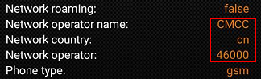
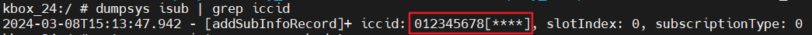
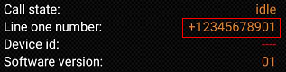
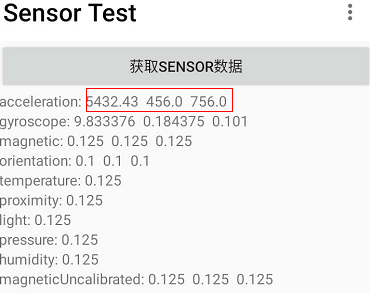
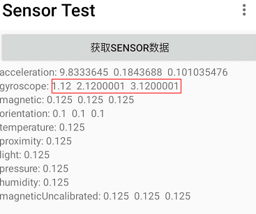
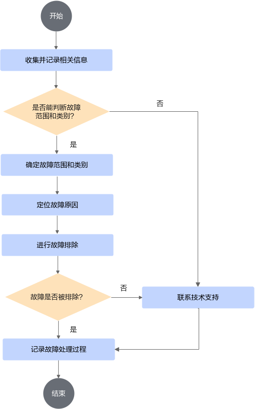

# 用户指南<a name="ZH-CN_TOPIC_0000002521463654"></a>

## 1 启动和卸载云手机实例<a name="ZH-CN_TOPIC_0000002549712545"></a>

### 1.1 挂载安卓镜像<a name="ZH-CN_TOPIC_0000002518192786"></a>

华为镜像仓库提供的官方Kbox Demo镜像不包含Android Kbox二进制，所以使用该镜像无法正常启动容器。用户使用该Demo镜像时，应下载Android Kbox二进制到本地，并使用脚本制作可正常启动的Kbox原始镜像。如需使能硬解功能，在挂载Kbox原始镜像后，需继续制作合入NETINT编解码库的Kbox新镜像。

**表 1** 镜像的获取方式与使用<a id="镜像的获取方式与使用"></a>

|镜像名称+tag|获取方式|使用方法|
|--|--|--|
|用户自行编译|用户自行编译|请参见章节自行编译，已包含Android Kbox二进制，容器可正常启动。|
|kbox:demo|华为镜像仓库提供的官方Kbox Demo镜像|不包含Android Kbox二进制，容器无法正常启动，需要执行制作Kbox镜像：合入商用二进制步骤。|
|kbox:origin|使用脚本制作|基于kbox:demo和Android Kbox二进制制作的镜像，容器可以正常启动。|
|kbox:latest|使用脚本制作的硬解镜像|基于kbox:origin和编解码库制作的镜像，使能硬解功能，容器可正常启动。|

**Kbox Demo镜像挂载<a name="section16531422174717"></a>**

请参见[软件环境](install_guide.md#Kbox安卓容器环境搭建软件环境要求)获取android.tar包上传至“\~/dependency”目录（本文以此目录作为示例，用户可自行设置目录），并挂载。

镜像的名称和tag可以自行定义，格式为“\{名称\}:\{tag\}”，此处设置镜像名为kbox:demo。

> **说明：** 
>镜像名以及tag名中只可包含数字与字母，镜像名的首字符必须为小写字母或数字。

```shell
cd ~/dependency
docker import android.tar kbox:demo
```

**制作Kbox镜像：合入商用二进制<a name="section8328138123920"></a>**

> **说明：** 
>用户使用华为镜像仓库提供的官方Kbox Demo镜像时，需要通过该小节的操作确保镜像中包含Android Kbox二进制。
>当用户使用自行编译的镜像时：
>
>- 硬件配置方案一：可跳过该小节的全部步骤。
>- 硬件配置方案二、三、四：可跳过该小节的步骤2。

1. 请参见[软件环境](install_guide.md#Kbox安卓容器环境搭建软件环境要求)获取Kbox-patches-AOSP11.zip，解压Kbox-patches-AOSP11.zip，将Kbox-patches-AOSP11文件夹中的deploy\_scripts目录上传至服务器的“\~/dependency“目录。
2. 请参见[软件环境](install_guide.md#Kbox安卓容器环境搭建软件环境要求)获取Android Kbox二进制文件包Boostkit-boostcph-kbox\_\*.zip并上传到“\~/dependency/deploy\_scripts“目录。
3. （硬件配置方案二、三、四）使用硬件配置方案二、三、四时需要解压显卡驱动压缩包VAGPU-25.03.01.01-RC20.tgz(参见[软件环境](install_guide.md#Kbox安卓容器环境搭建软件环境要求)获取)，获取va\_driver.tgz，上传到服务器的“\~/dependency/deploy\_scripts“目录。
4. 制作包含Android Kbox二进制的Kbox镜像，其中kbox:demo为上一步导入的官方Kbox Demo镜像，kbox:origin为包含Android Kbox二进制的新镜像。
    - 硬件配置方案一：

        ```shell
        cd ~/dependency/deploy_scripts
        chmod +x make_image.sh
        ./make_image.sh kbox:demo kbox:origin
        ```

    - 硬件配置方案二、三、四：

        ```shell
        cd ~/dependency/deploy_scripts
        chmod +x make_image.sh
        ./make_image.sh kbox:demo kbox:origin va_driver.tgz
        ```

**（硬件配置方案一，可选）制作Kbox镜像：使能硬解功能<a name="section1799111466509"></a>**

若环境中未使用编码卡则不能制作并使用使能硬解功能的镜像。

1. 解压Kbox-patches-AOSP11.zip，将Kbox-patches-AOSP11/make\_img\_sample目录上传至服务器的“\~/dependency“目录。
2. 请参见[软件环境](install_guide.md#Kbox安卓容器环境搭建软件环境要求)获取NETINT-vXXX.tar.gz，并重命名为NETINT.tar.gz，放至“\~/dependency/make\_img\_sample/decode\_iso\_build“目录，对该目录下的制作镜像脚本赋予可执行权限。

    ```shell
    cd ~/dependency/make_img_sample/decode_iso_build
    chmod +x Dockerfile make_image.sh
    ```

    > **说明：** 
    >Quadra编码卡和T432配套的NETINT.tar.gz不同，请选择对应的NETINT.tar.gz。

3. 制作硬解镜像。

    以名为kbox:origin的镜像为基础制作名为kbox:latest的镜像，这两个名称可自定义。

    ```shell
    ./make_image.sh kbox:origin kbox:latest
    ```

    在启动实例时输入的参数需和此处制作的名称、tag保持一致。后文的描述中镜像名以kbox:latest为例。

### 1.2 启动与卸载云手机实例<a name="ZH-CN_TOPIC_0000002518192802"></a>

启动云手机实例路径下应存在kbox\_config.cfg配置文件。容器会使用该文件中的配置，因此使用时应确保kbox\_config.cfg中的配置正确。若启动路径中无该配置文件，则云手机将无法启动。

通过修改如[**表 1** kbox\_config.cfg配置文件中容器使用的GPU、CPU以及数据卷存放路径配置说明](#kbox配置说明)所示的map中对应路数的值来选择该路容器使用的GPU、CPU以及数据卷存放路径，灵活配置云手机使用的资源，使性能达到最优。

**表 1** kbox\_config.cfg配置文件中容器使用的GPU、CPU以及数据卷存放路径配置说明<a id="kbox配置说明"></a>

|参数名称|参数说明|配置说明|
|--|--|--|
|KBOX_GPU_MAP（硬件配置一）KBOX_VA_GPU_MAP（硬件配置二、三、四）|通过修改map中对应路数的值来选择该路容器使用的GPU。|KBOX_GPU_MAP列表里的第一个表示编号为1的Kbox云手机，分配的GPU节点（/dev/dri/renderD128），根据renderD128节点属于NUMA0，因此鲲鹏920 7260处理器NUMA0对应的KBOX_CPUSET_MAP里配置的CPU核心取值范围应为0~31。KBOX_VA_GPU_MAP列表里的第一个表示编号为1的Kbox云手机，分配的GPU节点（/dev/dri/renderD128），根据renderD128~135属于NUMA0，因此对于鲲鹏920 7260处理器NUMA0对应的KBOX_CPUSET_MAP里配置的CPU核心取值范围应为0~31。鲲鹏920 7280Z处理器NUMA0对应的KBOX_CPUSET_MAP里配置的CPU核心取值范围应为0~79。|
|KBOX_CPUSET_MAP|通过修改map中对应路数的值来选择该路容器使用的CPU。|同上|
|KBOX_MOUNT_MAP|通过修改map中对应路数的值来选择该路容器使用的数据卷存放路径。|无|

> **说明：** 
>为确保Kbox云手机的稳定运行与最佳性能，请保障每个容器所绑定的CPU物理核和GPU渲染节点同属于一个CPU片。

Kbox云手机容器支持根据客户需求定制系统属性，以覆盖原有系统属性。如需使用定制属性，需要在启动路径中生成“local.prop”文件，文件内记录定制的系统属性，容器启动后的初始化过程会读取该文件内的属性并覆盖写入。修改方法请参见《[Kbox云手机容器 例行维护](routine_maintenance.md)》文档的“支持Android系统属性可定制”章节。

Kbox云手机容器支持使能图形加速层，通过将kbox\_config.cfg配置文件中的“ENABLE\_RENDER\_LAYER“修改为“1“进行使能。打开“\~/dependency/deploy\_scripts“路径下的“kbox\_render\_accelerating\_configuration.xml”配置文件，对应用的图形加速层功能进行配置。具体配置项描述请参见《[视频流引擎 用户指南](https://gitcode.com/boostkit/vmi/blob/CloudPhone/docs/zh/user_guide.md)》中的“图形加速层配置项”章节。首次启动云手机容器时，若需要修改图形加速层功能的配置，则修改配置文件中应用对应的配置，手动将其拷贝到云手机容器“/data/local/tmp“路径，重启应用即可生效。

1. 解压Kbox-patches-AOSP11.zip，将Kbox-patches-AOSP11文件夹中的deploy\_scripts目录上传至服务器的“\~/dependency“目录。
2. （可选）使能硬件解码（以下简称“硬解”）。
    1. 设置“deploy\_scripts“目录下的kbox\_config.cfg文件，将“ENABLE\_HARD\_DECODE“设置为“1“。

        > **说明：** 
        >若启动时为软件解码（以下简称“软解”）方式（设置ENABLE\_HARD\_DECODE=0），则重启时可切换为硬解方式（设置ENABLE\_HARD\_DECODE=1）。

    2. （硬件配置方案一）同时若使用硬件配置方案一时需参考以下步骤设置NETINT卡节点。
        1. <a name="li12677451102912"></a>执行如下命令查看编码卡芯片对应节点号。

            ```shell
            nvme list
            ```

            回显示例如下，请以实际为准。加粗部分为NETINT编码卡Quadra芯片NVMe节点，一张编码卡包含2颗芯片。

            ```shell
            Node          SN                   Model            Namespace Usage                    Format           FW Rev
            ------------- -------------------- ---------------- --------- ------------------------ ---------------- --------
            /dev/nvme0n1  Q2A325A11DC082-0454A QuadraT2A        1         8.59  TB /   8.59  TB    4 KiB +  0 B     48F6rKr1
            /dev/nvme1n1  Q2A325A11DC082-0454B QuadraT2A        1         8.59  TB /   8.59  TB    4 KiB +  0 B     48F6rKr1
            ```

        2. 查看nvme节点与pcie bus号对应关系。

            \{index\}为[2.b.i](#li12677451102912)回显信息所示的NVMe节点编号。例如/dev/nvme0n1，该节点\{index\}即为0。

            ```shell
            find /sys/devices/ -name nvme{index}
            ```

            回显如下，其中0000:05:00.0为该设备对应的busID：

            ```shell
            /sys/devices/pci0000:00/0000:00:0e.0/0000:05:00.0/nvme/nvme0
            /sys/devices/virtual/nvme-subsystem/nvme-subsys0/nvme0
            ```

        3. 通过bus号找到该节点与NUMA从属关系。

            \{busID\}为上一步骤获取的bus号。以nvme0设备的回显为例，\{busID\}即为0000:05:00.0。

            ```shell
            lspci -vvvs {busID} | grep NUMA
            ```

            回显如下。

            ```shell
            NUMA node: 0
            ```

        4. 根据编码卡NVMe设备节点对应的NUMA修改kbox\_config.cfg文件中NETINT的值。

            鲲鹏920 7260服务器：从属于0、1号NUMA的NVMe节点写在NETINT0字段中，从属于2、3号NUMA的NVMe节点写在NETINT1字段中。

            字段中每个设备需添加两个节点。例如2号NVMe设备，需添加“/dev/nvme2”、“/dev/nvme2n1”两个节点。

            ```shell
            # NETINT编码卡设备节点
            NETINT0="/dev/nvme0,/dev/nvme0n1,/dev/nvme1,/dev/nvme1n1"
            NETINT1="/dev/nvme2,/dev/nvme2n1,/dev/nvme3,/dev/nvme3n1"
            ```

            > **说明：** 
            >- 若第一次启动容器时NETINT的值为空，禁止设置ENABLE\_HARD\_DECODE=1，且禁止重启时设置ENABLE\_HARD\_DECODE=1，否则播放视频会有短暂黑屏的现象。
            >- 若需使能NETINT编码卡硬解，需要在kbox\_config.cfg中设置ENABLE\_HARD\_DECODE=1。
            >- 针对一张Quadra T2A编码卡环境，请参考以下配置方式，根据实际情况配置设备节点信息。
            >
            > ```shell
            > # NETINT编码卡设备节点
            > NETINT0="/dev/nvme0,/dev/nvme0n1,/dev/nvme1,/dev/nvme1n1"
            > NETINT1="/dev/nvme0,/dev/nvme0n1,/dev/nvme1,/dev/nvme1n1"
            >    ```

3. （可选）若需要启动使能了C2解码器的视频流云手机实例（硬件配置方案一可用），则需要设置“deploy_scripts”目录下的kbox_config.cfg文件，将“**ENABLE_AMD_C2_DECODE**”设置位“1”，其他值不使能，默认为0。必须再容器第一次启动时配置开/关C2解码器，不支持中途切换。云手机内置应用会根据自身需要自行选择解码器

    ```shell
    ENABLE_AMD_C2_DECODE=0
    ```

4. 通过android\_kbox.sh脚本启动容器。

    ```shell
    cd ~/dependency/deploy_scripts
    chmod +x android_kbox.sh
    ./android_kbox.sh start {镜像名称：tag}  ${index1}  ${index2}  
    ```

    Kbox基础云手机的默认配置信息如[**表 2** Kbox基础云手机的默认配置信息](#Kbox基础云手机的默认配置信息)所示。

    **表 2** Kbox基础云手机的默认配置信息<a id="Kbox基础云手机的默认配置信息"></a>

    |配置项|Kbox基础云手机|
    |--|--|
    |场景|移动办公/托管|
    |vCPUs|2|
    |绑核策略|2容器/2核|
    |内存|6GB|
    |系统存储|16GB|
    |分辨率|720*1280|

    启动脚本使用示例：

    - 启动一个编号为1的实例。

        ```shell
        ./android_kbox.sh start kbox:origin  1
        ```

    - 启动编号为1\~5的五个实例。

        ```shell
        ./android_kbox.sh start kbox:origin  1 5
        ```

        > **说明：** 
        >Kbox云手机容器启动时，一般情况下会自动打开Kbox内核动态开关，以使能必要的Linux Kernel功能。
        >可以通过以下指令查询Kbox内核动态开关状态。
        >
        >```shell
        >cat /sys/kernel/kbox/kbox_enable
        >```
        >
        >回显为1，表示Kbox内核动态开关为打开状态；回显为0，表示开关为关闭状态。
        >若查询发现Kbox内核动态开关为关闭状态，请通过以下指令手动打开该开关。
        >
        >```shell
        >echo 1 > /sys/kernel/kbox/kbox_enable
        >```

5. 执行如下命令确认Kbox容器是否启动成功，其中“$\{index\}“为启动实例的编号。

    ```shell
    docker exec -it kbox_${index} getprop | grep boot_completed
    ```

    若回显信息中的sys.boot\_completed显示为“1“，则启动成功。

6. 停止并删除Kbox容器的方法。

    由于Kbox方案默认挂载数据卷，默认的**docker stop**、**docker rm**命令不能彻底清理容器数据，需要使用脚本彻底清理主机侧文件。

    使用android\_kbox.sh脚本，停止并删除正在运行的Kbox容器。

    - 停止并删除编号为$\{index\}的容器。

        ```shell
        ./android_kbox.sh delete ${index}
        ```

    - 停止并删除编号为\$\{index1\}\~\$\{index2\}的所有容器。

        ```shell
        ./android_kbox.sh delete ${index1} ${index2}
        ```

7. 重启Kbox容器的方法。

    由于Kbox方案默认挂载数据卷，在重启容器时，无法使用默认的**docker restart**命令进行重启，需要使用脚本执行容器的重启操作。

    使用android\_kbox.sh脚本重启Kbox容器。

    - 重启编号为$\{index\}的容器。

        ```shell
        ./android_kbox.sh restart ${index}
        ```

    - 重启编号为\$\{index1\}\~\$\{index2\}的所有容器。

        ```shell
        ./android_kbox.sh restart ${index1} ${index2}
        ```

> **说明：** 
>使用硬件配置方案一时，必须在容器第一次启动时配置开/关C2解码器，不支持中途切换。云手机内置应用会根据自身需要自行选择解码器。

### 1.3 查询版本号信息<a name="ZH-CN_TOPIC_0000002549832569"></a>

本章节提供两种获取Kbox组件版本信息的方式，通过软件包查询和通过命令查询版本号信息。

- 方法一：通过获取的软件包查询版本号信息。

    请参见[**表 1** Kbox安卓容器环境搭建软件环境要求](install_guide.md#Kbox安卓容器环境搭建软件环境要求)中获取并解压BoostKit-boostcph-kbox\_\*.zip，并通过查询kbox\_version.txt文件，确认当前软件包的版本号。

    ```shell
    unzip BoostKit-boostcph-kbox_*.zip
    unzip Kbox-Boostkit-boostcph-kbox_*.zip
    cat ./products/kbox_version.txt
    ```

    回显信息即为Kbox版本号信息，示例如下。

    ```shell
    Product Name: Kunpeng BoostKit
    Product Version: 26.0.RC1
    Component Name: BoostKit-boostcph-kbox
    Component Version: 8.0.RC1
    Component AppendInfo: 11.0.0_r48
    ```

- 方法二：使用如下命令查询已启动的容器内的版本信息，其中“$\{index\}“为启动实例的编号，回显示例参见方法一的查询结果。

    ```shell
    docker exec -it kbox_${index} cat /system/vendor/etc/kbox_version.txt
    ```

### 1.4 （可选）使能内存超分特性<a name="ZH-CN_TOPIC_0000002549832547"></a>

多个云手机实例使用相同的镜像在服务器进行容器化部署，存在较多相同的内存页，造成内存浪费。若使用openEuler 5.10.0-182.0.0或者5.10.0-216.0.0内核，可使能KSM（Kernel Samepage Merging，内核同页合并）特性，为容器使能数据去重功能，将相同的匿名页进行合并，释放内存空间。

1. 服务器使能KSM守护进程。

    ```shell
    echo 1 > /sys/kernel/mm/ksm/run
    ```

    调整KSM相关的参数“pages\_to\_scan“和“sleep\_millisecs“减少优化时间，但会增加CPU利用率。

    - “pages\_to\_scan“表示在KSM守护进程睡眠之前，需要扫描多少页面。
    - “sleep\_millisecs“表示守护进程内核线程完成一次扫描之后的睡眠时间，以毫秒为单位。

    通过**echo  _xx_  \> /sys/kernel/mm/ksm/_\$param_** 进行参数修改，其中xx为要修改的参数值大小，$param为要修改的参数。

2. 容器使能自动全量KSM去重。

    ```shell
    echo 1 > /sys/fs/cgroup/memory/docker/CONTAINER_ID/memory.ksm
    ```

    其中CONTAINER\_ID为云手机容器的ID。查看是否使能成功。

    ```shell
    cat /sys/fs/cgroup/memory/docker/CONTAINER_ID/memory.ksm
    ```

    若“merge any tasks”不为0即使能成功。

3. 关闭KSM去重。

    ```shell
    echo 0 > /sys/fs/cgroup/memory/docker/CONTAINER_ID/memory.ksm
    ```

### 1.5（可选） 使能容器以F2FS文件系统启动<a name="ZH-CN_TOPIC_0000002549832548"></a>

此前云手机容器内文件格式是服务器常用ext4格式，和真机的f2fs格式不同，下面步骤说明如何使能云手机支持以f2fs文件格式启动，使其和真实手机采用一样的文件系统，提高仿真能力

#### 1.5.1  **环境准备。**

   环境准备的步骤可以参照feature_guide.md的"以f2fs文件格式启动"章节里的[使用介绍](feature_guide.md#ZH-CN_TOPIC_0000002549865941)章节
  
#### 1.5.2 **使能配置项。**<a name="ZH-CN_TOPIC_0000002549832549"></a>

   将配置文件的kbox_config.cfg中的ENABLE_F2FS设置为1

   ```text
   ENABLE_F2FS=1
   ```

#### 1.5.3 **校验是否生效。**

   启动容器后，进入容器环境查看挂载点信息。

   ```shell
   mount | grep -i /data
   ```

   若输出显示对应的分区挂载类型为 `f2fs`，即说明使能成功。

### 1.6（可选） 实现容器内/system分区大小可调节<a name="ZH-CN_TOPIC_0000002549832549"></a>

此前使用检测工具发现云手机容器内system分区大小和宿主机内根目录下空间大小一致，达到将近1T大小，和真机差距巨大，下面步骤说明如何调节云手机/system分区大小，使其和真实手机的/system分区大小相近，提高仿真能力

#### 1.6.1 **环境准备部分。**

   环境准备部分请参照feature_guide.md的“容器内/system分区大小可调节”章节里的[使用介绍](feature_guide.md#ZH-CN_TOPIC_0000002549865942)章节执行

#### 1.6.2 **触发分区扩容逻辑。**<a name="ZH-CN_TOPIC_0000002549832550"></a>

   在云手机配置文件kbox_config.cfg里，将SYSTEM_PARTITION_SIZE_MB设置为预期要实现的/system分区大小值，单位为MB

   ```txt
   SYSTEM_PARTITION_SIZE_MB=${预期要实现的/system分区大小值(MB)}
   ```

#### 1.6.3 **校验是否生效。**

   启动容器后，在容器内执行下面命令检查系统分区的实际容量。

   ```shell
   df -h /system
   ```

   确认 `Size` 列显示的大小与您配置的参数一致，即表示分区调节生效。

### 1.7（可选） 使能容器支持NFS挂载启动

该特性支持将数据存储通过NFS挂载到远端，实现存算分离，存储复用。

#### 1.7.1 **环境准备**

环境准备部分参考[支持NFS挂载](feature_guide.md#支持NFS挂载)章节执行。

#### 1.7.2 **NFS挂载**

容器配置文件kbox_config.cfg中配置NFS_DIR属性为/tmp/nfs，启动云手机使用nstart命令

```shell
./android_kbox.sh nstart kbox:origin 1
```

删除云手机使用ndelete命令

```shell
./android_kbox.sh ndelete kbox:origin 1
```

#### 1.7.3 **校验是否生效**

查看挂载目录下对应data/containerd内容是否跟容器id一致

```shell
cat /tmp/nfs/data/kbox_1/data/containerd
```

### 1.8（可选） 实现云机cpu频率动态调整<a name="ZH-CN_TOPIC_000000254983254923"></a>

在真机中，系统为了平衡负载和功耗，会动态调节 CPU 的运行频率，而云机依托于服务器宿主机的容器化环境运行，其底层物理 CPU 的频率通常处于恒定状态，与真机存在差异。下面步骤说明如何实现云手机cpu频率动态调节，提高仿真能力

#### 1.8.1. **环境准备**

   环境准备部分请参照feature_guide.md的"CPU频率动态模拟与调节"章节的[安装特性](feature_guide.md#ZH-CN_TOPIC_0000002518386097)章节执行

#### 1.8.2. **实施修改**<a name="ZH-CN_TOPIC_000000254983255011"></a>

   当前第三方检测应用一般通过读取scaling_cur_freq和cpuinfo_cur_freq这两个文件来获取当前设备的cpu运行频率，为了提高云机设备的仿真能力，在修改前先输入如下命令读取cpu所支持的频率列表。并且要对这两个文件都进行修改

   ```shell
   cat /sys/devices/system/cpu/cpu${准备进行频率修改的cpu的编号}/cpufreq/scaling_available_frequencies
   ```

   随后输入如下两个命令进行修改，输入的频率值最好是刚刚查询到的当前cpu支持的频率值

   ```shell
   echo ${预期修改的值} > /sys/devices/system/cpu/cpu${准备进行频率修改的cpu的编号}/cpufreq/scaling_cur_freq
   ```

   ```shell
   echo ${预期修改的值} > /sys/devices/system/cpu/cpu${准备进行频率修改的cpu的编号}/cpufreq/cpuinfo_cur_freq
   ```

#### 1.8.3. **校验是否生效。**

   启动容器后，在容器内安装如“手机设备信息大全”的app，查看cpu频率是否等于预期，若等于预期值即表示cpu频率调节生效。

## 2 ARDC测试<a name="ZH-CN_TOPIC_0000002549712565"></a>

在Windows系统中，调试时推荐使用ARDC投屏软件，图形接入Kbox容器。ARDC投屏软件请从官方渠道获取并安装。

在Windows系统中用adb连接已启动的Kbox实例的方法：

1. 打开ARDC安卓投屏助手，打开控制台界面。
2. 在CMD一栏，输入命令连接ARDC与云手机实例，输入服务器IP地址和adb端口号，然后回车。

    ```shell
    adb connect $ip:$port
    ```

    如果连接成功会显示如图。

    

3. 执行命令，查询当前ARDC已经成功连接的设备。

    ```shell
    adb devices
    ```

4. 在菜单中选择您启动的设备，等待连接。
5. 将待测试的APK拖入界面中，等待安装。
6. APK安装成功后，运行APK，开始测试。

## 3 （可选）Docker环境配置<a name="ZH-CN_TOPIC_0000002518352702"></a>

Docker不在本解决方案交付范围内，本章节提供的环境配置仅作为功能参考。不建议使用鲲鹏BoostKit云手机Demo作为商用方案。若选择使用鲲鹏BoostKit云手机参考方案需自行承担安全风险，客户或ISV在商用前请进行必要的安全评估。

**为容器创建单独分区、使能容器IPv6<a name="section66764141138"></a>**

1. Docker的默认目录是“/var/lib/docker“，所有Docker相关文件，包括镜像，都存放在这个目录下。这个目录可能很快就会被占满，届时Docker和主机可能无法使用。因此，建议创建一个单独的分区（逻辑卷），用来存放Docker文件。
2. Docker默认未开启IPv6，而一些应用依赖于IPv6协议，缺少IPv6的支持可能会导致这些应用的部分功能出现异常。以下提供了一种方法以使能Docker的IPv6协议。

建议修改方式：

1. 新建一个目录存放Docker相关文件，并mount一个未被挂载且文件系统类型为ext4的磁盘作为独立的分区，这里以“sda“为例。

    新建目录“/root/sda/docker“，并在“/etc/fstab“文件中添加一行“/dev/sda /root/sda/docker ext4 defaults 0 0“。若“/dev/sda“已被挂载或非ext4类型文件系统，则按实际情况选择未被挂载且文件系统类型为ext4的磁盘，下列命令中的sda根据实际可挂载的磁盘名称更改。

    ```shell
    mkdir -p /root/sda/docker
    echo "/dev/sda /root/sda/docker ext4 defaults 0 0" >> /etc/fstab
    ```

2. 选择“/root/sda/docker“路径。

    1. 打开“/etc/docker/daemon.json“文件。

        ```shell
        vim /etc/docker/daemon.json
        ```

    2. 按“i“进入编辑模式，在文件中添加属性“"data-root": "/root/sda/docker", "ipv6": true,"fixed-cidr-v6": "2001:db8::/64"“，以配置Docker的数据存储位置、使能IPv6协议。该文件需要遵循JSON格式。

        ```shell
        {
        "debug": true,
        "data-root": "/root/sda/docker",
        "ipv6": true,
        "fixed-cidr-v6": "2001:db8::/64"
        }
        ```

    3. 按“Esc“键，输入**:wq!**，按“Enter“保存并退出编辑。

    > **说明：** 
    >修改“/etc/docker/daemon.json“文件，若“/etc/docker/daemon.json“文件不存在，则使用以下命令自行创建该文件并将内容写入。
    >
    >```shell
    >touch /etc/docker/daemon.json
    >cat >/etc/docker/daemon.json <<EOF
    >{
    >"debug":true,
    >"data-root":"/root/sda/docker",
    >"ipv6":true,
    >"fixed-cidr-v6":"2001:db8::/64"
    >}
    >EOF
    >```

3. 重启Docker服务。

    > **说明：** 
    >重启Docker服务前需要确保没有其他容器运行，如果有需要清理。

    ```shell
    systemctl restart docker
    ```

4. 重新加载“/etc/fstab“文件中的内容。

    ```shell
    mount -a
    ```

## 4 仿真设备参数配置<a name="ZH-CN_TOPIC_0000002518352680"></a>

### 4.1 配置属性操作方式<a name="ZH-CN_TOPIC_0000002518192812"></a>

在进行配置属性前，需要先连接容器、进入容器，然后进行相应的属性操作。

本文提供两种进入容器的方式：[PC端命令行操作方式](#section155521166386)与[服务器终端界面操作方式](#section473111277384)，用户可根据实际情况任选一种。

**PC端命令行操作方式<a name="section155521166386"></a>**

1. 正常启动Kbox容器。
2. 在PC端的CMD界面，通过**adb**命令行连接容器实例。

    ```shell
    adb connect ip:port
    ```

    部分命令（如getevent）需要root权限。

    ```shell
    adb -s ip:port root
    ```

3. 通过**adb**命令行进入容器中。

    ```shell
    adb -s ip:port shell
    ```

    进入容器后即可执行相应的云手机参数配置命令。

    > **说明：** 
    >在本文档使用的**adb**命令中，ip是指服务器IP地址，port是adb端口号。

**服务器终端界面操作方式<a name="section473111277384"></a>**

1. 正常启动Kbox容器。
2. 在服务器的后台终端界面，通过**docker**命令行方式直接进入容器内。

    ```shell
    docker exec -it kbox_${index} sh
    ```

    进入容器后即可执行相应的云手机参数配置命令。

### 4.2 配置系统属性<a name="ZH-CN_TOPIC_0000002549712553"></a>

#### 4.2.1 配置GPS系统属性<a name="ZH-CN_TOPIC_0000002549712537"></a>

##### 4.2.1.1 GPS属性说明<a name="ZH-CN_TOPIC_0000002518352678"></a>

> **说明：** 
>对下表中的参数数据类型说明如下：
>
>- double类型参数有效值为15\~16位，若设置的数据有效值超过15\~16位，请采用科学计数法表示。由于double类型有效值位数限制，超出范围的数据会乱码。部分上层应用由于双精度浮点数类型转换，即使在有效数字范围内也存在精度浮动问题。
>- float类型参数有效值为6\~7位，若设置的数据有效值超过6\~7位，请采用科学计数法表示。由于float类型有效值位数限制，超出范围的数据会乱码。部分上层应用由于浮点数类型转换，在有效数字范围内也存在精度浮动问题。

|配置项名称|含义|类型|取值范围|默认值|说明|
|--|--|--|--|--|--|
|persist.gps.mock.latitude|纬度。|double|纬度范围是[-90,90]度|30.188433度|默认值为杭州的纬度。Android 11因为代码限制，经纬度不能同时设置为零。|
|persist.gps.mock.longitude|经度。|double|经度范围是[-180,180]度|120.199818度|初始值为杭州的经度。Android 11因为代码限制，经纬度不能同时设置为零。|
|persist.gps.mock.altitude|海拔高度，单位：米。|double|无限制，正负皆可|0米|初始值表示当前海拔高度为0米。|
|persist.gps.mock.speed|表示当前的移动速度，单位：米每秒。|float|[0,400]米每秒|0米每秒|初始值表示当前处于静止状态，超过400米每秒Android系统会停止上报GPS数据。|
|persist.gps.mock.bearing|当前的移动导向角，单位：度。|float|范围[0,360)度|0度|初始值表示正北方。|
|persist.gps.mock.accuracy|表示当前的定位精度，单位：米。|float|大于等于0米|20米|初始值表示定位误差为正负20米。|

##### 4.2.1.2 配置属性示例<a name="ZH-CN_TOPIC_0000002549712541"></a>

1. 调用**setprop**方法设置当前属性的值，以gps.mock.latitude和gps.mock.longitude系统属性为例，其他属性设置方式相同。

    ```shell
    setprop persist.gps.mock.latitude 30.188433
    setprop persist.gps.mock.longitude 120.193818
    ```

2. 检查当前的GPS系统属性值。

    ```shell
    getprop | grep "persist.gps.mock."
    ```

    回显示例如下。

    ```shell
    [persist.gps.mock.latitude]: [30.188433]
    [persist.gps.mock.longitude]: [120.193818]
    ```

    > **说明：** 
    >在Windows系统上查询字符串文本，请使用命令**findstr**替代命令**grep**，如下所示。本章后续使用**grep**命令的场景，请用户根据实际业务场景自行处理。
    >
    >```shell
    >adb -s ip:port shell getprop | findstr "persist.gps.mock."
    >```

3. 重启容器后，查询Location Service的GPS数据，进入容器后使用如下命令查询最近更新的GPS数据。

    ```shell
    dumpsys location | grep -A 1 "gps provider:"
    ```

    根据返回值判断GPS属性是否生效。示例回显如下。

    ```shell
        gps provider:
          last location=Location[gps 30.188433,120.199818 hAcc=20 et=+2h17m10s384ms alt=0.0 vel=0.0 bear=0.0 vAcc=??? sAcc=??? bAcc=??? {Bundle[{}]}]
    ```

    |返回帧参数项|含义|
    |--|--|
    |gps|位置信息，格式为：[纬度],[经度]|
    |hAcc|表示当前的定位误差，单位：米|
    |alt|海拔高度，单位：米|
    |bear|当前的移动导向角，单位：度|
    |vel|表示当前的移动速度，单位：米每秒|

4. 检查Location Service的GPS数据值与设定值是否一致。

#### 4.2.2 配置Telephony系统属性<a name="ZH-CN_TOPIC_0000002549832551"></a>

##### 4.2.2.1 Telephony属性说明<a name="ZH-CN_TOPIC_0000002518352692"></a>

|配置项名称|含义|类型|取值范围|默认值|说明|
|--|--|--|--|--|--|
|persist.sys.prop.writeimei|国际移动设备识别码（IMEI）。|int|15~17位数字|86+15位随机值|86表示中国|
|persist.gsm.operator.alphacph|网络运营商名字。|string|1~20位字母或数字|CMCC|-|
|persist.gsm.operator.numericcph|网络运营商代码。|int|5~6位数字|46000|由3位网络运营商国家代码+2~3位移动网络代码组成，比如460表示中国（cn），00表示中国移动。|
|persist.sys.prop.writeimsi|国际移动用户识别码（IMSI）。|int|15位数字|46011+随机值|前5~6位表示SIM卡运营商代码，组成和网络运营商代码相同，460表示中国（cn），11表示中国移动。|
|persist.gsm.sim.operator.alphacph|SIM卡运营商名字。|string|1~20位字母或数字|CMCC|-|
|persist.sys.prop.writesimserial|SIM卡序列号。|int|20位数字|898600+随机值|89为国际代码，86表示中国，00表示中国移动。|
|persist.sys.prop.writephonenum|手机号码。|int|0~20位数字|空|-|

> **说明：** 
>
>- 所有属性设置后都需要重启容器才能生效。
>- 容器启动过程中做参数合法性校验，只会判断字符和长度是否合法，判断非法则采用默认值。

##### 4.2.2.2 配置属性示例<a name="ZH-CN_TOPIC_0000002549712549"></a>

1. 调用**setprop**方法设置“IMEI“值。

    ```shell
    setprop persist.sys.prop.writeimei 861456987456321
    ```

    重启容器后，拨号界面输入“\*\#06\#“，获得如下提示。

    

2. 调用**setprop**方法设置“网络运营商名字”和“网络运营商代码”。

    ```shell
    setprop persist.gsm.operator.alphacph CMCC
    setprop persist.gsm.operator.numericcph 46000
    ```

    重启容器后，在应用中查询设置结果。

    

    > **说明：** 
    >用户可自行查找相关应用进行验证。

3. 调用**setprop**方法设置“IMSI”和“SIM卡运营商名字”。

    ```shell
    setprop persist.sys.prop.writeimsi 460110123456789
    setprop persist.gsm.sim.operator.alphacph CMCC
    ```

    重启容器后，拨号界面输入“\*\#\*\#4636\#\*\#\*“，打开手机信息，可以查询到“IMSI”。

    

    在应用中查询到“SIM卡运营商名字”和“SIM卡运营商代码”。

    

4. 调用**setprop**方法设置“SIM卡序列号”。

    ```shell
    setprop persist.sys.prop.writesimserial 01234567890123456789
    ```

    重启容器后，通过命令查询设置结果。

    ```shell
    dumpsys isub | grep iccid
    ```

    

    在应用中也可查询到设置结果。

    

    > **说明：** 
    >1. 通过命令查询“SIM卡序列号”，部分位置会出现星号遮挡，为正常现象不影响实际功能。
    >2. 用户可自行查找相关应用进行验证。

5. 调用**setprop**方法设置“手机号码”。

    ```shell
    setprop persist.sys.prop.writephonenum 12345678901
    ```

    重启容器后，在应用中查询设置结果。

    

#### 4.2.3 配置加速度陀螺仪系统属性<a name="ZH-CN_TOPIC_0000002549832553"></a>

##### 4.2.3.1 加速度陀螺仪属性说明<a name="ZH-CN_TOPIC_0000002518352686"></a>

|配置项名称|含义|类型|取值范围|默认值|说明|
|--|--|--|--|--|--|
|persist.sensors.mock.delaytime|数据采集频率（以微秒为单位）。|int|[20000,1000000]|200000|当设置的persist.sensors.mock.delaytime的值不在[20000,1000000]内时，实际采用默认值。|
|persist.sensors.mock.acce.data.x|当配置项为persist.sensors.mock.acce.data.x，表示沿x轴的加速力（包括重力），单位：m/s^2。|float|[-3.402823466e+38,3.402823466e+38]|加速度和陀螺仪的x轴默认值均为9.833359，该默认值可通过相关应用软件查询，不体现在系统属性persist.sensors.mock.acce.data.x或persist.sensors.mock.gyro.data.x上。但由于Android 11将底层采集的数据与resolution值一起计算量化成新值，加速度resolution=1/4032，陀螺仪resolution=1/1000。|当设置的persist.sensors.mock.acce.data.x或persist.sensors.mock.gyro.data.x的值包含非数字且非小数点字符的非法字符时，设置无效采用默认值。需注意float类型参数有效值为6-7位，若设置的数据有效值超过6-7位，请采用科学计数法表示，如3.40282e+38。由于float类型有效值位数限制，超出范围的数据会乱码。部分上层应用由于浮点数类型转换，在有效数字范围内也存在精度浮动问题。|
|persist.sensors.mock.gyro.data.x|当配置项为persist.sensors.mock.acce.data.x，表示沿x轴的加速力（包括重力），单位：m/s^2。|float|[-3.402823466e+38,3.402823466e+38]|加速度和陀螺仪的x轴默认值均为9.833359，该默认值可通过相关应用软件查询，不体现在系统属性persist.sensors.mock.acce.data.x或persist.sensors.mock.gyro.data.x上。但由于Android 11将底层采集的数据与resolution值一起计算量化成新值，加速度resolution=1/4032，陀螺仪resolution=1/1000。|当设置的persist.sensors.mock.acce.data.x或persist.sensors.mock.gyro.data.x的值包含非数字且非小数点字符的非法字符时，设置无效采用默认值。需注意float类型参数有效值为6-7位，若设置的数据有效值超过6-7位，请采用科学计数法表示，如3.40282e+38。由于float类型有效值位数限制，超出范围的数据会乱码。部分上层应用由于浮点数类型转换，在有效数字范围内也存在精度浮动问题。|
|persist.sensors.mock.acce.data.y|当配置项为persist.sensors.mock.acce.data.y，表示沿y轴的加速力（包括重力）。|float|[-3.402823466e+38,3.402823466e+38]|加速度和陀螺仪的y轴默认值均为0.184357，该默认值可通过相关应用软件查询，不体现在系统属性persist.sensors.mock.acce.data.y或persist.sensors.mock.gyro.data.y上。但由于Android 11将底层采集的数据与resolution值一起计算量化成新值，加速度resolution=1/4032，陀螺仪resolution=1/1000。|当设置的persist.sensors.mock.acce.data.y或persist.sensors.mock.gyro.data.y的值包含非数字/小数点字符的非法字符时，设置无效采用默认值。需注意float类型参数有效值为6-7位，若设置的数据有效值超过6-7位，请采用科学计数法表示，如3.40282e+38。由于float类型有效值位数限制，超出范围的数据会乱码。部分上层应用由于浮点数类型转换，在有效数字范围内也存在精度浮动问题。|
|persist.sensors.mock.gyro.data.y|当配置项为persist.sensors.mock.gyro.data.y，表示沿y轴的旋转速率。|float|[-3.402823466e+38,3.402823466e+38]|加速度和陀螺仪的y轴默认值均为0.184357，该默认值可通过相关应用软件查询，不体现在系统属性persist.sensors.mock.acce.data.y或persist.sensors.mock.gyro.data.y上。但由于Android 11将底层采集的数据与resolution值一起计算量化成新值，加速度resolution=1/4032，陀螺仪resolution=1/1000。|当设置的persist.sensors.mock.acce.data.y或persist.sensors.mock.gyro.data.y的值包含非数字/小数点字符的非法字符时，设置无效采用默认值。需注意float类型参数有效值为6-7位，若设置的数据有效值超过6-7位，请采用科学计数法表示，如3.40282e+38。由于float类型有效值位数限制，超出范围的数据会乱码。部分上层应用由于浮点数类型转换，在有效数字范围内也存在精度浮动问题。|
|persist.sensors.mock.acce.data.z|当配置项为persist.sensors.mock.acce.data.z，表示沿z轴的加速力（包括重力）。|float|[-3.402823466e+38,3.402823466e+38]|加速度和陀螺仪的z轴默认值均为0.101028，该默认值可通过相关应用软件查询，不体现在系统属性persist.sensors.mock.acce.data.z或persist.sensors.mock.gyro.data.z上。但由于Android 11将底层采集的数据与resolution值一起计算量化成新值，加速度resolution=1/4032，陀螺仪resolution=1/1000。|当设置的persist.sensors.mock.acce.data.z或persist.sensors.mock.gyro.data.z的值包含非数字/小数点字符的非法字符时，设置无效采用默认值。需注意float类型参数有效值为6-7位，若设置的数据有效值超过6-7位，请采用科学计数法表示，如3.40282e+38。由于float类型有效值位数限制，超出范围的数据会乱码。部分上层应用由于浮点数类型转换，在有效数字范围内也存在精度浮动问题。|
|persist.sensors.mock.gyro.data.z|当配置项为persist.sensors.mock.gyro.data.z，表示沿z轴的旋转速率。|float|[-3.402823466e+38,3.402823466e+38]|加速度和陀螺仪的z轴默认值均为0.101028，该默认值可通过相关应用软件查询，不体现在系统属性persist.sensors.mock.acce.data.z或persist.sensors.mock.gyro.data.z上。但由于Android 11将底层采集的数据与resolution值一起计算量化成新值，加速度resolution=1/4032，陀螺仪resolution=1/1000。|当设置的persist.sensors.mock.acce.data.z或persist.sensors.mock.gyro.data.z的值包含非数字/小数点字符的非法字符时，设置无效采用默认值。需注意float类型参数有效值为6-7位，若设置的数据有效值超过6-7位，请采用科学计数法表示，如3.40282e+38。由于float类型有效值位数限制，超出范围的数据会乱码。部分上层应用由于浮点数类型转换，在有效数字范围内也存在精度浮动问题。|

> **说明：** 
>Android 11数值转换公式：输入value是float类型，resolution是double类型，double incRes = 0.125 \* resolution；value = round\(static\_cast<double\>\(value\) / incRes\) \* incRes，round是指double类型取整。

##### 4.2.3.2 配置属性示例<a name="ZH-CN_TOPIC_0000002518192774"></a>

1. 调用**setprop**方法注入加速度传感器数据。

    ```shell
    setprop persist.sensors.mock.acce.data.x 5432.43
    setprop persist.sensors.mock.acce.data.y 456
    setprop persist.sensors.mock.acce.data.z 756
    ```

2. 在应用中可以查看设置的加速度数据。

    

    > **说明：** 
    >用户可自行查找相关应用进行验证。

3. 调用**setprop**方法注入陀螺仪传感器数据。

    ```shell
    setprop persist.sensors.mock.gyro.data.x 1.12
    setprop persist.sensors.mock.gyro.data.y 2.12
    setprop persist.sensors.mock.gyro.data.z 3.12
    ```

4. 在应用中可查看陀螺仪数据。

    

#### 4.2.4 配置多VInput设备系统属性<a name="ZH-CN_TOPIC_0000002518352684"></a>

##### 4.2.4.1 VInput属性说明<a name="ZH-CN_TOPIC_0000002549832585"></a>

|配置项名称|含义|类型|取值要求|说明|
|--|--|--|--|--|
|persist.sys.input.mouse.name|创建鼠标设备标识属性。|string|取值字符类型仅限字母、下划线、数字，字符长度范围为1～64位。|如果设置参数不符号要求，实际设置无效。|
|persist.sys.input.gamepad1.name|创建手柄1设备标识属性。|string|取值字符类型仅限字母、下划线、数字，字符长度范围为1～64位。|如果设置参数不符号要求，实际设置无效。|
|persist.sys.input.gamepad2.name|创建手柄2设备标识属性。|string|取值字符类型仅限字母、下划线、数字，字符长度范围为1～64位。|如果设置参数不符号要求，实际设置无效。|

##### 4.2.4.2 配置属性示例<a name="ZH-CN_TOPIC_0000002518192790"></a>

1. 调用**setprop**方法创建鼠标设备，通过**getevent**查看结果。

    ```shell
    setprop persist.sys.input.mouse.name mouse
    getevent
    ```

    回显示例如下。

    ```shell
    add device 1: /dev/input/event4
      name:     "mouse"
    add device 2: /dev/input/event3
      name:     "Touch Pad"
    could not get driver version for /dev/input/event0, Inappropriate ioctl for device
    could not get driver version for /dev/input/event1, Inappropriate ioctl for device
    ```

2. 调用**setprop**方法创建第一个手柄设备，通过**getevent**查看结果。

    ```shell
    setprop persist.sys.input.gamepad1.name gamepad1
    getevent
    ```

    回显示例如下。

    ```shell
    add device 1: /dev/input/event5
      name:     "gamepad1"
    add device 2: /dev/input/event4
      name:     "mouse"
    add device 3: /dev/input/event3
      name:     "Touch Pad"
    could not get driver version for /dev/input/event0, Inappropriate ioctl for device
    could not get driver version for /dev/input/event1, Inappropriate ioctl for device
    ```

3. 调用**setprop**方法创建第二个手柄设备，通过**getevent**查看结果。

    ```shell
    setprop persist.sys.input.gamepad2.name gamepad2
    getevent
    ```

    回显示例如下。

    ```shell
    add device 1: /dev/input/event6
      name:     "gamepad2"
    add device 2: /dev/input/event5
      name:     "gamepad1"
    add device 3: /dev/input/event4
      name:     "mouse"
    add device 4: /dev/input/event3
      name:     "Touch Pad"
    could not get driver version for /dev/input/event0, Inappropriate ioctl for device
    could not get driver version for /dev/input/event1, Inappropriate ioctl for device
    ```

### 4.3 系统功能参数配置<a name="ZH-CN_TOPIC_0000002518192782"></a>

|配置项名称|含义|类型|取值范围|默认值|说明|
|--|--|--|--|--|--|
|sys.vmi.vk.texturecompress|纹理压缩开关。支持Vulkan RGB和RGBA纹理压缩为BC7纹理以及支持先将ETC2纹理解码为RGBA格式，再压缩成BC7纹理。|int|0：关闭纹理压缩1：开启纹理压缩|1|该功能不支持在应用运行期间修改，如需修改，需要先退出应用。该功能不支持纹理后处理，如应用存在此种应用场景可能造成渲染异常，此时需关闭纹理压缩功能后重新打开应用。|
|sys.vmi.gl.texturecompress|纹理压缩开关。支持将OpenGL ES ASTC纹理转为RGBA格式，然后再重新压缩成BC3纹理。|int|0：关闭纹理压缩1：开启纹理压缩|1|该功能不支持在应用运行期间修改，如需修改，需要先退出应用。|
|ro.vmi.adaptive.vsync|自适应vsync功能开关，默认不使能。|int|0：关闭自适应vsync1：开启自适应vsync|0|该功能修改后重启生效。|

## 5 故障处理<a name="ZH-CN_TOPIC_0000002518352706"></a>

### 5.1 概述<a name="ZH-CN_TOPIC_0000002549712533"></a>

#### 5.1.1 故障处理原则<a name="ZH-CN_TOPIC_0000002518352700"></a>

- 故障分析、定位和处理原则：
    - 以尽快恢复业务为原则。
    - 定位故障时，应及时采集故障数据信息，并尽量将采集到的故障数据信息保存在移动存储介质中或其它计算机中。
    - 在确定故障处理的方案时，应先评估影响，优先保证业务的正常运行。
    - 第三方的硬件故障，可查看第三方的相关资料或拨打第三方公司的服务电话。
    - 如果无法定位出故障点或无法按手册解决故障，及时联系技术支持，最大程度减少业务中断时间。

- 定位处理前注意事项：
    - 严格遵守操作规程和行业安全规程，确保人身安全与设备安全。
    - 应先分析故障现象，定位原因后再进行处理。在原因不明的情况下应避免盲目操作，导致问题扩大化。
    - 在处理故障前，需要保留好故障现场的任何记录，不能随意删除数据或日志。
    - 在处理故障时，为了确保客户网络的安全和隐私，如果需要采集相关故障日志，请事先得到客户的同意和授权。
    - 在进行任何修改前，应先通过脚本导出、手工备份等方式备份数据。
    - 更换和维护设备部件过程中，要做好防静电措施，佩戴防静电腕带。
    - 在维护过程中遇到的任何问题，应详细记录各种原始信息。
    - 所有的重大操作，如重启进程等操作，均应做记录，并在操作前仔细确认操作的可行性，在做好相应的备份、应急和安全措施后，方可由有资格的操作人员执行。
    - 在系统恢复后，必须对运行情况进行观察，确认故障已经排除并及时填写相关的处理报告。
    - 慎重使用高危操作及命令。

- 对维护人员的要求：
    - 具备网络设备、操作系统和数据库基础知识，掌握其常用的操作命令，并能熟练使用它们开展维护工作。
    - 熟知现场业务系统的逻辑结构、系统各部件和现场设备的对应关系以及现场设备之间的物理连接关系。
    - 熟悉业务流程、系统结构，能熟练操作业务相关的软硬件。
    - 了解基本故障相关定位和处理方法。
    - 掌握远程接入方式的使用。

#### 5.1.2 故障处理流程<a name="ZH-CN_TOPIC_0000002549712555"></a>

故障处理总体流程主要分为四个过程：故障信息收集、故障判断、故障定位、故障排除。

**图 1** 常见故障处理流程<a name="fig1890714518232"></a><a id="常见故障处理流程"></a>


**故障信息收集<a name="section196271610142212"></a>**

故障信息是故障处理的重要依据，系统维护人员应尽可能多地收集故障信息。

**故障判断<a name="section4572941192214"></a>**

排除故障之前，系统维护人员根据收集的故障详细信息，对故障范围和类型进行判断。

**故障定位<a name="section3895552182410"></a>**

故障定位是指从众多可能原因中找出故障原因的过程。通过一定的方法或手段分析、比较各种可能的故障成因，不断排除非可能因素，最终确定故障发生的具体原因。

以下是故障定位的常用方法：

- 查看客户端日志，关注告警信息
- 查看服务端日志，关注告警信息
- 查看操作系统日志，关注告警信息
- 查看资源使用情况，关注资源满载过载现象
- 查询操作日志，分析操作过程是否有误
- 查看配置文件，检查数据配置是否正确

**故障排除<a name="section18134350132614"></a>**

故障排除是指根据不同的故障原因清除故障的过程。故障排除包括检修设备、修改配置数据、重启相关进程、重启容器、重启服务器等。

> **说明：** 
>处理重大故障前，请先联系技术支持工程师协助解决。
>在故障处理过程中，维护人员可能需要执行修改配置数据、重启虚拟机等重大操作，为确保数据安全，首先应该保存现场数据，备份相关数据库、告警信息和日志文件等。
>当系统维护人员无法自行排除故障时，请联系技术支持工程师协助解决。

### 5.2 信息收集<a name="ZH-CN_TOPIC_0000002518192810"></a>

#### 5.2.1 声明<a name="ZH-CN_TOPIC_0000002549712567"></a>

在信息收集操作过程中，请严格遵守以下原则：

- 任何维护操作必须得到客户的授权，禁止进行超出客户审批范围的任何维护操作。
- 将问题定位数据传出客户网络必须得到客户的授权。

#### 5.2.2 基本信息收集<a name="ZH-CN_TOPIC_0000002549712559"></a>

**收集局点信息<a name="section4323131116418"></a>**

故障发生后，作为问题定位的首要条件，通过收集局点信息，让技术支持及研发人员快速了解现场的情况；同时，反馈现场工程师的联系电话，保证联络渠道的畅通。

需收集的局点信息如下表所示。

**表 1** 局点信息收集表<a id="局点信息收集表"></a>

|运营商或企业|局点|组网图附件|现场工程师姓名/电话|客户姓名/电话|
|--|--|--|--|--|
|版本信息|-|-|-|-|
|远程维护信息|-|-|-|-|

**收集基本故障信息<a name="section19389174953610"></a>**

通过基本故障信息，可初步了解现场发生的问题、目前的状态、产生故障前的设备状态和引起故障的可能因素。具体信息如下表所示。

**表 2** 基本故障信息收集表<a id="基本故障信息收集表"></a>

|待收集现场|现场反馈结果|
|--|--|
|故障现象描述|-|
|故障出现时间|-|
|故障出现的频率|-|
|业务影响程度|-|
|当前故障是否已经处理|-|
|问题出现时，是否有相关系统进行过调整或者任何操作|-|
|对维护过程中出现的问题所实施的操作|-|
|问题出现后，是否采用什么措施进行处理|-|
|对问题进行处理后，达到的效果|-|
|现场有无明显的告警信息|-|
|现场告警信息是否已经收集|-|

**收集故障相关告警信息<a name="section350713449381"></a>**

通过故障相关的告警信息，可进一步辅助故障的分析、定位和处理。具体信息如下表所示。

**表 3** 故障相关告警信息收集表<a id="故障相关告警信息收集表"></a>

|待收集参数|参数值|
|--|--|
|告警ID|-|
|告警级别|-|
|告警名称|-|
|告警源/告警对象|-|
|产生时间|-|
|区域|-|
|类型|-|
|可能原因|-|
|附加信息|-|

**收集日志信息<a name="section168781199405"></a>**

收集系统的日志信息，可以通过日志，详细查看系统中用户的操作内容、操作时间等信息，从而进行故障的分析和定位。主要需要收集的日志如下表。

**表 4** 日志收集项<a id="日志收集项"></a>

|日志类别|详情|
|--|--|
|Android日志|通过**logcat**命令收集日志缓存区中日志。|
|收集ANR时的应用堆栈信息（/data/anr）。|
|通过dumpsys activity，dumpsys meminfo，dumpsys input收集必要的dumpsys信息。|
|通过**ps -a**收集进程信息。|
|通过**getprop**收集系统属性信息。|
|服务器日志|收集/var/log底下的syslog和kernel日志。|
|通过**dmesg -T**收集查看开机信息。|
|通过**docker stats/docker inspect**收集docker相关日志。|

为了便于使用，特基于Kbox\_maintainer（维护工具）提供一键式日志收集能力，Kbox\_maintainer工具收集日志的方法，请参见《[例行维护](routine_maintenance.md)》的“日志收集”章节。
